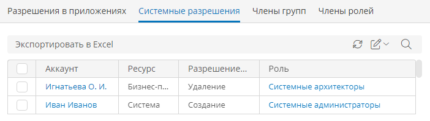

# Аудит разрешений аккаунтов {: #account_permission_audit}

## Просмотр разрешений аккаунтов

Страница «**Аудит разрешений аккаунтов**» позволяет просмотреть разрешения, предоставленные каждому аккаунту, а также списки аккаунтов, входящие в каждую группу и каждую роль.

1. На странице «[**Администрирование**][administration]» в разделе — «**Администрирование аккаунтов**» выберите пункт «**Аудит разрешений аккаунтов**» <i class="fa-light  fa-user-crown"></i>.
2. Отобразится страница «**Аудит разрешений аккаунтов**» со списком аккаунтов.

## Экспорт списка разрешений

1. Выберите вкладку с требуемым списком: «**[Разрешения в приложениях](#разрешения-в-приложениях)**», «**[Системные разрешения](#системные-разрешения)**», «**[Члены групп](#члены-групп)**» или «**[Члены ролей](#члены-ролей)**».
2. Нажмите кнопку «**Экспортировать в Excel**».
3. Браузер скачает файл со списком разрешений в формате XLSX.

### Разрешения в приложениях

На этой вкладке отображаются разрешения на доступ к ресурсам приложений. См. разделы «**[Роли в приложении][roles]**», «**[Разработка приложений][apps]**», «**[Аккаунты][accounts]**».

__

### Системные разрешения

На этой вкладке отображаются разрешения на доступ к ресурсам системы. См. разделы «**[Системные роли][system_roles]**» и «**[Аккаунты][accounts]**».

Список системных разрешений

### Члены групп

На этой вкладке отображается список всех аккаунтов и дочерних групп с указанием групп, в которые они входят. См. раздел «**[Группы][groups]**» и «[**Аккаунты**][accounts]».

Список членов групп

### Члены ролей

На этой вкладке отображается список всех аккаунтов и групп с указанием ролей, которые им назначены. См. разделы «[**Роли**][roles]», «[**Системные роли**][system_roles]» и «[**Аккаунты**][accounts]».

--8<-- "related_topics_heading.md"

**[Аккаунты. Создание, настройка, замещение, привязка к шаблону аккаунта, назначение лицензий, удаление][accounts]**


