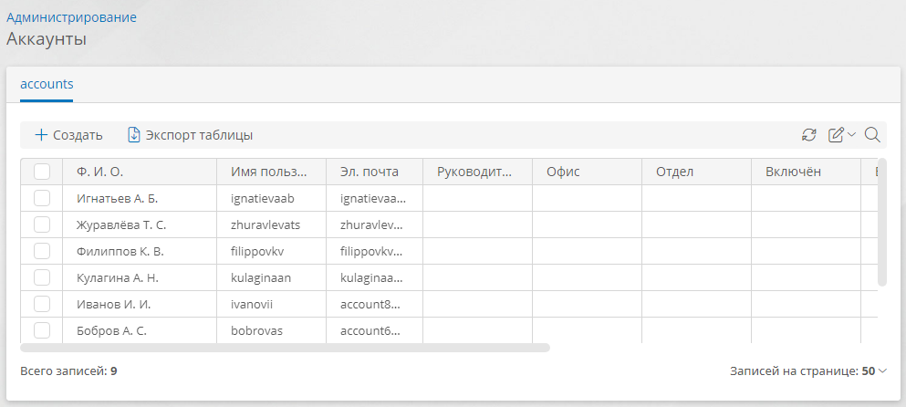

# Аккаунты. Создание, настройка, замещение, привязка к шаблону аккаунта, назначение лицензий, удаление {: #accounts}

## Просмотр списка аккаунтов и настройка аккаунта

1. На странице «[**Администрирование**][administration]» в разделе — «**Администрирование аккаунтов**» выберите пункт «**Аккаунты**» <i class="fa-light  fa-address-card">‌</i>.
2. Откроется список аккаунтов.
3. Нажмите кнопку «**Создать**» или дважды нажмите строку аккаунта в списке.
4. Откроется страница свойств аккаунта.
5. Настройте свойства аккаунта.
6. Сохраните аккаунт.

__

## Смена изображения аккаунта

1. Откройте страницу свойств аккаунта.
2. Прокрутите страницу до раздела «**Основные свойства**».
3. Нажмите изображение аккаунта.
4. Откроется окно выбора файла.
5. Выберите файл изображения.
6. Нажмите кнопку «**Сохранить**».

__

## Настройка замещений

Замещение позволяет на заданный период времени назначить вместо аккаунта другие аккаунты в качестве [исполнителей пользовательских задач][user_task] и передать им определённые [системные роли][system_roles] и [роли в приложении][roles].

1. Откройте страницу свойств аккаунта.
2. Прокрутите страницу до раздела «**Замещения**».
3. В списке замещений нажмите кнопку «**Создать**».
4. Настройте замещение:
    - **Название** — введите наглядное наименование замещения.
    - **Передаваемые роли** — выберите роли аккаунта, которые требуется передать заместителям:
        - нажмите ссылку «**0 ролей**» под пунктом «**Передаваемые роли**»;
        - отобразится окно «**Передаваемые роли**»;
        - нажимайте названия передаваемых ролей в левом списке;
        - назначенные заместителю роли отобразятся в правом списке;
        - нажмите кнопку «**Применить**».
    - **Заместители** — выберите аккаунты, которым передаются полномочия.
    - **Начало** — задайте дату начала замещения.
    - **Окончание** — задайте дату окончания замещения.
    - **В архиве** — установите этот флажок, чтобы на время замещения аккаунт помещался в архив. По окончании замещения аккаунт будет разархивирован.
5. Сохраните аккаунт.

__

## Настройка учётных данных для подключений

Для каждого аккаунта в системе можно настроить индивидуальные учётные данные, которые будут использоваться для подключений к внешним сервисам. См. раздел «**[Подключения][connections]**».

1. Откройте страницу свойств аккаунта.
2. Прокрутите страницу до раздела «**Аккаунты для подключений**».
3. Настройте персональные аккаунты для подключений.

## Привязка аккаунта к шаблону аккаунта

Чтобы добавить аккаунту дополнительные атрибуты, изначально не предусмотренные в **{{ productName }}**, его следует привязать к [шаблону аккаунта][account_templates].

1. Откройте [список аккаунтов](#просмотр-списка-аккаунтов-и-настройка-аккаунта).
2. Выберите один или несколько аккаунтов с помощью флажков выбора.
3. Нажмите кнопку «**Привязать к шаблону**».
4. Откроется окно «**Привязка к шаблону**».
5. Выберите шаблон аккаунта.
6. Нажмите кнопку «**Привязать**»

__

## Назначение лицензий аккаунтам

В списке аккаунтов предусмотрена возможность назначения и отзыва лицензий.

Подробные сведения о лицензировании **{{ productName }}** см. в разделе «**[Лицензирование»][licensing]**.

1. Откройте [список аккаунтов](#просмотр-списка-аккаунтов-и-настройка-аккаунта).
2. Выберите один или несколько аккаунтов с помощью флажков выбора.
3. Нажмите кнопку «**Диспетчер лицензий**».
4. Откроется окно «**Назначение лицензий**».
5. Выберите требуемый тип лицензии или пункт «**Нет лицензии**».
6. Нажмите кнопку «**Сохранить**».

__

## Архивирование и разархивирование аккаунтов

Архивные аккаунты не будут отображаться для включения в [groups][groups], в [списках аккаунтов][form_dynamic_elements_account] на формах, а также в раскрывающихся списках при назначении [исполнителей пользовательских задач][user_task].

### С помощью страницы аккаунта

1. Откройте [список аккаунтов](#просмотр-списка-аккаунтов-и-настройка-аккаунта).
2. Дважды нажмите строку аккаунта в списке.
3. На странице аккаунта нажмите кнопку «**Архивировать**» или «**Разархивировать**».
4. В разделе «**Статус**» будет установлен флажок «**В архиве**».
5. Аккаунт будет автоматически сохранён.

### С помощью списка аккаунтов

1. Откройте [список аккаунтов](#просмотр-списка-аккаунтов-и-настройка-аккаунта).
2. Установите флажки выбора для аккаунтов, подлежащих удалению.
3. Нажмите кнопку «**Архивировать**» или «**Разархивировать**».

## Деактивация аккаунта

!!! danger "Осторожно!"

    Не деактивируйте собственный аккаунт, так как после этого вы не сможете войти в систему.

1. Откройте страницу свойств аккаунта.
2. Прокрутите страницу до раздела «**Статус**».
3. Снимите флажок «**Включен**».
4. Аккаунт будет деактивирован и с помощью него нельзя будет войти в систему.

## Удаление аккаунтов

1. Откройте [список аккаунтов](#просмотр-списка-аккаунтов-и-настройка-аккаунта).
2. Выберите один или несколько аккаунтов с помощью флажков выбора.
3. Нажмите кнопку «**Удалить**».
4. Подтвердите удаление аккаунтов.

--8<-- "related_topics_heading.md"

**[Лицензирование. Активация продукта, использование ключей, назначение, отзыв и продление лицензий][licensing]**

**[Шаблон аккаунта][account_templates]**

**[Подключения. Определения, типы, создание, настройка, удаление][connections]**

