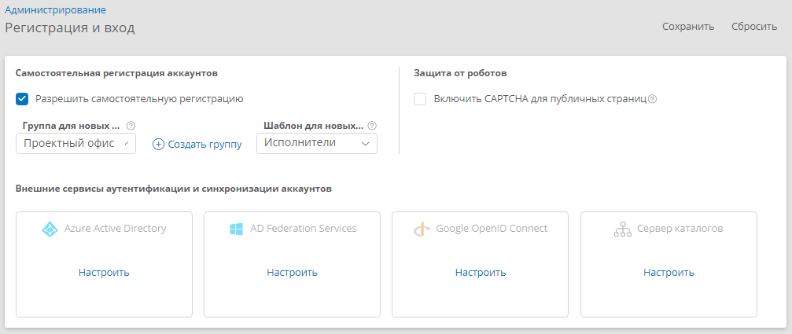

# Настройка самостоятельной регистрации, CAPTCHA и входа через OpenID и AD {: #registration_and_login}

## Введение

Страница «**Регистрация и вход**» позволяет просмотреть и настроить параметры самостоятельной регистрации новых аккаунтов, включить CAPTCHA на страницах входа и регистрации, а также настроить аутентификацию и синхронизацию аккаунтов с внешними службами: Azure Active Directory, AD Federation Services, Google OpenID Connect, Active Directory.

## Порядок настройки

1. На странице «[**Администрирование**][administration]» в разделе — «**Администрирование аккаунтов** выберите пункт «**Регистрация и вход**» <i class="fa-light  fa-user-plus">‌</i>.
2. Отобразится страница «**Регистрация и вход**».

__

## Настройка самостоятельной регистрации аккаунтов {: .pageBreakBefore }

Помимо создания аккаунтов с помощью раздела «[**Аккаунты**][accounts]» можно разрешить их самостоятельную регистрацию со страницы входа в систему.

1. Установите флажок «**Разрешить самостоятельную регистрацию**».
2. При необходимости выберите или создайте группу, в которую следует включать самостоятельно зарегистрированные аккаунты. См. раздел «**[Группы][groups]**»
3. При необходимости выберите шаблон аккаунта, к которому следует привязывать самостоятельно зарегистрированные аккаунты.
4. Чтобы на страницах самостоятельной регистрации и сброса пароля требовалось вводить контрольный код CAPTCHA, установите флажок «**Включить CAPTCHA для публичных страниц**».
5. Нажмите кнопку «**Сохранить**».

## Настройка подключения к внешней службе

1. Нажмите плитку подключения или выберите в меню с троеточием на плитке пункт «**Настроить**».
2. В отобразившемся окне «Свойства подключения» настройте параметры синхронизации аккаунтов с внешней службой.
3. Чтобы включить или отключить возможность входа в систему для аккаунтов из внешней службы, используйте переключатель «**Разрешить вход**».

__

## Создание подключения к серверу каталогов {: .pageBreakBefore }

1. Нажмите плитку Active Directory со ссылкой «**Добавить**».
2. Отобразится окно «**Новое подключение: Сервер каталогов**».
3. Настройте свойства подключения. См. *«[Сервер каталогов. Настройка подключения][ad_connection]»*.
4. Сохраните подключение.

__

## Удаление подключения к серверу каталогов {: .pageBreakBefore }

1. В меню с троеточием на плитке подключения выберите пункт «**Удалить**».
2. Подтвердите удаление в отобразившемся окне.

__

--8<-- "related_topics_heading.md"

**[Сервер каталогов. Настройка подключения][ad_connection]**

**[Аутентификация через WS-Federation. Настройка подключения, федеративного сервера и глобальной конфигурации][wsfederation_connection]**

**[Аутентификация через OpenID Connect. Настройка подключения и служб][openid_connection]**

**[Аутентификация через Active Directory. Настройка контроллера домена и экземпляра ПО][ad_authentication_configure_dc_instance]**

**[Аутентификация через единый вход (SSO). Настройка контроллера домена, экземпляра ПО и компьютера конечного пользователя][sso_authenticatation_configure]**

**[Настройка единого входа (SSO-аутентификации) в ОС Windows][sso_authentication_configure_windows]**


