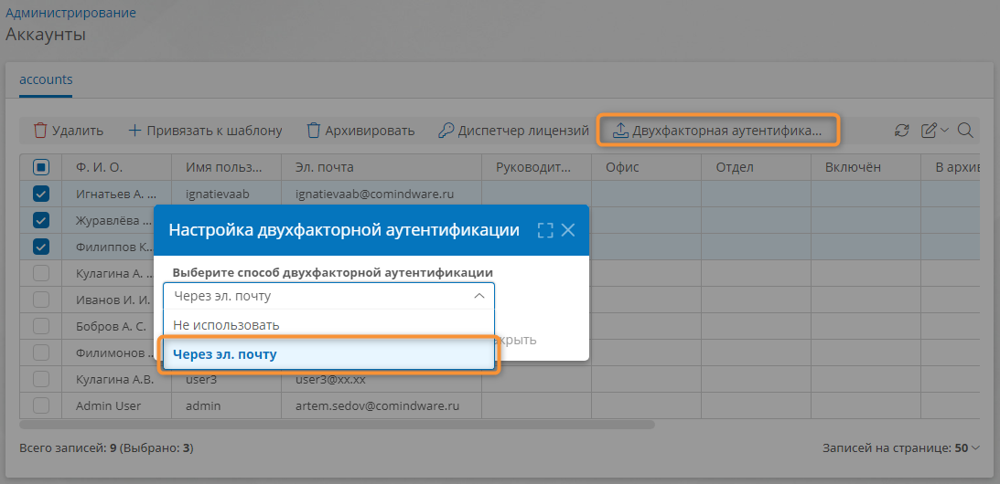

# Двухфакторная аутентификация. Настройка {: #two_factor_authentication}

## Введение

В **{{ productName }}** предусмотрена возможность двухфакторной аутентификации пользователей *мобильного приложения **{{ companyName }}***.

Для использования двухфакторной аутентификации необходимо включить эту функцию в глобальной конфигурации, настроить подключение для отправки эл. писем с кодом подтверждения и включить двухфакторную аутентификацию для аккаунтов, которым она необходима.

## Процесс двухфакторной аутентификации

1. При попытке входа на сервер **{{ productName }}** в мобильном приложении **{{ companyName }}** пользователю будет отправлено письмо с кодом подтверждения.
2. Пользователь должен ввести полученный код из четырёх цифр в течение 5 минут после его отправки. В отношении кода подтверждения действуют следующие ограничения:
	- повторно отправить код можно с интервалом в 1 минуту;
	- неверный код можно ввести не более трёх раз.

## Порядок настройки

1. Откройте страницу «**Администрирование**» – «[**Глобальная конфигурация**][global_configuration]».
2. В разделе «**Двухфакторная аутентификация**» выберите пункт «**Включено**».
3. Перезапустите экземпляр ПО **{{ productName }}**. Для этого обратитесь к системному администратору.
4. Настройте [подключение типа «**Отправка эл. почты из процесса**»][process_sending_connection] и установите в его свойствах флажок «**Использовать по умолчанию**».
5. Откройте страницу «**Администрирование**» – «[**Аккаунты**][accounts]».
6. В списке аккаунтов установите флажки выбора для аккаунтов, которым требуется включить двухфакторную аутентификации.
7. Нажмите кнопку «**Двухфакторная аутентификация**».
8. Во всплывающем окне «**Настройка двухфакторной аутентификации**» выберите пункт «**Через эл. почту**» и нажмите кнопку «**Закрыть**».
9. После включения двухфакторной аутентификации для новых аккаунтов будет автоматически устанавливаться режим двухфакторной аутентификации «**Через эл. почту**».  

__

Включение двухфакторной аутентификации для выбранных аккаунтов

--8<-- "related_topics_heading.md"

**[Глобальная конфигурация][global_configuration]**

**[Отправка эл. почты из процесса. Настройка подключения, пути передачи данных и события на диаграмме процесса][process_sending_connection]**

**[Аккаунты. Создание, настройка, замещение, привязка к шаблону аккаунта, назначение лицензий, удаление][accounts]**


