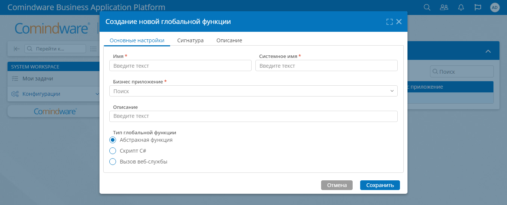

# Функции {: #functions}

## Введение

На странице «**Функции**» можно настроить свойства функций, созданных в предыдущих версиях **{{ productName }}**.

**Функции** предназначены для использования в действии «[**Задача-вызов сервиса**][service_call_task]».

!!! Note "Примечание"

    Создание новых функций в **{{ productName }}** версии 4 не предусмотрено, возможно только редактировать имеющиеся функции.

    Вместо функций рекомендуется использовать [**сценарии**][scenarios].

## Просмотр полного списка функций

1. На странице [«**Администрирование**»][administration] в разделе «**Архитектура**» выберите пункт «**Функции**» <i class="fa-light fa-lambda">‌</i>.
2. Отобразится список функций в составе всех приложений.

__

## Просмотр списка функций для приложения {: .pageBreakBefore }

1. В разделе «[**Администрирование**][apps]» приложения выберите пункт «**Функции**» <i class="fa-light fa-lambda">‌</i>.
2. Отобразится список функций в составе данного приложения.

__

## Настройка функции

1. Дважды щелкните строку в [списке функций](#просмотр-полного-списка-функций).
2. Настройте свойства функции:

    - [**Основные настройки**](#основные-настройки)
    - [**Сигнатура**](#сигнатура)
    - [**Описание**](#описание)

3. Нажмите кнопку «**Сохранить**».

__

### Основные настройки {: .pageBreakBefore }

На этой вкладке настраиваются основные параметры функции:

- **Имя**— наименование глобальной функции;
- **Системное имя**— уникальное текстовое имя глобальной функции.
--8<-- "system_name_requirements.md"
- **Бизнес-приложение** — бизнес-приложение, в котором применяется глобальная функция;
- **Описание**— дополнительный комментарий к назначению глобальной функции;
- **Тип** — выбор вида глобальной функции:
    - **Абстрактная функция**— используется для отладки сигнатуры;
    - **Скрипт C#**— для вызова скрипта C#;
    - **Вызов веб-службы**— для настройки API запросов к внешней веб-службе.

### Сигнатура

На этой вкладке настраиваются параметры передачи данных на входе в функцию и на выходе из неё:

- **Шаблон сообщения на входе** — создайте или выберите уже существующий Шаблон сообщения для передачи параметров на вход глобальной функции;
- **Настройка соответствия** — таблица для определения соответствия атрибутов шаблона сообщения с переменными, прописанными во вкладке «**Описание**».
- **Шаблон сообщения на выходе** — создайте или выберите уже существующий Шаблон сообщения для передачи параметров на выходе из глобальной функции;
- **Настройка соответствия** — таблица для определения соответствия атрибутов шаблона сообщения с переменными, прописанными во вкладке «**Описание**».

### Описание  {: .pageBreakBefore }

На этой вкладке задаётся определение глобальной функции в зависимости от выбранного типа:

- **[Скрипт C#](#скрипт-c)**
- **[Вызов веб-службы](#functions_web_service_call)**

#### Скрипт C#

1. Напишите скрипт. Входные параметры являются параметрами функции. Используйте класс `Dictionary<TKey,TValue>` для передачи параметров ключа и значения. Ключевые параметры соответствуют выходным параметрам сигнатуры.
2. Настройте соответствие между результатом выполнения скрипта и атрибутами выходного шаблона сообщения. Для этого используйте ключи скрипта. Установите флажок «**Использовать для вывода результата скрипта**», если скрипт возвращает единственное значение без ключа, и вы хотите записать это значение в определенный выходной атрибут.

#### Вызов веб-службы {: #functions_web_service_call  .pageBreakBefore }

1. Зарегистрируйте **{{ productName }}** во внешней веб-службе в качестве клиента.
2. Настройте аутентификацию **{{ productName }}** во внешней веб-службе.
3. Введите параметры описания глобальной функции:

    - **Адрес URI веб-службы**  — полный адрес URI веб-службы. В адресе обязательно используйте префикс `http` или  `https`.
    - **Аутентификация**  — выбор метода аутентификации в веб-службе:
        - **Без аутентификации**;
        - **Базовая аутентификация**.
    - **Логин** — логин для доступа к веб-службе. Доступно при выборе «**Базовая аутентификация**» в поле «**Аутентификация**».
    - **Пароль** — пароль для доступа к веб-службе. Доступно при выборе «**Базовая аутентификация**» в поле «**Аутентификация**».
    - **Заголовки**  — таблица настройки заголовков данных, которые будут использоваться в API запросах к веб-службе. Синтаксис заголовков предоставляется веб-службой. Заголовок `Content-Type` является обязательным и может принимать значения `application/json` или `application/xml`.
    - **Метод запроса** — выбор способа запроса веб-службы:
        - **GET** — получить данные из веб-службы;
        - **POST**— отправить данные в веб-службу;
        - **PUT**— отправить и изменить данные в веб-службе;
        - **DELETE** — удалить данные из веб-службы.
    - **Текст запроса** — данные, которые должны быть отправлены в веб-службу.
    - **Метод парсинга** — выбор способа парсинга данных, содержащихся в ответе веб-службы:
        - **Как есть**;
        - **XML**;
        - **JSON**.
    - **Настройка соответствия** —  таблица для настройки соответствия между атрибутами шаблона сообщения на выходе из функции и данными из ответа веб-службы.


