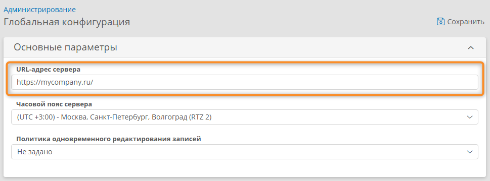
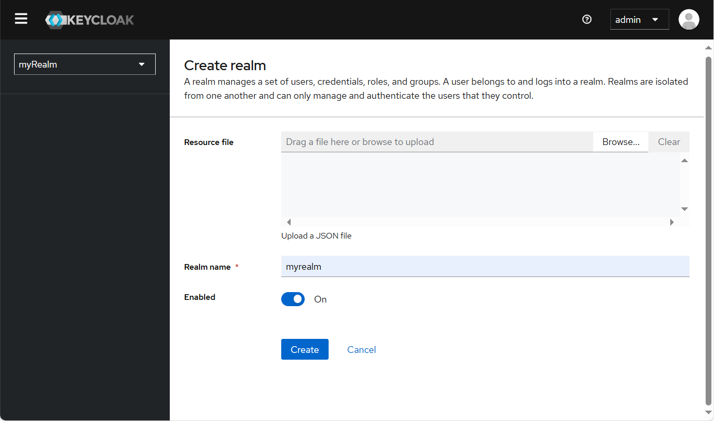
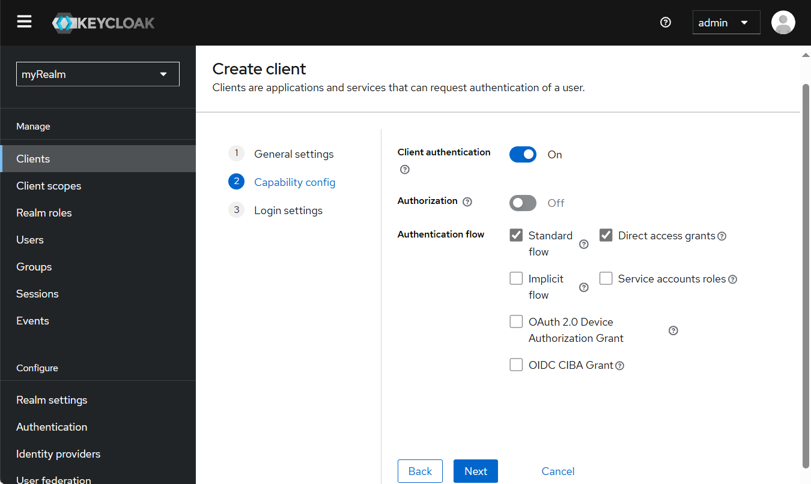
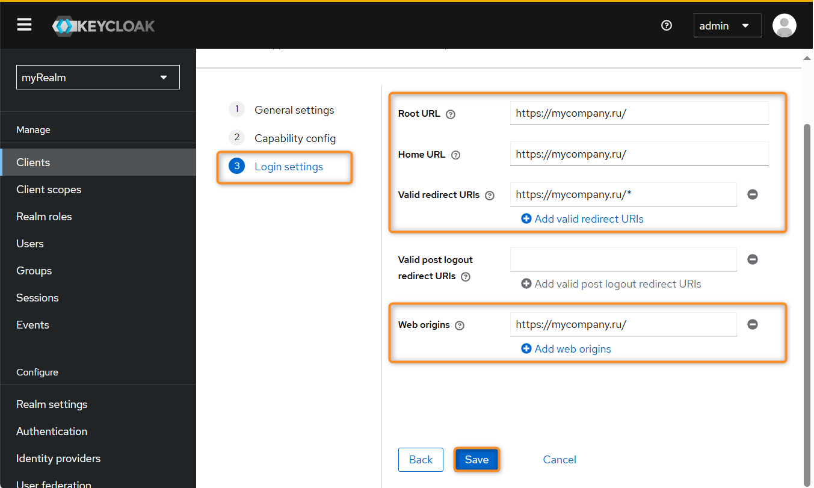
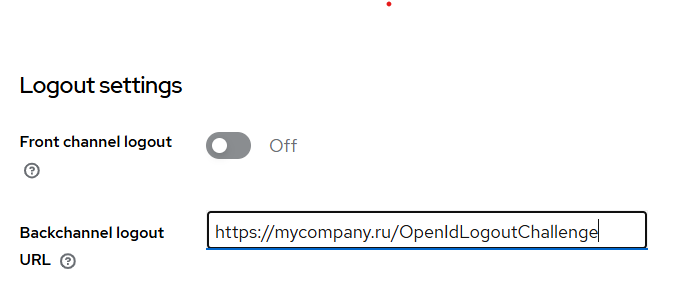
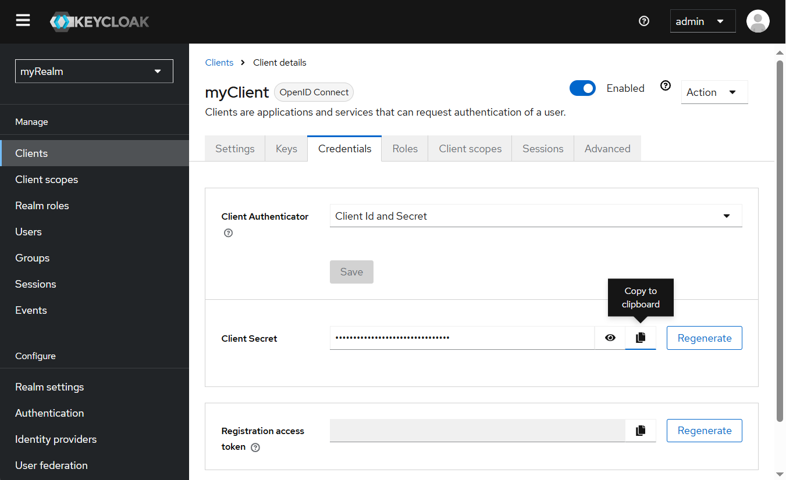
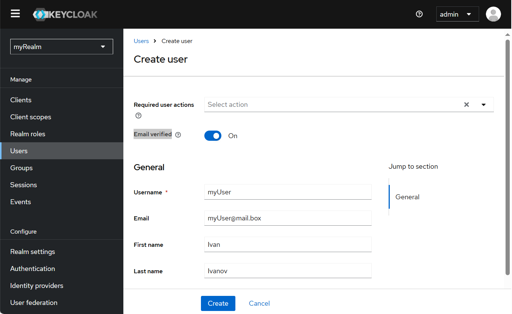
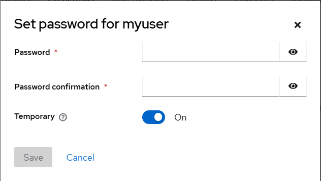
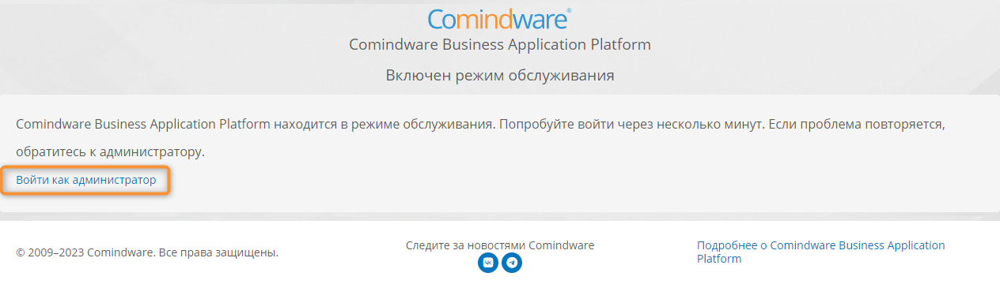
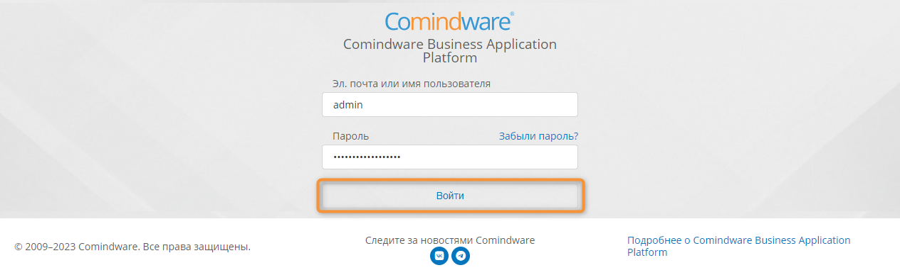

# Аутентификация через OpenID Connect. Настройка подключения и служб {: #openid_connection }

## Введение {: #openid_connection_intro }

Здесь представлены краткие инструкции по настройке аутентификации в **{{ productName }}** посредством Keycloak и клиента OpenID Connect.

## Подготовка к настройке {: #openid_connection_prerequisites }

Перед настройкой аутентификации через Keycloak подготовьте следующие сведения:

- `<yourHost>` — адрес сервера из [глобальной конфигурации](#openid_connection_server_address) **{{ productName }}**;
- `<instanceName>.yml` — путь к файлу конфигурации экземпляра **{{ productName }}** (cм. _«[Пути и содержимое папок экземпляра ПО][paths]»_).

## Проверка подключения сервера {{ productName }} по протоколу HTTPS {: #openid_connection_server_address }

1. Откройте страницу [«**Администрирование**» — «**Глобальная конфигурация**»][global_configuration].
2. Удостоверьтесь, что **URL-адрес сервера** начинается с `https://`.

    __

## Настройка Keycloak {: #openid_connection_keycloak_configure .pageBreakBefore }

1. Откройте консоль администратора Keycloak
2. В левом меню выберите область (realm) **master** или другую существующую область.

    __

3. Если требуемая область (realm) отсутствует, нажмите кнопку **Create realm** (Создать область)? введите имя области, например _myRealm_, и нажмите кнопку **Create** (Создать).

    __

4. В левом меню выберите пункт **Clients** (Клиенты).
5. Нажмите кнопку **Create client** (Создать клиент).
6. Выберите «**Client type**» (Тип клиента): **OpenID Connect**.
7. Введите «**Client ID**» (ID клиента), например _myClient_.

    __

8. На вкладке **Capability config** (Конфигурация совместимости) включите функции **Client authentication** (Аутентификация клиента) и **Direct access grants** (Прямое предоставление прав).

    __

10. На вкладке **Login settings** (Параметры входа) укажите **Root URL** (Корневой URL), **Home URL**  (URL начальной страницы), **Valid redirect URIs** (URI допустимых переадресаций), **Web origins** (Исходные URI)
(например: `https://<yourHost>/`, `https://<yourHost>/`, `https://<yourHost>/*`, `https://<yourHost>/`, соответственно).

    __

11. Нажмите кнопку «**Save**» (Сохранить).
12. На отобразившейся странице отключите функцию **Front channel logout** (Выход через прямой канал) и введите **Backchannel logout URL** (URL выхода через обратный канал) (например: `https://<yourHost>/OpenIdLogoutChallenge`).

    __

13. Сохраните **Client Secret** (Секрет клиента) с вкладки **Credentials** (его потребуется указать в директиве `auth.openId.clientSecret` в [файле конфигурации {{ productnName }}](#openid_connection_instance_configure)).

    __

14. В левом меню нажмите кнопку ***Users** (Пользователи).
15. Создайте нового пользователя, нажав кнопку **Create new user** (Создать пользователя), или добавьте имеющегося пользователя, нажав кнопку **Add user** (Добавить пользователя).
16. Заполните поля **Username** (Логин), **Email** (Адрес эл.&nbsp;почты), **First name** (Имя), **Last name** (Фамилия).
17. Включите функцию **Email verified** (Адрес эл.&nbsp;почты подтверждён).
18. Нажмите кнопку **Create** (Создать).

    __

19. На вкладке **Credentials** (Учётные данные) нажмите кнопку **Set password** (Установить пароль).
20. Задайте временный пароль для пользователя.

    __

### Настройка конфигурации {{ productName }} {: #openid_connection_instance_configure .pageBreakBefore }

1. В файле конфигурации экземпляра **{{ productName }}** (`<instanceName>.yml`) настройте директивы по следующему образцу:

    ``` yaml
    #### Настройки OpenID-аутентификации #####
    # Имя сервиса OpenID, используемого для входа
    auth.openId.displayName: <myKeycloak>
    # Вкл./выкл. функции
    auth.openId.enabled: true
    # Адрес сервера OpenId Connect
    auth.openId.server: https://<myKeycloakHost>
    # Пространство имен или контекст, 
    # в котором происходит аутентификация пользователей.
    # Используется для управления идентификацией
    # и доступом в системе OpenID Connect
    auth.openId.realm: myRealm
    # Уникальный идентификатор клиентского приложения,
    # используемый для аутентификации и авторизации запросов
    # в рамках протокола OpenID Connect
    auth.openId.clientId: myClient
    # Секретный ключ OpenId Connect
    # Это сохранённый ранее секрет клиента
    auth.openId.clientSecret: <keyCloakClientSecret>
    # Список идентификаторов целевой аудитории,
    # для которой предназначены токены, 
    # используемые в процессе аутентификации и авторизации в OpenID Connect.
    auth.openId.audience: myAudience
    ```

## Настройка ОС Linux для включения аутентификации через OpenID Connect в {{ productName }} {: .pageBreakBefore }

1. Перейдите в режим суперпользователя `root`:

    --8<-- "linux_sudo.md"

2. Добавьте в файл `/etc/hosts` строку:

    ```
    "xxx.xxx.xxx.xxx" "<yourHost>"
    ```

    Здесь `xxx.xxx.xxx.xxx` — IP-адрес, `<yourHost>` адрес сервера **{{ productName }}**, указанный в [_глобальной конфигурации {{ productName }}_](#проверка-адреса-сервера-comindware-platform) (без указания протокола `HTTP` или `HTTPS`).

3. Сформируйте SSL-сертификат на сервере NGINX. Например, согласно инструкциям в статье _«[Генерация SSL сертификата для NGINX (openssl)](https://webguard.pro/web-services/nginx/generacziya-ssl-sertifikata-dlya-nginx-openssl.html)»_.
4. Откройте для редактирования файл конфигурации NGINX:

    ```
    vim /etc/nginx/sites-available/comindware<instanceName>
    ```

    

5. Настройте конфигурацию SSL-сертификата аналогично следующему примеру:

    ``` cs
    server {
        listen 80 default;
        listen 443 ssl;

        root /var/www/<instanceName>;
        server_name <yourHost>;

        ssl_certificate /etc/nginx/ssl/nginx.crt;
        ssl_certificate_key /etc/nginx/ssl/nginx.key;

        client_max_body_size 300m;
        fastcgi_read_timeout 10000;
        location / {
            proxy_read_timeout 10000;
                        proxy_connect_timeout 10000;
                        proxy_send_timeout 10000;
                        root          /var/www/<instanceName>/;
                        fastcgi_pass  unix:/var/www/<instanceName>/App_Data/comindware.socket;
                        include       /etc/nginx/fastcgi.conf
                        }
    }
    ```
    

7. Проверьте конфигурацию NGINX:

    ```
    nginx -t
    ```

8. Перезапустите **{{ productName }}**:

    ```
    systemctl restart elasticsearch nginx comindware<instanceName>
    ```

## Вход в {{ productName }} через Keycloak {: .pageBreakBefore }

1. Откройте веб-сайт экземпляра **{{ productName }}**, например [https://<yourHost>](https://<yourHost>/)
2. Нажмите кнопку «**Войти как администратор**».

    __

3. Введите свои учётные данные и нажмите кнопку «**Войти**».

    __

    

4. Выйдите из системы.
5. Отобразится страница входа с кнопкой «**Войти с помощью myKeycloak**».
6. На этом настройка входа через OpenID Connect завершена. Теперь пользователи смогут входить в **{{ productName }}** с использованием своих аккаунтов через Keycloak.

<div class="relatedTopics" markdown="block">

--8<-- "related_topics_heading.md"

- [Глобальная конфигурация][global_configuration]
- [Пути и содержимое папок экземпляра ПО][paths]

</div>


