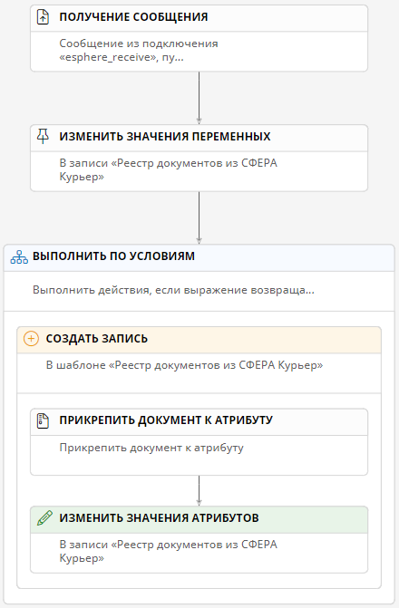

# Получение документов через «СФЕРА Курьер» {: #esphere_receive_configure}

## Введение



## Прикладная задача

Здесь приведён пример настройки подключения, пути передачи данных, шаблона записи и сценария для получения документов из системы «СФЕРА Курьер».

## Порядок настройки

1. Настройте [подключение](#настройка-подключения-для-получения-id-документов) типа «**Получение сообщений из системы «СФЕРА Курьер**».
2. Настройте [путь передачи данных](#настройка-пути-передачи-данных-для-получения-id-документов) «**Приём сообщений из «СФЕРА Курьер**», использующий созданное подключение.
3. Настройте [подключение](#настройка-подключения-для-отправки-запроса-к-сфера-курьер) типа «**Отправка сообщений в систему «СФЕРА Курьер**».
4. Настройте [путь передачи данных](#настройка-пути-передачи-данных-для-отправки-запроса-к-сфера-курьер) «**Отправка сообщений в «СФЕРА Курьер**» типа «**Получить документ**», использующий созданное подключение.
5. Настройте [шаблон записи](#настройка-шаблона-записи) для хранения данных электронных документов.
6. Настройте [сценарий](#настройка-сценария) для получения данных о контрагенте из системы «СФЕРА Курьер».

!!! tip "Совет"

    Из-за особенностей API «СФЕРА Курьер» при получении сообщений могут приходить не все атрибуты электронного документа. Чтобы получить недостающие атрибуты, отправьте дополнительный запрос с ID требуемого документа в «СФЕРА Курьер». Пример такого запроса приведён ниже в инструкциях по [настройка сценария](#настройка-сценария).

## Настройка подключения для получения ID документов

1. Откройте страницу «**Администрирование**» — «**[Подключения][connections]**».
2. В списке подключений откройте или создайте подключение типа «**Пользовательские подключения**» — «**Получение сообщений из системы «СФЕРА Курьер**».


## Настройка пути передачи данных для получения ID документов

1. Откройте страницу «**Администрирование**» — «**[Пути передачи данных][communication_routes]**».
2. Откройте двойным нажатием в списке или создайте подключение типа «**Пользовательские подключения**» — «**Приём сообщений из «СФЕРА Курьер**».
3. Настройте свойства пути передачи данных на следующих вкладках:

    - [**Основные свойства**](#основные-свойства)
    - [**Атрибуты сообщений**](#атрибуты-сообщений)
    - [**Интеграция**](#интеграция)

4. Сохраните путь передачи данных.

### Основные свойства

На вкладке «**Основные свойства**» настройте параметры использования пути передачи данных.

- **Подключение** — выберите [подключение для получения ID контрагентов из «СФЕРА Курьер»](#настройка-подключения-для-получения-id-документов).


### Атрибуты сообщений

На вкладке «**Атрибуты сообщения**» настройте атрибуты, значения которых будут подставляться в содержимое сообщений в зависимости от его типа.

1. Выберите **тип сообщения**:

    - **Поиск документов**;
    - **Перечислить компании по ИНН**.

    В примере используется тип сообщения «**Поиск документов**».

2. В таблицах «**Запрос**», «**Ответ**» и «**Ответ с ошибкой**» отобразятся готовые атрибуты, соответствующие выбранному **типу сообщения**.



### Интеграция

На вкладке «**Интеграция**» задайте статические параметры запроса к системе «СФЕРА Курьер»:

- Для типа сообщения «**Поиск документов**»:
    - **Папка документов** — укажите название папки в «СФЕРА Курьер» для поиска документов.
    - **Количество строк** — укажите максимальное количество документов, которые могут быть получены в одном запросе.
    - **Идентификатор статуса** — укажите идентификатор статуса искомого документа в «СФЕРА Курьер».
    - **Признак завершённости документооборота** — установите флажок для поиска документа с этим признаком.
    - **Признак того, что документ назначен текущему пользователю** — установите флажок для поиска документа с этим признаком.
    - **Номер договора** — укажите номер договора для поиска документа в «СФЕРА Курьер».
    - **Имя файла** — укажите имя файла для поиска документа в «СФЕРА Курьер».
    - **Идентификатор участника маршрута** — укажите уникальный идентификатор участника системы электронного документооборота (ЭДО).
    - **Идентификатор группы участников маршрута** — укажите уникальный идентификатор группы участников системы электронного документооборота (ЭДО).
    - Укажите **даты** для поиска документа в «СФЕРА Курьер».
- Для типа сообщения «**Перечислить компании по ИНН**»:
    - **ИНН клиента** — укажите ИНН клиента для поиска в «СФЕРА Курьер».
    - **ОГРН клиента** — укажите ОГРН клиента для поиска в «СФЕРА Курьер».
    - **КПП клиента** — укажите КПП клиента для поиска в «СФЕРА Курьер».

## Настройка подключения для запроса документов из «СФЕРА Курьер» {: #configure_connection_send_request }



## Настройка пути передачи данных для запроса документов из «СФЕРА Курьер»



### Основные свойства


- **Системное имя** — введите уникальное имя пути передачи данных.
- **Отключить** — установите этот флажок, если требуется временно деактивировать данный путь передачи данных.
- **Описание** — введите наглядное описание пути передачи данных, например _«Путь для запроса документов в «СФЕРА Курьер»_.
- **Номер шины данных** — выберите номер от 0 до 3, если требуется распределить потоки данных нескольких путей для повышения производительности.

### Атрибуты сообщений

На вкладке «**Атрибуты сообщения**» настройте атрибуты, значения которых будут подставляться в содержимое сообщений в зависимости от его типа.

1. Выберите **тип сообщения** «**Получить документ**»:
2. В таблицах «**Запрос**», «**Ответ**» и «**Ответ с ошибкой**» отобразятся готовые атрибуты, соответствующие выбранному **типу сообщения**.



## Настройка шаблона записи

1. Создайте шаблон записи _«Реестр документов из СФЕРА Курьер»_ со следующими атрибутами:

    - _Идентификатор документа «СФЕРА Курьер»_ типа «**Текст**»;
    - _Электронный договор_ типа «**Логический**»;
    - _Сумма документа_ типа «**Число**»;
    - _Сумма НДС_ типа «**Число**»;
    - _Номер документа контрагента_ типа «**Текст**»;
    - _Дата документа контрагента_ типа «**Дата и время**»;
    - _Документ_ типа «**Документ**».

2. Перенесите атрибуты на **основную форму**.

## Настройка сценария

1. Создайте новый сценарий:

    - **Название:** _Получение документов из СФЕРА Курьер_
    - **Контекст выполнения: от инициатора**

2. Настройте событие сценария:

    - **Тип: получение сообщения**
    - **Контекстный шаблон:** _Реестр документов из СФЕРА Курьер_
    - **Подключение:** выберите [подключение для получения сообщения из системы «СФЕРА Курьер»](#настройка-подключения)
    - **Путь передачи данных:** выберите [путь передачи данных для получения сообщений из системы «СФЕРА Курьер» типа «**Поиск документов**»](#настройка-пути-передачи-данных)
    - **Имя переменной:** _Message_

3. Добавьте действие «**Изменить значения переменных**»:

    - **Операция со значениями переменных: добавить**
    - **Набор переменных:** _Request_
    - Добавьте переменную _DocumentId_ со **значением** на **N3**:

    ``` turtle
    # Импортируем функции для работы с переменными
    @prefix session: <http://comindware.com/ontology/session#>.
    @prefix variable: <http://comindware.com/ontology/session/variable#>.
    {
        # Получаем значение локальной переменной Message и помещаем в ?message
        session:context variable:Message ?message.
        # Из ?message получаем ID документа и возвращаем его
        ?message variable:Id ?value.
    }
    ```

4. Добавьте действие «**Отправить сообщение**» со следующими свойствами:

    - **Подключение:** выберите [подключение для запроса документов из «СФЕРА Курьер»](#настройка-подключения-для-запроса-документов-из-сфера-курьер)
    - **Путь передачи данных:** выберите [путь передачи данных для для запроса документов из «СФЕРА Курьер» типа «**Получить документ**»](#настройка-пути-передачи-данных-для-запроса-документов-из-сфера-курьер)
    - **Переменная с сообщением:** _Request_
    - **Переменная для успешного ответа:** _Response_
    - **Переменная для ответа с ошибкой:** _Error_

5. Добавьте действие «**Изменить значения переменных**» со следующими свойствами:

    - **Операция со значениями переменных: добавить**
    - **Набор переменных:** _Document_
    - добавьте следующие переменные:
        - _Content_ со **значением** на **N3**:

            ``` turtle
            # Импортируем функции для работы с переменными
            @prefix session: <http://comindware.com/ontology/session#>.
            @prefix variable: <http://comindware.com/ontology/session/variable#>.

            {
                # Получаем значение локальной переменной Response и помещаем в ?response
                session:context variable:Response ?response.
                # Из ?response получаем документ и помещаем в ?document
                ?response variable:Content ?document.
                # Из ?document получаем содержимое документа и возвращаем его
                ?document variable:Content ?value.
            }
            ```
        
        - _Name_ со **значением** на **N3**:

            ``` turtle
            # Импортируем функции для работы с переменными
            @prefix session: <http://comindware.com/ontology/session#>.
            @prefix var: <http://comindware.com/ontology/session/variable#>.

            {
                # Получаем значение локальной переменной Response и помещаем в ?response
                session:context var:Response ?response.
                # Из ?response получаем документ и помещаем в ?document
                ?response var:Content ?document.
                # Из ?document получаем имя файла документа и возвращаем его
                ?document var:Filename ?value.
            }
            ```

6. Добавьте действие «**Выполнить по условиям**» со следующими параметрами:

    - **Название условия:** _NotHaveDocument_
    - **Выражение: N3**

    ``` turtle
    # Импортируем функции для работы с переменными и атрибутами
    @prefix object: <http://comindware.com/ontology/object#>.
    @prefix variable: <http://comindware.com/ontology/session/variable#>.
    @prefix session: <http://comindware.com/ontology/session#>.
    @prefix cmwui: <http://comindware.com/ontology/ui#>.
    @prefix assert: <http://comindware.com/logics/assert#>.
    {
        # Получаем значение локальной переменной Response и помещаем в ?response
        session:context variable:Response ?response.
        # Получаем из ?response ID документа и помещаем его в ?docId
        ?response variable:Id ?docId.
        # Приводим ?docId к строковому типу и помещаем в ?docIdStr
        ?docId cmwui:toClientString ?docIdStr.
        # Находим атрибут idDokumentaEDO (Идентификатор документа «СФЕРА Курьер»)
        # в шаблоне Reestrdokumentov (Реестр документов из СФЕРА Курьер)
        ("Reestrdokumentov" "idDokumentaEDO") object:findProperty ?foundIds.
        
        # Сравниваем ?foundIds и ?docIdStr на предмет совпадений
        {?coincidence ?foundIds ?docIdStr.} assert:count ?countCoincidence.
        # Если совпадений нет (т.е. ID документа из полученного сообщения
        # не встречается в шаблоне «Реестр документов из СФЕРА Курьер»)
        if {?countCoincidence == 0}
        # возвращаем значение true
        then {true -> ?value.}.
    }
    ```

7. Внутрь действия «**Выполнить по условиям**» поместите действие «**Создать запись**» и выберите **целевой шаблон** _«Реестр документов из СФЕРА Курьер»_.
8. Внутрь действия «**Создать запись**» поместите действие «**Прикрепить документ к атрибуту**» со следующими свойствами:

    - **Атрибут:** _Документ_
    - **Операция со значениями: добавить**
    - **Значение: формула**

    ``` cs
    $$Document
    ```

9. Внутрь действия «**Создать запись**» поместите действие «**Изменить значения атрибутов**» со следующими свойствами:

<table markdown="block">
<tbody markdown="block">
<tr markdown="block">
<th markdown="block">
Атрибут
</td>
<th markdown="block">
Операция со значениями
</td>
<th markdown="block">
Значение
</td>
</tr>
<tr markdown="block">
<td markdown="block">
_Идентификатор документа «СФЕРА Курьер»_
</td>
<td markdown="block">
**Заменить**
</td>
<td markdown="block">

**N3:**

``` turtle
# Импортируем функции для работы с переменными
@prefix variable: <http://comindware.com/ontology/session/variable#>.
@prefix session: <http://comindware.com/ontology/session#>.
@prefix ui: <http://comindware.com/ontology/ui#>.
{
    # Получаем значение локальной переменной Response
    # и помещаем в ?response
    session:context variable:Response ?response.
    # Получаем из ?response ID документа и помещаем его в ?docId
    ?response variable:Id ?docId.
    # Приводим ?docId к строковому типу и возвращаем значение ID
    ?docId ui:toClientString ?value.
}
```

</td>
</tr>
<tr markdown="block">
<td markdown="block">
_Электронный договор_
</td>
<td markdown="block">
**Заменить**
</td>
<td markdown="block">
**Формула:** `true`
</td>
</tr>
<tr markdown="block">
<td markdown="block">
_Сумма документа_
</td>
<td markdown="block">
**Заменить**
</td>
<td markdown="block">
**Формула:** `$$Response->TotalSum`
</td>
</tr>
<tr markdown="block">
<td markdown="block">
_Сумма НДС_
</td>
<td markdown="block">
**Заменить**
</td>
<td markdown="block">
**Формула:** `$$Response->VatSum`
</td>
</tr>
<tr markdown="block">
<td markdown="block">
_Номер документа контрагента_
</td>
<td markdown="block">
**Заменить**
</td>
<td markdown="block">
**Формула:** `$$Response->Number`
</td>
</tr>
<tr markdown="block">
<td markdown="block">
_Дата документа контрагента_
</td>
<td markdown="block">
**Заменить**
</td>
<td markdown="block">
**Формула:** `$$Response->Date`
</td>
</tr>
</tbody>
</table>

__

## Тестирование

1. С помощью системы «СФЕРА Курьер» отправьте документ пользователю «СФЕРА Курьер», API-ключ которого используется для [интеграции со «СФЕРА Курьер»](#порядок-настройки).
2. Перейдите к записям шаблона _«Реестр документов из СФЕРА Курьер»_.
3. В списке должна отобразиться новая запись.
4. Перейдите к новой записи и посмотрите полученные данные. К записи должен быть прикреплён документ и должны быть заполнены поля атрибутов.

--8<-- "related_topics_heading.md"

- _[Отправка документов через «СФЕРА Курьер»][esphere_send_configure]_
- _[Подключения. Определения, типы, создание, настройка, удаление][connections]_
- _[Пути передачи данных][communication_routes]_


