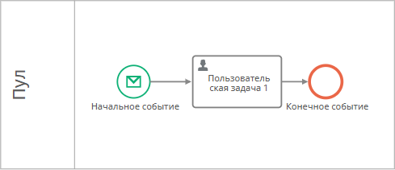
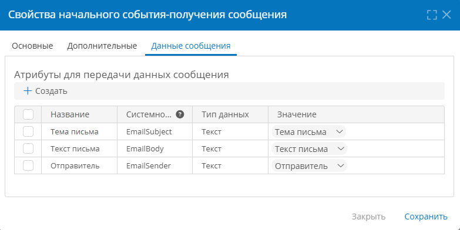

# Получение эл. почты и веб-запросов в процессе {: #process_receiving_connection}

## Введение

Здесь представлены инструкции по настройке подключения и пути передачи передачи данных из эл. писем и веб-запросов в бизнес-процессе.

Кроме того, потребуется настроить **[начальное][process_diagram_elements_receive_message_start_event]** или **[промежуточное][process_diagram_elements_receive_message_intermediate_event] событие-получение сообщения** на диаграмме процесса.

Подробный пример настройки приложения для обмена данными посредством эл. почты см. в статье _«[Пример: согласование заявлений по эл. почте. Настройка подключений, путей передачи данных и диаграммы процесса][process_email_configure]»_.

## Порядок настройки получения эл. писем

1. [Настройте подключение](#настройка-подключения) типа «**Получение эл. почты в процессе**».
2. [Настройте путь передачи данных](#настройка-пути-передачи-данных) типа «**Получение эл. почты в процессе**».
3. Настройте [начальное или промежуточное событие-получение сообщения](#настройка-события-получения-сообщения) на диаграмме процесса:

    - укажите настроенный **путь передачи данных**;
    - настройте сопоставление **данных сообщения**.

## Настройка подключения



1. Откройте страницу **«Администрирование»** — **«Подключения»**.
2. Откройте двойным нажатием в списке или создайте **подключение к электронной почте** типа «**Получение эл. почты в процессе**».
3. Настройте подключение к IMAP-серверу:

    - **Отключить** — установите этот флажок, если требуется временно деактивировать данное подключение.
    - **Название** — наименование подключения.
    - **Протокол** — выберите почтовый протокол:
        - **IMAP**;
        - **Microsoft Exchange**.
    - **Адрес почтового сервера** — укажите URL почтового сервера.

        !!! note "Примечание"

            - Для **SMTP не** указывайте протокол (`SMTP`, `HTTPS`, `HTTP`).
            - Для **Exchange укажите** протокол (`HTTPS`, `HTTP`).

    - **Порт** — укажите порт для подключения к почтовому серверу.
    - **Имя пользователя** — укажите учётную запись для подключения к почтовому серверу.
    - **Пароль** — введите пароль к учётной записи для подключения к почтовому серверу.
    - **Интервал опроса** — укажите интервал, с которым **{{ productName }}** будет проверять наличие новых писем.
    - **Защита данных** — выберите протокол шифрования:
        - **Нет**;
        - **SSL**;
        - **TLS**.
    - **Проверить соединение** — нажмите эту кнопку, чтобы проверить соединение с почтовым сервером.

4. Нажмите кнопку «**Создать**».

__

## Настройка пути передачи данных {: .pageBreakBefore }

Путь передачи данных для получения эл. почты служит для преобразования и передачи данных из эл. письма в **{{ productName }}**.

1. Откройте страницу «**Администрирование**» — «**Архитектура**» или страницу «**Администрирование**» приложения.
2. Выберите пункт «[**Пути передачи данных**][communication_routes]» <i class="fa-light fa-route " aria-hidden="true"></i>.
3. Откройте двойным нажатием в списке или создайте путь передачи данных типа «**Подключения к электронной почте**» – «**Получение эл. почты в процессе**».
4. Настройте свойства пути передачи данных на следующих вкладках:

    - [**Основные свойства**](#основные-свойства)
    - [**Атрибуты сообщения**](#атрибуты-сообщения)

5. Сохраните путь передачи данных.

### Основные свойства {: .pageBreakBefore }

На вкладке «**Основные свойства**» настройте базовые параметры пути передачи данных:

- **Отключить** — установите этот флажок, чтобы временно деактивировать путь передачи данных.
- **Название** — введите наглядное наименование пути передачи данных.
- **Подключение** — выберите подключение типа «**Получение эл. почты в процессе**».
- **Имя сообщения** — введите _уникальный_ идентификатор сообщения, проходящего по данному пути передачи данных.
- **Приложение** — выберите бизнес-приложение, в котором будет использоваться путь передачи данных.
- **Процесс** — выберите процесс из приложения, в котором будет использоваться путь передачи данных;
- **Назначение** — укажите полученным сообщением:
    - **Новый экземпляр процесса** — полученное сообщение будет создавать новый экземпляр указанного процесса;
    - **Существующий экземпляр процесса** — полученное сообщение будет отправлено в определенный экземпляр указанного процесса.
- **Ключевое поле** — атрибут для поиска существующего экземпляра процесса. Доступно при указании «**Существующий экземпляр процесса**» в «**Назначении**».

__

### Атрибуты сообщения {: .pageBreakBefore }

На вкладке «**Атрибуты сообщения**» заполните таблицу соответствия атрибутов сообщения с атрибутами электронного письма.

!!! tip "Извлечение значений атрибутов из эл. письма"

    Путь передачи данных для получения эл. почты служит для передачи данных из эл. письма в **{{ productName }}**.

    - На вкладке «**Атрибуты сообщения**» пути передачи данных задайте набор атрибутов, значения которых требуется извлечь из письма. Для этого создайте атрибуты и сопоставьте их с полями эл. письма.

        - Например, поместите текст эл. письма в атрибут _EmailBody_:

            - **Название:** _Текст письма_
            - **Системное имя:** _Email__Body_
            - **Тип данных: текст**
            - **Поместить тело ответа в этот атрибут:** _Сообщение_

    - Передайте значения атрибутов сообщения в атрибуты записи с помощью вкладки «**Данные сообщения**» в свойствах [**события-получения сообщения**][process_diagram_elements_receive_message_start_event], использующего этот путь передачи данных.

Чтобы создать атрибут сообщения и сопоставить его с полем письма, нажмите кнопку «**Создать**» и заполните строку таблицы сопоставления:

- **Название** — введите наглядное название атрибута.
- **Системное имя** — введите уникальное имя атрибута.
- **Тип данных** — выберите тип данных:
    - **Текст**
    - **Число**
    - **Длительность**
    - **Дата и время**
    - **Логический**
    - **Документ**
    - **Аккаунт**
- **Поле сообщения** — выберите поле электронного письма, значение которого требуется присвоить атрибуту сообщения:
{: .pageBreakBefore }
    - **Адрес отправителя**
    - **Имя отправителя**
    - **Адрес получателя**
    - **Имя получателя**
    - **Тема**
    - **Сообщение**
    - **Адрес для отправки копии**
    - **Имя для отправки копии**
    - **Адрес для отправки скрытой копии**
    - **Имя для отправки скрытой копии**
    - **Прикреплённые файлы**
    - **ID сообщения**
    - **Дата получения сообщения**

__

## Настройка события-получения сообщения

1. Поместите на диаграмму процесса [начальное][process_diagram_elements_receive_message_start_event] или [промежуточное][process_diagram_elements_receive_message_intermediate_event] событие-получение сообщения.

    __

2. В меню элемента события нажмите кнопку «**Свойства**» <i class="fa-light fa-gear">‌</i>.
3. На вкладке «**Основные**» настройте [общие свойства элемента][process_diagram_element_common_properties].
4. На вкладке «**Дополнительные**» выберите ранее созданный [путь передачи данных](#настройка-пути-передачи-данных).
5. На вкладке «**Данные сообщения**» сопоставьте **[атрибуты сообщения](#атрибуты-сообщения)** с атрибутами **[шаблона записи][record_templates]**, связанного с шаблоном процесса:

    - Укажите название, системное имя и тип данных **атрибутов сообщения** так же, как они указаны в таблице «**Атрибуты для передачи данных сообщения**» в [свойствах пути передачи данных](#атрибуты-сообщения).
    - В столбце «**Значение**» укажите атрибут **шаблона записи** такого же типа, как **атрибут сообщения**.
    - Значения указанных **атрибутов сообщения**  будут присвоены атрибутам **шаблона записи**.

    __

6. Опубликуйте процесс.

--8<-- "related_topics_heading.md"

- _[Начальное событие-получение сообщения][process_diagram_elements_receive_message_start_event]_
- _[Промежуточное событие-получение сообщения][process_diagram_elements_receive_message_intermediate_event]_
- _[Отправка, получение и обработка эл. почты в процессе. Пример: настройка подключений, путей передачи данных, диаграммы процесса и сценария][process_email_configure]_
- _[Отправка эл. почты из процесса. Настройка подключения, пути передачи данных и события на диаграмме процесса][process_sending_connection]_
- _[Получение эл. почты с помощью сценария через Exchange и IMAP. Настройка подключения, пути передачи данных и сценария][scenario_receive_email]_
- _[Отправка эл. почты из сценариев через SMTP и Exchange. Настройка подключения, пути передачи данных и сценария][scenario_send_email]_


