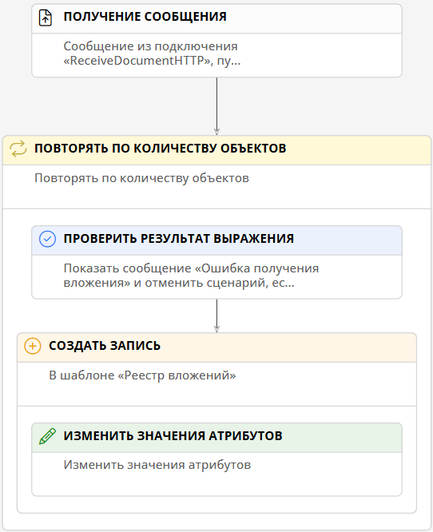

# Получение составного содержимого через HTTP-запросы {: #http_receive_file}

## Введение

**{{ productName }}** может получать составное содержимое с помощью встроенного HTTP-адаптера.

Здесь представлены инструкции по настройке подключения, пути передачи данных, шаблона записи и сценария для получения запросов в формате `JSON` с составным содержимым и прикреплёнными файлами.

## Прикладная задача

Имеется шаблон _«Реестр вложений»_, содержащий записи с прикреплёнными файлами.

Требуется настроить создание записей в шаблоне, получение файлов из внешней системы с помощью HTTP-запроса и добавление их в записи.

## Настройка подключения

1. Откройте страницу «**Администрирование**» — «**Подключения**».
2. Откройте двойным нажатием или создайте «**Подключения REST и OData**» — «**Получение HTTP-запросов**».
3. Настройте подключение к серверу:

    - **Системное имя** — введите уникальное имя подключения.
    --8<-- "system_name_requirements.md:no_autofill"
    - **Отключить** — установите этот флажок, если требуется временно деактивировать данное подключение.
    - **Описание** — введите наглядное описание подключения, например _«Подключение для получения файлов по HTTP»_.
    - **Запись в файловые журналы** — выберите, какие события следует записывать в журналы:
        - **Полные сведения об обработке сообщения**;
        - **Только ошибки**;
        - **Отключить** — не регистрировать в журнале события получения запросов.
    - **URI** — укажите адрес сервера, от которого будут отправляться запросы.
    - **Формат данных** — выберите формат **JSON**.
    - **Кодировка данных** — укажите формат кодировки данных, используемый сервером, по умолчанию: **UTF-8**..
    - **Тип аутентификации** — выберите способ проверки подлинности, используемый сервером:
        - **Отсутствует**;
        - **Базовая**;
        - **Аутентификация Windows**.

4. Нажмите кнопку «**Проверить соединение**», чтобы проверить соединение с сервером.
5. При необходимости нажмите кнопку «**Скачать журнал**», чтобы просмотреть журнал событий получения писем.
6. Сохраните подключение.

## Настройка пути передачи данных

1. Откройте страницу «**Администрирование**» — «**Архитектура**» или страницу «**Администрирование**» приложения.
2. Выберите пункт «[**Пути передачи данных**][communication_routes]» <i class="fa-light fa-route " aria-hidden="true"></i>.
3. Откройте двойным нажатием в списке или создайте путь передачи данных типа «**Подключения REST и OData**» — «**Получение HTTP-запросов**».
4. Настройте свойства пути передачи данных на следующих вкладках:

    - [**Основные свойства**](#основные-свойства)
    - [**Атрибуты сообщений**](#атрибуты-сообщений)
    - [**Интеграция**](#интеграция)

5. Сохраните путь передачи данных.

### Основные свойства

На вкладке «**Основные свойства**» настройте параметры использования пути передачи данных:

- **Подключение** — выберите [подключение для отправки HTTP-запросов](#настройка-подключения).
- **Системное имя** — введите уникальное имя пути передачи данных.
--8<-- "system_name_requirements.md:no_autofill"
- **Отключить** — установите этот флажок, если требуется временно деактивировать путь передачи данных.
- **Описание** — введите наглядное описание пути передачи данных, например _«Получение файлов по HTTP»_.

### Атрибуты сообщений

!!! warning "Составление атрибутов сообщения типа «Объект»"

    Чтобы составить атрибут сообщения типа «**Объект**», необходимо создать переменную с такой же структурой, как у атрибута сообщения, создав дочерние переменные:

    - Создайте переменную, оставив её значение пустым.
    - Установите флажок у имени родительской переменной в списке и нажмите кнопку «**Создать**».
    - Дважды нажмите значок <i class="fa-light fa-angle-down anchor"></i> рядом с родительской переменной.
    - В таблице отобразится дочерняя переменная.

1. Выберите тип сообщения «**Обработка HTTP-запросов с составным содержимым**».
2. В таблицу «**Запрос**» добавьте атрибут _File_ типа «**Объект**».
3. Добавьте дочерние атрибуты _Name_ и _Content_ типа «**Строка**».

### Интеграция

На вкладке «**Интеграция**» настройте дополнительные свойства пути передачи данных:

1. В таблицу «**Укажите атрибуты для преобразования составного содержимого запроса**» добавьте атрибут со следующими свойствами:

    - **Имя атрибута:** _File_
    - **Формат данных: файл**

## Настройка шаблона записи и сценария

### Настройка шаблона записи

1. Создайте шаблон записи _«Реестр вложений»_.
2. Создайте атрибут _«Вложение»_ типа «**Документ**».
3. Добавьте атрибут _«Вложение»_ на форму.

### Настройка сценария

1. Создайте новый сценарий _«Получение документов через HTTP»_.
2. Откройте автоматически созданное событие «**Нажатие кнопки**» и настройте его следующим образом:

    - **Тип: получение сообщения**;
    - **Контекстный шаблон:** _Реестр вложений_;
    - **Подключение:** выберите [подключение для получения документов с помощью HTTP-запросов](#настройка-подключения);
    - **Путь передачи данных:** выберите [путь передачи данных для получения документов с помощью HTTP-запросов](#настройка-пути-передачи-данных);
    - **Имя переменной:** _docs_ — в эту переменную будет сохраняться объект с полученными данными.

3. Добавьте действие «**Повторять по количеству объектов**» со следующими свойствами:
4. Добавьте действие «**Проверить результат выражения**» внутрь действия «**Повторять по количеству объектов**» со следующими свойствами:

    - **Сообщение об ошибке:** _Ошибка получения вложения_
    - **Выражение: N3**

        ``` turtle
        # Импортируем функции для работы с данными текущего сеанса и переменными
        @prefix document: <http://comindware.com/ontology/document#>.
        @prefix variable: <http://comindware.com/ontology/session/variable#>.
        @prefix operator: <http://comindware.com/ontology/session/operator#>.
        @prefix session: <http://comindware.com/ontology/session#>.
        {
            # Находим переменную docs из предыдущего действия
            # и помещаем её в локальную переменную ?docs
            session:context variable:docs ?docs.
            # Из ?docs достаём переменную File
            # и помещаем её в локальную переменную ?File
            ?docs variable:File ?File.
            # Из ?File достаём содержимое файла
            # и помещаем его в переменную ?Content
            ?File variable:Content ?Content.
            # Из ?File достаём название файла
            # и помещаем его в переменную ?Name
            ?File variable:Name ?Name.
            # Помещаем файл в ?document
            (?Content ?Name) document:attach ?document.
            # Заменяем переменную document содержимым ?document
            variable:document operator:replace ?document.
            # Возвращаем значение true
            true -> ?value.
        }
        ```

5. Внутрь действия «**Повторять по количеству объектов**» добавьте действие «**Создать запись**» для контекстного шаблона _«Реестр вложений»_.
6. Добавьте действие «**Изменить значение атрибутов**» внутрь действия «**Создать запись**» со следующими свойствами:

    - **Атрибут:** _«Вложение»_
    - **Операция со значениями:** заменить
    - **Значение: формула**

        ``` cs
        $$document
        ```

__

## Тестирование

1. Отправьте HTTP-запрос с файлом с сервера, указанного в [подключении](#настройка-подключения).
2. Перейдите к записям шаблона _«Реестр вложений»_.
3. Откройте новую запись.
4. В поле _«Вложение»_ отобразится отправленный файл.

<div class="relatedTopics" markdown="block">

--8<-- "related_topics_heading.md"

- _[Получение HTTP-запросов с обработкой JSON-запросов][receive_http_example]_
- _[HTTP-запросы типа POST. Отправка составного содержимого и файлов][http_send_file]_

</div>

