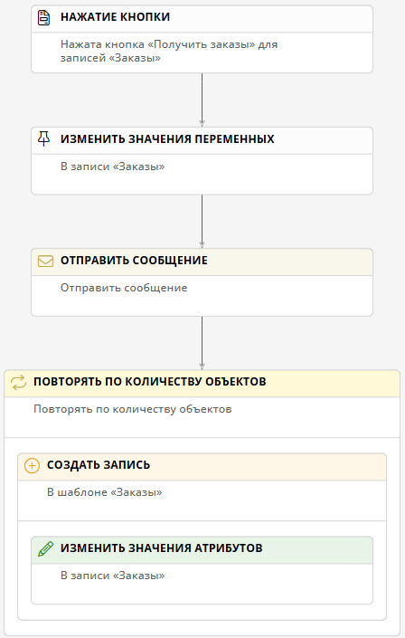

# Отправка HTTP-запроса типа GET и обработка полученного JSON-ответа с помощью сценария и выражений N3

## Введение

**{{ productName }}** позволяет отправлять HTTP-запросы типа `GET` для взаимодействия с внешними системами.

Здесь представлен пример настройки подключения, пути передачи данных и сценария для отправки HTTP-запросов типа `GET` в формате JSON и записи данных из ответа сервера в атрибуты шаблона записи с помощью сценария и выражений N3.

## Прикладная задача

Имеется шаблон _«Заказы»_, в котором хранятся данные о заказах. Требуется настроить подключение, путь передачи данных и сценарий, с помощью которых обрабатываются сведения о новых заказах.

Сведения о заказах передаются в формате JSON:

``` js
{
    "error": false,
    "status": "ok",
    "statusCode": 200,
    "orders": [
        {
         "orderAmount": 1000,
         "orderNumber": "Order-1",
         "orderStatus": "Fulfilled"
        },
        {
         "orderAmount": 2000,
         "orderNumber": "Order-2",
         "orderStatus": "Fulfilled"
        },
     ]
}
```

## Порядок настройки

1. Настройте [подключение](#настройка-подключения) типа «**Отправка HTTP-запросов**».
2. Настройте [путь передачи данных](#настройка-пути-передачи) типа «**Отправка HTTP-запросов**».
3. Настройте [шаблон](#настройка-шаблона-записи) для записи полученных данных.
4. Настройте [сценарий](#настройка-сценария), который будет добавлять полученные данные в шаблон записи посредством настроенных подключения и пути передачи данных.

## Настройка подключения

1. Откройте страницу «**Администрирование**» — «**Подключения**».
2. Откройте двойным нажатием в списке или создайте создайте **подключение REST и OData** типа «**Отправка HTTP-запросов**».
3. Настройте свойства подключения:

    - **Системное имя** — введите уникальное имя подключения.
    --8<-- "system_name_requirements.md"
    - **Отключить** — установите этот флажок, если требуется временно деактивировать данное подключение.
    - **Описание** — введите наглядное описание подключения, например _«Подключение для отправки HTTP-запросов»_.
    - **Запись в файловые журналы** — выберите, какие события следует записывать в журналы:
        - **Полные сведения об обработке сообщения**;
        - **Только ошибки**;
        - **Отключить** — не регистрировать в журнале события отправки писем.
    - **URI** — введите URL-адрес сервера, принимающего HTTP-запросы, например `http://example.com/api`. Символ `/` в конце URL не требуется.
    - **Формат данных** — выберите формат данных для обработки:
        - **JSON** — используется в данном примере;
        - **XML**;
        - **Простой текст**.
    - **Кодировка данных** — укажите стандарт кодирования символов. По умолчанию: **utf-8**.
    - **Тип аутентификации** — выберите способ проверки подлинности, используемый сервером:
        - **Отсутствует**;
        - **Базовая**;
        - **Аутентификация Windows**.
    - **Имя пользователя** — укажите учетную запись для подключения к серверу.
    - **Пароль** — введите пароль для подключения к серверу.
    - **Домен** — укажите домен пользователя почтового сервера.

4. Нажмите кнопку «**Проверить соединение**».
5. Чтобы просмотреть журнал событий отправки писем, нажмите кнопку «**Скачать журнал**».
6. Сохраните подключение.

## Настройка пути передачи данных

1. Откройте страницу «**Администрирование**» — «**Архитектура**» или страницу «**Администрирование**» приложения.
2. Выберите пункт «[**Пути передачи данных**][communication_routes]» <i class="fa-light fa-route " aria-hidden="true"></i>.
3. Откройте двойным нажатием в списке или создайте создайте **подключение REST и OData** типа «**Отправка HTTP-запросов**».
4. Настройте свойства пути передачи данных на следующих вкладках:

    - [**Основные свойства**](#основные-свойства)
    - [**Атрибуты сообщения**](#атрибуты-сообщения)
    - [**Интеграция**](#интеграция)

5. Сохраните путь передачи данных.

### Основные свойства

На вкладке «**Основные свойства**» настройте параметры использования пути передачи данных.

- **Подключение** — выберите [подключение для отправки HTTP-запросов](#настройка-подключения).
- **Системное имя** — введите уникальное имя пути передачи данных.
--8<-- "system_name_requirements.md"
- **Отключить** — установите этот флажок, если требуется временно деактивировать путь передачи данных.
- **Описание** — введите наглядное описание пути передачи данных, например _«Путь для отправки HTTP-запросов»_.
- **Номер шины данных** — выберите номер от 0 до 3, если требуется распределить потоки данных нескольких путей для повышения производительности.

### Атрибуты сообщений

На вкладке «**Атрибуты сообщения**» настройте атрибуты, значения которых требуется извлечь из полученных данных в формате JSON.

!!! warning "Внимание"

    Для атрибутов сообщения типа «**Объект**» необходимо создать дочерние атрибуты:

    - Создайте родительский атрибут.
    - Установите флажок у имени родительского атрибута в списке и нажмите кнопку «**Создать**».
    - Дважды нажмите значок <i class="fa-light fa-angle-down anchor"></i> рядом с родительским атрибутом.
    - В таблице отобразится дочерний атрибут.

1. Укажите **тип сообщения** «**Отправка HTTP-запросов**».
2. В таблице «**Ответ**» добавьте атрибут _orders_ со следующими свойствами:

    - **Тип: объект**
    - **Массив:** флажок установлен

3. К атрибуту _orders_ добавьте следующие дочерние атрибуты:

    - _orderAmount_ типа **число**;
    - _orderNumber_ типа **строка**;
    - _orderStatus_ типа **строка**.

### Интеграция

Настройте путь передачи данных на вкладке «**Интеграция**»:

1. Укажите **метод запроса** `GET`.
2. Укажите **атрибут для десериализации ответа без ошибки**:

    - **Путь к атрибуту:** _$_
    - **Выражение на языке запросов:** _$_

3. Укажите **атрибут для десериализации ответа с ошибкой**:

    - **Путь к атрибуту:** _$_
    - **Выражение на языке запросов:** _$_

## Настройка шаблона записи

1. Создайте шаблон записи _«Заказы»_.
2. Добавьте следующие атрибуты:

    - _Сумма заказа_ типа **число**
    - _Номер заказа_ типа **текст**
    - _Статус заказа_ типа **текст**

3. Добавьте кнопку _«Получить заказы»_ со следующими свойствами:

    - **Контекст операции: запись**
    - **Операция: вызвать событие «Нажата кнопка»**
    - **Результат выполнения: обновить данные**

4. Поместите атрибуты и кнопку на основную форму.

## Настройка сценария

1. Создайте новый сценарий _«Получение заказов через HTTP-запрос»_.
2. В свойствах события «**Нажатие кнопки**» выберите **контекстный шаблон** _«Заказы»_ и **кнопку** _«Получить заказы»_.
3. Добавьте действие «**Изменить значение переменных**» со следующими свойствами:

    - **Операция со значениями переменных: добавить**
    - **Набор переменных:** _Request_

4. Добавьте действие «**Отправить сообщение**» со следующими свойствами:

    - **Подключение:** выберите [подключение для отправки HTTP-запросов](#настройка-подключения).
    - **Путь передачи данных:** выберите [путь передачи данных для отправки HTTP-запросов](#настройка-пути-передачи-данных).
    - **Переменная с сообщением:** _Request_
    - **Переменная для успешного ответа:** _Response_

5. Добавьте действие «**Повторять по количеству объектов**» со следующими свойствами:

    - **Переменная:** _Order_
    - **Выражение для поиска: N3**

        ``` turtle
        # Импортируем функции для работы с данными текущего сеанса и переменными 
        @prefix session: <http://comindware.com/ontology/session#>.
        @prefix variable: <http://comindware.com/ontology/session/variable#>.
        {
            # Находим переменную Response из предыдущего действия
            # и помещаем её в ?records
            session:context variable:Response ?records.
            # В ?records находим переменную orders
            # и возвращаем её значение
            ?records variable:orders ?value.
        }
        ```

6. Внутри действия «**Повторять по количеству объектов**» добавьте действие «**Создать запись**» и выберите шаблон «**Заказы**» как целевой шаблон записи.
7. Внутри действия «**Создать запись**» добавьте действие «**Изменить значения атрибутов**».
8. В действии «**Изменить значения атрибутов**» на вкладке «**Дополнительно**» установите флажок «**Сбрасывать кэш значений**».
9. На вкладке «**Основные**» добавьте атрибуты, значения которых требуется изменить:

    - **Атрибут** _«Сумма заказа»_
        - **Операция со значениями: заменить**
        - **Значение: N3**

            ``` turtle
            @prefix session: <http://comindware.com/ontology/session#>.
            @prefix variable: <http://comindware.com/ontology/session/variable#>.
            {
                session:context variable:Order ?order.
                ?order variable:orderAmount ?value.
            }
            ```

    - **Атрибут** _«Номер заказа»_
        - **Операция со значениями: заменить**
        - **Значение: N3**

            ``` turtle
            @prefix session: <http://comindware.com/ontology/session#>.
            @prefix variable: <http://comindware.com/ontology/session/variable#>.
            {
                session:context variable:Order ?order.
                ?order variable:orderNumber ?value.
            }
            ```

    - **Атрибут** _«Статус заказа»_
        - **Операция со значениями: заменить**
        - **Значение: N3**

            ``` turtle
            @prefix session: <http://comindware.com/ontology/session#>.
            @prefix variable: <http://comindware.com/ontology/session/variable#>.
            {
                session:context variable:Order ?order.
                ?order variable:orderStatus ?value.
            }
            ```

10. На вкладке «**Дополнительно**» установите флажок «**Сбрасывать кэш значений**».

__

## Тестирование

1. Отправьте структуру JSON, которая указана в [прикладной задаче](#прикладная-задача).
2. Нажмите кнопку _«Получить заказы»_.
3. В таблице записей шаблона _«Заказы»_ отобразятся новые записи.
4. Откройте любую новую запись и просмотрите полученные данные.

<div class="relatedTopics" markdown="block">

--8<-- "related_topics_heading.md"

- _[Отправка HTTP-запросов. Настройка подключения][send_http_connection]_
- _[Отправка HTTP-запросов типа GET. Пример: настройка подключения, пути передачи данных и сценария для обработки запросов в формате JSON][send_http_example]_
- _[Событие и действия сценария. Определения, типы, свойства, настройка][scenario_elements]_

</div>


