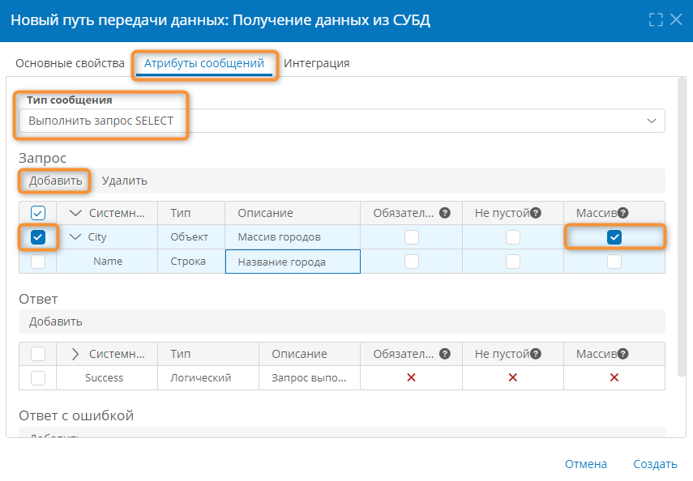
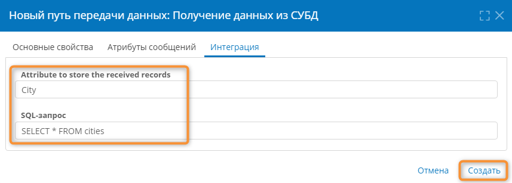
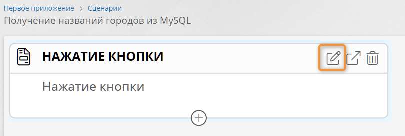
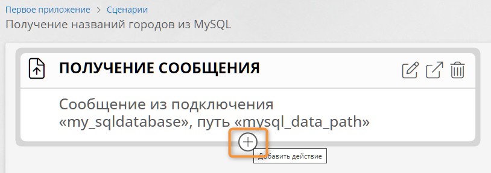
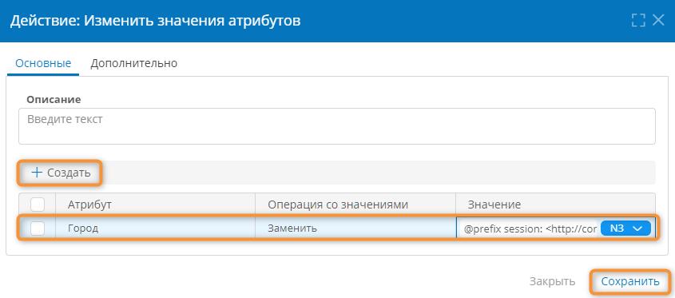

# Внешняя SQL-СУБД. Получение данных по таймеру {: #sql_receive_connection}

## Введение

Здесь представлены инструкции по настройке подключения, пути передачи данных и сценария для отправки SQL-запросов во внешнюю систему управления базами данных (СУБД) по таймеру и получения данных в приложении на основе **{{ productName }}** (далее «Приложение»).

Для получения данных из СУБД поддерживается SQL-запрос `SELECT`:

- задайте таблицу для выборки записей из СУБД;
- задайте условие `WHERE` (необязательно) для выборки записей из СУБД;
- задайте атрибут для хранения полученных записей из СУБД.

Настройка приложения для обмена данными с СУБД MySQL, MSSQL, Oracle и PostgreSQL осуществляется аналогичным образом.

См. также статью _«[Внешняя СУБД (MySQL, MSSQL, Oracle, Postgres). Отправка SQL-запроса. Настройка подключения, пути передачи данных и сценария][sql_send_connection]»._

## Прикладная задача

При наступлении заданного таймера **{{ productName }}** должна отправлять запрос `SELECT` во внешнюю СУБД и помещать полученные из таблицы `cities` записи с названиями городов в шаблон записи _«Города»_ в приложении.

### Исходные данные

Внешняя БД содержит таблицу `cities` с одним столбцом:

- `Name` типа `TINYTEXT` — название города.

В приложении имеется шаблон записи _«Города»_ с атрибутом:

- _Город_
    - **Тип данных: текст**:
    - **Использовать как заголовок записей**: флажок установлен

## Подготовка сервера СУБД

Перед подключением из **{{ productName }}** необходимо подготовить конфигурацию сервера СУБД, как указано ниже.

Настройка серверов MySQL, MSSQL и Oracle осуществляется аналогично.

### Настройка конфигурации сервера PostgreSQL

1. Откройте для редактирования файл `postgresql.conf`.

    - В ОС Linux путь к этому файлу можно узнать с помощью следующей команды:

        ``` shell
        sudo -u postgres psql -c 'SHOW config_file'
        ```

    - В ОС Windows путь к файлу по умолчанию:

        ``` powershell
        C:\ProgramData\PostgreSQL\X.X\data\postgresql.conf
        ```

        Здесь `X.X` — номер версии PostgreSQL.

2. В файле `postgresql.conf` добавьте следующие директивы:

    - Разрешите подключение со всех IP адресов:

        ``` shell
        listen_addresses = '*'
        ```

    - Задайте локаль для вывода сообщений об ошибках:

        ``` shell
        lc_messages = 'en_EN.utf-8'
        ```

3. Откройте для редактирования конфигурационный файл `pg_hba.conf` (в той же директории, что файло `postgresql.conf`).
4. В файле `pg_hba.conf` разрешите подключение с адреса сервера **{{ productName }}** (например, `123.45.67.89`):

    ``` cs
    host    all    all    123.45.67.89    md5
    ```

    

5. Перезапустите службу `postgresql`:

    **Linux**

    ``` shell
    sudo systemctl restart postgresql
    ```

    **Windows**

    ``` powershell
    net stop postgresql-x64-<номер_версии>
    net start postgresql-x64-<номер_версии>
    ```

## Создание подключения к СУБД {: .pageBreakBefore }

1. Откройте страницу «**Администрирование**» – «**Подключения**».
2. Создайте **SQL-подключение** типа «**Получение данных из СУБД**».

    __

3. В поле «**Системное имя**» введите уникальное имя подключения, например `RequestDataFromDBConnection`.
4. В поле «**Описание**» введите наглядное описание назначения подключения, например _«Подключение для запроса данных из СУБД»_.
5. В поле «**Запись в файловые журналы**» укажите, какие события при обмене данными с сервером СУБД следует регистрировать в журнале:

    - **Полные сведения об обработке сообщения**
    - **Только ошибки**
    - **Отключить**

6. В поле «**Строка подключения**» введите адрес сервера, имя базы данных, имя пользователя и пароль для подключения к СУБД:

    **MySQL**

    ``` shell
    Server=ServerAddress;Database=DataBaseName;Uid=Username;Pwd=Password;
    ```

    **MSSQL**

    ``` shell
    Server=ServerAddress;Database=DataBaseName;User Id=Username;Pwd=Password;
    ```

    **Oracle**

    ``` shell
    Data Source=DataBaseName;User Id=Username;Password=Password;Integrated Security=no;
    ```

    **PostgreSQL**

    ``` shell
    Host=ServerAddress;Database=DataBaseName;User ID=Username;Password=Password;
    ```

7. В поле «**Интервал опроса**» укажите периодичность автоматической отправки SQL-запросов в СУБД для получения из неё данных. Интервал опроса необходимо указать, чтобы настроить сценарий на срабатывание по событию «**Получение сообщения**».
8. В поле «**Система управления базами данных**» выберите тип СУБД:

    - **MySQL**
    - **MSSQL**
    - **Oracle**
    - **PostgreSQL**

9. Нажмите кнопку «**Проверить соединение**».
10. Если проверка соединения не выдала ошибок, нажмите кнопку «**Создать**».

## Создание пути получения данных из СУБД {: .pageBreakBefore }

1. Со страницы «**Администрирование**» приложения перейдите в раздел «**Пути передачи данных**».
2. Создайте **путь передачи данных** типа «**SQL-подключение — Получение данных из СУБД**».

    __

3. В поле «**Подключение**» выберите ранее созданное подключение к СУБД, например _«Подключение для запроса данных из СУБД»_.
4. В поле «**Системное имя**» введите уникальное имя пути передачи данных, например `RequestDataFromDBCommunicationRoute`.
5. В поле «**Описание**» введите наглядное описание пути передачи данных, например _«Путь для запроса данных из СУБД»_.
6. Откройте вкладку «**Атрибуты сообщений**».
7. В поле «**Тип сообщения**» выберите пункт «**Выполнить запрос SELECT**».
8. В области «**Запрос**» нажмите кнопку «**Добавить**», чтобы создать:
{: #message_attributes}

    - атрибут `City` типа «**Объект**» с установленным флажком «**Массив**» — этот атрибут будет содержать массив названий городов, полученных из внешней БД (системное имя этого атрибута может быть любым).

9. В таблице атрибутов установите флажок у атрибута `City` и нажмите кнопку «**Добавить**», чтобы создать:

    - вложенный атрибут `Name` типа «**Строка**» — этот атрибут будет содержать название города, и его системное имя должно совпадать с именем столбца с названиями городов в таблице, полученной из внешней БД.

    __

10. Откройте вкладку «**Интеграция**».
11. В поле «**Атрибут для хранения полученных записей**» укажите системное имя  атрибута `City`, созданного на вкладке «**[Атрибуты сообщений](#message_attributes)**».
12. В поле «**SQL-запрос**» введите запрос для получения записей с названиями городов из внешней БД, указав имя таблицы с названиями городов, которые будут помещены в атрибут `Name`, созданный на [шаге 8](#message_attributes). Например:

    ``` sql
    SELECT * FROM cities
    ```

13. Сохраните путь для получения данных из СУБД.

    __

## Создание сценария для получения данных из СУБД {: .pageBreakBefore }

1. Со страницы «**Администрирование**» приложения перейдите в раздел «**Сценарии**».
2. Создайте новый сценарий, нажав кнопку «**Создать**».
3. Настройте свойства сценария:

    - **Название** — введите наглядное название сценария, например _«Получение названий городов из СУБД»_.
    - **Системное имя** — введите уникальное имя сценария, например `getCityNamesFromDB`.
    - **Контекст выполнения** — выберите пункт «**От имени системы**».

4. Сохраните сценарий.
5. Откройте конструктор сценария, дважды нажав строку созданного сценария в списке сценариев.
6. В отобразившемся конструкторе сценария нажмите кнопку изменить на элемент «**Нажатие кнопки**».

    __

    

7. Настройте свойства события:
{: #start_event }

    - Смените «**Тип**» на «**Получение сообщения**».
    - **Контекстный шаблон** — укажите шаблон записи _«Города»_, в который необходимо записать названия городов, полученные из внешней БД.
    - **Подключение** — выберите ранее созданное _Подключение для запроса данных из СУБД_.
    - **Путь передачи данных** — выберите ранее созданный _Путь для запроса данных из СУБД_.
    - **Имя переменной** — введите имя переменной (это имя может быть любым), в которую будут передаваться данные, полученные из внешней БД, например `CityRecords`.

8. Нажмите кнопку «**Добавить действие**» под элементом «**Получение сообщения**».

    __

9. Добавьте действие «**Повторять по количеству объектов**» и настройте его:
{: #object_cycle}

    - В поле «**Переменная**» введите наглядное имя переменной для итераций в цикле, например `record`;
    - В поле «**Атрибут или выражение для поиска объектов**» введите следующее выражение:
        - **Формула**

            ``` cs
            $$CityRecords->City
            ```

        - **N3**

            ``` turtle
            @prefix session: <http://comindware.com/ontology/session#>.
            @prefix var: <http://comindware.com/ontology/session/variable#>.
            {
                session:context var:CityRecords ?message.
                ?message var:City ?value.
            }
            ```

        

        - Здесь:
            - `CityRecords` — **имя переменной**, указанное в свойствах свойствах события «[**Получение сообщения**](#start_event)».
            - `City` — системное имя атрибута-массива, созданного [на вкладке «**Атрибуты сообщений**»](#message_attributes) в свойствах пути передачи данных.

    - Сохраните действие «**Повторять по количеству объектов**».

    __

10. Внутри действия «**Повторять по количеству объектов**» добавьте действие «**Создать запись**» и настройте его:
{: #create_record}
    - В поле «**Целевой шаблон записи**» выберите шаблон, в котором требуется создавать записи с данными, полученными из внешней БД.
    - Сохраните действие «**Создать запись**».

    __

    

11. Внутри действия «**Создать запись**» добавьте действие «**Изменить значения атрибутов**».
12. В действии «**Изменить значения атрибутов**» на вкладке «**Дополнительно**» установите флажок «**Сбрасывать кэш значений**».
13. На вкладке «**Основные**»:

    - Нажмите кнопку «**Создать**».
    - В столбце «**Атрибут**» выберите атрибут указанного в [действии «Создать запись»](#create_record) шаблона, в который будут помещаться названия городов, полученные из внешней БД.
    - В столбце «**Операция со значениями**» выберите пункт «**Заменить**».
    - В поле «**Значение**» введите следующее выражение:
        - **Формула**

            ``` cs
            $$record->Name
            ```

        - **N3**

            ``` turtle
            @prefix session: <http://comindware.com/ontology/session#>.
            @prefix variable: <http://comindware.com/ontology/session/variable#>.
            {
                session:context variable:record ?records.
                ?records variable:Name ?value.
            }
            ```

        - Здесь:
            - `record`  — имя переменной, заданное на [в свойствах действия «**Повторять по количеству объектов**»](#object_cycle).

            - `Name` — системное имя строкового атрибута (в массиве `City` ), созданного [на вкладке «**Атрибуты сообщений**»](#message_attributes) в свойствах пути передачи данных.

    - Сохраните действие «**Изменить значения атрибутов**».

    __

    

14. Должен получиться показанный на следующей иллюстрации сценарий.

    __

## Тестирование сценария

1. Дождитесь срабатывания таймера, заданного в поле «**Интервал опроса**» [пути для получения данных из СУБД](#создание-пути-получения-данных-из-субд).
2. При срабатывании таймера должен сработать [настроенный сценарий](#создание-сценария-для-получения-данных-из-субд).
3. Сценарий должен создавать в шаблоне записи _«Города»_ записи с названиями городов, полученных из внешней БД.

<div class="relatedTopics" markdown="block">

--8<-- "related_topics_heading.md"

- _[Внешняя СУБД (MySQL, MSSQL, Oracle, Postgres). Отправка SQL-запроса. Настройка подключения, пути передачи данных и сценария][sql_send_connection]_

</div>


