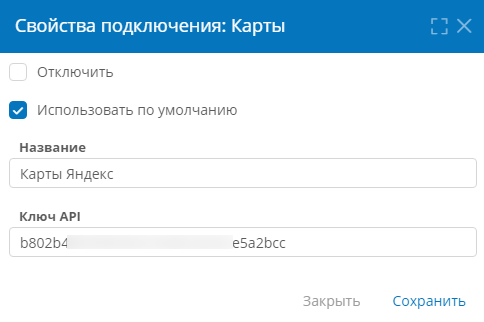

# Карты. Настройка подключения, шаблона и формы {: #map_configure}

## Введение

Подключение к картографической службе используется для отображения карт на формах и добавления на карты географических меток.

Для отображения карт на форме требуется настроить **системное подключение** типа «**Карты**», шаблон записи, на форме которого будет отображаться карта, и шаблон записи, в котором будут храниться данные меток на карте. Кроме того, на форме с картой можно настроить таблицу для просмотра и ввода данных меток.

Здесь представлены инструкции по настройке подключения к картографической службе Яндекс Карты.

Сведения об использовании карт см. в статье _«[Карты. Использование][map_use]»_.

## Создание подключения {: .pageBreakBefore }

1. Откройте страницу [«**Администрирование**» — «**Подключения**»][administration].
2. Создайте **системное подключение** типа «**Карты**» или откройте имеющееся подключение, дважды нажав его в списке.
3. Настройте свойства подключения к картографической службе:

    - **Отключить** — установите этот флажок, если требуется деактивировать данное подключение;
    - **Название** — введите наглядное наименование подключения;
    - **Использовать по умолчанию** — установите этот флажок, чтобы это подключение использовалось как основное, если имеется несколько подключений типа «**Карты**».
    - **Ключ API** — введите ключ доступа к картографической службе «**JavaScript API и HTTP Геокодер**», полученный в [кабинете разработчика Яндекс](https://developer.tech.yandex.ru/services).

        !!! warning "Внимание!"

            Для использования Яндекс Карт необходимо выбрать ключ именно к службе «**JavaScript API и HTTP Геокодер**», не следует выбирать ключ к службе «**Static API Яндекс.Карт**».

4. Сохраните подключение.

__

## Настройка шаблонов записи и формы {: .pageBreakBefore }

1. Создайте шаблон записи _«Объекты»_ для хранения картографических данных со следующими атрибутами:

    - атрибуты типа «**Текст**»:
        - _Страна_
        - _Регион_
        - _Населённый пункт_
        - _Улица_
        - _Дом, строение_
        - _Индекс_
    - атрибуты типа «**Число**»:
        - _Широта_
        - _Долгота_

2. Создайте шаблон записи _«Карты»_ с атрибутом _«Объекты на карте»_:

    - **Тип данных: запись**
    - **Связанный шаблон:** _Объекты_
    - **Взаимная связь с атрибутом: с новым**
    - **Атрибут:** _Карта_
    - **Хранить несколько значений:** флажок установлен

3. Поместите на форму атрибут _«Объекты на карте»_ и выберите для него **представление** «**Карта**».
4. Установите **высоту** карты от 200 до 480 пикселей. Высота по умолчанию: 240 пикселей.
5. Сопоставьте атрибуты адреса и атрибуты координат с атрибутами шаблона _«Объекты»_.
6. Поместите атрибут _«Объекты на карте»_ на форму ещё раз и выберите **представление** «**Таблица**».
7. Добавьте в таблицу _«Объекты на карте»_ атрибуты шаблона _«Объекты»_.
8. В область кнопок таблицы _«Объекты на карте»_ поместите кнопки «**Создать**» и «**Удалить**».
9. Сохраните форму.
10. Протестируйте работу карты на форме: добавьте, переместите, переименуйте и удалите метки. См. [_«Карты. Использование»_][map_use].

--8<-- "related_topics_heading.md"

- _[Карты. Использование][map_use]_
- _[Динамические элементы формы. Настройка карты][form_dynamic_elements_map]_


