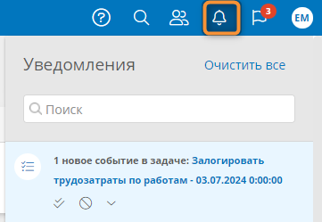

# Уведомления о задачах. Настройка пути передачи данных {: #task_notifications}

## Введение

**{{ productName }}** выводит стандартные уведомления о пользовательских задачах, если не настроены **путь передачи данных** типа «**Уведомления о задачах**» и **данные сообщения пользовательской задачи**.

Здесь представлены инструкции по настройке **пути передачи данных** для отправки нестандартных уведомлений о пользовательской задаче.

Чтобы формировать нестандартные уведомления о пользовательской задаче, содержащие особый текст и данные из процессов, необходимо:

- настроить **путь передачи данных** типа «**Уведомления о задачах**»;
- настроить сопоставление атрибутов с атрибутами **пути передачи данных** с **данными сообщения** в свойствах **[пользовательской задачи][process_diagram_elements_user_task]**.

Уведомления о задачах отображаются при нажатии значка «**Уведомления**» <i class=" fal  fa-bell ">‌</i> в информационной панели.

Уведомления о задачах отправляются в push-сообщениях при использовании **[{{ productNameMobile }}][mobile_app_use]** и веб-версии **{{ productName }}**.

{: #task_notifications_email }
Уведомления о задачах также можно отправлять на эл.&nbsp;почту исполнителям:

- чтобы отправлять уведомления о задачах на эл.&nbsp;почту исполнителям, настройте подключение типа «**Отправка эл.&nbsp;почты из процесса**» и установите в его свойствах флажок «**Использовать по умолчанию**» (см. _«[Отправка эл.&nbsp;почты из процесса. Настройка подключения, пути передачи данных и события на диаграмме процесса][process_sending_connection]»_ );
- если не настроен путь передачи данных, исполнителям приходит письмо со стандартным уведомлением от _Системы оповещения Comindware_ с адреса _robot@comindware.ru._
{: .pageBreakAfter }

__

## Настройка пути передачи данных {: .pageBreakBefore }

Для создания пути передачи данных для уведомления о задачах требуются следующие действия:

1. Откройте страницу «**Администрирование**» — «**Архитектура**» или страницу «**Администрирование**» приложения.
2. Выберите пункт «**Пути передачи данных**» <i class=" fal  fa-route ">‌</i>.
3. Отобразится список путей передачи данных.
4. Создайте или откройте путь передачи данных типа «**Уведомления о задачах**».
5. [Настройте свойства](#communication_routes_properties) пути передачи данных.
6. Сохраните путь передачи данных.

## Свойства пути передачи данных {: #communication_routes_properties }

### Основные свойства

Вкладка «**Основные свойства**» содержит основные параметры пути передачи данных:

- **Отключить** — установите этот флажок, чтобы временно деактивировать путь передачи данных.
- **Название** — введите наглядное наименование пути передачи данных.
- **Имя сообщения** — введите _уникальный_ идентификатор сообщения, проходящего по данному пути передачи данных.
- **Приложение** — выберите бизнес-приложение, в котором будет использоваться путь передачи данных.

__

### Атрибуты сообщения {: .pageBreakBefore }

!!! question "Подстановка значений атрибутов сообщения в уведомление"

    Путь передачи данных для отправки уведомлений о задачах позволяет передавать данные из записей в эл. письмо с уведомлением.

    1. На вкладке «**Атрибуты сообщения**» пути передачи данных задайте набор атрибутов, значения которых требуется передать в путь передачи данных и подставить в сообщение.
    2. На вкладке «**Свойства сообщения**» подставьте значения атрибутов сообщения в любое поле, указав их системные имена в фигурных скобках `{}`.

        - Например, подставьте в тему письма номер заявления и имя заявителя:
            - **Тема:** _Заявление на отпуск № `{ApplicationNumber}` от: `{ApplicantName}`_

    3. Задайте значения атрибутов сообщения с помощью вкладки «**Данные сообщения**» в свойствах [**пользовательской задачи**][process_diagram_elements_user_task], использующей этот путь передачи данных.

На вкладке «**Атрибуты сообщения**» заполните таблицу соответствия атрибутов сообщения с атрибутами уведомления о задаче.

Эти атрибуты следует использовать на вкладке «**[Свойства сообщения](#message_properties)**» пути передачи данных,

Значения этих атрибутов необходимо задать на вкладке «**Данные сообщения**» в свойствах [**пользовательской задачи**][process_diagram_elements_user_task].

Чтобы создать атрибут сообщения и сопоставить его с полем письма, нажмите кнопку «**Создать**» и заполните строку таблицы сопоставления:
{: .pageBreakBefore }

- **Название** — введите наглядное название атрибута.
- **Системное имя** — введите уникальное имя атрибута.
- **Тип данных** — выберите тип данных:

    - **Текст**
    - **Число**
    - **Длительность**
    - **Дата и время**
    - **Логический**
    - **Документ**

    - **Аккаунт**

__

### Свойства сообщения {: #message_properties .pageBreakBefore }

На вкладке «**Свойства сообщения**» настройте соответствие между атрибутами шаблона сообщения и полями электронного письма:

- **Список атрибутов, которые можно использовать при написании эл. письма**: содержит настроенные **атрибуты сообщения**; копируйте их (вместе с фигурными скобками) и вставляйте в поля электронного письма.
- **Электронное письмо** содержит шаблон письма с полями для заполнения. В поля эл. письма вводите произвольный текст и имена атрибутов в фигурных скобках для подстановки их значений.

__

--8<-- "related_topics_heading.md"

- _[Пользовательская задача][process_diagram_elements_user_task]_
- _[Пути передачи данных][communication_routes]_
- _[Отправка эл.&nbsp;почты из процесса. Настройка подключения, пути передачи данных и события на диаграмме процесса][process_sending_connection]_


