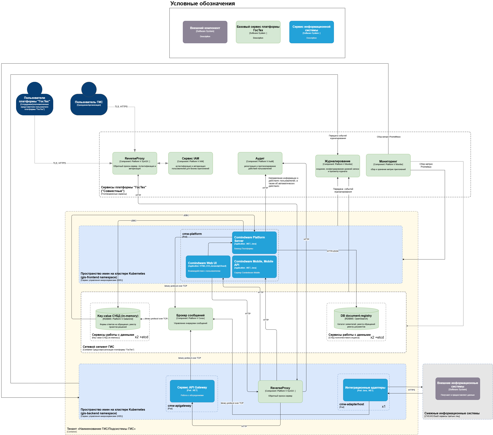

# Развёртывание ПО. Архитектура и ИТ-ландшафт {: #architecture_landscape}

## Введение

**{{ productName }}** представляет собой целостный программный комплекс на базе стека современных технологий.

Здесь представлено краткое описание архитектуры **{{ productName }}**, а также даны рекомендации по выбору ландшафта и конфигурации программного и аппаратного (технического) обеспечения для развёртывания Системы на основе **{{ productName }}**.

!!! question "Определения"
    - **Сервер приложений** — установленный экземпляр ПО **{{ productName }}**.
    - **Приложение** — обособленное бизнес-решение, реализованное на сервере приложений.
    - **Активные пользователи** — пользователи, регулярно генерирующие данные на сервере приложений.
    - **DAS** — запоминающее устройство, непосредственно подключенное к серверу приложений.
    - **SAN** — сетевая система хранения (СХД, сеть хранения данных).
    - **IOPS** — количество операций ввода-вывода в секунду.

## Архитектура Системы

В основе Системы лежит клиент-серверная компонентно-многослойная сервисно-ориентированная архитектура, расширяемая плагинами и адаптерами.

В состав Системы входят следующие компоненты:

- _Веб-приложение_: одностраничное приложение (SPA) на основе Marionette, Backbone, React, Redux.
- _Мобильное приложение_: React Native on Expo.
- _Бэкенд_: компоненты-сервисы на основе .NET 6.0, .NET Framework 4.8 (Windows), Mono 6.12 (Linux), JRE 17.
- _СУБД_: фирменная патентованная СУБД Comindware ElasticData
- _Хранилище данных_: распределённая высокопроизводительная СУБД {{ apacheIgniteVariants }}.
- _Сервис журналирования транзакций_: {{ openSearchVariants }}.
- _Сервис сбора и анализа журналов и данных мониторинга Системы_: {{ zabbixVariants }}{{ openSearchVariants }}, Kibana (OpenSearch Dashboards), Platform V Audit.
- _Сервис файловых журналов_: NLog.
- _Модули для интеграции_: см. _«[Интеграция с внешними системами](#интеграция-с-внешними-системами)»_.

См _[Перечень стороннего ПО, входящего в состав и необходимого для работы Системы][auxiliary_software_list]_.


__

__


### Безопасность и отказоустойчивость Системы {: .pageBreakBefore }

В Системе предусмотрены следующие механизмы обеспечения безопасности и отказоустойчивости:

- Внешняя безопасность — реализуется посредством:
    - механизма аутентификации пользователей Kerberos и OpenID;
    - сетевого экрана;
    - обратного прокси-сервера.
- Внутренняя безопасность — реализуется посредством ролевой модели безопасности.
- Отказоустойчивость — реализуется посредством использованием резервных серверов и дополнительных узлов хранения и обработки данных.
- Масштабируемость — реализуется посредством увеличения количества серверов, обрабатывающих запросы.

См. _«[Безопасность][security]»_.

### Интеграция с внешними системами

В Системе предусмотрены следующие механизмы интеграции с внешними системами:

- Git —контроль версий приложений, создаваемых с помощью Системы.
- OData — обмен данными с внешними системами посредством REST API.
- OpenLDAP (Active Directory) — аутентификация, управление аккаунтами и единый вход.
- SMTP/IMAP/Exchange — получение и отправка электронных писем.
- ESB (RabbitMQ / MSMQ) — обмен сообщениями с внешними системами в распределенных и федеративных конфигурациях.

См. _«[Подключения][connections]»_.

## Ландшафт развертывания Системы {: .pageBreakBefore }

Для обеспечения бесперебойной работы Систему необходимо развернуть в окружении, обеспечивающем достаточную производительность и отказоустойчивость.

Систему можно развернуть для доступа через интернет и интранет:

- _в минимальной конфигурации_ — на одной виртуальной или физической машине заказчика.
- _в продуктовой конфигурации_— на мощностях заказчика в отказоустойчивой конфигурации в соответствии с требованиями заказчика.

### Рекомендуемые варианты развертывания Системы

#### Минимальная конфигурация

Компоненты типовой минимальная конфигурации Системы, предназначенной для демонстраций и реализации пилотных проектов:

- _**{{ productName }}**_: установленный экземпляр ПО.
- _СУБД_ _Comindware ElasticData_.
- _Сервер журналирования транзакций {{ openSearchVariants }}_ — в конфигурации с одним узлом.


__


#### Продуктовая конфигурация  {: .pageBreakBefore }

Компоненты типовой продуктовой конфигурации, обеспечивающей дублирование и резервирование ресурсов, а также отказоустойчивость Системы:

- _**{{ productName }}**_: установленный экземпляр ПО.
- _СУБД Comindware ElasticData_.
- _Сервер журналирования транзакций {{ openSearchVariants }}_.
- _Обратный прокси-сервер {{ nginxVariants }}_ для фильтрации нежелательных запросов и ретрансляции допустимых запросов во внутреннюю сеть.
- _Сервер мониторинга {{ zabbixVariants }}_ для мониторинга доступности служб и свободного пространства на дисках.
- _Сервер уведомлений {{ notificationServerVariants }}_ (необязательно) для передачи уведомлений.
- _Сервер LDAP_ (необязательно) для централизованного управления инфраструктурой сети.
- _Сервер Git_ (необязательно) для контроля версий приложений, создаваемых с помощью **{{ productName }}**.


__


Продуктовое использование накладывает требования на следующие характеристики Системы:
{: .pageBreakBefore }

- _безопасность_ — реализуется за счет настройки сетевого экрана и обратного прокси-сервера;
- _отказоустойчивость_ — реализуется за счет использования резервных серверов и дополнительных узлов на серверах, хранящих данные;
- _масштабируемость_ — реализуется за счет добавления дополнительных серверов, обрабатывающих запросы.


__


### Рекомендуемый набор серверов приложений

Для повышения эффективности разработки и тестирования приложений, а также отказоустойчивости и безопасности эксплуатации приложений рекомендуется развернуть несколько серверов приложений (необходимость использования каждого из этих серверов определяется при составлении технических требований):

- _сервер разработки_ (development), на котором осуществляется разработка приложений;
- _сервер тестирования_ (pre-production), на котором осуществляется тестирование приложений;
- _основной сервер_ (production), на котором осуществляется эксплуатация приложений;
- _резервный сервер_ (standby), который используется в случае перегрузки или выхода из строя основного сервера.

## Техническое обеспечение Системы  {: .pageBreakBefore }

Здесь представлены рекомендуемые характеристики технического обеспечения для развёртывания Системы на мощностях заказчика под управлением операционной системы Windows или Linux.

### Конфигурация серверов приложений

Сервер приложений размещается на физической или виртуальной машине, обеспечивая взаимодействие с пользователями, сторонними системами, ввод, обработку и хранение таких данных, как файлы базы данных, файлы конфигурации, загружаемые пользователями файлы, файлы журналов,  файлы резервных копий.

Следующие рекомендации позволят определить необходимую конфигурацию технического обеспечения для работы серверов приложений.

В минимальной конфигурации достаточно развернуть один сервер приложений для разработки, тестирования и эксплуатации приложений.

Приведенные ниже требования носят рекомендательный характер и позволяют обеспечить комфортную работу конечных пользователей, гражданских разработчиков и тестировщиков приложений **{{ productName }}**.

Фактические требования к техническому обеспечению могут значительно отличаться и зависят от следующих факторов:

- количества активных пользователей в Системе;
- количества приложений в Системе;
- количества запускаемых процессов;
- количества настроенных вычислений, правил, условий и зависимостей данных;
- объема хранимой информации и документов.

Подсистемы (см. параграф _«[Конфигурация подсистем](#конфигурация-подсистем)»_) и виртуальные машины с ПО рекомендуется размещать на нескольких физических машинах.

Каналы связи между узлами Системы должны обеспечивать пропускную способность не менее 10 Гбит/с.

### Методика расчета требуемых аппаратных ресурсов {: .pageBreakBefore }

Здесь представлены примеры расчёта системных ресурсов отказоустойчивой системы.

В следующих таблицах представлена конфигурация системы для следующего количества пользователей:

- 500 зарегистрированных;
- 200 активных;
- 25 постоянных.

#### Инфраструктурные сервисы

- Виртуальные серверы одного сервиса должны быть размещены на разных физических серверах.
- Скорость соединения между серверами должна быть не менее 10 Гб/с.
- SSD-накопитель для базы данных должен быть высокоскоростным и высоконадёжным.

<table markdown>
<thead markdown>
<tr markdown>
<th markdown>Логич. ядер ЦП от 3,0 ГГц</th>
<th markdown>ОЗУ, ГБ</th>
<th markdown>Раздел с ПО, ГБ, SSD</th>
<th markdown>БД, ГБ, SSD</th>
</tr>
</thead>
<tbody markdown>
<tr markdown>
<td colspan="4" markdown>
**Обратные прокси (VPS): `Reverse proxy1`, `Reverse proxy2`**
</td>
</tr>
<tr markdown>
<td markdown>2</td>
<td markdown>2</td>
<td markdown>24</td>
<td markdown></td>
</tr>

<thead markdown>
<tr markdown>
<td colspan="7" markdown>
**Система мониторинга и отслеживания (VPS): `Monitor1`, `Monitor2`**
</td>
</tr>
</thead>
<tbody markdown>
<tr markdown>
<td markdown>2</td>
<td markdown>4</td>
<td markdown>24</td>
<td markdown>128</td>
</tr>
</tbody>
</table>

#### Продуктовый ландшафт {: .pageBreakBefore }

- Виртуальные серверы одного сервиса должны быть размещены на разных физических серверах.
- Скорость соединения между серверами должна быть не менее 10 Гб/с.
- SSD-накопитель для базы данных должен быть высокоскоростным и высоконадёжным.

<table markdown>
<thead markdown>
<tr markdown>
<th markdown markdown>Логич. ядер ЦП от 3,0 ГГц</th>
<th markdown markdown>ОЗУ, ГБ</th>
<th markdown markdown>Раздел с ПО, ГБ, SSD</th>
<th markdown markdown>БД, ГБ, SSD</th>
<th markdown markdown>Загру­­­жаемые файлы, ГБ, СХД HDD</th>
<th markdown markdown>Жур­налы, HDD</th>
<th markdown markdown>Резерв­­ные копии, ГБ, СХД HDD</th>
</tr>
<tr markdown>
<td colspan="8" markdown>
**Серверы приложений (VPS): `CBAP-node1`, `CBAP-node2`, `CBAP-node3`**
</td>
</tr>
</thead>
<tbody markdown>
<tr markdown>
<td markdown>8</td>
<td markdown>32</td>
<td markdown>64</td>
<td markdown>128</td>
<td markdown>1024</td>
<td markdown>16</td>
<td markdown>512</td>
</tr>

<tr markdown>
<td colspan="7" markdown>
**Сервер журналов OpenSearch (VPS): `OpenSearch-node1`, `OpenSearch-node2`, `OpenSearch-node3`**
</td>
</tr>

<tbody markdown>
<tr markdown>
<td markdown>4</td>
<td markdown>16</td>
<td markdown>24</td>
<td markdown>128</td>
<td markdown></td>
<td markdown>16</td>
<td markdown>512</td>
</tr>

</tbody>
</table>

#### Ландшафт тестирования и разработки

- SSD-накопитель для базы данных должен быть высокоскоростным и высоконадёжным.

<table markdown>
<thead markdown>
<tr markdown>
<th markdown>Логич. ядер ЦП от 3,0 ГГц</th>
<th markdown>ОЗУ, ГБ</th>
<th markdown>Раздел с ПО, ГБ, SSD</th>
<th markdown>БД, ГБ, SSD</th>
<th markdown>Загру­­­жаемые файлы, ГБ, СХД HDD</th>
<th markdown>Жур­налы, HDD</th>
<th markdown>Резерв­­ные копии, ГБ, СХД HDD</th>
</tr>
</thead>
<tbody markdown>
<tr markdown>
<td colspan="7" markdown>
**GitLab: `git-server`**
</td>
</tr>
<tr markdown>
<td markdown>2</td>
<td markdown>4</td>
<td markdown>24</td>
<td markdown>128</td>
<td markdown></td>
<td markdown></td>
<td markdown></td>
</tr>

<tr markdown>
<td colspan="7" markdown>
**Сервер приложений (VPS): `CBAP-test`**
</td>
</tr>
<tr markdown>
<td markdown>8</td>
<td markdown>24</td>
<td markdown>64</td>
<td markdown>128</td>
<td markdown>32</td>
<td markdown>16</td>
<td markdown>128</td>
</tr>

<tr markdown>
<td colspan="7" markdown>
**Сервер приложений (VPS): `CBAP-dev`**
</td>
</tr>
<tr markdown>
<td markdown>8</td>
<td markdown>24</td>
<td markdown>64</td>
<td markdown>128</td>
<td markdown>32</td>
<td markdown>16</td>
<td markdown>128</td>
</tr>
<tr markdown>
<td colspan="7" markdown>
**Сервер журналирования транзакций (VPS): `OpenSearch`**
</td>
</tr>
<tr markdown>
<td markdown>4</td>
<td markdown>16</td>
<td markdown>24</td>
<td markdown>128</td>
<td markdown></td>
<td markdown>16</td>
<td markdown>128</td>

</tbody>
</table>

#### Минимальная конфигурация основного сервера приложений {: .pageBreakBefore }

| **Кол-во польз.** | **ЦП** | **ОЗУ** | **HDD** | **SSD** |
| --- | --- | --- | --- | --- |
| 1–200 активных | 4 ядра от 3,7 ГГц +  (1 ядро × 100 акт. польз. × кол-во прил.) | 16 ГБ +  (4 ГБ × 100 акт. польз. × кол-во прил.) | 16 ГБ | 16 ГБ |
| 200 активных | 4 ядра +  (2 ядра × кол-во прил.) | 16 ГБ +  (8 ГБ × кол-во прил.) | 16 ГБ × кол-во прил. | 16 ГБ × кол-во прил. |
| 300 активных | 4 ядра +  (3 ядра × кол-во прил.) | 16 ГБ +  (12 ГБ × кол-во прил.) | 16 ГБ × кол-во прил. | 16 ГБ × кол-во прил. |
| 400 активных | 4 ядра +  (4 ядра × кол-во прил.) | 16 ГБ +  (16 ГБ × кол-во прил.) | 16 ГБ × кол-во прил. | 16 ГБ × кол-во прил. |

#### Минимальная конфигурация резервного сервера приложений

| **Кол-во польз.** | **ЦП** | **ОЗУ** | **HDD** | **SSD** |
| --- | --- | --- | --- | --- |
| 1­–200 | 4 ядра от 3,7 ГГц +  (1 ядро × 100 польз. × кол-во прил.) | 16 ГБ +  (4 ГБ × 100 польз. × кол-во прил.) | 16 ГБ × кол-во прил. | 8 ГБ × кол-во прил. |
| 200 | 4 ядра +  (2 ядра × кол-во прил.) | 16 ГБ +  (8 ГБ × кол-во прил.) | 16 ГБ × кол-во прил. | 8 ГБ × кол-во прил. |
| 300 | 4 ядра +  (3 ядра × кол-во прил.) | 16 ГБ +  (12 ГБ × кол-во прил.) | 16 ГБ × кол-во прил. | 8 ГБ × кол-во прил. |
| 400 | 4 ядра +  (4 ядра × кол-во прил.) | 16 ГБ +  (16 ГБ × кол-во прил.) | 16 ГБ × кол-во прил. | 16 ГБ × кол-во прил. |

#### Минимальная конфигурация серверов разработки и тестирования

| **Кол-во польз.**       | **ЦП**            | **ОЗУ** | **HDD** | **SSD** |
| ----------------------- | ----------------- | ------- | ------- | ------- |
| 1–100                   | 4 ядра от 3,7 ГГц | 16 ГБ   | 16 ГБ   | 16 ГБ   |

### Конфигурация системы хранения данных {: .pageBreakBefore }

В минимальной конфигурации все папки данных сервера приложений могут храниться в одном разделе на высокопроизводительном SSD-накопителе.

Высокопроизводительные системы хранения (SSD DAS/SAN) должны обеспечивать производительность не меньше 100 000 IOPS на 1 сервер приложений.

Объем выделяемого пространства на высокопроизводительных (SSD DAS/SAN) и низкопроизводительных системах хранения (HDD DAS/SAN) следует определить в ходе составления технических требований.

Для оптимизации обработки, хранения и резервного копирования папки данных сервера приложений можно разместить в отдельных хранилищах:

- _файлы базы данных и конфигурации_ — SSD DAS/SAN (эти данные сервер приложений обрабатывает постоянно в оперативном режиме, что создает высокую нагрузку на подсистему хранения);
- _загруженные пользователями файлы_ — HDD DAS/SAN (такие файлы хранятся долговременно, не в базе данных и запрашиваются по ссылке, поэтому для их обработки и хранения высокопроизводительная подсистема хранения не требуется);
- _журнал Системы_ — HDD DAS/SAN (запись файлов журнала создает минимальную нагрузку на подсистему хранения);
- _резервные копии_ — HDD DAS/SAN (резервные копии формируются периодически, используются редко, для их хранения важнее объем, а не производительность хранилища; тем не менее, скорость резервного копирования может снижаться в случае наличия большого количества мелких файлов, загруженных пользователями, в таком случае можно разместить папку резервных копий на высокопроизводительном накопителе);
- _временная папка_ — SSD DAS/SAN (нагрузка при хранении и обработке временных файлов может возрастать при большом количестве активных пользователей и транзакций, загрузке пользователями множества файлов и под влиянием прочих факторов).

## Конфигурация подсистем {: .pageBreakBefore }

### Конфигурация сервера распределённой СУБД

Сервер распределённой СУБД {{ apacheIgniteVariants }} в минимально необходимой конфигурации можно установить автоматически при развертывании **{{ productName }}** либо самостоятельно в требуемой конфигурации.

**Требования к конфигурации**


- _[Platform V DataGrid. Руководство по установке](https://client.sbertech.ru/docs/public/IGN/17.0.0/IGNT/17.0.0/documents/installation-guide/index.html)_

- _[Apache Ignite. Установка и настройка. Краткое руководство][apache_ignite_deploy]_.


**Примеры конфигураций**


- _[Platform V DataGrid. Руководство по установке](https://client.sbertech.ru/docs/public/IGN/17.0.0/IGNT/17.0.0/documents/installation-guide/index.html)_

- _[Apache Ignite. Установка и настройка. Краткое руководство][apache_ignite_deploy]_.


### Конфигурация сервера журналирования транзакций

Сервер журналирования транзакций {{ openSearchVariants }} в минимально необходимой конфигурации можно установить автоматически при развертывании **{{ productName }}** либо самостоятельно в требуемой конфигурации.

**Требования к конфигурации**

- Должна быть включена аутентификация.
- Должна быть разрешена работа под любым аккаунтом, кроме стандартного (например, `elastic`).
- Номер порта должен отличаться от стандартного 9200.
- В конфигурации должно быть задано достаточное количество шардов: минимум 3000.

**Примеры конфигураций**


- _[Platform V Search (SRH). Руководство по установке](https://client.sbertech.ru/docs/public/SRH/1.5.0/SRHX/1.5.0/documents/installation-guide/index.html)_

- _[Установка Elasticsearch и настройка кластера Elasticsearch без сертификатов подлинности][elasticsearch_cluster_deploy_no_certificates]_


- _[Установка Elasticsearch. Краткое руководство для Windows][elasticsearch_deploy_windows]_

### Конфигурация обратного прокси-сервера {: .pageBreakBefore }

Обратный прокси-сервер {{ nginxVariants }} в минимально необходимой конфигурации можно установить автоматически при развертывании **{{ productName }}** либо самостоятельно в требуемой конфигурации.

**Требования к конфигурации**

- {{ nginxVariants }};
- Модуль ModSecurity;
- Модуль GeoIP.

**Примеры конфигураций**


- _[Руководство по установке Platform V SynGX (SNX)](https://client.sbertech.ru/docs/public/SNX/3.0.0/SNGX/3.0.0/documents/installation-guide/index.html)_

- _[NGINX. Установка и настройка][nginx_deploy]»_
- _[Модуль GeoIP для NGINX. Установка и настройка][nginx_geoid_deploy]_.


### Конфигурация сервера {{ zabbixVariants }} {: .pageBreakBefore }

**Требования к конфигурации**

Конфигурация сервера {{ zabbixVariants }} должна обеспечивать мониторинг работоспособности Системы, как указано ниже.

- Мониторинг доступности сервера распределённой СУБД {{ apacheIgniteVariants }}.
    - Сервер может быть недоступен из-за проблем с сетью.
    - На сервере может закончиться свободное место на диске.
    - Конфигурация сервера может не позволять обработать запросы, например, ввиду невозможности создания нового индекса или соответствующего ему шарду.
- Мониторинг доступности сервера журналирования транзакций {{ openSearchVariants }}
    - Сервер может быть недоступен из-за проблем с сетью.
    - На сервере может закончиться свободное место на диске.
    - Конфигурация сервера может не позволять обработать запросы, например, ввиду невозможности создания нового индекса или соответствующего ему шарда.
- Мониторинг места на дисках с базой данных, журналами, резервными копиями и т. п.
- Мониторинг ошибок в процессе работы Системы
    - Ошибки конфигурации Системы.
    - Ошибки в процессе эксплуатации Системы.
    - Ошибки, связанные с обновлением окружения, в котором работает Система, или компонентов самой Системы.

**Примеры конфигураций**


- _[Platform V Monitor. Руководство по установке](https://client.sbertech.ru/docs/public/OPM/6.0.10/common/documents/installation-guide/index.html)_.

- _[Zabbix. Установка и настройка. Краткое руководство][zabbix_deploy]_.



