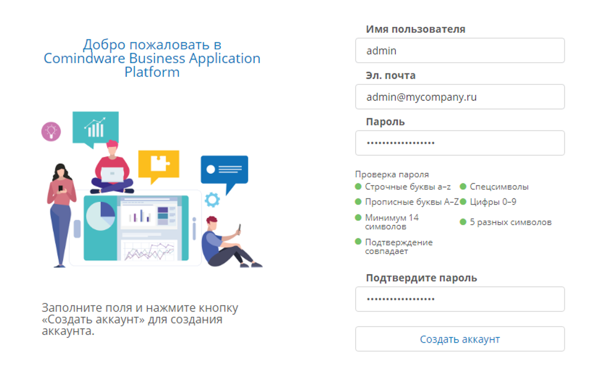

# Установка, запуск, инициализация и остановка ПО {: #deploy_guide_linux}

## Введение

Для работы **{{ productName }}** требуются операционная система, сервер базы данных, веб-сервер, обратный прокси-сервер и сервер журналов.

Для быстрого развёртывания **{{ productName }}** в Linux компания **{{ companyName }}** предоставляет дистрибутив с установщиком, настраивающим необходимое программное обеспечение. См. _[{{ productName }} {{ productVersion }}. Перечень стороннего программного обеспечения для Linux][auxiliary_software_list]_.

Здесь представлены инструкции по развёртыванию и инициализации **{{ productName }}** из дистрибутива в ОС Linux.

## Установка {{ productName }} {: #deploy_guide_linux_install_sw }

1. Перейдите в режим суперпользователя:

    --8<-- "linux_sudo.md"

2. Скачайте и распакуйте дистрибутив **{{ productName }}**, полученный по ссылке от компании **{{ companyName }}** (`X.X`, `<versionNumber>` — номер версии ПО, `<osname>` — название операционной системы):

    ``` sh
    tar -xf X.X-release-ru-<versionNumber>.<osname>.tar.gz
    ```

    !!! tip "Совет"

        По завершению распаковки архив можно удалить для экономии места:

        ``` sh
        rm -f X.X-release-ru-<versionNumber>.<osname>.tar.gz
        ```

3. Перейдите в директорию со скриптами для развёртывания ПО:

    ``` sh
    cd <distPath>/CMW_<osname>/scripts
    ```

    Здесь:  `<distPath>/CMW_<osname>/` — путь к распакованному дистрибутиву ПО.

4. Установите ПО из дистрибутива:
{: #install.sh}

    ``` sh
    sh prerequisites_install.sh -p [-k] [-e]
    ```

    Скрипт `install.sh` поддерживает следующие ключи:
    {: .pageBreakBefore }

    - `p` — установить ПО {{ productName }}.
    - `k` — установить ПО Kafka (необязательный ключ).
    - `e` — установить ПО Elasticsearch (необязательный ключ).
    - `h` — вызов краткой справки по использованию скрипта (указывать только без остальных ключей).
    - `kh=<value>` или `kafkaHost=<value>`
    - `kp=<portNumber>` или `kafkaPort=<portNumber>`- задать порт для Kafka

    !!! note "Примечание"

        Скрипт `install.sh` устанавливает ПО {{ productName }} и необходимые для него компоненты, включая Java, .NET, Mono, NGINX.

    !!! tip "Вызов справки для скриптов"

        Для ознакомления с ключами и назначением любого скрипта используйте ключ `-h` без каких-либо других ключей, например:

        ``` sh
        sh install.sh -h
        ```

1. По окончании установки скрипт выведет информацию об установленных компонентах. Удостоверьтесь, что компоненты успешно установлены (имеют статус `OK`).

    Пример результата выполнения скрипта с ключом `-p` без установки Elasticsearch и Kafka:

    ``` sh
    [Done] Creating CBAP Data Dir.
    -----------------------------------------
    Environment details
    Status     | Software   | Version   
    -----------------------------------------
    OK         | mono       | 6.12.0.182     
    OK         | dotnet     | 6.0.417        
    OK         | java       | 17.0.7            
    OK     NGINX installed.
    OK     NGINX started.
    OK     CBAP version folder created.
    OK     CBAP configs folder created.
    OK     CBAP data folder created.
    OK     CBAP logs folder created.
    OK     CBAP dotnet folder created.
    OK     Local elasticsearch server installed: No 
    OK     Local elasticsearch server started: No 
    OK     Local kafka server installed: No 
    OK     Local kafka server started: No 
    OK     Final status.
    ```

2. Если отобразится запрос на перезагрузку ОС, выполните перезагрузку:

    ``` sh
    reboot
    ```

    После перезагрузки ОС заново запустите [установку ПО из дистрибутива (шаг 4)](#install.sh).

3. После успешного завершения установки подождите 3–5 минут. Этого времени обычно достаточно для автоматического запуска и инициализации установленных служб (в зависимости от конфигурации машины).
4. Удостоверьтесь, что ПО установлено, просмотрев список установленных версий ПО:

    ``` sh
    ls /var/www/.cmw_version/
    ```

## Создание экземпляра ПО {: .pageBreakBefore }

### Подготовка к созданию экземпляра ПО

Перед созданием экземпляра ПО необходимо проверить конфигурацию Linux и при необходимости внести в неё перечисленные ниже изменения.

1. Перейдите в режим суперпользователя:

    --8<-- "linux_sudo.md"

2. Откройте для редактирования файл `limits.conf`:

    ``` sh
    nano /etc/security/limits.conf
    ```

3. Установите следующие директивы:

    - **Astra Linux**, **Ubuntu**, **Debian** (DEB-based)

    ``` systemd
    www-data soft nproc 200000
    www-data hard nproc 200000
    www-data soft nofile 200000
    www-data hard nofile 200000
    ```

    - **РЕД ОС**, **Rocky** (RPM-based)

    ``` systemd
    nginx soft nproc 200000
    nginx hard nproc 200000
    nginx soft nofile 200000
    nginx hard nofile 200000
    ```

    - **Альт Сервер**

    ``` systemd
    _nginx soft nproc 200000
    _nginx hard nproc 200000
    _nginx soft nofile 200000
    _nginx hard nofile 200000
    ```

4. Откройте для редактирования файл `common-session`:

    ``` sh
    nano /etc/pam.d/common-session
    ```

5. Установите следующую директиву:

    ``` systemd
    session required pam_limits.so
    ```

6. Откройте для редактирования файл `sysctl.conf`:

    ``` sh
    nano /etc/sysctl.conf
    ```

7. Установите следующие директивы:

    ``` cs
    fs.file-max=2097152
    vm.max_map_count=262144
    fs.inotify.max_user_instances=524288
    ```

8. Откройте для редактирования файл `user.conf`:

    ``` sh
    nano /etc/systemd/user.conf
    ```

9. Установите следующую директиву:

    ``` cs
    DefaultLimitNOFILE=200000
    ```

10. Откройте для редактирования файл `system.conf`:

    ``` sh
    nano /etc/systemd/system.conf
    ```

11. Установите следующую директиву:

    ``` cs
    DefaultLimitNOFILE=200000
    ```

12. После внесения изменений перезапустите демоны:

    ``` sh
    sysctl -p
    systemctl daemon-reexec
    ```

### Создание единственного экземпляра ПО {: .pageBreakBefore }

1. Перейдите в режим суперпользователя:

    --8<-- "linux_sudo.md"

2. Перейдите в директорию со скриптами для развёртывания ПО **{{ productName }}**:

    ``` sh
    cd <distPath>/CMW_<osname>/scripts/instance
    ```

    Здесь:  `<distPath>/CMW_<osname>/` — путь к распакованному дистрибутиву ПО.

3. Разверните экземпляр ПО:

    ``` sh
    sh create.sh -n=<instanceName> -v=<versionNumber> [-p=<portNumber>]
    ```

    Скрипт `create.sh` поддерживает следующие ключи:

    - `-n=<instanceName>` — имя экземпляра ПО (**обязательный** ключ).
    - `-v=<versionNumber>` — номер версии ПО вида `X.X.XXXX.X` (например: 5.0.0000.0, **обязательный** ключ). Версия должна быть установлена, см. _«[Установка {{ productName }}](#deploy_guide_linux_install_sw)»_.
    - `-p=<portNumber>` — порт для экземпляра ПО, по умолчанию: 80 (необязательный ключ).
    - `-h` — вызов краткой справки по использованию скрипта (указывать только без остальных ключей).

4. Удостоверьтесь, что была создана директория с файлами конфигурации экземпляра ПО.

    ``` sh
    ls -lhF /var/www/<instanceName>/
    ```

5. По ответу команды `ls` удостоверьтесь, что в путях указана верная версия ПО, например `5.0.0000.0`:

    ``` sh
    lrwxrwxrwx. 1 nginx nginx   36 Oct 11 17:54 bin -> /var/www/.cmw_version/5.0.0000.0/bin/
    lrwxrwxrwx. 1 nginx nginx   41 Oct 11 17:54 compiled -> /var/www/.cmw_version/5.0.0000.0/compiled/
    lrwxrwxrwx. 1 nginx nginx   37 Oct 11 17:54 data -> /var/www/.cmw_version/5.0.0000.0/data/
    lrwxrwxrwx. 1 nginx nginx   44 Oct 11 17:54 favicon.ico -> /var/www/.cmw_version/5.0.0000.0/favicon.ico
    lrwxrwxrwx. 1 nginx nginx   44 Oct 11 17:54 Global.asax -> /var/www/.cmw_version/5.0.0000.0/Global.asax
    lrwxrwxrwx. 1 nginx nginx   39 Oct 11 17:54 mobile -> /var/www/.cmw_version/5.0.0000.0/mobile/
    lrwxrwxrwx. 1 nginx nginx   46 Oct 11 17:54 redirect.aspx -> /var/www/.cmw_version/5.0.0000.0/redirect.aspx
    lrwxrwxrwx. 1 nginx nginx   42 Oct 11 17:54 resources -> /var/www/.cmw_version/5.0.0000.0/resources/
    lrwxrwxrwx. 1 nginx nginx   43 Oct 11 17:54 robots.txt -> /var/www/.cmw_version/5.0.0000.0/robots.txt
    lrwxrwxrwx. 1 nginx nginx   45 Oct 11 17:54 unauthorized -> /var/www/.cmw_version/5.0.0000.0/unauthorized/
    ```

### Создание дополнительного экземпляра ПО {: .pageBreakBefore }

На одном сервере можно развернуть несколько экземпляров ПО **{{ productName }}**.

1. Перейдите в режим суперпользователя:

    --8<-- "linux_sudo.md"

2. Просмотрите список имеющихся экземпляров ПО **{{ productName }}**:

    ``` sh
    cat /usr/share/comindware/configs/instance/* | grep -E '(configPath:)'
    ```

3. Просмотрите список используемых портов:

    ``` sh
    ss -tunlp
    ```

    Также можно узнать, используется ли определённый порт (`<portNumber>`):

    ``` sh
    ss -tunlp | grep :<portNumber>
    ```

4. Просмотрите список установленных версий ПО:

    ``` sh
    ls /var/www/.cmw_version/
    ```

5. Создайте новый экземпляр ПО согласно приведённым выше [инструкциям](#создание-экземпляра-по), указав для него уникальные имя и порт.
6. Откройте для редактирования три службы каждого из установленных экземпляров ПО (`<instanceName>`):

    ``` sh
    nano /usr/lib/systemd/system/comindware<instanceName>.service
    nano /usr/lib/systemd/system/apigateway<instanceName>.service
    nano /usr/lib/systemd/system/adapterhost<instanceName>.service
    ```

7. Если используются локальные службы Kafka и Elasticsearch, откройте их для редактирования:

    ``` sh
    nano /usr/lib/systemd/system/kafka.service
    nano /usr/lib/systemd/system/elasticsearch.service
    ```

8. В каждом файле службы установите следующие директивы:

    ``` cs
    # Макс. количество открытых файлов
    LimitNOFILE=200000
    # Макс. количество процессов
    LimitNPROC=8192
    ```

## Запуск экземпляра ПО

1. Перейдите в режим суперпользователя:

    --8<-- "linux_sudo.md"

2. Удостоверьтесь, что основные службы установлены, запущены и имеют статус `Active (running)`:

    ``` sh
    systemctl status comindware<instanceName>
    systemctl status kafka
    systemctl status nginx
    systemctl status elasticsearch
    ```

3. Если какая-либо служба не работает, запустите её:

    ``` sh
    systemctl start comindware<instanceName>
    systemctl start kafka
    systemctl start nginx
    systemctl start elasticsearch
    ```

4. Выполните инициализацию ПО.

## Инициализация {{ productName }} {: #deploy_guide_linux_initialize .pageBreakBefore }

<!--initialize-start-->
1. Запустите веб-браузер и в адресной строке введите ссылку следующего вида, при необходимости указав порт, на котором был развёрнут экземпляр ПО:

    ``` sh
    http://localhost:<portNumber>
    ```

2. Дождитесь запуска и отображения веб-сайта **{{ productName }}**, что может занять примерно 5 минут.
3. Откроется страница создания аккаунта администратора **{{ productName }}**.

    __

4. Введите учётные данные аккаунта администратора и нажмите кнопку «**Создать аккаунт**».

    !!! warning "Внимание!"

        - В экземпляре ПО всегда должен оставаться хотя бы один аккаунт администратора. Он может потребоваться для восстановления системы.
        - Аккаунт администратора, созданный при инициализации экземпляра ПО, не следует удалять, даже если впоследствии аккаунты будут синхронизироваться с Active Directory.

5. При необходимости откроется страница инициализации служб. Выберите службы, которые должны быть запущены, и нажмите кнопку «**Далее**».

    __

6. При необходимости откроется страница активации ПО. Выполните **онлайн-** или **ручную активацию** либо нажмите кнопку «**Пропустить**» для первоначального ознакомления с ПО без активации.
7. При необходимости откроется страница настройки подключения к службе Elasticsearch.
8. В поле «**URI**» введите адрес сервера Elasticsearch, например: `http://localhost:9200`
9. Оставьте **имя пользователя** и **пароль** Elasticsearch пустыми. Или введите их, если в конфигурации Elasticsearch включена аутентификация.
10. Установите уникальный **префикс индекса**, например `mycompanyprefix`. Он служит для идентификации в Elasticsearch данных экземпляра ПО. Поэтому во избежание конфликтов данных для каждого экземпляра ПО следует указывать собственный префикс индекса.
11. Нажмите кнопку «**Далее**».
12. При необходимости откроется страница инициализации данных в Elasticsearch.

    __

13. Нажмите кнопку «**Обновить**».
14. Дождитесь открытия начальной страницы **{{ productName }}**.

    __

15. На этом этапе развертывание экземпляра **{{ productName }}** завершено и можно приступать к созданию и использованию приложений.
<!--initialize-end-->

## Остановка экземпляра ПО {: .pageBreakBefore }

1. Перейдите в режим суперпользователя:

    --8<-- "linux_sudo.md"

2. Перед тем как выполнять любые действия с файлами ПО и базы данных, остановите службы, поддерживающие работу ПО:

    ``` sh
    systemctl stop comindware<instanceName>
    systemctl stop kafka
    systemctl stop nginx
    systemctl stop elasticsearch
    ```

3. Удостоверьтесь, что службы остановлены:

    ``` sh
    systemctl status comindware<instanceName>
    systemctl status kafka
    systemctl status nginx
    systemctl status elasticsearch
    ```

## Удаление экземпляра ПО {: .pageBreakBefore }

1. Перейдите в режим суперпользователя:

    --8<-- "linux_sudo.md"

2. Остановите экземпляр ПО согласно [инструкции](#остановка-экземпляра-по).
3. Перейдите в директорию со скриптами для развёртывания ПО **{{ productName }}**:

    ``` sh
    cd <distPath>/CMW_<osname>/scripts/instance
    ```

4. Запустите удаление экземпляра ПО:

    ``` sh
    sh delete.sh -n=<instanceName>
    ```

    Скрипт `delete.sh` поддерживает следующие ключи:

    - `-n=<instanceName>` — создать экземпляр ПО с указанным именем (**обязательный** ключ).
    - `-h` — вызов краткой справки по использованию скрипта (указывать только без остальных ключей).

## Удаление версии ПО {: #deploy_guide_linux_delete_version .pageBreakBefore }

1. Перейдите в режим суперпользователя:

    --8<-- "linux_sudo.md"

2. Просмотрите список экземпляров ПО с указанием версий:

    ``` sh
    cat /usr/share/comindware/configs/instance/* | grep -E '(configPath:|version:)'
    ```

3. Удалите все экземпляры с версией ПО, которую требуется удалить, или обновите их до другой версии. Удалить версию ПО, которая используется в каких-либо экземплярах, не удастся. См. _«[Удаление экземпляра ПО](#удаление-экземпляра-по)»_.
4. Удалите версию ПО:

    ``` sh
    rm -r /var/www/.cmw_version/<versionNumber>
    ```

    Здесь: `<versionNumber>` — номер версии ПО вида `X.X.XXXX.X` (например: `5.0.0000.0`).

<div class="relatedTopics" markdown="block">

--8<-- "related_topics_heading.md"

- _[Пути и содержимое директорий экземпляра ПО][paths]_

</div>


