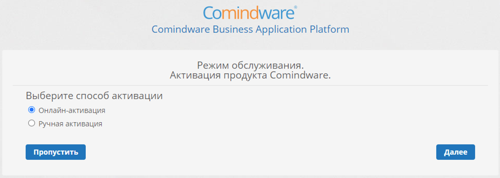

# Установка, запуск, инициализация и остановка ПО {: #deploy_guide_linux}

## Введение

Для работы **{{ productName }}** требуются операционная система, сервер базы данных, веб-сервер, обратный прокси-сервер и сервер журналов.

Для быстрого развертывания **{{ productName }}** в среде Linux компания **{{ companyName }}** предоставляет дистрибутив с установщиком, настраивающим необходимое программное обеспечение. См. статью «[{{ productName }} {{ productVersion }}. Перечень стороннего программного обеспечения для Linux][auxiliary_software_list]».

Здесь представлены инструкции по развертыванию и инициализации **{{ productName }}** из дистрибутива в операционных системах Linux.

## Установка {{ productName }}

1. Перейдите в режим суперпользователя:

    ``` sh
    sudo -i
    ```

    или

    ``` sh
    su -
    ```

2. Скачайте и распакуйте дистрибутив **{{ productName }}** по ссылке, предоставленной компанией **{{ companyName }}** (`X.X.XXXX.X` — номер версии ПО, `<osname>` — название операционной системы):

    ``` sh
    tar -xf X.X-release-ru-X.X.XXXX.X.<osname>.tar.gz
    ```

    По заверешению распаковки архив можно удалить:

    ``` sh
    rm -f X.X-release-ru-X.X.XXXX.X.<osname>.tar.gz
    ```

3. Перейдите в распакованную папку:

    ``` sh
    cd CMW_<osname>/
    ```

4. Установите ПО из дистрибутива:
{: #install.sh}

    ``` sh
    sh install.sh -p [-k] [-i=<instanceName>] [-e] [-d=demo] [-u=www-data] [-g=www-data]
    ```

    Скрипт `install.sh` поддерживает следующие ключи:
    {: .pageBreakBefore }

    - `p` — установить ПО {{ productName }};
    - `k` — установить ПО Kafka;
    - `e` — установить ПО Elasticsearch;
    - `d=demo` — создать экземпляр ПО {{ productName }} c демонстрационной базой данных (необязательный ключ по умолчанию);
    - `d=clear` — создать экземпляр ПО {{ productName }} без демонстрационной базы данных;
    - `u` — пользователь (необязательный ключ);
    - `g` — группа (необязательный ключ);
    - `h` — вызов краткой справки по использованию скрипта (этот ключ следует указывать только без остальных ключей);
    - `kh=hostname` — использовать указанный хост для подключения к ПО Kafka (необязательный ключ);
    - `kp=portnumber` — использовать указанный порт для подключения к ПО Kafka (необязательный ключ);
    - `i=<instanceName>` — создать экземпляр ПО с указанным именем (необязательный ключ). Имя экземпляра по умолчанию: `cmwdata`;
    - `-ip=<portNumber>` — создать экземпляр ПО на указанном порте (необязательный ключ). По умолчанию: 80.

5. Если отобразится запрос на перезагрузку ОС, выполните перезагрузку:

    ``` sh
    reboot
    ```

    После перезагрузки ОС заново запустите [установку ПО из дистрибутива (шаг 4)](#install.sh).

6. Дождитесь завершения установки ПО.
7. После успешного завершения установки подождите 3–5 минут. Этого времени обычно достаточно для автоматического запуска и инициализации установленных служб (в зависимости от конфигурации машины).
8. Удостоверьтесь, что ПО установлено, просмотрев список установленных версий ПО:

    ``` sh
    ls /var/www/.cmw_version/
    ```

## Создание экземпляра ПО

1. Перейдите в папку со скриптами для развёртывания ПО **{{ productName }}**:

    ``` sh
    cd CMW_<osname>/scripts/instance
    ```

2. Разверните экземпляр ПО:

    ``` sh
    sh create.sh -n=<instanceName> [-p=<portNumber>] -v=<versionNumber>
    ```

    Скрипт `create.sh` поддерживает следующие ключи:

    - `-n=<instanceName>` — создать экземпляр ПО с указанным именем (**обязательный** ключ);
    - `-p=<portNumber>` — создать экземпляр ПО с указанным именем (необязательный ключ). Порт по умолчанию: 80;
    - `-v=<versionNumber>` — номер установленной версии ПО вида: `X.X.XXXX.X` (например: 4.7.2222.0);
    - `-h` — вызов краткой справки по использованию скрипта (этот ключ следует указывать только без остальных ключей).

3. Удостоверьтесь, что была создана директория с файлами конфигурации экземпляра ПО. Обратите внимание, что в путях указана верная версия ПО:

    ``` sh
    ls -lhF /var/www/<instanceName>/
    ```

## Установка дополнительного экземпляра ПО

**{{ productName }}** позволяет развернуть несколько экземпляров ПО на одном сервере. Чтобы развернуть дополнительный экземпляр ПО, воспользуйтесь следующими инструкциями:

1. Просмотрите список созданных экземпляров ПО на сервере:

    ``` sh
    ls /var/lib/comindware/
    ```

2. Просмотрите список используемых портов:

    ``` sh
    ss -tunlp
    ```

    Вы также можете просмотреть, используется ли определённый порт:

    ``` sh
    ss -tunlp | grep :<portNumber>
    ```

3. Просмотрите список установленных версий ПО:

    ``` sh
    ls /var/www/.cmw_version/
    ```

4. Установите новый экземпляр ПО согласно [инструкциям](#создание-экземпляра-по), указав уникальное имя и порт для него.
5. Откройте службы каждого экземпляра ПО для редактирования:

    ``` sh
    nano /lib/systemd/system/<serviceName>.service
    ```

    где вместо `<serviceName>` требуется подставить имя каждой из служб, перечисленных ниже, для каждого экземпляра ПО:

    - `comindware<instanceName>`
    - `apigateway<instanceName>`
    - `adapterhost<instanceName>`

6. Измените значения следующих строк:

    ``` d
    LimitNOFILE=200000
    LimitNPROC=8192
    ```

7. Если службы Kafka и Elasticsearch установлены локально, то отредактируйте их конфигурацию так же, как в шаге 6.

## Запуск экземпляра ПО

1. Перейдите в режим суперпользователя:

    ``` sh
    sudo -i
    ```

    или

    ``` sh
    su -
    ```

2. Удостоверьтесь, что основные сервисы установлены, запущены и имеют статус `Active (running)`:

    ``` sh
    systemctl status comindware<instanceName>
    systemctl status kafka
    systemctl status nginx
    systemctl status elasticsearch
    ```

    Здесь `<instanceName>` — имя экземпляра ПО.

3. Если какой-либо сервис не работает, запустите его:

    ``` sh
    systemctl start comindware<instanceName>
    systemctl start kafka
    systemctl start nginx
    systemctl start elasticsearch
    ```

## Остановка экземпляра ПО {: .pageBreakBefore }

1. Перейдите в режим суперпользователя:

    ``` sh
    sudo -i
    ```

    или

    ``` sh
    su -
    ```

2. Перед тем как выполнять любые действия с файлами ПО и базы данных,
остановите службы, поддерживающие работу ПО:

    ``` sh
    systemctl stop comindware<instanceName>
    systemctl stop kafka
    systemctl stop nginx
    systemctl stop elasticsearch
    ```

3. Удостоверьтесь, что службы остановлены:

    ``` sh
    systemctl status comindware<instanceName>
    systemctl status kafka
    systemctl status nginx
    systemctl status elasticsearch
    ```

## Инициализация {{ productName }} {: #deploy_guide_linux_initialize}

1. Запустите веб-браузер и в адресной строке введите: `localhost`
2. Дождитесь запуска и отображения веб-сайта **{{ productName }}**, что может занять примерно 5 минут.
3. Откроется страница создания аккаунта администратора **{{ productName }}**.

    __

4. Введите учётные данные аккаунта администратора и нажмите кнопку «**Создать аккаунт**».

    !!! warning "Внимание!"

        - В экземпляре ПО всегда должен оставаться хотя бы один аккаунт администратора. Он может потребоваться для восстановления системы.
        - Аккаунт администратора, созданный при инициализации экземпляра ПО, не следует удалять, даже если впоследствии аккаунты будут синхронизироваться с Active Directory.

5. Если при установке продукта был указан ключ `-d=demo`, откроется страница инициализации системы.

    __

6. Если при установке продукта был указан ключ `-d=clear` или этот ключ был опущен, откроется страница активации ПО.

    __

7. Для первоначального ознакомления с ПО этап активации можно пропустить, нажав кнопку «**Пропустить**».
8. При необходимости откроется страница настройки подключения к службе Elasticsearch.

    __

9. В поле «**URI**» введите адрес сервера Elasticsearch, например: `http://localhost:9200`
10. Оставьте **имя пользователя** и **пароль** Elasticsearch пустыми. Или введите их, если в конфигурации Elasticsearch включена аутентификация.
11. Установите уникальный **префикс индекса**. Он служит для идентификации в Elasticsearch данных экземпляра ПО. Поэтому во избежание конфликтов данных для каждого экземпляра ПО следует указывать собственный префикс индекса.
12. Нажмите кнопку «**Далее**».
13. При необходимости откроется страница инициализации данных в Elasticsearch.

    __

14. Нажмите кнопку «**Обновить**».
15. Дождитесь открытия начальной страницы **{{ productName }}**.

    __

16. На этом этапе развертывание экземпляра **{{ productName }}** завершено и можно приступать к созданию и использованию бизнес-приложений.


