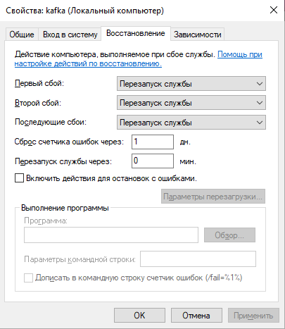

# Установка Apache Kafka в ОС Windows и подключение к {{ productName }} {: #kafka_deploy_windows }

## Введение {: #kafka_deploy_windows_intro }

Для обмена данными между **{{ productName }}** и внешними системами (а также для работы обсуждений) необходимо настроить подключение к брокеру сообщений Kafka.

Здесь представлена инструкция по установке Kafka в ОС Windows с использованием KRaft (без использования Zookeeper) и подключению Kafka к **{{ productName }}**.

## Предварительные условия {: #kafka_deploy_windows_prerequisites }

Должно быть установлено ПО Java и заданы следующие системные переменные:

- `JAVA_HOME` — путь к исполняемым файлам Open JDK, например `C:\Program Files\jdk\jdk-<version>\bin`
- `JAVA_HOME_DLL` — путь к DLL-файлу Open JDK, например `C:\Program Files\jdk\jdk-<version>\bin\server\jvm.dll`
- `Path` — короткий путь к файлам Java: `%JAVA_HOME%\bin`

!!! warning "Внимание!"

    - При указании путей используйте фактические имена дисков вместо используемых здесь дисков `C` и `X`.
    - Для корректной работы Kafka рекомендуется скачивать архив с бинарными файлами.
    - Рекомендуется использовать путь минимальной длины и названия папок без пробелов, иначе некоторые команды могут не сработать.
    - Рекомендуется создавать папку для журналов на отдельном диске, а не на диске где установлено ПО Kafka.

## Процесс установки {: #kafka_deploy_windows_install }

1. Скачайте последнюю версию Kafka с **[официального сайта](https://kafka.apache.org/downloads)**.
2. Распакуйте файлы архива, например в папку `C:\kafka`
3. Создайте папку для журналов, например `X:\kafka\logs`.
4. Откройте файл конфигурации Kafka `C:\kafka\config\kraft\server.properties`.
5. Отредактируйте файл конфигурации, указав IP-адрес сервера {{ apacheKafkaVariants }}, папку для журналов и размеры сообщений.

    !!! warning "Внимание!"

        В директиве `log.dirs` для указания пути к папке журналов используйте прямую косую черту `/`, а не обратную `\`:

    --8<-- "kafka_deploy_config_start.md"
    # Путь к файлам журналов
    # Bспользуйте прямую косую черту `/`, а не обратную `\`
    log.dirs=X:/kafka/logs
    --8<-- "kafka_deploy_config_end.md"

6. Откройте _PowerShell_ от имени администратора и выполните команды:

    ``` powershell
    cd "C:\kafka\bin\windows\"
    .\kafka-storage.bat random-uuid
    ```

7. Kafka выдаст UID, например, `kNZtrWDsRvW0udJeaEahsg`
8. Используйте полученный UID в следующей команде:

    ``` powershell
    .\kafka-storage.bat format -t kNZtrWDsRvW0udJeaEahsg -c C:\kafka\config\kraft\server.properties
    ```

9. Загрузите с **[официального сайта](https://nssm.cc/download)** архив _NSSM_ и распакуйте его.
10. В папке `\win64` найдите файл `nssm.exe` и скопируйте его в папку `C:\kafka\bin\windows\`.
11. В _PowerShell_ от имени администратора выполните следующую команду:

    ``` powershell
    .\nssm install kafka
    ```

12. Запустится программа `NSSM service installer`.

    __

13. Укажите следующие пути к файлам службы Kafka:

    - **Path**

    ``` powershell
    C:\kafka\bin\windows\kafka-server-start.bat
    ```

    - **Startup directory**

    ``` powershell
    C:\kafka\bin\windows\
    ```

    - **Arguments**

    ``` powershell
    C:\kafka\config\kraft\server.properties
    ```

14. Нажмите кнопку «**Install service**».
15. Произойдёт установка сервиса.
16. По завершении установки откройте программу _«Службы_» (_Services_) и найдите в списке `kafka`.

    __

17. В окне свойств службы на вкладке «**Восстановление**» включите и настройте перезапуск Kafka в случае сбоев.

    __

18. Протестируйте работу Kafka, выполнив в _PowerShell_ следующие команды:

    ``` powershell
    cd "C:\kafka\bin\windows\"
    .\kafka-console-producer.bat --bootstrap-server <KafkaIP>:9092 --topic TEST
    # Отправьте любое сообщение, например:
    hello
    ```

19. При правильной работе Kafka выдаст предупреждение, что раннее такой ветки сообщений не было, и создаст её.

    __

## Подключение экземпляра {{ productName }} к Kafka {: #kafka_deploy_windows_instance_connect }

1. Откройте папку `C:\ProgramData\comindware\configs\instance`
2. Задайте параметры подключения к Kafka в файле `<instanceName>.yml` (`<instanceName>` — имя экземпляра ПО):

    ``` yaml
    # IP-адрес сервера Kafka
    mq.server: <KafkaIP>:9092
    # Имя экземпляра ПО
    mq.group: <instanceName>
    # Идентификатор узла очереди сообщений
    mq.node: <instanceName>
    ```

3. Удалите следующую строку из файла `<instanceName>.yml`:

    ``` powershell
    kafkaBootstrapServer:
    ```

    !!! warning "Внимание!"

        --8<-- "kafka_deploy_config_warning.md"
        
            ```
            C:\ProgramData\comindware\configs\instance\<instanceName>.yml
            C:\ProgramData\comindware\Instances\<InstanceName>\config\apigateway.yml
            C:\ProgramData\comindware\Instances\<InstanceName>\config\adapterhost.yml
            ```
        - Удостоверьтесь, что в `YML`-файлах конфигурации все пути указаны с обратной косой чертой `\` в стиле Windows, а не в стиле Linux `/`.

1. Задайте параметры подключения к Kafka в файле `apigateway.yml`:

    ``` yaml
    # Укажите IP-адрес сервера Kafka
    # без префикса http/https
    mq.server: <KafkaIP>:9092
    # Укажите имя экземпляра ПО
    mq.group: <instanceName>
    # Идентификатор узла очереди сообщений
    mq.node: <instanceName>
    ```

2. Задайте параметры подключения к Kafka в файле `adapterhost.yml`:

    ``` yaml
    # Укажите IP-адрес сервера Kafka
    mq.server: <KafkaIP>:9092
    ```

3. Перезапустите экземпляр ПО.
4. Проверьте соединение с Kafka в браузере по ссылке (`<instanceAddress>` — URL экземпляра ПО):

    ``` powershell
    <instanceAddress>/async
    ```



<div class="relatedTopics" markdown="block">

--8<-- "related_topics_heading.md"

- [Настройка конфигурации вспомогательного ПО для оптимизации работы {{ productName }}][auxiliary_software_optimize]
- [Пути и содержимое директорий экземпляра ПО][paths_windows]

</div>


