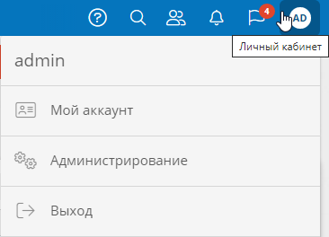

# Страница «Администрирование». Использование {: #administration}

## Переход к функциям администрирования системы

На странице «**Администрирование**» представлены разделы, позволяющие настроить различные параметры системы: как глобальные, так и для отдельных приложений.

1. Выберите меню «**Личный кабинет**» справа в верхней информационной панели.
2. В раскрывающемся меню выберите пункт «**Администрирование**».
3. Отобразится страница «**Администрирование**».
4. Выбирайте перечисленные ниже пункты, чтобы настроить систему.

__

### Внешний вид

* [Темы][themes]
* [Дизайн страниц входа и регистрации][login_and_registration_page_design]

### Архитектура

* [Приложения][apps]
* [Разделы навигации][navigation_sections_setup]
* [Шаблоны][templates]
* [Диаграммы][diagrams]
* [Функции][functions]
* [Пути передачи данных][communication_routes]

### Администрирование аккаунтов

* [Аккаунты][accounts]
* [Группы][groups]
* [Системные роли][system_roles]
* [Аудит разрешений аккаунтов][account_permission_audit]
* [Замещение][substitution]
* [Регистрация и вход][registration_and_login]

### Инфраструктура

* [Мониторинг][monitoring]
* [Журналы событий][logs]
* [Лицензирование][licensing]
* [Резервное копирование][backup]
* [Управление системными службами][system_service_management]
* [Список подключений][connections]
* [Производительность](performance.md)
* [Конфигурация журналирования][logging_configuration]
* [Глобальная конфигурация][global_configuration]
* [Адаптеры][adapters]
* [Ключи аутентификации][authentication_keys]


