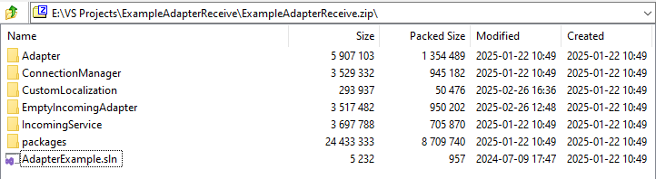

# Адаптеры. Определения, настройка, удаление {: #adapters }

<div class="admonition question" markdown="block">

## Определения {: #definitions .admonition-title }

- **Адаптер** — это заказной модуль для подключения **{{ productName }}** к внешним системам.
- Адаптер включает в себя модель данных и методы отправки или получения запросов.
- Для использования адаптера необходимо загрузить и скомпилировать его исходный код на стороне **{{ productName }}**.
- После компиляции адаптера необходимо настроить соответствующие подключение, путь передачи данных и сценарий для взаимодействия с внешней системой. См. [Порядок настройки адаптера](#adapters_configure).

</div>

## Преимущества использования адаптеров {: #adapters_benefits }

Заказные адаптеры дают следующие преимущества:

- быстрота и гибкость реализации необходимых бизнесу способов обмена данными;
- возможность обработки и преобразования данных на уровне специализированных протоколов;
- обработка различных моделей данных с помощью одного адаптера;
- повышенная отказоустойчивость благодаря обмену данными с **{{ productName }}** через брокер сообщений.

## Предварительные требования {: #adapters_prerequisites }

Для работы с адаптером необходимо выполнить следующие условия:

1. **Для корректной работы сервера {{ productName }}**

    - Установлены библиотеки .NET SDK и Runtime версии не ниже 6.0.
    - В конфигурации NGINX разрешён доступ к URI путей передачи данных адаптера.
    - Достаточно свободного места на диске для компиляции и работы адаптера.

2. **Для разработки адаптера**

    - Visual Studio 2022 или новее.
    - .NET SDK 6.0 или новее.
    - Образец исходного кода адаптера, полученный от **{{ companyName }}**.
    - Доступ к документации по API внешней системы.
    - Описание структуры данных для обмена.

3. **Для компиляции, настройки и использования адаптера в {{ productName }}**

    - Доступ к странице [«**Администрирование**» — «**Инфраструктура**» — «**Адаптеры**»][adapters_list_configure].
    - Доступ к страницам «**Администрирование**» — [«**Подключения**»][connections] и [«**Пути передачи данных**»][communication_routes].
    - Сведения для настройки подключений и путей передачи данных с использованием адаптера.
    - Доступ к средствам мониторинга адаптеров для диагностики возможных проблем. См. _«[Мониторинг работы адаптера](#adapters_monitor)»_.

## Порядок настройки адаптера {: #adapters_configure .pageBreakBefore }

1. [Определите модель данных](#adapters_data_model), передаваемых через адаптер.
2. [Определите логику работы](#adapters_structure) адаптера для отправки и получения данных.
3. [Подготовьте решение](#adapters_source_code_structure) Visual Studio с исходным кодом адаптера на C#.
4. [Настройте сервер](#adapters_server_configure) для работы адаптера.
5. [Загрузите и скомпилируйте адаптер](#adapters_list_configure) на сервере **{{ productName }}**.

    !!! warning "Внимание!"

        Чтобы скомпилировать адаптер, на сервере **{{ productName }}** должны быть установлены библиотеки .NET SDK и Runtime версии 6.0.

6. Настройте подключение с использованием адаптера согласно протоколу соединения с внешней системой.
7. Настройте путь передачи данных с использованием адаптера согласно модели данных и логике взаимодействия с внешней системой.
8. Настройте шаблоны и сценарий для обработки запросов с помощью адаптера.
9. Отслеживайте работу адаптера, см. _«[Мониторинг работы адаптера](#adapters_monitor)»_.

## Построение модели данных {: #adapters_data_model .pageBreakBefore }

Для разработки адаптера сформируйте его модель данных:

1. Подготовьте описание структуры данных в стандартизированном формате (например, XML, JSON) или в виде таблицы.
2. Преобразуйте описание структуры данных в модель классов C# для адаптера, например с помощью автогенератора <https://json2csharp.com/code-converters/xml-to-csharp>.
3. Модифицируйте полученную модель в соответствии с необходимой бизнес-логикой.

## Устройство адаптера {: #adapters_structure .pageBreakBefore }

Адаптер должен включать следующие блоки:

- сериализация или десериализация данных;
- модели данных и методы для их преобразования во внутренние модели адаптера;
- конечные точки адаптера (эндпоинты), распределяющие запросы между методами согласно модели данных адаптера;
- службы, обеспечивающие взаимодеиствие с Kestrel, отправку сообщений, таймауты, проверку данных и т. д.

## Структура исходного кода адаптера {: #adapters_source_code_structure .pageBreakBefore }

Образец исходного кода адаптера запросите у представителя **{{ companyName }}**. На его основе можно разработать адаптер под свои нужды.

Адаптер для включения в состав **{{ productName }}** должен представлять собой решение Visual Studio из перечисленных ниже компонентов:

- проект с исходным кодом адаптера, включая один файл решения (`.sln`) в корневой папке;
- подпроекты, содержащие интерфейсы для разработки и последующей компиляции адаптера;
- подпроект, содержащий основной функционал адаптера;
- дополнительные подпроекты, например для локализации;
- папка с подключаемыми библиотеками.

Готовое решение упакуйте в ZIP-архив для компиляции в **{{ productName }}**.

__


### Обозначения {: #adapters_naming }

Далее используются следующие обозначения:

- `{AdapterName}` — имя адаптера, которое используется в названии решения Visual Studio, а также в системном имени адаптера в **{{ productName }}**. Например:
    - `IncomingAdapter` — адаптер для получения данных;
    - `OutgoingAdapter` — адаптер для отправки данных.
- `{communicationRouteName}` — имя пути передачи данных, который реализуется в адаптере.
- `{CommunicationRoutePath}` — URI эндпоинта адаптера, например: `MyIncomingAdapter/GetRequests`.

    !!! note "Примечание"

        Доступ к этому URI необходимо разрешить в конфигурации NGINX.

        См. _«[Настройка сервера {{ productName }} для работы адаптера](#adapters_server_configure)»_.

### Проекты в составе адаптера {: #adapters_projects .pageBreakBefore }

Решение Visual Studio с исходным кодом адаптера должно включать перечисленные ниже проекты.

Скопируйте эти проекты проекты из образца исходного кода адаптера.

В общем случае изменять следует только проекты `{AdapterName}`, `CustomLocalization` и `ExternalServiceContracts`.

- `{AdapterName}` — проект с бизнес-логикой адаптера для [получения](#adapters_incoming_classes) или [отправки](#adapters_outgoing_classes) сообщений.
- `IncomingService` либо `OutgoingService` — проект для обработки входящих или исходящих сообщений в **{{ productName }}**.
- `Adapter` — общая логика адаптеров.
- `ConnectionManager` — диспетчер подключений к внешним службам.
- `Heartbeat` — мониторинг состояния адаптера.
- `Localization.Adapter` — стандартные локализованные сообщения и графический интерфейс адаптера.
- `MessageBroker.Api` — интерфейсы взаимодействия со службой брокера сообщений.
- `Platform.FormDefinition` — графический интерфейс адаптера.
- Необязательные библиотеки:
    - `CustomLocalization` — локализация полей сообщений и прочие текстовые константы.
    - `ExternalServiceContracts` — модели сообщений внешних сервисов.

### Классы и методы адаптера для получения сообщений {: #adapters_incoming_classes .pageBreakBefore }

В проекте `{AdapterName}` должен быть реализован интерфейс `IIncomingConnectionService` при помощи перечисленных ниже классов и методов для взаимодействия с **{{ productName }}**:

- Класс `Adapter`

    | Метод | Описание |
    |---|---|
    | `GetName()` | Возвращает название адаптера |
    | `GetDescription()` | Возвращает описание адаптера |
    | `GetVersion()` | Возвращает версию адаптера |
    | `GetSignatures()` | Возвращает модели всех реализованных путей передачи данных |

- Папка `Behaviour`
    - Папка `{communicationRouteName}`
        - Класс `{communicationRouteName}Performer`

            | Метод | Описание |
            |---|---|
            | `{communicationRouteName}Performer()` | Получает входящее сообщение и формирует ответ на него |
            | `RecognizeRawRequest()` | Сопоставляет данные во входящем сообщении с внутренними данными (маппинг) |
            | `SendRawResponse()` | Вызывает интерфейс `IIncomingConnectionService.OnReplyReceive(object message)` для успешного ответа или `IIncomingConnectionService.OnErrorReceive(object message)` для отправки сообщения с ошибкой. Это обязательный метод, если включено ожидание синхронного ответа от **{{ productName }}** |

        - Класс `{communicationRouteName}IncomingService` (наследуется от `GenericIncomingConnectionService`)

            | Свойство | Описание |
            |---|---|
            | `IsWaitResponse` | Необходимость ожидания синхронного ответа от **{{ productName }}** |
            | `Integration` | Тип интеграции |

    - Класс `Service`

        | Метод / свойство | Описание |
        |---|---|
        | `CreatePerformer()` | Инициализирует получение входящего сообщения |
        | `OnStart()` | Вызывает интерфейс `IIncomingConnectionService.Subscribe` при создании или включении пути передачи данных на сервере **{{ productName }}** |
        | `OnStop()` | Вызывает интерфейс `IIncomingConnectionService.Unsubscribe` при удалении или выключении пути передачи данных на сервере **{{ productName }}** |
        | `PerformTest()` | Проверяет соединение с адаптером с помощью интерфейса `IIncomingConnectionService.PerformTest` |
        | `GetEndpointConfigs()` | Возвращает список подключений. В свойстве `Route` необходимо указать `{CommunicationRoutePath}` |
        | `KestrelConfig` | Инициализирует список подключений к `Kestrel`, включая `EndpointConfig` |
        | `GetIncomingService()` | Инициализирует путь передачи данных |

- Папка `Configuration`
    - Класс `Endpoint`

        | Свойство | Описание |
        |---|---|
        | `Endpoint` | Модель подключения к внешнему сервису |
        | `EndpointForm` | Модель формы для настройки подключения |

    - Класс `Procedure`

        | Свойство | Описание |
        |---|---|
        | `Procedure` | Модели путей передачи данных |
        | `SignatureForm` | Модель формы для настройки пути передачи данных |

- Папка `Signature`
    - Класс `{communicationRouteName}ExternalMessage`

        | Свойство | Описание |
        |---|---|
        | `{communicationRouteName}ExternalMessage` | Модель сообщений внешнего сервиса |

    - Класс `{communicationRouteName}IncomingMessage`

        | Свойство | Описание |
        |---|---|
        | `{communicationRouteName}IncomingMessage` | Модель входящих сообщений, обязательно унаследованная от `Comindware.Adapter.Message`. Обязательно должно быть задано свойство `Display` для локализации названия каждого атрибута посредством `CustomLocalization` |

    - Класс `ErrorMessage`

        | Свойство | Описание |
        |---|---|
        | `ErrorMessage` | Модель сообщения об ошибке, унаследованная от `Comindware.Adapter.Message` |

    - Класс `ResponseMessage`

        | Свойство | Описание |
        |---|---|
        | `ResponseMessage` | Модель ответного сообщения, унаследованная от `Comindware.Adapter.Message` |

    - Класс `{communicationRouteName}Signature`

        | Метод | Описание |
        |---|---|
        | `GetIncomingMessageType()` | Возвращает тип входящего сообщения после его преобразования к внутренним данным |
        | `GetOutgoingMessageType()` | Возвращает тип сообщения об ответе без ошибок |
        | `GetErrorMessageType()` | Возвращает тип сообщения об ошибке |

### Классы и методы адаптера для отправки сообщений {: #adapters_outgoing_classes .pageBreakBefore }

В проекте `{adapterName}` должен быть реализован интерфейс `IOutgoingConnectionService` при помощи перечисленных ниже классов и методов для взаимодействия с **{{ productName }}**:

- Класс `Adapter`

    | Метод | Описание |
    |---|---|
    | `GetName()` | Возвращает название адаптера |
    | `GetDescription()` | Возвращает описание адаптера |
    | `GetVersion()` | Возвращает версию адаптера |
    | `GetSignatures()` | Возвращает модели всех реализованных путей передачи данных |

- Папка `Behaviour`
    - Папка `{communicationRouteName}`
        - Класс `{communicationRouteName}Performer`

            | Метод | Описание |
            |---|---|
            | `TranslateIncomingMessage()` | Сопоставляет данные во входящем сообщении с внутренними данными (маппинг) |
            | `SendRawRequest()` | Отправляет сообщение во внешний сервис |
            | `RecognizeRawResponse()` | Обрабатывает ответ внешнего сервиса |

        - Класс `{communicationRouteName}OutgoingService` (наследуется от `GenericOutgoingConnectionService`)

            | Метод / свойство | Описание |
            |---|---|
            | `Execute()` | Выполняет исходящие запросы |
            | `ConnectionConfigData` | Модель конфигурации подключений к внешнему серверу|

    - Класс `Service`

        | Метод / свойство | Описание |
        |---|---|
        | `CreatePerformer()` | Инициализирует отправку исходящего сообщения |
        | `PerformTest()` | Проверяет соединение с внешним сервисом с помощью интерфейса `IOutgoingConnectionService.PerformTest` |
        | `GetEndpointConfigs()` | Возвращает список подключений. В свойстве `Route` необходимо указать `{CommunicationRoutePath}` |

- Папка `Configuration`
    - Класс `Endpoint`

        | Свойство | Описание |
        |---|---|
        | `Endpoint` | Модель подключения к внешнему сервису |
        | `EndpointForm` | Модель формы для настройки подключения |

    - Класс `Procedure`

        | Свойство | Описание |
        |---|---|
        | `Procedure` | Модели путей передачи данных |

- Папка `Signature`
    - Класс `{communicationRouteName}ExternalMessage`

        | Свойство | Описание |
        |---|---|
        | `{communicationRouteName}ExternalMessage` | Модель сообщений внешнего сервиса |

    - Класс `{communicationRouteName}Request`

        | Свойство | Описание |
        |---|---|
        | `{communicationRouteName}Request` | Модель сообщения запроса, унаследованная от `Comindware.Adapter.Message`. Обязательно должно быть задано свойство `Display` для локализации названия каждого атрибута посредством `CustomLocalization` |

    - Класс `ErrorMessage`

        | Свойство | Описание |
        |---|---|
        | `ErrorMessage` | Модель сообщения об ошибке, унаследованная от `Comindware.Adapter.Message` |

    - Класс `ResponseMessage`

        | Свойство | Описание |
        |---|---|
        | `ResponseMessage` | Модель ответного сообщения, унаследованная от `Comindware.Adapter.Message` |

    - Класс `{communicationRouteName}Signature`

        | Метод | Описание |
        |---|---|
        | `GetIncomingMessageType()` | Возвращает тип входящего сообщения после его преобразования к внутренним данным |
        | `GetOutgoingMessageType()` | Возвращает тип сообщения об ответе без ошибок |
        | `GetErrorMessageType()` | Возвращает тип сообщения об ошибке |

## Настройка сервера {{ productName }} для работы адаптера {: #adapters_server_configure .pageBreakBefore }

Чтобы скомпилировать адаптер, на сервере **{{ productName }}** должны быть установлены библиотеки .NET SDK и Runtime версии не ниже 6.0.

Чтобы адаптер работал корректно, доступ ко всем URI путей передачи данных адаптера необходимо разрешить в конфигурации NGINX.

1. Перейдите в режим суперпользователя:

    --8<-- "linux_sudo.md"

2. Установите пакеты .NET:

    - **Astra Linux**, **Ubuntu**, **Debian** (DEB-based)

        ``` sh
        apt-get update
        apt-get install -y dotnet-sdk-6.0
        ```

    - **РЕД ОС**, **Rocky** (RPM-based)

        ``` sh
        dnf install dotnet-sdk-6.0
        ```

    - **Альт Сервер**

        ``` sh
        apt-get update
        apt-get install dotnet-sdk
        ```

3. Откройте файл конфигурации NGINX для редактирования (`instanceName` — имя экземпляра ПО):

    - **Astra Linux**, **Ubuntu**, **Debian** (DEB-based)

        ``` sh
        nano /etc/nginx/sites-available/comindware<instanceName>
        ```

    - **РЕД ОС**, **Rocky** (RPM-based)

        ``` sh
        nano /etc/nginx/conf.d/comindware<instanceName>
        ```

    - **Альт Сервер**

        ``` sh
        nano /etc/nginx/sites-available.d/comindware<instanceName>
        ```

4. Добавьте следующие директивы **для каждого пути передачи данных** (`CommunicationRoutePath` — URI пути передачи данных, `hostName` — адрес сервера **{{ productName }}**, `portNumber` — порт, по которому доступен адаптер):

    !!! warning "Порт для адаптера"

        Порт, по которому доступен адаптер, должен отличаться от номера порта сервера **{{ productName }}**.

    ``` cs
    location <CommunicationRoutePath> {
        proxy_pass https://<hostName>:<portNumber>;
    }
    ```

5. При необходимости перезапустите NGINX.

## Просмотр списка адаптеров и настройка адаптера {: #adapters_list_configure .pageBreakBefore }

1. На странице [«**Администрирование**» — «**Инфраструктура**»][administration] выберите пункт «**Адаптеры**» <i class="fa-light fa-puzzle-piece-simple">‌</i>.
2. Отобразится список адаптеров.

    __

3. Нажмите кнопку «**Создать**» или дважды нажмите строку имеющегося адаптера.
4. Отобразится страница свойств адаптера.

    __

    

5. В поле «**Исходный код адаптера**» загрузите ZIP-архив с исходным кодом адаптера. Архив должен содержать подготовленное решение Visual Studio. См. [Устройство адаптера](#adapters_source_code_structure).
6. Нажмите кнопку «**Сохранить**».
7. Нажмите кнопку «**Опубликовать**», чтобы скомпилировать адаптер.
8. В случае успешной компиляции адаптера его название отобразится в списке адаптеров и свойствах адаптера. Название берётся из файлов решения Visual Studio.
9. После компиляции просмотрите **журнал компиляции**.

    __

10. При необходимости скачайте архив с журналами работы адаптера (вида `_CBAP.adapters.20221026.logs.zip_`), нажав кнопку «**Скачать журнал работы**». См. _«[Мониторинг работы адаптера](#adapters_monitor)»_.

    __

    

11. Пункт с названием подключения для скомпилированного адаптера появится в меню «**Создать**» — «**Пользовательские подключения**» на страницах «**[Подключения][connections]**» и «**[Пути передачи данных][communication_routes]**». При этом для каждой модели данных в пути передачи данных будет предусмотрен соответствующий **тип сообщения**.

__

__

## Мониторинг работы адаптера {: #adapters_monitor .pageBreakBefore }

Для проверки работы адаптера можно воспользоваться встроенными в **{{ productName }}** средствами мониторинга.

- На [странице свойств адаптера](#adapters_list_configure) скачайте архив с журналами адаптера, нажав кнопку «**Скачать журнал работы**». Этот журнал содержит следующие сведения:
    - статус служб адаптера;
    - статус подключения адаптера;
    - доступность методов;
    - объём выделенной памяти;
    - информация о созданных путях передачи данных;
    - взаимодействие адаптера со службой Kafka.

    См. _«[Журналы адаптеров][logging_engine_adapter_logs]»_ и _«[Событие в адаптере][log_files_event_examples_adapter_event]»_.

- В свойствах **[подключения][connections]** адаптера нажмите кнопку «**Скачать журнал**». Этот журнал содержит следующие события:
    - статус подключения;
    - получение и отправка сообщений;
    - запуск сценария обработки сообщения;
    - использование методов адаптера.

    См. _«[Статус подключения][log_files_event_examples_connection_status]»_

- Просмотрите события получения или отправки запросов и связанные с ними цепочки событий:
    - Откройте страницу «**Администрирование**» — «**[Журналы событий][logs]**».
    - Перейдите на вкладку «**Трассировка событий**».
    - Просмотрите события типа «**Получен запрос**» и «**Запрос отправлен**», связанные с работой адаптера, дважды нажав строку события.

    См. _«[Просмотр цепочки событий][logs_event_chain_view]»_.

## Удаление адаптера {: #adapters_delete .pageBreakBefore }

!!! warning "Внимание!"

    Пути передачи данных и подключения, сгенерированные для удалённого адаптера, станут неактивны и перестанут работать.

1.  На странице [«**Администрирование**» — «**Инфраструктура**»][administration] выберите пункт «**Адаптеры**» <i class="fa-light fa-puzzle-piece-simple">‌</i>.
2. Установите флажок в первом столбце списка для адаптера, подлежащего удалению.
3. Нажмите кнопку «**Удалить**».
4. Подтвердите удаление адаптера.

<div class="relatedTopics" markdown="block">

--8<-- "related_topics_heading.md"

- _[Подключения. Определения, типы, создание, настройка, удаление][connections]_
- _[Журналы событий. Типы, просмотр, цепочки событий][logs]_
- _[Примеры событий в файловых журналах][log_files_event_examples]_
- _[Подсистема журналирования][logging_engine]_

</div>


