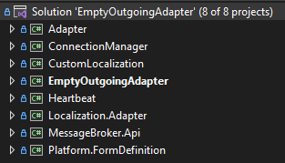
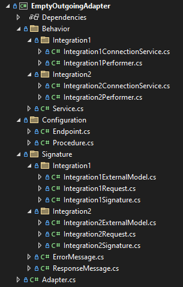

**Создание плагина принимающего адаптера**

Необходимо взять за основу приложенный пример **EmptyIncomingAdapter** (плагин адаптера, загружаемого в платформу), внести изменения и дополнения в соответствии с вашей предметной областью по приложенной ниже инструкции. Нежелательно изменять шаблонную структуру решения для удобства дальнейшей отладки и доработки другими разработчиками. Пример включает в себя две интеграции - Integration1 и Integration2.

1. **СТРУКТУРА АДАПТЕРА**

1\.1) **Инфраструктурные библиотеки** (TargetFramework обязательно должен быть net6.0), изменять и удалять их не нужно:

- Comindware.Adapter
- Comindware.Infrastructure.Heartbeat
- Localization.Adapter
- Comindware.MessageBroker.Api
- Comindware.Platform.FormDefinition

1\.2) **Функционал получения сообщений из внешних сервисов**

- Comindware.Adapter.ConnectionManager
- Comindware.Adapter.IncomingService

1\.3) **Необязательный библиотеки**

- Comindware.Adapter.ExternalServiceContracts (модели сообщений внешних сервисо)
- Comindware.Adapter.CustomLocalization (локализация полей сообщений и прочие текстовые константы)

1\.4) **Основной функционал адаптера** 

- {AdapterName}IncomingAdapter 

*Структура плагина адаптера*

1. **СОЗДАНИЕ АДАПТЕРА**

**2.1)** Основной функционал адаптера представляет из себя:

- класс **Adapter** с основной информацией об адаптере;
- папку **Behaviour**, содержащую в себе класс **Service** (инициализация перформеров, подписка/отписка на получение входящих сообщений и пр.), перформеры (обработка входящего и ответного сообщений), а также прочие вспомогательные сервисы. Если в адаптере предусмотрено несколько интеграций, то перформеры и все вспомогательные сервисы необходимо распределить по соответствующим папкам;
- папку **Configuration**, содержащую конфигурацию Подключения (класс **Endpoint**) и конфигурацию Процедуры (класс **Procedure**);
- папку **Signature**, содержащую модели внешних и внутренних сообщений, сообщений об ошибках, а также класс {IntegrationName}Signature**.** Если в адаптере предусмотрено несколько интеграций, то модели и классы сигнатур необходимо распределить по соответствующим папкам.

*Структура основного функционала адаптера EmptyIncomingAdapter*

**2.2)** В папке **Signature** должны находиться:

- модели сообщений внешнего сервиса (**Integration1ExternalMessage** в примере);

- модели сообщений платформы (**Integration1IncomingMessage** в примере), корневая модель обязательно должна быть унаследована от Comindware.Adapter.Message, а также добавлен атрибуты Display для локализации для каждого свойства;

- модель сообщения об ошибке, унаследованная от Comindware.Adapter.Message (**ErrorMessage** в примере);

- модель ответного сообщения, унаследованная от Comindware.Adapter.Message (**ResponseMessage** в примере);

- класс **{IntegrationName}Signature,** унаследованный от Comindware.Adapter.Signature, в методе GetIncomingMessageType необходимо указать тип входящего (внутреннего) сообщения (Integration1IncomingMessage в примере), в методе GetOutgoingMessageType - ответное сообщение (ResponseMessage в примере), в методе GetErrorMessageType - сообщение об ошибке (ErrorMessage в примере).

**2.3)** Внести соответствующие изменения в класс **Adapter** - указать название, описание и версию адаптера, если в адаптере задействовано несколько сигнатур, все они должны быть описаны в методе GetSignatures().

![ref1]

*Метод **GetSignatures** класса Adapter*

**2.4)** В папке **Configuration**:

- конфигурация Подключения (в классе **Endpoint** располагаются свойства, необходимые для создания подключения к внешнему сервису получения сообщений, в **EndpointForm** конфигурируется форма для настройки подключения);
- конфигурация Процедуры (**Procedure** и **SignatureForm**).

**2.5)** Реализовать **{IntegrationName}Performer** для каждой интеграции:

- обязательно реализовать два конструктора базового класса Comindware.Adapter.IncomingPerformer - один для внешнего сообщения, второй для ответного;
- маппинг внешнего сообщения на внутреннее в методе **RecognizeRawRequest**;
- если для получения сообщения используется Kestrel в базовой реализации и подразумевается ответное сообщение, то в методе **SendRawResponse** обязательно вызвать **IIncomingConnectionService.OnReplyReceive(object message)** для успешного ответа или **IIncomingConnectionService.OnErrorReceive(object message)** для отправки сообщения с ошибкой;

**2.6)** Реализовать класс **Service**:

- в методе **CreatePerformer** инициализировать перформер (в т.ч. предусмотреть инициализацию вторым конструктором для ответного сообщения);
- метод **OnStart** вызывается при создании или включении Пути передачи данных в интерфейсе Платформы и в нём необходимо инициировать прослушивание входящих сообщений для конкретной интеграции;
- метод **OnStop** вызывается при удалении или выключении Пути передачи данных в интерфейсе Платформы и в нём нужно завершать прослушивание входящих сообщений для конкретной интеграции;
- метод **PerformTest** предназначен для проверки работоспособности сервиса, прослушивающего входящие сообщения, вызывается нажатием соответствующей кнопки в окне Подключение и логгером состояния Платформы с определённой периодичностью;

**2.7)** Функционал получения сообщений (слушающий сервис) рекомендуется отделить от описанного выше функционала адаптера (п.2.5 и п.2.6) и предоставлять последнему уже подготовленное и десериализованное сообщение для последующего маппинга и передачи в Платформу. Вам необходимо либо реализовать свой функционал согласно ТЗ либо воспользоваться предоставленной базовой реализацией.

В приложенном примере (**EmptyIncomingAdapter)** базовый функционал представляет из себя реализацию интерфейса **IIncomingConnectionService** в виде **GenericIncomingConnectionService (Kestrel)** и унаследованного от него **{IntegrationName}IncomingService** с деталями реализации для конкретной интеграции. Для получения сообщений необходимо:

- для каждой интеграции реализовать **{IntegrationName}IncomingService,** унаследовав от **GenericIncomingConnectionService**, указать тип интеграции (**Integration**), ожидается ли синхронное ответное сообщение от платформы (**IsWaitResponse**), указать **ContentType**, при необходимости переопределить виртуальные методы;
- в классе **Service** инициализировать список **EndpointConfig**, где каждой интеграции соответствует один эндпоинт;
- в классе **Service** инициализировать **KestrelConfig**, включающий в себя список **EndpointConfig;**
- в классе **Service** инициализировать **{IntegrationName}IncomingService** в зависимости от конкретной интеграции;
- в методе **Service.OnStart** вызвать **IIncomingConnectionService**.**Subscribe** (для инициации прослушивания входящих сообщения конкретной интеграцией);
- в методе **Service.OnStop** вызвать **IIncomingConnectionService**.**Unsubscribe** (для завершения прослушивания входящих сообщений для конкретной интеграции;
- в методе **Service.PerformTest**  вызвать **IIncomingConnectionService**.**PerformTest**  (для проверки работоспособности прослушивающего сервиса);
- если подразумевается ответное сообщение (**IsWaitResponse = true)**, то в методе **SendRawResponse** обязательно вызвать **IIncomingConnectionService.OnReplyReceive(object message)** для успешного ответа или **IIncomingConnectionService.OnErrorReceive(object message)** для отправки сообщения с ошибкой.

_Методы **GetEndpointConfigs**_ **и _GetIncomingService_** _класса Service_

**Создание плагина отправляющего адаптера**

Необходимо взять за основу приложенный пример **EmptyOutgoingAdapter** (плагин адаптера, загружаемого в платформу), внести изменения и дополнения в соответствии с вашей предметной областью по приложенной ниже инструкции. Нежелательно изменять шаблонную структуру решения для удобства дальнейшей отладки и доработки другими разработчиками. Пример включает в себя две интеграции - Integration1 и Integration2

1. **СТРУКТУРА АДАПТЕРА**

1\.1) **Инфраструктурные библиотеки** (TargetFramework обязательно должен быть net6.0), изменять и удалять их не нужно:

- Comindware.Adapter
- Comindware.Infrastructure.Heartbeat
- Localization.Adapter
- Comindware.MessageBroker.Api
- Comindware.Platform.FormDefinition

1\.2) **Функционал отправки сообщений внешним сервисам**

- Comindware.Adapter.ConnectionManager

1\.3) **Необязательный библиотеки**

- Comindware.Adapter.ExternalServiceContracts (модели сообщений внешних сервисо)
- Comindware.Adapter.CustomLocalization (локализация полей сообщений и прочие текстовые константы)

1\.4) **Основной функционал адаптера** 

- {AdapterName}OutgoingAdapter 

*Структура плагина адаптера*

1. **СОЗДАНИЕ АДАПТЕРА**

**2.1)** Основной функционал адаптера представляет из себя:

- класс **Adapter** с основной информацией об адаптере;
- папку **Behaviour**, содержащую в себе класс **Service** (инициализация перформеров, проверка соединения с внешним сервисом и пр.), перформеры (обработка исходящего и получение ответного сообщений от внешнего сервиса), а также прочие вспомогательные сервисы. Если в адаптере предусмотрено несколько интеграций, то перформеры и все вспомогательные сервисы необходимо распределить по соответствующим папкам;
- папку **Configuration**, содержащую конфигурацию Подключения (класс **Endpoint**) и конфигурацию Процедуры (класс **Procedure**);
- папку **Signature**, содержащую модели внешних и внутренних сообщений, сообщений об ошибках, а также класс {IntegrationName}Signature**.** Если в адаптере предусмотрено несколько интеграций, то модели и классы сигнатур необходимо распределить по соответствующим папкам.

*Структура основного функционала адаптера EmptyOutgoingAdapter*

**2.2)** В папке **Signature** должны находиться:

- модели сообщений внешнего сервиса (**Integration1ExternalMessage** в примере);

- модели сообщений платформы (**Integration1Request** в примере), корневая модель обязательно должна быть унаследована от Comindware.Adapter.Message, а также добавлены атрибуты Display для локализации для каждого свойства;

- модель сообщения об ошибке, унаследованная от Comindware.Adapter.Message (**ErrorMessage** в примере);

- модель ответного сообщения, унаследованная от Comindware.Adapter.Message (**ResponseMessage** в примере);

- класс **{IntegrationName}Signature,** унаследованный от Comindware.Adapter.Signature, в методе GetIncomingMessageType необходимо указать тип исходящего (внутреннего) сообщения (Integration1Request в примере), в методе GetOutgoingMessageType - ответное сообщение (ResponseMessage в примере), в методе GetErrorMessageType - сообщение об ошибке (ErrorMessage в примере).

**2.3)** Внести соответствующие изменения в класс **Adapter** - указать название, описание и версию адаптера, если в адаптере задействовано несколько сигнатур, все они должны быть описаны в методе GetSignatures().

![ref1]

*Метод **GetSignatures** класса Adapter*

**2.4)** В папке **Configuration**:

- конфигурация Подключения (в классе **Endpoint** располагаются свойства, необходимые для создания подключения к внешнему сервису для отправки сообщений, в **EndpointForm** конфигурируется форма для настройки подключения);
- конфигурация Процедуры (**Procedure** и **SignatureForm**).

**2.5)** Реализовать **{IntegrationName}Performer** для каждой интеграции:

- маппинг внутреннего сообщения на внешнее в методе **TranslateIncomingMessage**;

- в методе **SendRawRequest** выполнить отправку сообщения внешнему сервису (см. п.2.7);
- в методе **RecognizeRawResponse** обработать ответное сообщение внешнего сервиса, в случае успеха вернуть объект ProcessingResult с ProcessingResultType.MessageRecognized и ResponseMessage, а в случае ошибки - вернуть объект ProcessingResult с ProcessingResultType.ErrorMessageRecognized и ErrorMessage.

**2.6)** Реализовать класс **Service**:

- в методе **CreatePerformer** инициализировать перформер;
- метод **PerformTest** предназначен для проверки соединения с внешним сервисом, вызывается нажатием соответствующей кнопки в окне Подключение и логгером состояния Платформы с определённой периодичностью;

**2.7)** Функционал отправки сообщений рекомендуется отделить от описанного выше функционала адаптера (п.2.5 и п.2.6). Вам необходимо либо реализовать свой функционал согласно ТЗ либо воспользоваться предоставленной базовой реализацией.

В приложенном примере (**EmptyOutgoingAdapter)** базовый функционал представляет из себя реализацию интерфейса **IOutgoingConnectionService** в виде **GenericOutgoingConnectionService** и унаследованного от него **{IntegrationName}ConnectionService** с деталями реализации для конкретной интеграции. Для отправки сообщений необходимо:

- для каждой интеграции реализовать **{IntegrationName}ConnectionService,** унаследовав от **GenericOutgoingConnectionService** и при необходимости переопределить метод **Execute**;
- инициализировать конфигурацию для подключения к внешнему сервису - **ConnectionConfigData**;
- в перформере конкретной интеграции** инициализировать **{IntegrationName}ConnectionService**;

[ref1]: Aspose.Words.92f448f4-eee0-4e69-a3f0-3ce52e917dd7.003.png
