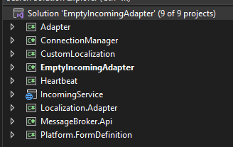
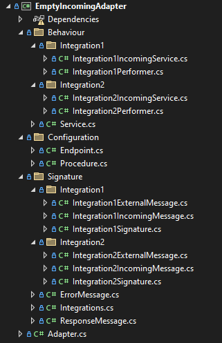
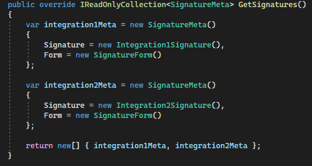
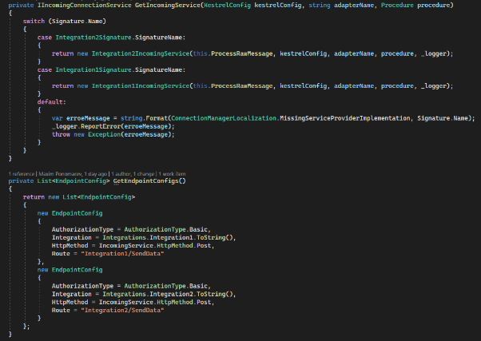

# Создание плагинов адаптеров

Необходимо взять за основу приложенные примеры **EmptyIncomingAdapter** и **EmptyOutgoingAdapter** (плагины адаптеров, загружаемых в платформу), внести изменения и дополнения в соответствии с вашей предметной областью по приложенной ниже инструкции. Нежелательно изменять шаблонную структуру решения для удобства дальнейшей отладки и доработки другими разработчиками. Примеры включают в себя две интеграции - Integration1 и Integration2.

## Структура адаптера

### Инфраструктурные библиотеки (TargetFramework обязательно должен быть net6.0), изменять и удалять их не нужно:

- Comindware.Adapter
- Comindware.Infrastructure.Heartbeat
- Localization.Adapter
- Comindware.MessageBroker.Api
- Comindware.Platform.FormDefinition

### Функционал получения и отправки сообщений

- Comindware.Adapter.ConnectionManager
- Comindware.Adapter.IncomingService (для входящих адаптеров)
- Comindware.Adapter.OutgoingService (для исходящих адаптеров)

### Необязательные библиотеки

- Comindware.Adapter.ExternalServiceContracts (модели сообщений внешних сервисов)
- Comindware.Adapter.CustomLocalization (локализация полей сообщений и прочие текстовые константы)

### Основной функционал адаптера

- {AdapterName}IncomingAdapter (для входящих адаптеров)
- {AdapterName}OutgoingAdapter (для исходящих адаптеров)

## Создание адаптера

### Основной функционал адаптера представляет из себя:

- класс **Adapter** с основной информацией об адаптере;
- папку **Behaviour**, содержащую в себе класс **Service** (инициализация перформеров, подписка/отписка на получение входящих сообщений и пр.), перформеры (обработка входящего и ответного сообщений), а также прочие вспомогательные сервисы. Если в адаптере предусмотрено несколько интеграций, то перформеры и все вспомогательные сервисы необходимо распределить по соответствующим папкам;
- папку **Configuration**, содержащую конфигурацию Подключения (класс **Endpoint**) и конфигурацию Процедуры (класс **Procedure**);
- папку **Signature**, содержащую модели внешних и внутренних сообщений, сообщений об ошибках, а также класс {IntegrationName}Signature. Если в адаптере предусмотрено несколько интеграций, то модели и классы сигнатур необходимо распределить по соответствующим папкам.

### В папке **Signature** должны находиться:

- модели сообщений внешнего сервиса (**Integration1ExternalMessage** в примере);
- модели сообщений платформы (**Integration1IncomingMessage** для входящих адаптеров и **Integration1Request** для исходящих адаптеров), корневая модель обязательно должна быть унаследована от Comindware.Adapter.Message, а также добавлены атрибуты Display для локализации для каждого свойства;
- модель сообщения об ошибке, унаследованная от Comindware.Adapter.Message (**ErrorMessage** в примере);
- модель ответного сообщения, унаследованная от Comindware.Adapter.Message (**ResponseMessage** в примере);
- класс **{IntegrationName}Signature**, унаследованный от Comindware.Adapter.Signature, в методе GetIncomingMessageType необходимо указать тип входящего (внутреннего) сообщения (Integration1IncomingMessage в примере), в методе GetOutgoingMessageType - ответное сообщение (ResponseMessage в примере), в методе GetErrorMessageType - сообщение об ошибке (ErrorMessage в примере).

### Внести соответствующие изменения в класс **Adapter** - указать название, описание и версию адаптера, если в адаптере задействовано несколько сигнатур, все они должны быть описаны в методе GetSignatures().

### В папке **Configuration**:

- конфигурация Подключения (в классе **Endpoint** располагаются свойства, необходимые для создания подключения к внешнему сервису, в **EndpointForm** конфигурируется форма для настройки подключения);
- конфигурация Процедуры (**Procedure** и **SignatureForm**).

### Реализовать **{IntegrationName}Performer** для каждой интеграции:

- для входящих адаптеров:
  - обязательно реализовать два конструктора базового класса Comindware.Adapter.IncomingPerformer - один для внешнего сообщения, второй для ответного;
  - маппинг внешнего сообщения на внутреннее в методе **RecognizeRawRequest**;
  - если для получения сообщения используется Kestrel в базовой реализации и подразумевается ответное сообщение, то в методе **SendRawResponse** обязательно вызвать **IIncomingConnectionService.OnReplyReceive(object message)** для успешного ответа или **IIncomingConnectionService.OnErrorReceive(object message)** для отправки сообщения с ошибкой;
- для исходящих адаптеров:
  - маппинг внутреннего сообщения на внешнее в методе **TranslateIncomingMessage**;
  - в методе **SendRawRequest** выполнить отправку сообщения внешнему сервису;
  - в методе **RecognizeRawResponse** обработать ответное сообщение внешнего сервиса, в случае успеха вернуть объект ProcessingResult с ProcessingResultType.MessageRecognized и ResponseMessage, а в случае ошибки - вернуть объект ProcessingResult с ProcessingResultType.ErrorMessageRecognized и ErrorMessage.

### Реализовать класс **Service**:

- для входящих адаптеров:
  - в методе **CreatePerformer** инициализировать перформер (в т.ч. предусмотреть инициализацию вторым конструктором для ответного сообщения);
  - метод **OnStart** вызывается при создании или включении Пути передачи данных в интерфейсе Платформы и в нём необходимо инициировать прослушивание входящих сообщений для конкретной интеграции;
  - метод **OnStop** вызывается при удалении или выключении Пути передачи данных в интерфейсе Платформы и в нём нужно завершать прослушивание входящих сообщений для конкретной интеграции;
  - метод **PerformTest** предназначен для проверки работоспособности сервиса, прослушивающего входящие сообщения, вызывается нажатием соответствующей кнопки в окне Подключение и логгером состояния Платформы с определённой периодичностью;
- для исходящих адаптеров:
  - в методе **CreatePerformer** инициализировать перформер;
  - метод **PerformTest** предназначен для проверки соединения с внешним сервисом, вызывается нажатием соответствующей кнопки в окне Подключение и логгером состояния Платформы с определённой периодичностью.

### Функционал получения и отправки сообщений рекомендуется отделить от описанного выше функционала адаптера. Вам необходимо либо реализовать свой функционал согласно ТЗ либо воспользоваться предоставленной базовой реализацией.

В приложенных примерах (**EmptyIncomingAdapter** и **EmptyOutgoingAdapter**) базовый функционал представляет из себя реализацию интерфейсов **IIncomingConnectionService** и **IOutgoingConnectionService** в виде **GenericIncomingConnectionService** и **GenericOutgoingConnectionService** соответственно, и унаследованных от них **{IntegrationName}IncomingService** и **{IntegrationName}ConnectionService** с деталями реализации для конкретной интеграции. Для получения и отправки сообщений необходимо:

- для входящих адаптеров:
  - для каждой интеграции реализовать **{IntegrationName}IncomingService**, унаследовав от **GenericIncomingConnectionService**, указать тип интеграции (**Integration**), ожидается ли синхронное ответное сообщение от платформы (**IsWaitResponse**), указать **ContentType**, при необходимости переопределить виртуальные методы;
  - в классе **Service** инициализировать список **EndpointConfig**, где каждой интеграции соответствует один эндпоинт;
  - в классе **Service** инициализировать **KestrelConfig**, включающий в себя список **EndpointConfig**;
  - в классе **Service** инициализировать **{IntegrationName}IncomingService** в зависимости от конкретной интеграции;
  - в методе **Service.OnStart** вызвать **IIncomingConnectionService.Subscribe** (для инициации прослушивания входящих сообщения конкретной интеграцией);
  - в методе **Service.OnStop** вызвать **IIncomingConnectionService.Unsubscribe** (для завершения прослушивания входящих сообщений для конкретной интеграции);
  - в методе **Service.PerformTest** вызвать **IIncomingConnectionService.PerformTest** (для проверки работоспособности прослушивающего сервиса);
  - если подразумевается ответное сообщение (**IsWaitResponse = true**), то в методе **SendRawResponse** обязательно вызвать **IIncomingConnectionService.OnReplyReceive(object message)** для успешного ответа или **IIncomingConnectionService.OnErrorReceive(object message)** для отправки сообщения с ошибкой.
- для исходящих адаптеров:
  - для каждой интеграции реализовать **{IntegrationName}ConnectionService**, унаследовав от **GenericOutgoingConnectionService** и при необходимости переопределить метод **Execute**;
  - инициализировать конфигурацию для подключения к внешнему сервису - **ConnectionConfigData**;
  - в перформере конкретной интеграции инициализировать **{IntegrationName}ConnectionService**.

