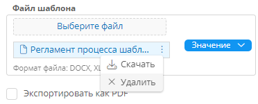

---
kbId: 5070
title: 'Построение корпоративной архитектуры. Работа с демонстрационным стендом'
tags:
    - рабочий стол Architect
    - начальная страница
    - операции на рабочем столе
hide: tags
---

# Построение корпоративной архитектуры. Работа с демонстрационным стендом {: #architect_demo_instance }

## Введение

Здесь представлено описание стенда, демонстрирующего возможности модуля «**{{ productNameArchitect }}**».

Модуль «**{{ productNameArchitect }}**» в составе **{{ productNameEnterprise }}** предоставляет инструменты для моделирования и анализа бизнес-архитектуры организаций.

На демонстрационном стенде представлены базовые элементы для создания процессной архитектуры и организационно-штатной структуры (ОШС).

Запросите доступ к демонстрационному стенду у представителя компании **{{ companyName }}**.

Этот материал ориентирован на бизнес-аналитиков, начинающих знакомство с инструментами **{{ productNameEnterprise }}**.

Рассматриваются следующие темы:

- **Введение в конструктор корпоративной архитектуры**
    - Два уровня конструктора архитектуры:
    - Процессная архитектура
    - Организационно-штатная структура (ОШС)
    - Две роли, используемые в демонстрации:
        - _Архитектор_ занимается построением процессной архитектуры и наполнением справочников
        - _Сотрудник_ занимается просмотром моделей процессов, ОШС и выполнением задач, связанных с согласованием и аудитом
- **Разделы навигации для Архитектора**
    - Управление архитектурой, оргструктура и процессная архитектура
    - Рабочий стол _Архитектора_ и области для взаимодействия с системой
- **Формирование ОШС**
    - Формирование ОШС, заполнение справочников и установление связей
    - Построение процессной архитектуры и согласование процессов
    - Области для согласования и аудита процессов
- **Анализ корпоративной архитектуры**
    - Набор дашбордов для анализа архитектуры и график динамики аудитов
- **Создание ОШС**
    - Иерархический реестр группы компаний с иерархией подразделений и должностей
    - Возможность визуализации организационных структур
- **Управление кадрами**
    - Форма для управления кадрами с данными о подразделениях и должностях
    - Формирование документов по шаблонам
- **Описание должностей**
    - Отображение юридического лица, подразделения, руководителя и требований к должности
    - Заполнение должностных обязанностей
- **Процессная архитектура**
    - Создание диаграмм бизнес-процессов и бизнес-способностей
    - Группировка процессов на разных уровнях иерархии
- **Описание процессов**
    - Карта процессов группы компаний с основными, вспомогательными и процессами управления
    - Диаграммы в нотации BPMN 20
- **Регламент процесса**
    - Формирование регламента процесса по настраиваемому шаблону
    - Описание процесса, показатели эффективности, участники и диаграммы хода выполнения
- **Согласование процессов**
    - Создание копии процесса для изменений и согласования
    - Три уровня процесса согласования: владелец процесса, куратор и руководители исполнителей
- **Исполняемый процесс согласования**
    - Исполняемая диаграмма процесса согласования
    - Предоставление комментариев
    - Повторное согласование
    - Переход процесса согласования переходит на следующий уровень при согласии всех участников
- **Согласование и аудит процессов**
    - История действий и комментарии в составе процесса согласования
    - Отправка уведомления всем исполнителям после завершения согласования
    - Смена статуса процесса на «**согласован**» и отображение кнопки назначения аудита
- **Назначение и проведение аудита**
    - Добавление нового аудита в список
    - Назначение аудитора и проведение аудита в ходе процесса аудита
    - Указание аудитором фактических значений и несоответствий
    - Завершение аудита
- **Уведомления по результатам аудита**
    - Отправка уведомления инициатору и владельцу процесса при наличии несоответствий
    - Отправка уведомления о завершении в случае успешного аудита
- **Роль Сотрудника**
    - Доступ _Сотрудника_ к архитектурным данным и процессам
    - Доступны модели процессов, структура компании, личный профиль, регламенты и должностные инструкции
    - Участие _Сотрудника_ в процессах согласования и аудита
- **Доступ к информации для Сотрудника**
    - Просмотр на рабочем столе задач и показателей по функциональным обязанностям
    - Просмотр процессной карты и групп процессов, к которым _Сотрудник_ имеет отношение
    - Ограничение доступа к информации посредством прав пользователя
    - Скачивание должностной инструкции и положения о подразделении

## Сопутствующие материалы

При работе с модулем «**{{ productNameArchitect }}**» руководствуйтесь инструкциями в следующих статьях:

- **Моделирование корпоративной архитектуры**
    - _[Построение процессной архитектуры][architect_process_architecture_design]_
        - _[Конструктор диаграмм][architect_process_architecture_diagram_designer]_
        - _[Редактирование диаграммы][architect_process_architecture_diagram_edit]_
    - _[Построение организационной структуры][architect_organizational_structure_design]_
        - _[Создание оргединицы][architect_organizational_structure_design_unit_create]_
        - _[Редактирование формы и атрибутов оргединицы][architect_organizational_structure_design_unit_configure_form_and_attributes]_
        - _[Изменение иерархии оргединиц][architect_organizational_structure_design_hierarchy_change]_
- **Использование {{ productName }}**
    - _[Рабочий стол. Использование][desktop]_
    - _[Панель навигации. Использование][navigation_panel]_
    - _[Панель и разделы навигации. Определения, настройка, удаление][navigation_sections_setup]_
    - _[Приложения. Определения, создание, настройка, администрирование, удаление][apps]_
    - _[Шаблоны. Определения, создание, настройка, перенос между приложениями, архивирование, очистка, удаление][templates]_
        - _[Шаблон записи][record_templates]_
        - _[Шаблон организационной единицы][organizational_unit_templates]_
        - _[Импорт данных в шаблон][import_data]_
        - _[Шаблоны экспорта. Определения и настройка][export_templates]_
        - _[Подготовка файла шаблона экспорта][export_template_file_configure]_
    - _[Атрибуты. Определения, типы, настройка, архивирование, удаление][attributes]_
        - _[Вычисляемые атрибуты][attribute_calculated]_
    - _[Формы. Определения, редактирование, удаление, использование списка форм][forms]_
        - _[Правила для формы. Определения, логика работы и настройка][form_rules]_
    - _[Исполняемая диаграмма процесса. Определения, просмотр, редактирование, публикация][process_diagram]_
    - _[Роли. Определения и настройка][roles]_
    - _[Аккаунты. Создание и настройка][accounts]_
    - _[Группы. Создание и настройка][groups]_

## Роль Архитектора

Запросите имя пользователя и пароль аккаунта _Архитектора_ у представителя компании **{{ companyName }}**.

_Архитектор_ занимается построением процессной архитектуры и организационно-штаной структуры (ОШС), наполнением и созданием справочников, связанных с корпоративной архитектурой:

- **ИТ-системы**
- **Физические лица**
- **Юридические лица**
- **Показатели KPI**
- **Статусы**
- **Возможные решения по согласованию**
- **Ставки должностей**
- **Бизнес-роли**

_Архитектору_ доступны следующие возможности:

- Редактирование моделей процессов.
- Согласование процессов.
- Запуск аудитов по уже согласованным моделям процессов.
- Настройка и формирование регламентов процессов, должностных инструкций, положений о подразделениях и других документов.
- Публикация моделей процессов для конечных пользователей.
- Анализ данных моделей.
- Анализ процессов по моделям (**Согласования**, **Аудиты**).

_Архитектору_ доступны следующие разделы навигации:

- **Рабочий стол** — начальная страница, отображающаяся при входе.
- **Управление архитектурой** — справочные данные и шаблоны записи, использующиеся в связанных процессах.
- **Оргструктура**, **Процессы** — реестры ОШС и бизнес-процессов.

### Использование рабочего стола Архитектора

1. Выберите пункт «**Рабочий стол**» на панели навигации.
2. Отобразятся следующие разделы:

- **С чего начать** — виджет с типовыми операциями, которые выполняет _Архитектор_:

    1. Формирование ОШС и заполнение справочников:

        - Юридические лица — заполнение информации по юридическим лицам.
        - Физические лица — создание профилей конечных пользователей с указанием мест работы (процесс будет описан далее в сценарии).
        - Ставки по должностям — формирование ставок по должностям.

    2. Построение процессной архитектуры.
    3. Заполнение справочника «**ИТ-системы**», который будет использоваться в процессах.
    4. Отслеживание согласований процессной архитектуры:

        - Справочник возможных решений по согласованию.
        - Список заявок на согласование процессов для отслеживания их статуса.
        - Список согласований, где указаны конкретные согласующие и статус их решений.

    5. Аудит процессов, после согласования процессов.

        - Проведение аудитов по уже описанному и согласованному процессу.
        - Наполнение справочников возможных показателей KPI с вариантами их измерений.

    6. Анализ архитектуры:

        - Просмотр таблиц по группам процессов, процессов, задач и ОШС с возможностью фильтрации по метаданным элементов архитектуры.

- **Быстрые действия**:
    - Плитки «**Согласовать процесс**», «**Назначить аудит**» с кнопками «**Создать**», которые позволяют:
        - создать новую заявку на согласование при внесении изменений в неисполняемый процесс;
        - создать новый аудит по одному из процессов для оценки и улучшения работы процесса в соответствии с показателями для оценки различных характеристик.
- **Отчёты** — круговые динамические диаграммы, которые отображают статистику в зависимости от периода, юридического лица и ИТ-системы:
    - **Процессы по статусам**
    - **Заявки по статусам**
    - **Аудиты по статусам**
    - Чтобы перейти к детализации данных, нажмите значение легенды или саму диаграмму.
- **Динамика аудитов** — график «**Динамика аудитов по статусам**» показывает изменения статусов аудитов с течением времени.

## Организационно-штатная структура (ОШС)

Здесь представлены следующие темы:

- Построение структуры
    - Создание иерархий подразделений, должностей и настройка их атрибутов
    - Примеры визуализации структуры и формирования связанных документов, таких как должностные инструкции
- Управление сотрудниками
    - Работа с данными сотрудников, привязка их к должностям
    - Использование справочников для обеспечения актуальности информации

### Возможности построения ОШС

В модуле «**{{ productNameArchitect }}**» предусмотрены следующие возможности построения организационно-штатной структуры (ОШС):

- Создание ОШС структуры с использованием диаграммы.
- Визуализация как оргструктур отдельных компаний, так и сложных многоуровневых оргструктур групп компаний.
- Реструктуризация ОШС.
- Расширение элементов ОШС с использованием произвольного набора атрибутов.
- Наполнение ОШС посредством импорта файлов .xlsx, .csv или интеграции с 1С по OData.
- Настройка и формирование печатных документов — должностных инструкций, положений о подразделениях и др.

### Использование демонстрационной ОШС

На демонстрационном стенде сформирован иерархический реестр подразделений и должностей в организации — ОШС, которая содержит иерархию подразделений и должностей.

Созданы справочники:

- **Юрлица** — компании, для которых мы визуализируем оргструктуру.
- **Физические лица** — сотрудники, которые могут занимать определённые должности и роли.
- **Места работы** — позволяют назначать сотрудникам должности из ОШС.

1. На панели навигации в разделе «**Оргструктура**» выберите пункт «**Группа компаний**».

    - Рассмотрите верхнеуровневую оргструктуру _Группы компаний_.
    - Рассмотрите структуру каждой из компаний: _ООО «Продажи»_ и _ООО «Склад»_.
    - Рассмотрите структуру _Единого центра управления_, который отвечает за общие процессы двух компаний.

2. Нажмите значок компании _«Единый центр управления»_, которая является дочерней оргединицей группы компаний.
3. Откроется диаграмма ОШС в контексте выбранной оргединицы.
4. Справа от диаграммы отобразится форма со следующими сведениями:

    - **Юридическое лицо** — название подразделения.
    - **Руководитель** — должность, которая выбирается вручную по указанному в подразделении юрлицу.
    - **ФИО руководителя** — вычисляется автоматически из действующих ставок (мест работ) по должности.
    - **Список сотрудников** — перечень должностей и процессов, в которых участвуют сотрудники. Заполняется автоматически по бизнес-ролям исполнителей, указанных в пользовательских задачах.

5. Нажмите значок подразделения «**Управление кадрами**».
6. Справа откроется форма, в которой отображены те же свойства, но с данными, в контексте того же юрлица по конкретному отделу.
7. Нажмите кнопку «**Положение о структурном подразделении**».
8. Браузер скачает файл `Положение о структурном подразделении «Отдел кадров».docx`.
9. Откройте скачанный файл. Назначение этого документа — регламентировать функционал структурного подразделения, а также права и обязанности его сотрудников.
10. Нажмите должность «**Рекрутер**».
11. Справа откроется форма со сведениями о выбранной должности:

    - **Юридическое лицо** — вычисляется автоматически по подразделению, к которому относится должность.
    - **Подразделение** — вычисляется автоматически по подразделению, к которому относится должность.
    - **Руководитель должности** — вычисляется автоматически по вышестоящей должности в реестре.
    - **Требования** — список необходимых требований. Заполняется вручную.
    - **Навыки** — список необходимых навыков. Заполняется вручную.
    - **Роли** — список бизнес-ролей, которым соответствует должность, с указанием задач выполняемых в процессах. Заполняется автоматически по исполнителям пользовательских задач.
    - **Сотрудники** — список сотрудников по местам работ с указанием периода занимаемой ставки. Заполняется автоматически.
    - **Обязанности** — заполняются вручную из справочника «**Обязанности**» посредством раскрывающегося списка.
    - **Ставки** — общее количество доступных ставок, свободные и занятые ставки вычисляются по действительным на текущий момент времени занимаемых ставок по должности.

12. Нажмите кнопку «**Должностная инструкция**».
13. Браузер скачает файл `Должностная инструкция «Аудитор».docx`.
14. Откройте скачанный файл. Назначение этого документа — определить, что именно сотрудник обязан делать на рабочем месте и как ему взаимодействовать с начальством и коллегами.
15. На вкладке «**Сотрудники**» выберите пункт «**Скворцова Мария Юрьевна**».
16. Отобразится только общедоступная информация о сотруднике, персональные данные скрыты от третьих лиц.

    !!! tip "Совет"

        Логику отображения любых полей и областей можно настроить с помощью простых правил для форм.

        См. _«[Правила для формы. Определения, логика работы и настройка][form_rules]»_.

17. В разделе «**Управление архитектурой**» нажмите кнопку «**Мой профиль**».

    !!! warning "Важно!"

        Чтобы сработала кнопка «**Мой профиль**» необходимо войти в аккаунт _Архитектора_.

18. Откроется форма личной карточки сотрудника с его персональными данными. В карточке сотрудника можно посмотреть текущее место работы, историю своих мест работ, ставку, информацию о руководителе.

## Процессная архитектура

Здесь представлены следующие темы:

- Основы создания диаграмм процессов
    - Ключевые принципы работы с процессной архитектурой
    - Использовании нотацию BPMN 2.0 для создания и редактирования модели процессов
- Настройка и согласование моделей
    - Согласование процессов и назначение версий
    - Проведение аудитов для оценки их эффективности
    - Обеспечение согласования всех заинтересованных сторон

### Возможности построения процессной архитектуры

В модуле «**{{ productNameArchitect }}**» предусмотрены следующие возможности построения процессной архитектуры:

- Создание диаграмм бизнес-способностей (собственная нотация разработанная BPMN-евангелистом Анатолием Белайчуком). Используя данную нотацию, можно, например, создавать процессные карты. Нотация бизнес-способностей используется для сущности «**Группы процессов**».
- Создание диаграмм бизнес-процессов в полной нотации BPMN 2.0. Данная нотация используется для сущностей «**Процессы**» и «**Подпроцессы**».
- Расширение элементов архитектуры с использованием произвольного набора атрибутов.
- Импорт диаграмм в формате `.bpmn`.
- Экспорт диаграмм в виде изображений форматах `.png` и `.svg`.
- Настройка и формирование печатного документа со спецификацией процессной архитектуры — регламент процесса

### Использование демонстрационной процессной архитектуры

На демонстрационном стенде сформирована карта процессов и описаны бизнес-способности.

В данной реализации процессы организованы на уровне _Группы компаний_, но также есть возможность произвольной группировки процессов на разных уровнях.

Целевые диаграммы бизнес-процессов располагаются в отдельной группе процессов «**Модели**», так как концептуально правильно все процессы создавать в отдельном месте в реестре, чтобы потом их можно было вариативно группировать и переиспользовать.

1. В разделе навигации «**Процессы**» нажмите группу процессов «**Процессы**».
2. Откроется карта процессов группы компаний. Все процессы организации можно разделить на основные и вспомогательные.
3. Перейдите в группу процессов «**Вспомогательные процессы**»
4. Отобразится диаграмма с указанием ассоциативных связей групп процессов и ресурсов.
5. Перейдите в группу процессов «**Развитие и управление человеческим ресурсом**».
6. Отобразится цепочка создания ценности со ссылками на процессы по управлению человеческими ресурсами.
7. Перейдите в процесс «**Управление заявками на найм персонала**».
8. Отобразится диаграмма бизнес-процесса в нотации BPMN 2.0.

### Процесс «Управление заявками на найм персонала»

1. В разделе навигации «**Управление архитектурой**» перейдите на вкладку «**Процессы**» в группу «**Кадровые**». В данной отдельной группе процессов находятся целевые диаграммы бизнес-процессов, на которые мы ссылаемся.

2. Справа откроется форма с основной информацией о группе процессов:

    - **Куратор** — в его полномочия входит руководство и управление группой процессов. Выбираем из списка должностей. Изменение куратора влияет только на процесс _согласования_ — с кем требуется согласовать.
    - **Название** — указывается вручную.
    - **Наименование** — указывается вручную.
    - **Порядковый номер** — системный атрибут для упорядочивания элементов в контексте верхнеуровневой группы процессов.

3. Перейдите к процессу «**Управление заявками на найм персонала**».
4. Справа отроется форма с информацией о процессе:

    - **Наименование** — указывается вручную.
    - **Описание** — указывается вручную
    - **Статус процесса** — вычисляется автоматически:
        - при создании процесса или версии процесса «**В работе**»;
        - при запуске процесса согласования «**На согласовании**»;
        - при успешном завершении со статусом «**Согласовано**»;
        - при неуспешном завершении со статусом «**Отклонено**».
    - **Юрлицо** — значения выбираются из справочника «**Юридические лица**» с помощью раскрывающегося списка.
    - **Владелец** — должность выбирается из списка, фильтруется по выбранному юрлицу.
    - **Используемые ИТ-системы** — перечень используемых ИТ-систем. Вычисляется по всем пользовательским задачам.
    - **Задачи процесса** — перечень задач процесса. Вычисляется по модели диаграммы процесса.
    - **Участники процесса** — перечень участвующих ролей и соответствующих им должностей.
    - **Аудиты** — история аудитов по процессу с отображением показателей KPI, по которым проводился аудит, аудитором плановой и фактической датой проведения аудита, а также текущий статус. Выбрав запись, можно перейти на форму аудита для просмотра информации о проведенном или новом аудите.
    - **Числовые KPI** — перечень числовых показателей KPI по процессу с указанием названия показателя, диапазона и плановым значением.
    - **Списочные KPI** — перечень списочных показателей KPI по процессу с указанием названия показателя, возможными и плановыми значениями.
    - **История согласований** — список истории согласования текущей версии процесса. Выбрав запись, можно перейти на форму согласования процесса для просмотра информации о ходе или результате согласования процесса.

5. Нажмите любую задачу в процессе.
6. Справа откроется форма с информацией о задаче:

    - **Наименование** — заполняется вручную.
    - **Описание** — заполняется вручную.
    - **ИТ-системы** — используемые для выполнения задачи ИТ-системы. Выбирается с помощью раскрывающегося списка из справочника «**ИТ-системы**».
    - **Исполнитель** — выбирается бизнес-роль исполнителя задачи из списка, фильтруемого по юридическому лицу процесса.
    - **Нормативный срок** — заполняется вручную.
    - **Трудоемкость** — заполняется вручную.

7. Нажмите в реестре на панели навигации троеточие рядом с названием процесса.
8. К контекстном меню выберите пункт «**Экспорт регламента**».
9. Будет сформирован регламент процесса по настроенному пользователем шаблону в формате `.docx`.
10. Файл регламента процесса будет помещён в атрибуты «**Регламент процесса DOCX**» и «**Регламент процесса PDF**». Ссылки на процессы видны конечным пользователям.
11. В разделе «**Управление архитектурой**» выберите пункты «**Администрирование**» — «**Настройки**» — «**Управление версиями**».
12. Настройте шаблон экспорта регламента процесса, который был сформирован на предыдущем шаге:

    1. Нажмите три точки <i class="fa-light fa-ellipsis-vertical"></i> у имени файла шаблона экспорта.
    2. Отобразится контекстное меню.
    3. Выберите пункт «**Скачать**».
    4. Ознакомьтесь со структурой файла шаблона экспорта.
    5. Измените шаблон экспорта согласно своим потребностям.

    !!! question "Шаблон экспорта"

        - Регламент процесса формируется по размеченному документу Word или Excel.
        - В файле шаблона экспорта указываются системные имена атрибутов процесса и элементов процесса.
        - Система подставляет значения по указанным системным именам.

        Инструкции по настройке шаблона экспорта см. в статьях _«[Шаблоны экспорта. Определения и настройка][export_templates]»_ и _«[Подготовка файла шаблона экспорта][export_template_file_configure]»_.

    __

## Версионирование, согласование и аудит моделей процессов

На демонстрационном стенде настроены связанные с неисполняемыми диаграммами процессов исполняемые процессы: _«Аудиты»_ и _«Согласования»_.

### Создание новой версии модели процесса

Для начала создадим новую версию модели процесса путём её дублирования.

После этого система изменит её статус на «**В работе**» и сменит версию.

1. Нажмите в реестре процессов справа от процесса «**Управление заявками на найм персонала**» троеточие <i class="fa-light fa-ellipsis-vertical"></i>.
2. В раскрывающемся меню выберите пункт «**Дублировать**».
3. Перейдите в копию модели и переименуйте её: замените слово «**Копия**» на «**Вер 2**».
4. Будет создана полноценная копия модели со всеми значениями атрибутов процесса и его элементов.
5. Внесите изменения в процесс.

### Согласование модели процесса

1. Чтобы перейти к согласованию процесса, нажмите кнопку «**Направить на согласование**» над диаграммой.
2. Откроется форма отправки модели на согласование.
3. Заполните **описание изменений**.
4. Нажмите кнопку «**Направить на согласование**».
5. Запустится процесс согласования модели и статус модели изменится на «**На согласовании**».
6. Перейдите на вкладку «**История согласований**». Здесь должна присутствовать запись о новом согласовании модели.
7. Выберите запись и нажмите кнопку «**Перейти**»
8. Откроется форма согласования процесса.

    !!! warning "Логика назначения исполнителя задачи согласования процесса"

        Видно, что задача согласования процесса была назначена владельцу процесса, который вычисляется следующим образом: по указанной нами должности в процессе система находит активную ставку на должность и вычисляет _Сотрудника_.

9. Перейдите к исполняемой модели процесса, нажав над диаграммой кнопку «**Мои настройки**» <i class="fa-light fa-edit"></i> и выбрав пункт «**Процессы**».
10. Откройте запущенный процесс.
11. Отобразится диаграмма исполняемого процесса, показывающая движение токена.
12. Перейдите в задачу подпроцесса.
13. Укажите **решение** «**Согласовать**».

    - Если в ходе согласования один из согласующий отклонил согласование, процесс завершается уведомлением инициирующего согласование.
    - Если согласующий выбирает «**Предоставить комментарий**» и заполняет «**Комментарий**», тогда инициатору придёт задача о необходимости предоставить комментарий согласующему. После предоставления комментарий процесс вернётся согласующему.

14. Завершите задачу. Это означает, что владелец процесса согласовал его.
15. Вернитесь на диаграмму исполняемого процесса, где видно движение токена до подпроцесса «**Согласование Куратором**».

    !!! warning "Логика определения куратора"

        Куратор определяется по указанной нами должности в группе процессов в атрибуте «**Куратор**» аналогично вычислению владельца процесса.

16. Выполните действия по согласованию аналогично действиям владельца процесса.
17. Вернитесь на диаграмму исполняемого процесса.

    !!! warning "Логика определения руководителей"

        Видно, что согласование перешло на руководителей исполнителей, которые вычисляются следующим образом: у задачи есть атрибут «**Исполнитель**», где мы указываем бизнес-роль, она в свою очередь связана с должностями, у должностей есть подразделения, а у подразделения руководитель, вычисляется сотрудник, занимающий её на момент запуска процесса, и получает задачу на согласование процесса.

18. Выполните действия по согласованию аналогично действиям _Куратора_.
19. Вернитесь на одну страницу назад к форме заявки на согласование.
20. Завершите процесс.
21. Система направит уведомление исполнителям процесса с информацией о том, что им необходимо работать по новой версии процесса.
22. Нажмите на форме гиперссылку «**Управление заявками на найм персонала (Вер 2)**».
23. Отобразится форма с информацией о том, что после успешного согласования процесса статус процесса изменился на «**Согласовано**», а значение «**Версия процесса**» округлилось.
24. Будут скрыты кнопки «**Редактировать**» и «**Направить на согласование**».
25. Появится кнопка «**Назначить аудит**».

### Публикация модели процесса

1. Перейдите в группу «**2.4 Развитие и управление человеческим ресурсом**».
2. Нажмите кнопку «**Редактировать**».
3. Чтобы опубликовать новую версию модели для конечных пользователей, перейдите на диаграмму бизнес-способностей, в которой она используется.
4. Нажмите элемент «**Управление заявками на найм персонала**».
5. Появится контекстное меню элемента.
6. Нажмите кнопку «**Свойства**», выберите пункт «**Управление заявками на найм персонала (Вер 2)**» и нажмите кнопку «**Сохранить**».
7. Модель станет доступна для просмотра конечным пользователям. Информация, которую видят пользователи, будет показана далее.

### Аудиты

Проведение аудита возможно только по согласованным моделям процесса.

1. Перейдите на согласованный в параграфе «**[Создание пользователей и привязка к физлицам](#создание-пользователей-и-привязка-к-физлицам)**» процесс «**Управление заявками на найм персонала (Вер 2)**».
2. Чтобы инициировать _Аудит_, помимо согласованной модели процесса заполните вкладки «**Числовые KPI**» и «**Списочные KPI**» у модели процесса, по которой мы хотим провести аудит, так как после согласования редактировать данные модели будет невозможно.

#### Добавление KPI для аудита

Чтобы дополнить набор KPI, по которым необходимо провести аудит уже согласованной модели, выполните следующее:

1. В разделе навигации «**Управление архитектурой**» выберите пункты «**Данные**» — «**Контрольные данные**» — «**KPI**».
2. Нажмите кнопку «**Плановые KPI**».
3. Отобразятся все плановые KPI по всем процессам, в таблице «**Фактические KPI**», где перечислены все фактические KPI по всем процессам по проведенным аудитам.
4. Нажмите кнопку «**Создать**».
5. Откроется форма создания показателя KPI. Поля «**Процесс**» и «**Вариант измерений**» являются обязательными полями для заполнения.
6. Выберите пункты «**Процесс**» — «**Управление заявками на найм персонала (Вер 2)**» и «**Вариант измерений**» — «**Список значений**»
7. Появится область для заполнения сведений о списочном показателе KPI.
8. Выберите любой «**Показатель**».
9. Появится поле «**Возможные значения**».
10. Выберите несколько значений в поле «**Возможные значения**».
11. Появится область «**Плановое значение**».
12. Выберите 2 значения в поле «**Плановое значение**». Мы выбрали возможные значения для указанного процесса по выбранному показателю KPI.
13. Нажмите кнопку «**Сохранить**».
14. Перейдите в процесс «**Управление заявка на найм персонала (Вер 2)**».
15. Откройте вкладку «**Списочные KPI**». Мы создали списочный показатель KPI для процесса с возможными и плановыми значениями.
16. Нажмите кнопку «**Назначить аудит»**.
17. Появится диалоговое окно, где выбран процесс, отображены его описание и показатели по которым будет проводиться аудит.
18. Снова нажмите кнопку «**Назначить аудит**».
19. На панели навигации выберите пункты «**Управление архитектурой**» — «**Данные**» — «**Контрольные данные**».

#### Проведение аудита

1. Нажмите кнопку «**Аудиты**».
2. Отобразится последний созданный аудит по процессу «**Управление заявка на найм персонала**».
4. Перейдите на форму записи двойным нажатием.
5. Отобразится конечная форма записи по аудиту, которая будет наполняться по ходу процесса «**Проведение аудита**».
6. Перейдите в процесс, связанный с записью. Для этого перейдите к исполняемой модели процесса, нажав над диаграммой кнопку «**Мои настройки**» <i class="fa-light fa-edit"></i> и выбрав пункт «**Процессы**».
7. Откройте запущенный процесс.
8. Отобразится диаграмма исполняемого процесса, показывающая движение токена, остановившегося на задаче «**Назначить аудитора**».

    !!! warning "Логика определения исполнителя задачи по выбору аудитора"

        Эта задача назначается на _Сотрудника_, занимающего должность **Главного аудитора** из нашей ОШС. 
        
        Система вычисляет активную ставку по должности «**Главный аудитор**» и назначает привязанный к физлицу аккаунт исполнителем задачи.

9. Откройте задачу «**Назначить аудитора**».
10. Отобразится форма записи аудита.
11. Выберите в поле «**Аудитор**» любого сотрудника. Список сотрудников фильтруется по отделу «**Аудит**».
12. Нажмите кнопку «**Завершить задачу**».
13. Вернитесь на диаграмму процесса.

    !!! warning "Логика назначения задачи выбранному аудитору"

        Видно, что процесс пошел дальше и остановился на задаче «**Провести аудит**», исполнителем которой является аккаунт, который мы выбрали раннее.

14. Откройте задачу «**Провести аудит**».
15. Отобразится форма записи аудита и с колонками с фактическими значениями. Аудитор должен заполнить форму и прикрепить отчёт.
16. Выберите вкладку «**Несоответствия**».

    !!! warning "Логика указания несоответствий"

        При выявлении аудитором несоответствий он может их указать во вкладке «**Несоответствия**», в таком случае владельцу процесса по завершению процесса придет уведомление о завершении процесса с выявленными несоответствиями.

17. Укажите фактические значения. В одном из числовых показателей укажите значение большее, чем значение «**До**».
18. Завершите задачу.

    !!! warning "Логика контроля значений KPI"

        Если аудитор ввёл значение вне диапазона показателя KPI, система выделит поле и отобразит пуш-уведомление пользователю.
        
        Можно настроить любую логику ошибок.

19. Укажите значение, входящее в допустимый диапазон, прикрепите файл в поле «**Отчет**».
20. Завершите задачу.
21. На этом этапе **Аудитор** провел аудит и прикрепил отчёт, процесс **Аудита** завершён.
22. На панели навигации выберите пункты «**Управление архитектурой**» — «**Данные**» — «**Контрольные данные**».
23. Нажмите кнопку «**Аудиты**».
24. Откройте форму записи завершённого только что аудита.
25. Мы провели аудит процесса по показателям KPI, по окончанию которого было направлено уведомление владельцу процесса.
26. Выберите вкладку «**Уведомления**» и просмотрите своё уведомление.

# Роль Сотрудника

Запросите имя пользователя и пароль аккаунта _Сотрудника_ у представителя компании **{{ companyName }}**.

_Сотрудник_ — это роль для конечных пользователей системы, у которых доступ на чтение только к относящимся к нему архитектурным данным._

_Сотруднику_ доступны следующие возможности:

- Просмотр моделей процессов, в которых он является участником.
- Просмотр собственной организационной структуры компании — от своей должности, до самого верхнего уровня.
- Просмотр и заполнение личного профиля.
- Скачивание регламента бизнес-процессов, в которых сотрудник участвует, для ознакомления.
- Скачивание своей должностной инструкции.
- Скачивание положения о своем подразделении.
- Участие в процессах согласования и аудитах, если сотрудник занимает участвующую в данных процессах должность.

## Рабочий стол

_Сотруднику_ доступны следующие разделы навигации:

- **Рабочий стол** — начальная страница, отображающаяся при входе.
- **Сотрудник**
    - **Телефонный справочник** — справочник физических лиц.
    - **Мой профиль** — карточка личного профиля.
    - **Моя оргструктура**, **Мои процессы** — отображается организационно-штатная структура сотрудника и процессы, в которых он участвует.

1. Выберите пункт «**Рабочий стол**».
2. Отобразятся следующие разделы:

    - **Работа** — содержит два показателя:
        - Функциональные обязанности, вычисляется количество задач в которых _Сотрудник_ участвует. При нажатии пользователь может просмотреть подробную информацию по задачам, в которых он участвует.
        - **Мои процессы** — количество процессов, в которых участвует сотрудник. Нажав показатель, можно просмотреть подробную информацию по процессам, в которых участвует сотрудник.
    - **Мои задачи** — задачи _Сотрудника_ по исполняемым процессам «**Согласование**» и «**Аудит**», участником которых он является.

## Использование реестра процессов

1. На рабочем столе в разделе «**Мои процессы**» выберите процесс «**Управление сведениями о кандидате**».
2. Справа откроется форма с информацией о процессе. _Сотрудник_ может только просматривать информацию.
3. Нажмите файл в поле «**Регламент в PDF**».
4. Браузер скачает регламент процесса, с которым _Сотрудник_ может ознакомиться, чтобы понять, как устроен процесс и какие сотрудники в нём участвуют.

## Использование реестра ОШС

1. На панели навигации в разделе «**Моя оргструктура**» выберите пункт «**Единый центр управления**».
2. Отобразится оргструктура всей компании, к которой относится _Сотрудник_. Просматривать информацию _Сотрудник_ может только об оргединицах, которые прямо или косвенно связаны с его должностью (снизу-вверх).
3. Нажмите кнопку «**Положение о подразделении**».
4. Браузер скачает положение о структурном подразделении, чтобы _Сотрудник_ мог ознакомиться с порядком деятельности своей компании или своего отдела.
5. Выберите оргединицу «**Кадровик**».
6. Отобразится информация о должности _Сотрудника_.
7. Нажмите кнопку «**Должностная инструкция**».
8. Браузер скачает должностную инструкцию _Сотрудника_.

# Создание пользователей и привязка к физлицам

Создадим пользователя с привязкой к карточке физического лица.

1. На панели навигации выберите пункты «**Данные**» — «**Справочники**» — «**Пользователи**».
2. Отобразится список всех пользователей приложения.
3. Нажмите кнопку «**Создать**».
4. Откроется форма создания аккаунта.
5. Введите **Ф. И. О.**, **имя пользователя**, **пароль** и **адрес эл. почты** (**запомните адрес эл. почты!**).
6. Нажмите кнопку «**Создать**».
7. Будет создан аккаунт пользователя, который можно использовать для входа в систему.
8. На панели навигации выберите пункты «**Администрирование**» — «**Настройки**» — «**Группы**».
9. Откройте группу «**Сотрудники**».
10. Добавьте из левого списка в правый только что созданный аккаунт.
11. На этом этапе мы привязали новый аккаунт в группе. Группа в свою очередь состоит в роли (_Сотрудник_), в которой указаны разрешения для разграничения доступа.
12. На панели навигации выберите пункты «**Управление архитектурой**» — «**Данные**» — «**Справочники**» — «**Физические лица**».
13. Нажмите кнопку «**Создать**».
14. Заполнить поля любыми данными, указав **тот же адрес эл. почты**, что и при создании аккаунта. Система привяжет карточку физического лица по совпадающему адресу эл. почты.
15. Нажмите кнопку «**Сохранить**»
16. Теперь мы создали аккаунт, предоставили ему доступ в рамках роли _Сотрудник_ и сформировали карточку физического лица, которая будет привязана к аккаунту посредством адреса эл. почты.

## Заключение

Модуль «**{{ productNameArchitect }}**» позволяет бизнес-аналитикам структурировать процессы и организационную структуру предприятия, что способствует эффективному управлению и анализу.

Демонстрационный стенд дает общее представление о возможностях **{{ productName }}** и служит отправной точкой для более глубокого изучения продукта.

--8<-- "related_topics_heading.md"

- _[Построение процессной архитектуры][architect_process_architecture_design]_
- _[Конструктор диаграмм][architect_process_architecture_diagram_designer]_
- _[Редактирование диаграммы][architect_process_architecture_diagram_edit]_
- _[Построение организационной структуры][architect_organizational_structure_design]_
- _[Создание оргединицы][architect_organizational_structure_design_unit_create]_
- _[Редактирование формы и атрибутов оргединицы][architect_organizational_structure_design_unit_configure_form_and_attributes]_
- _[Изменение иерархии оргединиц][architect_organizational_structure_design_hierarchy_change]_
- _[Рабочий стол. Использование][desktop]_
- _[Панель навигации. Использование][navigation_panel]_
- _[Панель и разделы навигации. Определения, настройка, удаление][navigation_sections_setup]_
- _[Приложения. Определения, создание, настройка, администрирование, удаление][apps]_
- _[Шаблоны. Определения, создание, настройка, перенос между приложениями, архивирование, очистка, удаление][templates]_
- _[Шаблон записи][record_templates]_
- _[Шаблон организационной единицы][organizational_unit_templates]_
- _[Импорт данных в шаблон][import_data]_
- _[Шаблоны экспорта. Определения и настройка][export_templates]_
- _[Подготовка файла шаблона экспорта][export_template_file_configure]_
- _[Атрибуты. Определения, типы, настройка, архивирование, удаление][attributes]_
- _[Вычисляемые атрибуты][attribute_calculated]_
- _[Формы. Определения, редактирование, удаление, использование списка форм][forms]_
- _[Правила для формы. Определения, логика работы и настройка][form_rules]_
- _[Исполняемая диаграмма процесса. Определения, просмотр, редактирование, публикация][process_diagram]_
- _[Роли. Определения и настройка][roles]_
- _[Аккаунты. Создание и настройка][accounts]_
- _[Группы. Создание и настройка][groups]_


