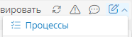

---
kbId: 
title: Моделирование корпоративной архитектуры. Описание демонстрационного стенда

tags:
    - рабочий стол Architect
    - начальная страница
    - операции на рабочем столе
hide: tags
---

# Моделирование корпоративной архитектуры. Описание демонстрационного стенда

## Введение

Здесь представлено описание стенда, демонстрирующего возможности модуля «**{{ productNameArchitect }}**».

Модуль «**{{ productNameArchitect }}**» в составе **{{ productNameEnterprise }}** предоставляет инструменты для моделирования и анализа бизнес-архитектуры организаций.

На демонстрационном стенде представлены базовые элементы для создания процессной архитектуры и организационно-штатной структуры (ОШС).

Этот материал ориентирован на бизнес-аналитиков, начинающих знакомство с инструментами **{{ productNameEnterprise }}**.

Рассматриваются следующие темы:

- **Введение в конструктор корпоративной архитектуры**
    - Два уровня конструктора архитектуры:
    - Процессная архитектура
    - Организационно-штатная структура (ОШС)
    - Две роли, используемые в демонстрации:
    - _Архитектор_ занимается построением процессной архитектуры и наполнением справочников
    - _Сотрудник_ занимается просмотром моделей процессов, ОШС и выполнением задач, связанных с согласованием и аудитом
- **Разделы навигации для Архитектора**
    - Управление архитектурой, оргструктура и процессная архитектура
    - Рабочий стол _Архитектора_ и области для взаимодействия с системой
- **Формирование ОШС**
    - Формирование ОШС, заполнение справочников и установление связей
    - Построение процессной архитектуры и согласование процессов
    - Области для согласования и аудита процессов
- **Анализ корпоративной архитектуры**
    - Набор дашбордов для анализа архитектуры и график динамики аудитов
- **Создание ОШС**
    - Иерархический реестр группы компаний с иерархией подразделений и должностей
    - Возможность визуализации организационных структур
- **Управление кадрами**
    - Форма для управления кадрами с данными о подразделениях и должностях
    - Формирование документов по шаблонам
- **Описание должностей**
    - Отображение юридического лица, подразделения, руководителя и требований к должности
    - Заполнение должностных обязанностей
- **Процессная архитектура**
    - Создание диаграмм бизнес-процессов и бизнес-способностей
    - Группировка процессов на разных уровнях иерархии
- **Описание процессов**
    - Карта процессов группы компаний с основными, вспомогательными и процессами управления
    - Диаграммы в нотации BPMN 20
- **Регламент процесса**
    - Формирование регламента процесса по настраиваемому шаблону
    - Описание процесса, показатели эффективности, участники и диаграммы хода выполнения
- **Согласование процессов**
    - Создание копии процесса для изменений и согласования
    - Три уровня процесса согласования: владелец процесса, куратор и руководители исполнителей
- **Исполняемый процесс согласования**
    - Исполняемая диаграмма процесса согласования
    - Предоставление комментариев
    - Повторное согласование
    - Переход процесса согласования переходит на следующий уровень при согласии всех участников
- **Согласование и аудит процессов**
    - История действий и комментарии в составе процесса согласования
    - Отправка уведомления всем исполнителям после завершения согласования
    - Смена статуса процесса на «согласован» и отображение кнопки назначения аудита
- **Назначение и проведение аудита**
    - Добавление нового аудита в список
    - Назначение аудитора и проведение аудита в ходе процесса аудита
    - Указание аудитором фактических значений и несоответствий
    - Завершение аудита
- **Уведомления по результатам аудита**
    - Отправка уведомления инициатору и владельцу процесса при наличии несоответствий
    - Отправка уведомления о завершении в случае успешного аудита
- **Роль Сотрудника**
    - Доступ _Сотрудника_ к архитектурным данным и процессам
    - Доступны модели процессов, структура компании, личный профиль, регламенты и должностные инструкции
    - Участие _Сотрудника_ в процессах согласования и аудита
- **Доступ к информации для Сотрудника**
    - Просмотр на рабочем столе задач и показателей по функциональным обязанностям
    - Просмотр процессной карты и групп процессов, к которым _Сотрудник_ имеет отношение
    - Ограничение доступа к информации посредством прав пользователя
    - Скачивание должностной инструкции и положения о подразделении

## Видеопрезентация

Прежде чем изучать данный материал, ознакомьтесь с демонстрационным видеороликом, представленным ниже.

<video controls="controls" width="100%" height="100%">
<source src="https://kb.comindware.ru/platform/v5.0/architect/img/architect_demo.mp4" type="video/mp4" />
</video>

## Сопутствующие материалы

При работе с модулем «**{{ productNameArchitect }}**» руководствуйтесь инструкциями в следующих статьях:

- **Моделирование корпоративной архитектуры**
    - _[Построение процессной архитектуры][architect_process_architecture_modelling]_
        - _[Конструктор диаграмм][architect_process_diagram_designer]_
        - _[Редактирование диаграммы][architect_edit_diagram]_
    - _[Построение организационной структуры][architect_organizational_structure_modelling]_
        - _[Создание оргединицы][architect_creating_organizational_unit]_
        - _[Редактирование формы и атрибутов оргединицы][architect_configuring_organizational_unit_form_and_attributes]_
        - _[Изменение иерархии оргединиц][architect_changing_hierarchy]_
- **Использование {{ productName }}**
    - _[Панель навигации. Использование][navigation_panel]_
    - _[Приложения. Определения, создание, настройка, администрирование, удаление][apps]_
    - _[Панель и разделы навигации. Определения, настройка, удаление][navigation_sections_setup]_
    - _[Шаблоны. Определения, создание, настройка, перенос между приложениями, архивирование, очистка, удаление][templates]_
        - _[Шаблон записи][record_templates]_
        - _[Шаблон организационной единицы][organizational_unit_templates]_
        - _[Импорт данных в шаблон][import_data]_
    - _[Атрибуты. Определения, типы, настройка, архивирование, удаление][attributes]_
        - _[Вычисляемые атрибуты][attribute_calculated]_
    - _[Формы. Определения, редактирование, удаление, использование списка форм][forms]_
        - _[Правила для формы. Определения, логика работы и настройка][form_rules]_

## Роль Архитектора

Запросите имя пользователя и пароль аккаунта **Архитектора** у представителя компании **{{ companyName }}**.

_Архитектор_ – это роль, которая занимается построением процессной архитектуры и ОШС, наполнением, связанным с корпоративной архитектурой справочников:

- ИТ-системы;
- Физические лица;
- Юридические лица;
- Показатели KPI;
- Статусы;
- Возможные решения по согласованию;
- Ставки должностей
- Бизнес-роли;
- И, при необходимости, создания своих собственных справочников.

_Архитектору_ доступны следующие возможности:

- Редактирование моделей процессов
- Согласование процессов
- Запуск аудитов по уже согласованным моделям процессов
- Настройка и формирование регламентов процесса, должностных инструкций, положений о подразделении и других документов
- Публикация моделей процессов для конечных пользователей
- Анализ данных моделей
- Анализ процессов по моделям (Согласования, Аудиты)

_Архитектору_ доступны следующие разделы навигации: «Управление архитектурой», _где находятся справочные данные и шаблоны записи, использующиеся в связанных процессах_. «Оргструктура», «Процессы», _в этих разделах отображаются реестры организационно-штатной структуры и процессов соответственно._

Нажать на **Рабочий стол,** где находятся:

- В разделе «С чего начать?» находится виджет с 5-ю шагами:
    - Первым шагом является формирование организационно-штатной структуры и заполнение справочников:
    - Юридические лица – заполнение информации по юридическим лицам
    - Физические лица – создание профилей конечных пользователей с указанием мест работы (процесс будет описан далее в сценарии)
    - Ставки по должностям – формирование ставок по должностям
    - Вторым шагом является построение процессной архитектуры и заполнение справочника «ИТ-системы», которые будут использоваться в процессах
    - Третий шаг – это отслеживание согласований процессной архитектуры:
    - Справочник возможных решений по согласованию
    - Список заявок на согласование процессов для отслеживания их статуса
    - Список согласований, где указаны конкретные согласующие и статус их решений
    - Четвертый шаг – аудиты процессов, после согласования процессов, предоставляется возможность проведения аудитов по уже описанному и согласованному процессу (более подробно будет рассказано далее в сценарии), здесь:
    - Наполняем справочник возможных показателей KPI с вариантами их измерений
    - Пятый шаг – анализ архитектуры:
    - Просмотр таблиц по группам процессов, процессов, задач и ОШС с возможностью фильтровать по метаданным элементов архитектуры
- В разделе «Быстрые действия» плитки «Согласовать процесс», «Назначить аудит» с кнопками «Создать», которые позволяют:
    - создать новую заявку на согласование при внесении изменений в неисполняемый процесс,
    - создать новый аудит по одному из процессов для оценки и улучшения работы процесса в соответствии с показателями для оценки различных характеристик.
- В разделе «Отчёты» находятся круговые динамические диаграммы, которые отображают статистику в зависимости от периода, Юр. Лица и ИТ-системы:
    - «Процессы по статусам»
    - «Заявки по статусам»
    - «Аудиты по статусам»

Также доступна детализация данных, на которую можно перейти, кликнув на значение легенды или на саму диаграмму

- В разделе «Динамика аудитов» находится график «Динамика аудитов по статусам», где можно увидеть, как изменялись статусы аудитов с течением времени

## ОШС

Здесь представлены следующие темы:

- Построение структуры
    - Создание иерархий подразделений, должностей и настройка их атрибутов.
    - Примеры визуализации структуры и формирования связанных документов, таких как должностные инструкции.
- Управление сотрудниками
    - Работа с данными сотрудников, привязка их к должностям
    - Использование справочников для обеспечения актуальности информации.

### Функционал ОШС

В текущей версии модуля «**{{ productNameArchitect }}**» доступен функционал для создания организационно-штатной структуры, есть возможность:

- Создания организационно-штатной структуры используя диаграмму с возможностью реструктуризации
- Расширять с использованием произвольного набора атрибутов элементы организационной структуры
- Наполнять оргструктуру импортируя файлы .xlsx, .csv, а также используя интеграцию 1С по OData
- Настройка и формирование печатного документа – должностная инструкция, положение о подразделении и др.

### Демо ОШС

Был сформирован иерархический реестр подразделений и должностей в организации — организационно-штатную структуру, которая содержит иерархию подразделений и должностей, а также возможность визуализации как организационных структур отдельных компаний, так и сложные многоуровневые организационные структуры групп компаний

Также созданы справочники: Юр. Лица – компании, для которых визуализируем структуру, Физические лица – то есть_Сотрудники_, которые могут занимать определенные должности и роли, а также их Места работы, которые отвечают за занятие _Сотрудниками_ должностей из ОШС.

- В разделе навигации на вкладке «Оргструктура» нажать на «**Группу компаний**»,
    - Можем рассмотреть верхнеуровневую организационную структуру Группы компаний, также рассмотреть структуру каждой из компаний: ООО Продажи и ООО Склад, а также Единый центр управления, который отвечает за общие процессы двух компаний.
- Нажать на иконку компании **«Единый центр управления»,** которая ниже по уровню от группы компаний, открывается диаграмма ОШС в контексте выбранной оргединицы, справа открывается форма, где указано:
    - Юридическое лицо, название подразделения,
    - Руководитель – должность, которая выбирается вручную по указанному в подразделении юр.лицу,
    - ФИО руководителя – вычисляется автоматически из действующих ставок (мест работ) по должности.
    - Список _Сотрудников_, с указанием их должности и процессов, в которых они участвуют – вычисляется автоматически по бизнес-ролям, указанных в пользовательских задачах как исполнитель
- Нажать на иконку подразделения «**Управление кадрами**», справа открывается форма, в которой отображены те же свойства, но с данными, в контексте того же юр лица по конкретному отделу:
    - Нажать на кнопку «**Положение о структурном подразделении**», открыть загруженный документ, цель которого – регламентировать функционал структурного подразделения, а также права и обязанности его _Сотрудников_.
- Нажать на должность «**Рекрутер»,** справа открывается форма, где отображается информация по выбранной должности:
    - Юридическое лицо – вычисляется автоматически по подразделению, в котором находится должность
    - Подразделение - вычисляется автоматически по подразделению, в котором находится должность
    - Руководитель должности – вычисляется автоматически по вышестоящей должности в реестре
    - Требования – заполняется вручную, список необходимых требований
    - Навыки – заполняется вручную, список необходимых навыков
    - На вкладке «**Роли**» - список бизнес-ролей, которым соответствует должность, с указанием задач выполняемых в процессах. Вычисляется автоматически по исполнителям пользовательских задач.
    - На вкладке «**Сотрудники**» - вычисляется автоматически список _Сотрудников_ по местам работ с указанием периода занимаемой ставки
    - На вкладке «**Обязанности**» - заполняется вручную посредством выпадающего списка – справочник «Обязанности»
    - На вкладке «**Ставки**» - указывается общее количество доступных ставок, свободные и занятые ставки вычисляются по действительным на текущий момент времени занимаемых ставок по должности
- Нажать на кнопку «**Должностная инструкция**», открыть загруженный документ, Назначение должностной инструкции — определить, что именно работник обязан делать на рабочем месте и как ему взаимодействовать с начальством и коллегами.
- На вкладке «**Сотрудники**» кликнуть на «Скорцова Мария Юрьевна», где отобразиться только общедоступная информация о _Сотруднике_, персональные данные скрыты от 3-их лиц. Логику отображения любых полей и областей можно настроить простыми правилами для форм._
- Нажать в разделе «Управление архитектурой» кнопку «Мой профиль»,

ВАЖНО: Чтобы отработала кнопка необходимо быть авторизованным под пользователем goncharova C0m1ndw4r3Pl@tf0rm

_,откроется форма личной карточки _Сотрудника_ с его персональными данными, где он может посмотреть текущее место работы, историю своих мест работ, ставку, информацию о руководителе._

## Процессы

Здесь представлены следующие темы:

- Основы создания диаграмм процессов
    - Ключевые принципы работы с процессной архитектурой.
    - Использовании нотацию BPMN 2.0 для создания и редактирования модели процессов.
- Настройка и согласование моделей
    - Согласование процессов и назначение версий.
    - Проведение аудитов для оценки их эффективности.
    - Обеспечение согласования всех заинтересованных сторон.

### Функционал процессной архитектуры

В текущей версии модуля Архитект доступен функционал для создания процессной архитектуры, есть возможность:

- Создавать диаграммы бизнес-способностей (собственная нотация разработанная BPMN-евангелистом Анатолием Белайчуком), также используя данную нотацию можно создавать процессные карты. Данная нотация используется для сущности Группы процессов
- Создавать диаграммы бизнес-процессов в полной нотации BPMN 2.0. Данная нотация используется для сущности Процессы, Подпроцессы.
- Расширять с использованием произвольного набора атрибутов элементы архитектуры
- Импортирование диаграмм в формате: .bpmn
- Экспорт диаграмм как картинок в форматы: .png, .svg
- Настройка и формирование печатного документа со спецификацией процессной архитектуры – регламент процесса

### Демо Процессная архитектура

_Была сформирована карта процессов и описаны бизнес-способности. В данной реализации процессы организованы на уровне Группы компаний, но также есть возможность произвольной группировки процессов на разных уровнях._

- В разделе навигации на вкладке «Процессы» нажимаем на группу процессов «**Процессы**»
    - _где отображена карта процессов группы компаний. Все процессы организации можно разделить на основные и вспомогательные._
- Переходим в группу процессов «**Вспомогательные процессы**»
    - _где отрисована диаграмма с указанием ассоциативных связей групп процессов и ресурсов_
- Переходим в группу процессов «**Развитие и управление человеческим ресурсом**»
    - _где отрисована цепочка создания ценности и указаны ссылки на процессы по управлению человеческим ресурсом_
- В данной диаграмме переходим на процесс «**Управление заявками на найм персонала**»
    - _где отображена диаграмма бизнес-процесса_

_Конечные диаграммы бизнес-процессов располагаются в отдельной группе процессов **«Модели»**, так как концептуально правильно все процессы создавать в отдельном месте в реестре, чтобы потом их можно было вариативно группировать и переиспользовать._

### Процесс «Управление заявками на найм персонала»

- В разделе навигации «Управление архитектурой» переходим на вкладку «Процессы» в группу «Кадровые», _где в данной отдельной группе процессов находятся конечные диаграммы бизнес-процессов, на которые мы ссылаемся. Справа открылась форма, на которой указана основная информация о группе процессов:_
    - Куратор, _в чьи полномочия входит руководство и управление группой процессов –_ _выбирается из списка должностей (изменение куратора влияет только на процесс Согласования, с кем согласовывать)_
    - Название – _указывается вручную_
    - Наименование – _указывается вручную_
    - Порядковый номер – _системный атрибут для управления упорядоченности в контексте верхнеуровневой группы процессов._
- Перейти в процесс «Управление заявками на найм персонала», _справа отрылась форма, на которой отображена информация о процессе:_
    - Наименование – _указывается вручную_
    - Описание – _указывается вручную_
    - Статус процесса – _вычисляемый атрибут,_
    - _при создании процесса или версии процесса «В работе»,_
    - _при запуске процесса согласования «На согласовании»_
      - _при успешном завершении «Согласовано»,_
      - _при неуспешном «Отклонено»,_
    - Юр. Лицо – _выбор значений из списка справочника «Юридические лица»_
    - Владелец – _выбор должности из списка, фильтруется по выбранному юр.лицу_
    - Используемые ИТ-системы – _перечень используемых ИТ-систем, вычисляется по всем пользовательским задачам_
    - Задачи процесса – _перечень задач процесса, вычисляется по модели диаграммы процесса_
    - Участники процесса – _перечень участвующих ролей и соответствующих им должностей_
    - Вкладка «Аудиты» - _история аудитов по процессу с отображением показателей KPI, по которым проводился аудит, аудитором плановой и фактической датой проведения аудита, а также текущий статус. При выборе записи можно перейти на форму аудита для просмотра информации о проведенном или новом аудите._
    - Вкладка «Числовые KPI» - _перечень числовых показателей KPI по процессу с указанием названия показателя, диапазона и плановым значением._
    - Вкладка «Списочные KPI» - _перечень списочных показателей KPI по процессу с указанием названия показателя, возможными и плановыми значениями_
    - История согласований – _список истории согласования текущей версии процесса. При выборе записи можно перейти на форму согласования процесса для просмотра информации о том, как прошло или проходит согласование процесса._
- Нажать на любую задачу в процессе, _справа на форме отображена информация о задаче_:
    - Наименование – _заполняется вручную_
    - Описание – _заполняется вручную_
    - ИТ-системы – _используемые для выполнения задачи ИТ-системы, выбирается из списка. Справочник «ИТ-системы»_
    - Исполнитель – _выбирается бизнес-роль исполнителя задачи из списка, фильтруемого по юридическому лицу процесса_
    - Нормативный срок – _заполняется вручную_
    - Трудоемкость – _заполняется вручную_
- Нажать в реестре (в общем списке слева) рядом с процессом на три точки   и выбрать кнопку «Экспорт регламента», _это кнопка выгружает регламент процесса по настроенному пользователем шаблону в формате .docx, также при выгрузке система подкладывает выходной файл в системные атрибуты «Регламент процесса DOCX» и «Регламент процесса PDF», он у нас используется в ссылках на процессы, которые отображаются конечным пользователям._
- Перейти в раздел «Управление архитектурой» в папку «Администрирование» => «Настройки» => «Управление версиями», _где настраивается шаблон экспорта регламента процесса, который был сформирован на предыдущем шаге._
    - Нажать на три точки у файла шаблона и нажать «Скачать», открыть шаблон экспорта 
    - _Регламент процесса формируется по размеченному документу Word, также можно использовать документ Excel. В шаблоне указываются системные имена атрибутов процесса, элементов процесса, а система подставляет значения по указанной в шаблоне атрибутике._

## Версионирование моделей, согласование, аудиты

_Были настроены связанные с неисполняемой частью процессов исполняемые процессы: Аудиты и Согласования._

### Версионирование + Согласование + Публикация

_Для начала создадим новую версию модели путем копирования модели, прикладные настройки системы изменят ее статус на «В работе» и изменят версию._

- Нажать в реестре процессов справа от процесса «Управление заявками на найм персонала» на три точки  и выбрать кнопку «Дублировать», перейти в копию модели и переименовать изменив слово «Копия» на «Вер 2», _таким образом создалась полноценная копия модели со всеми значениями атрибутов процесса и его элементов, допустим мы внесли какие-то изменения и хотим согласовать процесс._
- Нажать в тулбаре диаграммы «Направить на согласование», _при нажатии которой, откроется форма отправки модели на согласование._
    - Заполнить «Описание изменений» и нажать «Направить на согласование», _запуститься процесс согласования модели и измениться статус модели «На согласовании»_
- Перейти на вкладку «История согласований», _где появилась запись о новом согласовании модели._
- Выбрать запись и нажать кнопку «Перейти», _откроется форма согласования процесса, видим что задача на согласование процесса была назначена владельцу процесса, который вычисляется следующим образом -  по указанной нами должности в процессе система находит активную ставку на должность и вычисляет _Сотрудника_._
- В тулбаре сверху перейти в исполняемую модель процесса  провалиться в активную запись, _где мы видим движение токена исполняемого процесса._
- Перейти в задачу подпроцесса и указать в «Решении» - «Согласовать».
    - _В случае, если в ходе согласования один из согласующий отклонил согласование, процесс завершается уведомлением инициирующего согласование._
    - _В случае, когда согласующий выбирает «Предоставить комментарий» и заполняет «Комментарий», тогда инициатору придет задача о необходимости предоставить комментарий согласующему, после предоставления процесс вернется согласующему._
- Завершить задачу, _владелец процесса согласовал процесс._
- Вернуться на диаграмму исполняемого процесса, _где видно движение токена до подпроцесса «Согласование Куратором», который вычисляется по указанной нами должности в группе процессов в атрибуте «Куратор», вычисление то же, что и у владельца процесса._ Произвести те же действия.
- Вернуться на диаграмму исполняемого процесса, _где видно, что согласование перешло на руководителей исполнителей, которые вычисляются следующим образом: у задачи есть атрибут «Исполнитель», где мы указываем бизнес-роль, она в свою очередь связана с должностями, у должностей есть подразделения, а у подразделения руководитель, вычисляется _Сотрудник_, занимающий ее на момент запуска процесса, и получает задачу на согласование процесса._ Произвести те же действия
- Вернуться на одну страницу назад на форму заявки на согласование, _по завершению процесса система направит уведомление исполнителям процесса с информацией о том, что им необходимо работать по новой версии процесса._
- Нажать на форме на гиперссылку «Управление заявками на найм персонала (Вер 2)», _где видно, что после успешного согласования процесса статус процесса изменился на «Согласовано», а значение «Версия процесса» округлилось. Также перестали быть доступны кнопки «Редактировать» и «Направить на согласование», но появилась кнопка «Назначить аудит»._
- Перейти в группу «2.4 Развитие и управление человеческим ресурсом» и нажать «Редактировать», _чтобы новая версия модели была опубликована для конечных пользователей необходимо перейти на диаграмму бизнес-способностей, в которой она используется_
- Кликнуть по элементу с названием «Управление заявками на найм персонала», _появится контекстное меню элемента_
- Выбрать кнопку «Свойства» и выбрать «Управление заявками на найм персонала (Вер 2)» и нажать «Сохранить», _таким образом модель будет доступна для просмотра конечным пользователям. Что видят пользователи будет показано далее._

### Аудиты

_Проведение аудита возможно только по согласованным моделям процесса._

- Перейти на согласованный в п.3.1 процесс «**Управление заявками на найм персонала (Вер 2)**»

_Чтобы инициировать Аудит, помимо согласованной модели процесса необходимо было заполнить вкладки «Числовые KPI» и «Списочные KPI» у модели процесса, по которой мы хотим провести аудит, так как после согласования редактировать данные модели будет невозможно. Но если пользователю необходимо дополнить набор KPI, по которым необходимо провести аудит по уже согласованной модели, то сделать это можно следующим образом:_

- В разделе навигации «**Управление архитектурой**» перейти в «**Данные**» => «**Контрольные данные**» => «**KPI**», нажать «**Плановые KPI**», _где отображены все плановые KPI по всем процессам, в таблице_ **«Фактические KPI»,** _где перечислены все фактические KPI по всем процессам по проведенным аудитам_.
- Нажать кнопку «**Создать**», _при нажатии которой попадаем на форму создания показателя KPI, поле «Процесс» и «Вариант измерений» являются обязательными полями для заполнения._
- Выбрать «Процесс» - «**Управление заявками на найм персонала (Вер 2)**» и «Вариант измерений» - «**Список значений**», _появится область для заполнения сведений о списочном показателе KPI._
- Выбрать любой «Показатель», _появится поле «Возможные значения»._
- Выбрать несколько значений «Возможные значения», _появится область «Плановое значение»._
- Выбрать 2 значения «Плановое значение»_, таким образом выбрали возможные значения для указанного процесса по выбранному показателю KPI._ Нажать «Сохранить».
- Перейти в процесс «**Управление заявка на найм персонала (Вер 2)**» и открыть вкладку «Списочные KPI», т_аким образом создали списочный показатель KPI для процесса с возможными и плановыми значениями._
- Нажать кнопку «**Назначить аудит»**, _появится диалоговое окно, где выбран процесс, отображено его описание и показатели по которым будет проводиться аудит ,_ Нажать еще раз «Назначить аудит»
- Перейти в раздел навигации «**Управление архитектурой**», папка «Данные» => «Контрольные данные» и нажать на «Аудиты», _где видно последний созданный аудит по процессу «Управление заявка на найм персонала»,_
- Перейти на форму записи двойным кликом, _где мы видим конечную форму записи по аудиту, которая будет наполняться по ходу процесса «Проведение аудита», перейдем в процесс, связанный с записью._
- Перейти в шаблон процесса  и перейти в запущенный процесс, _где видим движение токена, остановившегося на задаче «Назначить аудитора», которая назначается на _Сотрудника_, занимающего должность Главного аудитора из нашей ОШС. Система вычисляет активную ставку по должности Главный аудитор и назначаем привязанный к физ.лицу аккаунт как исполнителя задачи._
- Провалить в задачу «Назначить аудитора», _где отображена форма записи аудита._
- Выбрать в «Аудитор» любого _Сотрудника_, _список _Сотрудник_ов фильтруется по отделу «Аудит»._
- Нажать «Завершить задачу» и вернуться на диаграмму процесса, _где видно, что процесс пошел дальше и остановился на задаче «Провести аудит», исполнителем которой является аккаунт, который мы выбрали раннее._
- Провалиться в задачу «Провести аудит», _где будет отображаться форма записи аудита и появятся колонки с фактическими значениями, которые необходимо указать аудитору и прикрепить отчет._
- Нажать на вкладку «Несоответствия», _при выявлении аудитором несоответствий он может их указать во вкладке «Несоответствия», в таком случае владельцу процесса по завершению процесса придет уведомление о завершении процесса с выявленными несоответствиями._
- Указать фактические значения, в одном из числовых показателей указать значение большее, чем значение «До» и «Завершить задачу», _в случае если аудитор введет значение вне диапазона показателя KPI, то система выделит поле и отобразит пуш-уведомление пользователю. Можно настроить любую логику ошибок._
- Указать значение входящее в диапазон, прикрепить файл в поле «Отчет» и завершить задачу, _аудитор провел аудит и прикрепил отчет, процесс Аудита завершен._
- Перейти в раздел навигации «**Управление архитектурой**», папка «Данные» => «Контрольные данные» и нажать на «Аудиты»
- Провалиться в форму записи завершенного только что аудита, _таким образом был проведен аудит процесса по показателям KPI,_ нажать на вкладку «Уведомления», _по окончанию которого было направлено уведомление владельцу процесса._

# Роль Сотрудника

Запросите имя пользователя и пароль аккаунта **Сотрудника** у представителя компании **{{ companyName }}**.

_Сотрудник_ – это роль для конечных пользователей системы, у которого доступ на чтение только к относящимся к нему архитектурным данным._

_Сотруднику_ доступна возможность:_

- _Просмотра моделей процессов, в которых он является участником_
- _Просмотр собственной организационной структуры компании – от своей должности, до самого верхнего уровня_
- _Просмотр и наполнение личног профиля_
- _Скачивать регламент бизнес-процессов в которых он участвует для ознакомления_
- _Скачивать свою должностную инструкцию_
- _Скачивать положение о своем подразделении_
- _Участие в процессах согласования и аудитах, в случае, если он занимает участвующую в данных процессах должность_

## Рабочий стол

_Сотрудник_у доступны следующие разделы навигации: «_Сотрудник_», _где находится «Телефонный справочник» - справочник физических лиц, а также «Мой профиль» - переход в собственную карточку профиля. «Моя оргструктура» и «Мои процессы», в этих разделах отображается организационно-штатная структура _Сотрудника_ и процессы, в которых он является участником._

- Нажать на «Рабочий стол», _где находятся:_
    - Раздел «Работа», _в котором отображены два показателя_:
    - Функциональные обязанности, _вычисляется количество задач в которых _Сотрудник_ участвует, при нажатии пользователь может просмотреть подробную информацию по задачам, в которых он участвует_
    - Мои процессы, _вычисляется количество процессов, в которых _Сотрудник_ является участником, при нажатии на показатель – пользователь можнт просмотреть подробную информацию по процессам, в которых он является участником_
    - Раздел «Мои задачи», _в котором пользователю будут отображаться задачи по исполняемым процессам «Согласование» и «Аудит» в случаях, когда его должность является их участником._

## Процессы

- Нажать в разделе «Мои процессы» на процесс «Управление сведениями о кандидате», _справа откроется форма с информацией о процессе, _Сотрудник_ может только ознакамливаться с информацией_
- Нажать на вложение в атрибуте «Регламент в PDF», _будет скачан регламент процесса, с которым _Сотрудник_ может ознакомиться для понимания как устроен процесс и какие люди в нем участвуют, помимо него_

## ОШС

- Нажать в разделе «Моя оргструктура» на «Единый центр управления», _где _Сотрудник_ может увидеть оргструктуру всей компании, которой он приналежит, но просматривать информацию может только об оргединицах, которые прямо или косвенно связаны с его должностью (снизу-вверх)._
- Нажать кнопку «Положение о подразделении», _скачается положение о структурном подразделении, чтобы _Сотрудник_ мог ознакомиться о деятельности своей компании или своего отдела._
- Нажать на оргединицу «Кадровик», _где _Сотрудник_ может ознакомиться с информацией о своей должности_
- Нажать кнопку «Должностная инструкция», _скачается должностная инструкция _Сотрудника_

# Кейсы

## Создание пользователей и привязка к физ.лицам

_Для того чтобы создать пользователя с привязкой к карточке физического лица необходимо:_

- Нажать в навигации «Данные» => «Справочники» => «Пользователи», _где отобразиться список всех пользователей приложения._
- Нажать «Создать», _откроется форма создания аккаунта_
- Ввести Ф.И.О., логин, пароль и email (почту запомнить) и нажать «Создать», _таким образом мы создали аккаунт пользователя для входа в систему_
- Нажать в навигации «Администрирование» => «Настройки» => «Группы», выбрать «_Сотрудник_и» и добавить из левой части только что созданный аккаунт, _таким образом мы привязали новый аккаунт в группе, она в свою очередь состоит в роли (_Сотрудник_), в которой указаны разрешения для разграничения доступа._
- Нажать в разделе «Управление архитектурой» - «Данные» => «Справочники» => «Физические лица», нажать «Создать»
- Заполнить поля любыми данными, указывая тот же имейл, что и при создании аккаунта, _система привяжет карточку физического лица по одинаковому e-mail._
- Нажать «Сохранить», _таким образом был создан пользователь, предоставлен доступ по роли _Сотрудник_ и сформирована карточка физического лица, которая будет привязана к аккаунту посредством e-mail._

## Заключение

Модуль «**{{ productNameArchitect }}**» позволяет бизнес-аналитикам структурировать процессы и организационную структуру предприятия, что способствует эффективному управлению и анализу.

Демонстрационный стенд дает общее представление о возможностях **{{ productName }}** и служит отправной точкой для более глубокого изучения продукта.

--8<-- "related_topics_heading.md"

- _[Построение процессной архитектуры][architect_process_architecture_modelling]_
- _[Конструктор диаграмм][architect_process_diagram_designer]_
- _[Редактирование диаграммы][architect_edit_diagram]_
- _[Построение организационной структуры][architect_organizational_structure_modelling]_
- _[Создание оргединицы][architect_creating_organizational_unit]_
- _[Редактирование формы и атрибутов оргединицы][architect_configuring_organizational_unit_form_and_attributes]_
- _[Изменение иерархии оргединиц][architect_changing_hierarchy]_
- _[Панель навигации. Использование][navigation_panel]_
- _[Приложения. Определения, создание, настройка, администрирование, удаление][apps]_
- _[Панель и разделы навигации. Определения, настройка, удаление][navigation_sections_setup]_
- _[Шаблоны. Определения, создание, настройка, перенос между приложениями, архивирование, очистка, удаление][templates]_
- _[Шаблон записи][record_templates]_
- _[Шаблон организационной единицы][organizational_unit_templates]_
- _[Импорт данных в шаблон][import_data]_
- _[Атрибуты. Определения, типы, настройка, архивирование, удаление][attributes]_
- _[Вычисляемые атрибуты][attribute_calculated]_
- _[Формы. Определения, редактирование, удаление, использование списка форм][forms]_
- _[Правила для формы. Определения, логика работы и настройка][form_rules]_


