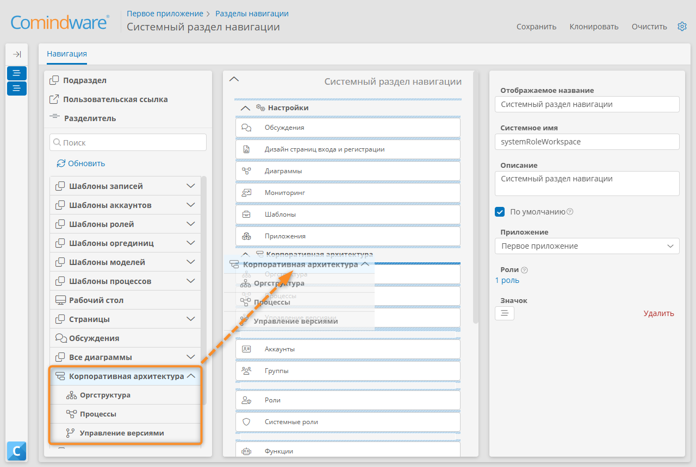

# {{ productNameArchitect }}. Описание модуля {: #architect_description }



## Введение

Модуль «**{{ productNameArchitect }}**» — это no-code-конструктор процессной архитектуры и организационной структуры предприятия.

Этот модуль доступен только в **{{ productNameEnterprise }}**.

## Знакомство с модулем «{{ productNameArchitect }}» {: #architect_intro }

Прежде чем приступать к моделированию архитектуры предприятия, ознакомьтесь со следующими практическими примерами использования модуля «**{{ productNameArchitect }}**»:

- _[Моделирование корпоративной архитектуры. Описание демонстрационного стенда][architect_demo_instance]_
- _[Построение ОШС и архитектуры процессов организации. Практический пример][architect_demo_organizational_structure_processes]_

## Возможности моделирования корпоративной архитектуры



## Подключение модуля «{{ productNameArchitect }}»

Для использования модуля «**{{ productNameArchitect }}**» необходимо активировать его с помощью **лицензионного ключа**.

1. На странице «[**Администрирование**][administration]» в разделе «**Инфраструктура**» выберите пункт «**Лицензирование**» <i class="fa-light fa-key"></i>.
2. Отобразится список лицензионных ключей.
3. Добавьте лицензионный ключ модуля «**{{ productNameArchitect }}**».
4. При необходимости назначьте лицензии аккаунтам.

    !!! warning "Внимание!"

        Тип лицензии модуля «**{{ productNameArchitect }}**», назначенной аккаунту, должен совпадать с типом лицензии **{{ productName }}**, назначенной аккаунту.

        См. также _«[Лицензирование. Активация, назначение, отзыв и продление лицензий][licensing]»_.

5. На странице «[**Администрирование**][administration]» в разделе «**Архитектура**» выберите пункт «**Разделы навигации**» <i class=" fal  fa-list-dropdown "></i>.
6. Создайте или откройте для редактирования существующий раздел навигации.
7. Добавьте блок «**{{ productNameArchitect }}**» в раздел навигации.
8. Сохраните изменения.

__

## Рабочий стол «{{ productNameArchitect }}» {: #architect_desktop_operations .pageBreakBefore }

После входа в **{{ productNameEnterprise }}** отображается Рабочий стол «**{{ productNameArchitect }}**» со ссылками для выполнения базовых операций.

- **Создание архитектуры**
    - **Процессы** — **[построение процессной архитектуры][architect_process_architecture_design]** организации.
    - **Оргструктура** — **[построение организационной структуры][architect_organizational_structure_design]**.
    - **Версии** — **[управление версиями][architect_version_control]** процессной архитектуры и организационной структуры.
- **Настройка продукта**
    - **Внешний вид**
        - **[Темы][themes]**
        - **[Дизайн страниц входа и регистрации][login_and_registration_page_design]**
        - **[Рабочее пространство][navigation_sections_setup]**
    - **Расширенная настройка**
        - **[Резервное копирование][backup_configure]**
        - **[Общесистемные настройки][global_configuration]**
    - **Совместная работа**
        - **[Регистрация и вход][registration_and_login]**
        - **[Роли в приложении][roles]**
        - **[Системные роли][system_roles]**
        - **[Аккаунты][accounts]**

См. также общие сведения о Рабочем столе **{{ productName }}**:

- _[Рабочий стол. Использование][desktop]_
- _[Рабочий стол. Определения и настройка][desktop_setup]_

__

--8<-- "related_topics_heading.md"

- _[Моделирование корпоративной архитектуры. Описание демонстрационного стенда][architect_demo_instance]_
- _[Построение ОШС и архитектуры процессов организации. Практический пример][architect_demo_organizational_structure_processes]_
- _[Построение процессной архитектуры][architect_process_architecture_design]_
- _[Построение организационной структуры][architect_organizational_structure_design]_
- _[Рабочий стол. Использование][desktop]_
- _[Рабочий стол. Определения и настройка][desktop_setup]_


