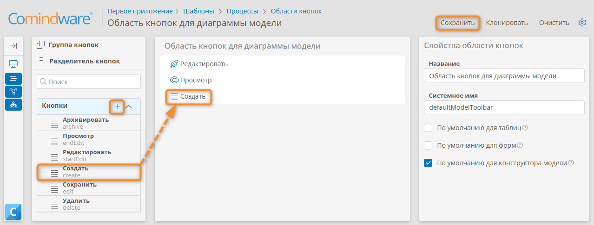

# Просмотр и редактирование диаграмм процессов и бизнес-способностей {: #architect_process_architecture_diagram_edit }

## Введение

В **{{ productNameEnterprise }}** для моделирования корпоративной архитектуры предусмотрен визуальный конструктор диаграмм процессов в нотации BMPN 2.0 и диаграмм бизнес-способностей.

!!! warning "Внимание!"

    Изменения, внесённые в конструкторе диаграмм, сохраняются автоматически. Отмена изменений не предусмотрена.

## Просмотр диаграммы {: #architect_process_architecture_diagram_view }

1. Выберите элемент процессной архитектуры в панели навигации или дважды нажмите его строку в [реестре процессов][architect_process_architecture_design_registry_view].
2. Откроется диаграмма процесса или бизнес-способностей в режиме просмотра.
3. При необходимости [отредактируйте диаграмму](#architect_process_architecture_diagram_designer).

### Функции при просмотре диаграммы {: .pageBreakBefore }

__

1. **Кнопки типовых операций**

    - **Редактировать** <i class="fa-light fa-pen-nib"></i> — переход в режим [редактирования диаграммы](#architect_process_architecture_diagram_designer).
    - **Обсуждение** <i class="fa-light fa-comment-dots"></i> — отображение чата для обсуждения диаграммы.
    - **Версии** <i class="fa-light fa-code-branch"></i> — просмотр версий диаграммы.
    - **Свойства** <i class="fa-light fa-sidebar-flip"></i> — просмотр свойств диаграммы или выбранного элемента.

    Cм. также _«[Настройка кнопок типовых операций](#настройка-кнопок-типовых-операций)»_.

--8<-- "process_architecture_diagram_zoom_controls.md"
1. **Панель свойств** — здесь отображаются свойства выбранного элемента, а также панель обсуждения и панель версий диаграммы.

### Переход к дочерним элементам диаграммы {: .pageBreakBefore }

Для перехода к диаграмме подпроцесса или дочерней группы процессов нажмите значок перехода к дочернему элементу:

- <i class="fa-light fa-diagram-subtask"></i> <i class="fa-light fa-square-plus"></i> — переход к диаграмме бизнес-способностей по ссылке;
- <i class="fa-light fa-list-tree"></i> <i class="fa-light fa-square-plus"></i> — переход к диаграмме бизнес-способностей.
- <i class="fa-light fa-diagram-nested"></i> — переход к диаграмме процесса;
- <i class="fa-light fa-code-compare"></i> — переход к диаграмме процесса по ссылке;
- <i class="fa-light fa-square-plus"></i> — переход к подпроцессу с диаграммы процесса.

__

__

## Редактирование диаграммы {: #architect_process_architecture_diagram_designer .pageBreakBefore }

### Переход к конструктору диаграмм

1. Выберите элемент процессной архитектуры в панели навигации или дважды нажмите его строку в [реестре процессов][architect_process_architecture_design_registry_view].
2. Откроется диаграмма процесса или бизнес-способностей в режиме просмотра.
3. Нажмите кнопку «**Редактировать**» <i class="fa-light fa-pen-nib" aria-hidden="true"></i>.
4. Отобразится конструктор диаграмм процессов и бизнес-способностей.

__

### Элементы конструктора диаграмм {: .pageBreakBefore }

__

__

1. **Кнопки типовых операций**

    - **Просмотр** <i class="fa-light fa-eye"></i> — переход в режим просмотра диаграммы.
    - **Очистить** <i class="fa-light fa-trash"></i> — безвозвратное удаление всех элементов с диаграммы. При нажатии этой кнопки отобразится запрос подтверждения.
    - **Обсуждение** <i class="fa-light fa-comment-dots"></i> — отображение чата для обсуждения диаграммы.
    - **Версии** <i class="fa-light fa-code-branch"></i> — управление версиями диаграммы.
    - **Свойства** <i class="fa-light fa-sidebar-flip"></i> — [настройка свойств][architect_process_architecture_design_entity_properties_configure] диаграммы или выбранного элемента.

    Cм. также _«[Настройка кнопок типовых операций](#настройка-кнопок-типовых-операций)»_.

2. **Кнопки для работы с диаграммой**

    - **Указатель** <i class="fa-light fa-arrow-pointer"></i> — выбор одного элемента.
    - **Лассо** <i class="fa-light fa-square-dashed"></i> — выбор нескольких элементов путём обводки требуемой области.
    - **Импорт** <i class="fa-light fa-file-import"></i> — [загрузка диаграммы][architect_exporting_process_entity] из файла формата `BPMN`.
    - **Экспорт** <i class="fa-light fa-file-export"></i> — [выгрузка диаграммы][architect_importing_process_entity] в файл формата `BPMN`, `PNG` или `SVG`. При нажатии этой кнопки браузер скачает файл с названием диаграммы выбранного формата.
    - **Проверить** <i class="fa-light  fa-circle-exclamation-check"></i> — [проверка диаграммы][architect_process_architecture_diagram_verify]. Отображается только для диаграмм процессов. Проверка диаграмм бизнес-способностей не предусмотрена.
    - **Отменить** <i class="fa-light fa-arrow-rotate-left"></i> — отмена последнего действия.
    - **Повторить** <i class="fa-light fa-arrow-rotate-right"></i> — повтор последнего отменённого действия.

3. **Палитра элементов** — содержит элементы либо нотации BPMN 2.0, либо нотации бизнес-способностей, которые можно перетащить на диаграмму.
--8<-- "process_architecture_diagram_zoom_controls.md"
6. **Панель свойств** — здесь отображаются свойства выбранного элемента, а также панель обсуждения и панель версий диаграммы.
7. **Панель проверки диаграммы** — содержит ошибки и предупреждения, возникшие при [проверке диаграммы][architect_process_architecture_diagram_verify]. Отображается только для диаграмм процессов.

### Управление с помощью клавиатуры {: .pageBreakBefore }

В конструкторе диаграмм можно использовать следующие сочетания клавиш:

--8<-- "enterprise_architecture_keyboard_shortcuts.md"



### Меню элемента {: #architect_process_architecture_diagram_designer_element_menu .pageBreakBefore }

При выборе любого элемента на диаграмме отображается его контекстное меню с перечисленными ниже пунктами.

__

- **Быстрое создание** — создание элемента, связанного посредством потока управления с текущим элементом. Набор доступных элементов зависит от типа текущего элемента.
- **Изменить тип** — смена типа элемента, набор доступных типов зависит от типа текущего элемента.
- **Модификаторы** — доступны для задач и процессов.
- **Изменить цвет** — выбор цвета рамки и фона элемента.
- **Свойства** — данный пункт в текущей версии «**{{ productNameEnterprise }}** действует только для элементов «**Вызов процесса**» и «**Скрытый пул**» на диаграммах процессов и элементов «**Процесс**», «**Ссылка на процесс**», «**Ссылка на группу процессов**».
- **Удалить** — удаление текущего элемента.

### Настройка кнопок типовых операций {: .pageBreakBefore }

Кнопки типовых операция отображаются при открытии следующих элементов в конструкторе диаграмм:

- **Встроенный подпроцесс**
- **Группа процессов**
- **Повторно используемый процесс**
- **Процесс**
- **Ссылка на группу процессов**
- **Ссылка на процесс**

Подробные инструкции по настройке кнопок см. в статьях _«[Области кнопок. Определение, настройка, клонирование, удаление][button_area]»_, и _«[Кнопки. Определение, настройка, удаление][buttons]»_.

Кнопки типовых операций для конструктора диаграмм можно настроить в соответствующих **шаблонах моделей** следующим образом:

1. Откройте список **шаблонов моделей**.
2. Откройте требуемый **шаблон модели**.
3. Откройте вкладку «**Область кнопок**».
4. Откройте **область кнопок для диаграммы моделей**.
5. Поместите на область кнопки, которые должны отображаться в конструкторе диаграммы по данному шаблону модели.
6. При необходимости создайте новые кнопки, нажав значок <i class="fa-light fa-plus"></i> рядом с заголовком «**Кнопки**» в панели элементов слева.
7. Удалите ненужные кнопки.
8. Сохраните область кнопок.

__

### Проверка диаграммы процесса {: #architect_process_architecture_diagram_verify .pageBreakBefore }

Для диаграмм процессов в нотации BPMN 2.0 рекомендуется выполнять проверку, как указано ниже.

Проверка диаграммы позволяет обеспечить её корректный экспорт и возможность преобразования в исполняемый формат.

1. Перейдите к [конструктору диаграммы][architect_process_architecture_diagram_designer] процесса.
2. Нажмите кнопку «**Проверить**» <i class="fa-light  fa-circle-exclamation-check"></i>, показанную на иллюстрации ниже.
3. Под диаграммой отобразится список ошибок и предупреждений, относящихся к элементам диаграммы.
4. Нажимайте на ошибки и предупреждения в списке, чтобы перейти к соответствующим элементам на диаграмме.
5. При необходимости исправьте диаграмму.

__

--8<-- "related_topics_heading.md"

- _[Построение процессной архитектуры][architect_process_architecture_design]_
- _[Просмотр диаграмм процессов и бизнес-способностей][architect_process_architecture_diagram_view]_
- _[Изменение свойств элемента процессной архитектуры][architect_process_architecture_design_entity_properties_configure]_
- _[Редактирование формы свойств и атрибутов элемента][architect_process_architecture_design_entity_form_attributes_configure]_
- _[Импорт диаграмм процессов][architect_importing_process_entity]_
- _[Экспорт диаграмм и регламентов процессов][architect_exporting_process_entity]_
- _[Области кнопок. Определение, настройка, клонирование, удаление][button_area]_
- _[Кнопки. Определение, настройка, удаление][buttons]_


