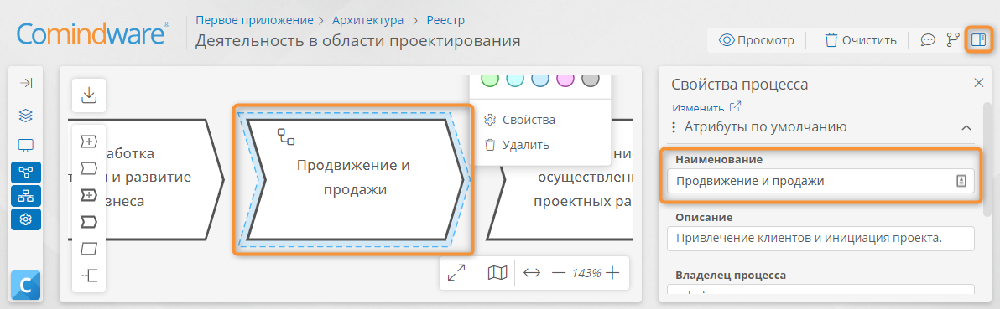

# Построение процессной архитектуры {: #architect_process_architecture_design }

## Введение

Для построения процессной архитектуры в «**{{ productNameArchitect }}**» предусмотрены следующие инструменты:

* иерархический [реестр процессов](#architect_process_architecture_design);
* [конструктор диаграмм][architect_process_diagram_designer] бизнес-способностей и процессов;
* функции импорта и экспорта диаграмм и регламентов процессов.

Для построения процессной архитектуры используются нотация моделирования бизнес-способностей и нотация BPMN 2.0.

Предусмотрены следующие элементы процессной архитектуры:

* **процесс** — служит для моделирования бизнес-процессов в нотации BPMN 2.0;
* **группа процессов** — служит для моделирования деятельности организации в нотации бизнес-способностей;
* **ссылка на процесс** — служит для многократного использования типовых процессов;
* **ссылка на группу процессов** — служит для многократного использования типовых групп процессов.

Каждый элемент процессной архитектуры представляет собой запись в **шаблоне модели** соответствующего типа.

Атрибуты и форму любого элемента процессной архитектуры можно [изменить](#architect_process_architecture_design_entity_form_attributes_configure).

## Редактирование процессной архитектуры {: #architect_process_architecture_edit }

Чтобы отредактировать процессную архитектуру, отройте [реестр процессов](#architect_process_architecture_design_registry_view).

- Редактировать оргструктуру можно следующими способами:
    - с помощью конструктора диаграмм;
    - с помощью реестра процессов;
    - с помощью панели навигации.
- Предусмотрены следующие операции с элементами процессной архитектуры:
    - [создание](#architect_process_architecture_design_entity_create);
    - [переименование](#architect_process_architecture_design_entity_rename);
    - [изменение типа или модификатора](#architect_process_architecture_design_entity_type_modifier_change);
    - [изменение свойств](#architect_process_architecture_design_entity_properties_configure);
    - [редактирование формы и атрибутов](#architect_process_architecture_design_entity_form_attributes_configure);
    - [изменение цвета и размера на диаграмме ОШС](#architect_process_architecture_design_color_change_resize);
    - [перемещение в иерархии](#architect_process_architecture_design_hierarchy_change);
    - [дублирование](#architect_process_architecture_design_entity_clone);
    - [удаление](#architect_process_architecture_design_entity_delete).

## Просмотр реестра процессов {: #architect_process_architecture_design_registry_view }

1. В [панели навигации][navigation_panel] выберите пункт «**Процессы**» — «**Реестр**» для просмотра всей иерархии процессов.
2. Отобразится страница «**Реестр процессов**» со следующими сведениями:

    * **Название** — наименование процесса;
    * **Владелец процесса** — лицо, ответственное за выполнение процесса;
    * **Участники** — гиперссылки на аккаунты, которым назначаются задачи по процессу.

3. Чтобы открыть диаграмму процесса или бизнес-способностей, дважды нажмите соответствующую строку в списке.

__

## Создание элемента процессной архитектуры {: #architect_process_architecture_design_entity_create}

## Создание элемента на диаграмме

1. В [конструкторе диаграммы][architect_process_diagram_designer] перетащите на диаграмму требуемый элемент из палитры элементов.
2. Чтобы создать элемент, связанный с имеющимся:

    - выберите элемент на диаграмме;
    - в разделе «**Быстрое создание**» меню элемента укажите элемент, который требуется создать.

3. Новый элемент будет создан и при необходимости связан потоком управления с имеющимся на диаграмме.
4. [Настройте элемент](#architect_process_architecture_design_entity_properties_configure).

__

!!! Tip "Совет"
    Чтобы создать поток управления, выберите пункт «**Поток управления**» в разделе «**Быстрое создание**» [меню элемента][меню-элемента].

!!! Tip "Совет"
    **Промежуточное событие** можно перетащить на элемент «**Задача**», «**Встроенный подпроцесс**» или «**Вызов процесса**». В этом случае событие будет прикреплено к соответствующему элементу.

!!! Note "Примечание"
    Созданные на диаграмме элементы «**Встроенный подпроцесс**», «**Группа процессов**», «**Ссылка на процесс**» и «**Ссылка на группу процессов**» автоматически появляются в [реестре процессов][architect_process_architecture_design].

### Создание элемента на верхнем уровне иерархии с помощью реестра

1. В [реестре процессов][architect_process_architecture_design] нажмите кнопку «**Создать**».
2. В раскрывающемся меню выберите пункт «**Группа процессов**», «**Процесс**», «**Ссылка на группу процессов**» или «**Создать ссылку на процесс**».

    __

3. Будет создан элемент процессной архитектуры на верхнем уровне иерархии.
--8<-- "process_architecture_name_element.md"

### Создание дочернего элемента в группе процессов с помощью реестра

#### Создание с помощью контекстного меню

1. В [реестре процессов][architect_process_architecture_design] щёлкните правой кнопкой мыши группу процессов.
2. В раскрывающемся меню выберите пункт «**Создать**» — «**Группа процессов**», «**Процесс**», «**Ссылка на группу процессов**» или «**Ссылку на процесс**».

    __

--8<-- "process_architecture_element_created.md"
--8<-- "process_architecture_name_element.md"

#### Создание с помощью кнопки «Создать» {: .pageBreakBefore }

1. В [реестре процессов][architect_process_architecture_design] установите флажок выбора в строке группы процессов.
2. Нажмите кнопку «**Создать**» и в раскрывающемся меню выберите пункт «**Группа процессов**», «**Процесс**», «**Ссылка на группу процессов**» или «**Ссылка на процесс**».

    __

--8<-- "process_architecture_element_created.md"
--8<-- "process_architecture_name_element.md"

### Создание элемента с помощью панели навигации

1. В разделе «**Процессы**» [панели навигации][navigation_panel] нажмите кнопку «**Действия**» <i class="fa-light fa-ellipsis-vertical"></i> у группы процессов или у пункта «**Реестр**».
2. В раскрывающемся меню выберите пункт «**Создать группу процессов**», «**Создать процесс**», «**Создать ссылку на группу процессов**» или «**Создать ссылку на процесс**».

    __

3. Будет создан элемент процессной архитектуры внутри элемента, выбранного на шаге 1, либо на верхнем уровне иерархии.
4. Введите требуемое название элемента сразу после его создания.

    __

--8<-- "process_architecture_name_element.md"

## Переименование элемента процессной архитектуры {: #architect_process_architecture_design_entity_rename  .pageBreakBefore }

## Переименование элемента на диаграмме с помощью его подписи

1. Дважды нажмите элемент в [конструкторе диаграммы][architect_process_diagram_designer].
2. Введите новое название элемента в отобразившееся текстовое поле.
3. Нажмите любое место вне элемента, чтобы применить изменения.

__

## Переименование элемента на диаграмме с помощью панели свойств

1. Выберите элемент в [конструкторе диаграммы][architect_process_diagram_designer].
2. Откройте панель свойств, нажав кнопку «**Свойства**» <i class="fa-light fa-sidebar-flip"></i>.
3. Введите новое название элемента в поле «**Наименование**» на панели свойств.

__

### Переименование с помощью панели навигации

1. Чтобы переименовать имеющийся элемент, нажмите кнопку «**Действия**» <i class="fa-light fa-ellipsis-vertical"></i> у элемента.
2. В раскрывающемся меню выберите пункт «**Переименовать**».

    __

4. Введите требуемое название.

    __

## Изменение типа или модификатора элемента с помощью диаграммы {: #architect_process_architecture_design_entity_type_modifier_change .pageBreakBefore }

1. Выберите элемент на диаграмме.
2. Выберите требуемый тип элемента в разделе «**Изменить тип**» меню элемента.
3. Выберите требуемый модификатор в разделе «**Модификаторы**» меню элемента.

## Изменение свойств элемента процессной архитектуры {: #architect_process_architecture_design_entity_properties_configure}

У каждого элемента процессной архитектуры предусмотрены настраиваемые свойства ([атрибуты][architect_process_architecture_design_entity_form_attributes_configure]).

Свойства элемента процессной архитектуры (значения его атрибутов) можно изменить с помощью панели свойств в конструкторе диаграммы.

--8<-- "process_architecture_edit_diagram_properties.md"
4. При необходимости выберите любой элемент на диаграмме, чтобы изменить его свойства.
5. В панели свойств измените значения атрибутов.
6. При необходимости [отредактируйте атрибуты и форму свойств элемента][architect_process_architecture_design_entity_form_attributes_configure].

!!! Note "Примечание"
    Изменения, внесённые в [конструкторе диаграмм][architect_process_diagram_designer], сохраняются автоматически. Отмена изменений не предусмотрена.

__

## Редактирование формы и атрибутов элемента процессной архитектуры {: #architect_process_architecture_design_entity_form_attributes_configure}

У каждого элемента процессной архитектуры предусмотрены настраиваемые атрибуты и форма свойств.

На форму свойств всех элементов процессной архитектуры по умолчанию вынесены следующие системные атрибуты:

* **Наименование** — наглядное название элемента;
* **Описание** — комментарий относительно назначения элемента процессной архитектуры.

На форму свойств процесса по умолчанию вынесены дополнительные системные атрибуты:

* **Владелец процесса** — наглядное название процесса;
* **Задачи процесса** — комментарий относительно назначения элемента процессной архитектуры;
* **Участники процесса** — комментарий относительно назначения элемента процессной архитектуры.

Атрибутивный состав элемента процессной архитектуры можно изменить, и на его форму свойств можно вынести дополнительные визуальные элементы и атрибуты. Для этого выполните указанные ниже действия.

--8<-- "process_architecture_edit_diagram_properties.md"
4. При необходимости выберите любой элемент диаграммы, чтобы отредактировать его атрибуты и форму свойств.
5. В панели свойств нажмите кнопку «**Изменить**» <i class="fa-light fa-arrow-up-right-from-square"></i>.

    __

6. Отобразится конструктор формы.
7. Создайте или отредактируйте атрибуты элемента процессной архитектуры. См. _«[Операции на панели элементов конструктора форм][form_designer_elements_operations]»_.
8. Перетащите на форму новые атрибуты и визуальные элементы или удалите ненужные. См. _«[Редактирование формы][form_designer]»_.
9. Нажмите кнопку «**Сохранить**».

    __

## Изменение цвета или размера элемента на диаграмме {: #architect_process_architecture_design_color_change_resize .pageBreakBefore }

1. Выберите элемент на диаграмме.
2. Нажмите кнопку требуемого цвета в разделе «**Изменить цвет**» [меню элемента][меню-элемента].
3. Наведите указатель мыши на границу элемента.
4. Перетащите границу элемента, чтобы изменить его размер.

__

## Изменение иерархии элементов процессной архитектуры {: #architect_process_architecture_design_hierarchy_change}

### Перемещение элемента с помощью реестра

1. В [реестре процессов][architect_process_architecture_design] наведите указатель мыши на первую ячейку в строке процесса или группы процессов, которую требуется переместить на другой уровень иерархии.
2. Отобразится значок с вертикальными троеточиями <i class="fa-light fa-grip-dots-vertical"></i>.
3. Удерживая значок <i class="fa-light fa-grip-dots-vertical"></i>, перетащите процесс или группу процессов на строку новой родительской группы процессов.

__

4. Чтобы переместить элемент на верхний уровень иерархии, перетащите его в позицию между первой строкой и заголовками столбцов, как показано на иллюстрации.

__

## Перемещение элемента с помощью панели навигации

В [панели навигации][navigation_panel] нажмите и перетащите процесс или группу процессов в новую родительскую группу.

__

## Дублирование элемента процессной архитектуры {: #architect_process_architecture_design_entity_clone}

!!! Note "Примечание"

    * Дублировать можно только процессы и группы процессов.
    * Ссылки на процессы и ссылки на группы процессов дублировать нельзя.

### Дублирование с помощью реестра процессов

1. Установите флажок выбора для процесса или группы процессов в реестре процессов
2. Нажмите кнопку «**Дублировать**».

__

### Дублирование с помощью панели навигации {: .pageBreakBefore }

1. В разделе «**Процессы**» [панели навигации][navigation_panel] нажмите кнопку «**Действия**» <i class="fa-light fa-ellipsis-vertical"></i> у элемента, который требуется дублировать.
2. В раскрывающемся меню выберите пункт «**Дублировать**».
3. Будет создан дубликат элемента процессной архитектуры на том же уровне иерархии.
4. Присвойте наглядное название созданному элементу. См. «_[Переименование элемента процессной архитектуры][architect_process_architecture_design_entity_rename]_».

__

## Удаление элементов процессной архитектуры {: #architect_process_architecture_design_entity_delete}

!!! Warning "Внимание!"
    Элементы процессной архитектуры удаляются вместе со всеми дочерними элементами и всеми ссылками на них, в том числе с диаграмм.

## Удаление с помощью диаграммы

!!! warning "Внимание!"

    При удалении с диаграммы элемента «**Встроенный подпроцесс**», «**Группа процессов**», «**Ссылка на процесс**» или «**Ссылка на группу процессов**» этот элемент также будет удалён из [реестра процессов][architect_process_architecture_design]. 

    Кроме того, будут удалены все ссылки на данный элемент на других диаграммах.

1. Выберите элемент, подлежащий удалению, в [конструкторе диаграммы][architect_process_diagram_designer].
2. В меню элемента выберите пункт «**Удалить**» или нажмите клавишу ++delete++.
3. Подтвердите удаление элемента.
4. Элемент будет удалён безвозвратно вместе с его потоками управления и дочерними элементами.

__

### Удаление с помощью реестра

1. Установите для подлежащих удалению элементов флажки выбора в первом столбце [реестра процессов][architect_process_architecture_design].
3. Нажмите кнопку «**Удалить**».
4. Подтвердите удаление элементов.

__

### Удаление с помощью панели навигации

1. Нажмите кнопку «**Действия**» <i class="fa-light fa-ellipsis-vertical"></i> у элемента, подлежащего удалению.
3. В раскрывающемся меню выберите пункт «**Удалить**».
4. Подтвердите удаление элементов.

__

--8<-- "related_topics_heading.md"

- _[Просмотр диаграммы][architect_process_architecture_diagram_view]_
- _[Редактирование диаграмм процессов и бизнес-способностей][architect_edit_diagram]_
- _[Проверка диаграммы процесса][architect_verify_diagram]_
- _[Редактирование формы][form_designer]_
- _[Операции на панели элементов конструктора форм][form_designer_elements_operations]_
- _[Использование панели навигации][navigation_panel]_


