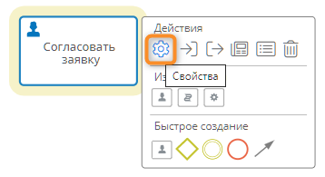

# Общие свойства элементов диаграммы процесса {: #process_diagram_element_common_properties}

У всех элементов диаграммы процесса предусмотрены перечисленные ниже свойства.

- **Название** — наглядное наименование элемента.
- **Системное имя** — уникальное имя элемента. **Обязательное поле**.
--8<-- "system_name_requirements.md"
- **Состояние элемента диаграммы** — отображается в [окне свойств элемента](#process_diagram_element_properties_setting).
    - **Активен** — элемент выполняется, когда на него приходит токен.
    - **Приостановлен** — токен останавливается на элементе и не идет на последующие элементы.
    - **Пропуск** — токен проходит через элемент без выполнения элемента.
- **Описание** — необязательный комментарий относительно назначения элемента.

Общие свойства элемента (кроме статуса активности) отображаются в панели свойств элемента при его выборе в [конструкторе диаграммы процесса][process_diagram_designer], а также в [окне свойств элемента](#process_diagram_element_properties_setting).

__

## Настройка свойств элемента {: #process_diagram_element_properties_setting}

1. Нажмите элемент диаграммы.
2. Нажмите кнопку «**Свойства**» <i class="fa-light fa-gear"></i> в меню элемента.

    __

3. Отобразится окно свойств элемента.
4. Настройте и сохраните элемент.

    __

--8<-- "related_topics_heading.md"

**[Элементы диаграммы процесса][process_diagram_elements]**

**[Диаграмма процесса][process_diagram]**

**[Конструктор диаграммы процесса][process_diagram_designer]**


