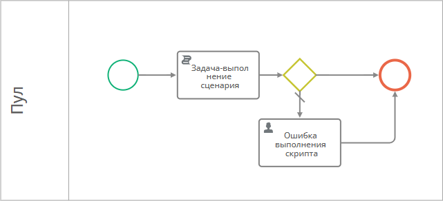

# Ошибки в процессе. Отслеживание {: #process_error_monitor }

## Введение

**{{ productName }}** позволяет моделировать и реализовывать исполняемые бизнес-процессы с назначением задач исполнителям, выполнением сценариев, отправкой внутренних и внешних сообщений, просмотром журнала действий.

В ходе выполнения процесса могут возникнуть различные ошибки, например в задачах, сценариях, C#-скриптах.

**{{ productName }}** предлагает различные встроенные механизмы по отслеживанию ошибок, а также даёт возможность настроить свои собственные.

Здесь представлены инструкции по настройке отслеживания ошибок в процессах с помощью следующих инструментов:

- таблицы со списком экземпляров процесса, в которых имеются ошибки;
- атрибута для отслеживания ошибок при выполнении C#-скрипта и отправки уведомлений администратору процесса.

## Настройка таблицы для отслеживания ошибок в экземплярах процесса

Чтобы отслеживать экземпляры процесса, в которых произошли ошибки, настройте таблицу со списком экземпляров процесса и фильтром по наличию ошибок.

1. Откройте шаблон процесса.
2. Перейдите на вкладку «**Таблицы**».
3. Создайте таблицу _«Процессы с ошибками»_.
4. На панели «**Свойства таблицы**» в поле «**Системный фильтр**» введите следующее выражение на **N3**:

    ``` turtle
    # Импортируем функции для работы с процессами
    @prefix process: <http://comindware.com/ontology/process#>.
    @prefix cmw: <http://comindware.com/logics#>.
    {
    # Собираем все экземпляры процесса
    ?item process:businessObject ?.
    # Возвращаем экземпляры процесса, в которых есть ошибки
    ?item process:hasTokenError true.
    }
    ```

5. Сохраните таблицу.
6. Перейдите к списку экземпляров процесса.
7. Откройте вкладку с таблицей _«Процессы с ошибками»_.
8. Должен отобразиться список процессов, при выполнении которых произошли ошибки.

## Отслеживание ошибок в задаче-выполнении сценария с отправкой уведомлений {: .pageBreakBefore }

Для использования C#-скриптов в процессах предусмотрена задача-выполнение сценария. Если при её выполнении произойдёт ошибка, процесс будет остановлен. Чтобы отследить ошибки в C#-скрипте задачи-выполнении сценария, но не останавливать процесс, можно воспользоваться конструкцией `try..catch`. С помощью этого приёма можно отследить проблемы выполнении C#-скрипта, поместив сообщение об ошибке в текстовый атрибут и вывести уведомление об ошибке в пользовательской задаче.

1. Создайте атрибут _«Отслеживание ошибок»_ с системным именем `ErrorMonitoring` в шаблоне записи, связанном с процессом.
2. Добавьте в диаграмму процесса задачу-выполнение сценария с C#-скриптом по следующему образцу:

    ``` cs
    using System;
    using System.Collections.Generic;
    using System.Linq;
    using Comindware.Data.Entity;
    using Comindware.TeamNetwork.Api.Data.UserCommands;
    using Comindware.TeamNetwork.Api.Data;

    class Script
    {
        public static string Main(Comindware.Process.Api.Data.ScriptContext context, Comindware.Entities entities)
        {
            // Добавьте входные данные.
            int Result = 0;
            try
            {
                // Добавьте код, который должен отработать в штатном режиме.
                // Result = 1 — код успешного выполнения скрипта
                Result = 1;
                // ErrorMonitoring — системное имя атрибута «Отслеживание ошибок».
                // Присваиваем атрибуту «Отслеживание ошибок» значение "Нет ошибок выполнения скрипта".
                var data = new Dictionary<string, object>{{"ErrorMonitoring", "Нет ошибок выполнения скрипта"}};
                Api.TeamNetwork.ObjectService.EditWithAlias(context.BusinessObjectId, data);
            }
            catch
            {
                // Добавьте код, который должен отработать в случае ошибки.
                // Result = -1 — код ошибки при выполнении скрипта
                Result = -1;
                // ErrorMonitoring — системное имя атрибута «Отслеживание ошибок».
                // Присваиваем атрибуту «Отслеживание ошибок» значение "Ошибка выполнения скрипта".
                var data = new Dictionary<string, object>{{"ErrorMonitoring", "Ошибка выполнения скрипта"}};
                Api.TeamNetwork.ObjectService.EditWithAlias(context.BusinessObjectId, data);
            }
            // Возвращаем результат выполнения скрипта.
            // Эта строка отобразится в поле «Выходные данные» 
            // в событии «Скрипт выполнен» в цепочке событий для задачи-выполнения сценария.
            return string.Format("Результат: {0}", Result);
        }
    }
    ```

3. Создайте на диаграмме процесса пользовательскую задачу _«Ошибка выполнения скрипта»_.
4. Поместите на форму задачи _«Ошибка выполнения скрипта»_ атрибут _«Отслеживание ошибок»_.
5. После задачи-выполнения сценария добавьте **развилку «или/или»**.
6. Соедините **развилку «или/или»** с задачей _«Ошибка выполнения скрипта»_ и следующим элементом процесса.
7. Настройте исходящие потоки **развилки «или/или»**:

    <table markdown="block">
    <tbody markdown="block">
    <tr markdown="block">
    <th markdown="block">
    Поток «иначе»
    </th>
    <th markdown="block">
    Конечная точка
    </th>
    <th markdown="block">
    Условие
    </th>
    </tr>
    <tr markdown="block">
    <td markdown="block">
    Флажок установлен
    </td>
    <td markdown="block">
    Пользовательская задача _«Ошибка выполнения скрипта»_
    </td>
    <td markdown="block">
    </td>
    </tr>
    <tr markdown="block">
    <td markdown="block">
    </td>
    <td markdown="block">
    Следующий этап процесса
    </td>
    <td markdown="block">
    **Формула:**

    ``` cs
    $ErrorMonitoring == "Нет ошибок выполнения скрипта"
    ```

    </td>
    </tr>
    </tbody>
    </table>

8. Настройте остальные действия процесса согласно бизнес-логике.

__

### Тестирование {: .pageBreakBefore }

1. Запустите экземпляр процесса.
2. Дождитесь завершения выполнения C#-скрипта.
3. Если в C#-скрипте произойдут ошибки, на странице «**Мои задачи**» появится задача _«Ошибка выполнения скрипта»_.
4. Откройте задачу _«Ошибка выполнения скрипта»_ и просмотрите сообщение в поле _«Отслеживание ошибок»_.
5. В задаче нажмите кнопку <i class="fa-light fa-edit"></i> и выберите пункт «**Перейти к диаграмме процесса**».
6. Откроется диаграмма экземпляра процесса.
7. Откройте **журнал изменений** и нажмите значок {: width="20px"} рядом с названием задачи-выполнения сценария.
8. Откроется **цепочка событий** с информацией о ходе выполнения C#-скрипта на панели «**Выполнение элемента процесса**».

<div class="relatedTopics" markdown="block">

--8<-- "related_topics_heading.md"

- _[Использование диаграммы экземпляра процесса][process_diagram_view_instance]_
- _[Просмотр цепочки событий][events_chain_view]_
- _[Отладка формул, выражений N3, сценариев и C#-скриптов][expression_debug]_

</div>


