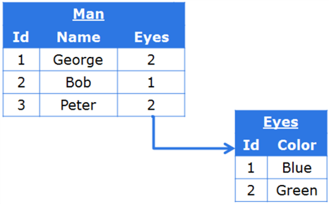
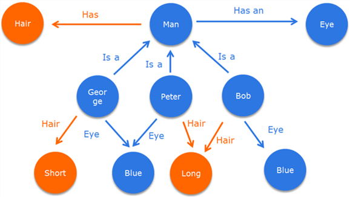

# Технология {{ companyName }} ElasticData {: #elasticdata_description}

## Описание технологии ElasticData

**{{ companyName }} ElasticData** — это первоклассная гибкая технология управления данными следующего поколения, которая лежит в основе современных веб-приложений. В основе **ElasticData** лежит графовая модель данных, тип баз данных, расширяющий возможности и обеспечивающий более гибкий подход, чем традиционные реляционные модели данных.

За последние несколько лет графовая модель данных быстро прошла путь от научных публикаций и прототипов с ограниченным использованием до полнофункционального развертывания. Например, в X (Twitter) применяется технология графовых баз данных FlockDB. Помимо **{{ companyName }} ElasticData** сегодня появляется все большее число графовых баз данных. Например, AllegroGraph, Neo4j, HyperGraphDB, InfiniteGraph и другие.

Для работы современных веб-приложений требуется более высокий уровень гибкости, масштабирования и скорости, чем могут обеспечить традиционные реляционные базы данных, что повышает интерес и уровень инновационных решений графовой модели баз данных.

Графовая модель данных, которая используется в ElasticData, обеспечивает такие возможности **{{ productName }}**, которые практически невозможно реализовать для приложений на основе реляционных баз данных без значительных издержек. Графовая модель данных по своей сути обладает гораздо большей гибкостью в определении структур данных и изменении этих структур в режиме реального времени. Это возможно благодаря уникальному и гораздо более гибкому подходу к хранению и управлению данными.

Технология **ElasticData** основана на принципах семантической паутины, сформулированных известным консорциумом W3C consortium. Согласно определению консорциума W3C: «Семантическая паутина обеспечивает общую структуру, позволяющую распределять и повторно использовать данные в рамках приложения, предприятия и группы». Использование принципов семантической паутины позволяет создавать приложения, которые проще понять и настраивать.

## Преимущества графовой модели данных

Традиционные бизнес-приложения на основе реляционной модели данных отлично работают, если все взаимоотношения и структуры данных определены на этапе разработки приложения (design-time). Однако при необходимости изменения модели данных и процессов в уже работающем приложении (run-time) при использовании традиционных приложений часто возникают трудности с хранением объектов новых типов и их управлением, поиском недавно созданных данных, добавлением отношений между объектами и так далее. Эти сложности возникают из-за самой природы реляционной модели данных: предполагается, что сначала определяется модель данных и все взаимоотношения, только после этого начинается работа.

И напротив, технология **ElasticData** была разработана с расчетом на то, что модель данных и процессы можно будет изменить на этапе выполнения, что позволит лучше удовлетворять потребности современных компаний, которые должны адаптироваться к постоянно изменяющимся условиям.

Другой проблемой реляционной модели данных является то, что она разработана только для хранения данных, а не бизнес-правил работы с этими данными. Все бизнес-правила реализуются в качестве надстройки базы данных в определённом приложении. Этот подход работает только при наличии одного приложения, однако при использовании двух или нескольких приложений бизнес-правила определяются также в двух или нескольких местах, и чаще всего по-разному.

Графовая же модель данных была разработана для сохранения бизнес-правил как неотъемлемой части базы данных. Поэтому она может выступать в качестве единого источника бизнес-правил для многих приложений, работающих с одними и теми же данными. Нет необходимости беспокоиться о том, что для различных приложений применяются разные версии бизнес-правил для работы с данными.

## Принцип работы: реляционная и графовая модели данных

Реляционная база хранит данные в виде связанных таблиц. Каждая таблица содержит большое количество записей в строках с общими атрибутами, представленными в виде столбцов. Таблицы соединены друг с другом с помощью специальных столбцов, содержащих ссылки на другие таблицы.

__

Представление в виде таблиц вполне интуитивно и кажется простым в управлении. Более того, управление не представляет сложности, если имеется прямой доступ к базе данных и с ней работает, например, пять пользователей.

Однако в расширенных бизнес-приложениях к базам данных прибавляются сложные бизнес-правила, поэтому естественная интуитивность реляционной модели данных теряется в сложности бизнес-приложения. В результате приложения на основе систем управления реляционными базами данных быстро становятся негибкими, их сложно изменять и расширять. Преобразование данных и добавление новых функций приложения занимают много времени и усилий.

При использовании графовой модели данных **ElasticData** также хранит данные в интуитивной форме: форма объектов и связей между ними. Этот способ даже более интуитивен, чем таблицы, если смотреть на него с позиции объектов и их взаимосвязей. Например: «Иван и Сергей — друзья» или «Окно — это часть здания» или «Этот конкретный монитор — один из многих других мониторов».

Структуры данных в графовой модели данных также остаются интуитивными, так как бизнес-правила хранятся в той же базе данных, и их можно прочитать в виде простого текста. Сложные трансформации данных из одного набора таблиц в другой не требуется выполнять, так как почти все трансформации модели данных и расширения могут быть выполнены с помощью добавления новых фактов к модели в форме простого текста.

__

Таким образом факты сохраняются в графовой базе данных:

__

Бизнес-правила в **ElasticData** имеют расширенный вид по сравнению со стандартом N3 для работы с комплексными правилами. Пример.

__

Вы (и любая другая система) можете прочитать их в виде простого текста; они не являются жестко запрограммированными в сложной системе определенного бизнес-приложения, как обычно бывает с приложениями на основе РСУБД.

Кстати, при использовании структур объектно-реляционного отображения не удается решить проблемы из-за ряда сложностей, известных под названием «object-relational impedance mismatch».

Для внесения изменений в структуру хранимых данных (добавление новых полей в объекты или создание объектов новых типов) в реляционной модели данных необходимо добавить/удалить столбцы или даже создать/удалить целые таблицы. Поэтому добавление новых и удаление имеющихся типов объектов и взаимосвязей между объектами является затруднительной операцией, которая может привести к возникновению ошибок.

Даже в пределах одной компании структуры данных создаются в разных отделах для разных целей, поэтому для обмена данными потребуются большие усилия из-за различий в описании данных: несоответствий кодов, значительных различий в подходах моделирования схожих объектов и т.п.

__

**ElasticData** работает с отдельными фактами о данных вместо предварительно определенных таблиц с данными. Для добавления новых данных или изменения структуры данных необходимо просто добавить новые факты, это можно сделать даже на этапе выполнения. Таким образом, можно создать совершенно новые типы данных и связать их с имеющимися данными, а модифицировать модель данных можно, не прерывая работу пользователей с приложением.

__

Этот подход обеспечивает большую степень гибкости при определении структур данных и их изменении в реальном времени. И заданные структуры данных можно легко прочитать в виде текста на английском языке.

Графовая модель данных также обладает своими преимуществами при поиске, основанном на глубокой взаимосвязи между объектами. Рассмотрим пример, чтобы определить различия обработки поисковых запросов в системе управления реляционными базами данных и графовой базе данных.

Предположим, что имеется база данных, в которой хранится информация пользователя. В модели данных имеются следующие бизнес-объекты: задачи, пользователи, отделы и страны. Выполним поиск страны, в которой создана определенная задача.

В системе управления реляционными базами данных запрос, скорее всего, будет выглядеть следующим образом:

__

И это не самый сложный пример. Для написания запросов в системе управления реляционными базами данных потребуются квалифицированные специалисты, понимающие модель данных, которые способны написать запрос SQL. В большинстве приложений на основе системы управления реляционными базами данных предпринимается попытка скрыть эту сложность как для самого приложения, так и для его пользователей за счет ограничения полей для запроса и критериев поиска.

При использовании графовой базы данных, например ElasticData, поисковые запросы выглядят намного проще:

__

Как видно, это одна строка, которая легко понятна и может быть написана человеком, не обладающим обширными техническими познаниями. Этот подход обеспечивает простоту создания точного запроса и функций поиска для пользователей.

## Функции {{ productName }}, обеспечиваемые технологией ElasticData

Как здесь показано, графовая модель данных, используемая ElasticData, гораздо более гибкая, она обеспечивает важные преимущества для современных бизнес-приложений по сравнению с традиционными реляционными базами данных.

Технология **ElasticData** открывает широкие возможности для создания бизнес-приложений на базе **{{ productName }}**, в том числе:

- Бизнес-процессы можно создавать и изменять в реальном времени, так как обновленные процессы можно разворачивать в режиме реального времени, не прерывая активные процессы. Это значит, что нет необходимости тщательно разрабатывать весь процесс до начала использования. Можно просто начать с минимальной формализации бизнес-процессов и при необходимости обновлять их; при этом участники команды даже не заметят такого обновления. Напротив, в приложениях на основе системы управления реляционными базами данных зачастую требуется выполнить процедуру повторного развертывания и временно приостановить активные процессы, чтобы внести изменения.
- Отчетность с любыми типами анализа доступна во всей организации в режиме реального времени.
- Модели данных можно также изменять в реальном времени без реорганизации. С помощью **ElasticData** новые типы объектов и связи между ними можно добавить без остановки текущих процессов. В приложениях на основе системы управления реляционными базами данных добавление новых типов объектов зачастую связано со сложной и неудобной операцией, во время которой необходимо решить множество задач, например по созданию новых столбцов и таблиц. С помощью **ElasticData** любой тип бизнес-объекта можно легко добавить и связать с другими бизнес-объектами в системе.
- Все добавляемые в систему данные сразу же доступны для поиска, включая ссылки на другие объекты, так как перестроение индексов (как в системе управления реляционными базами данных) совершенно не требуется.
- Можно легко формировать запросы на основе глубокой взаимосвязи объектов (например: Контактный номер менеджера по работе с продукцией, который занимался продажей определенного товара определенному клиенту) и они пишутся на английском языке.
- Возможность сложного поиска по историческим данным благодаря тому, что исторические данные хранятся в той же самой базе данных, что и основные данные. Это означает, что можно выполнить сложный анализ без создания OLAP-кубов, при этом не потребуется привлекать специалистов для создания OLAP-кубов. Другими словами, благодаря **ElasticData** OLAP-инструменты всегда будут под рукой, и их не потребуется обновлять при каждом изменении модели данных, как в системе управления реляционными базами данных.
- Отдельные базы данных **ElasticData** могут быть естественно и просто объединены без процедуры миграции, так как все данные имеют уникальные идентификаторы в соответствии со стандартами семантической паутины. Если отдельные приложения **{{ productName }}** для разных отделов потребуется объединить, можно будет просто установить надлежащие связи между ними.
- Кроме того, можно легко настроить комплексную интеграцию с различными внешними источниками данных, даже имеющими совершенно разные структуры данных, не основанные на графовой модели данных. Интеграция источников данных настраивается простым добавлением «фактов» о внешней базе данных в базу данных, работающую с технологией **ElasticData**, что гораздо удобнее, чем определение соответствия объектов в плоских таблицах в приложениях на основе системы управления реляционными базами данных.
