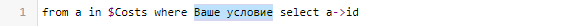
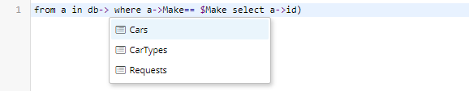
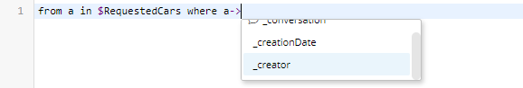
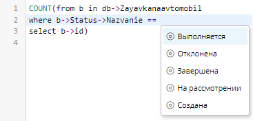
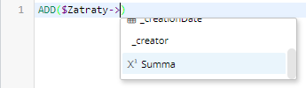
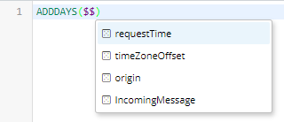

# Предиктивный ввод в формулах {: #formula_editor_autocomplete }

## Ввод имён объектов

Для ввода формул в редакторе выражений предусмотрены предиктивный ввод и подсказки:

* При вводе символов `$`, `$$`, `->`, `<-`, `==`, `!=`, имён объектов, функций и аргументов, а также при нажатии клавиш ++ctrl+space++ отображается список подходящих по контексту сущностей.
* При вводе имён функций отображаются подсказки с их описанием.

## Ввод имени функции и просмотр подсказки по функции {: #formula_autocompete_editor_function .pageBreakBefore }

1. Введите любые буквы имени функции.
2. Отобразится список подходящих функций, введённые буквы будут выделены в именах функций.
3. Выберите функцию в списке.
4. Для выбранной функции отобразится подсказка с описанием функции, её параметров и возвращаемого значения.
5. Чтобы просмотреть подробное описание функции [в справочнике][expression_editor_reference] нажмите пункт «**Показать в справочнике**» в подсказке.
6. Чтобы вставить выбранную функцию в формулу, дважды нажмите её имя в списке.

__

## Ввод запроса from where select {: #formula_editor_autocomplete_from_where_select .pageBreakBefore }

Запрос `#!sql from where select` возвращает список значений из указанного источника данных, соответствующих заданному условию.

### Ввод заготовки конструкции from where select

С помощью предиктивного ввода можно вставить заготовку запроса `#!sql from where select`.

1. Нажмите клавиши ++ctrl+space++.
2. Отобразится список источников данных для запроса — атрибутов типа «**Запись**» в текущем шаблоне и шаблонов в текущем приложении.

    __

3. Дважды нажмите системное имя атрибута или шаблона в списке, чтобы вставить в формулу заготовку конструкции `#!sql from where select` для него:

    __

4. Замените строку `Ваше условие` после оператора `#!sql where` на условие выборки записей из источника данных.

!!! note "Примечание"

    - В качестве источника данных для запроса `#!sql from where select` рекомендуется использовать атрибут типа «**Запись**», содержащий ID записей, из которых требуется произвести выборку.
    - Запрос по записям, связанным с атрибутом, выполняется быстрее, чем запрос по всем записям из шаблона.
    - В качестве источника данных можно использовать атрибуты типа «**Запись**», у которых установлен флажок «**Хранить несколько значений**».
    - Атрибуты, подходящие для запроса, отображаются в подсказке в начале списка с префиксом `$` и суффиксом `(запрос)`: `$AttributeName (запрос)`.

### Синтаксис запроса from where select {: .pageBreakBefore }

- `#!sql from a` — объявление локальной переменной-селектора `a`, в которую будут помещены записи из источника данных.
- `#!sql in` — объявление источника данных:
    - `#!sql db->TemplateName` — шаблон записи с системным именем `TemplateName`;
    - `#!sql $RecordAttributeName` — атрибут типа «**Запись**» с системным именем `RecordAttributeName`, хранящий несколько значений;
    - `#!sql (from where select)` — вложенный запрос. Вложенный запрос необходимо заключить в скобки и использовать в нём уникальную переменную-селектор:

    ``` sql
    from a in (from b in $DataSource2 where Condition2 select b->Attribute2)
    where Condition1 select a->Attribute1
    ```

- `#!sql where Condition` — выбор записей, для которых выражение `Condition` возвращает `true`.
- `#!sql orderby SortAttribute ascending` — сортировка записей по значению атрибута `SortAttribute`. Порядок сортировки указывается оператором `ascending` — по возрастанию (порядок по умолчанию, указывать необязательно) или `descending` — по убыванию.
- `#!sql select a->ReturnAttribute` — выборка значений атрибута `ReturnAttribute` записей из источника данных. Оператор `select` может содержать выражение.

``` sql title="Пример: запрос записей районов Москвы с сортировкой по убыванию названия района"
from a in $Cities
where a->CityName == "Москва"
orderby a->Districts->DistrictName descending
select a->Districts
```

``` sql title="Пример: запрос названий и авторов книг, у которых указан автор, с сортировкой по возрастанию имени автора и выводом в формате «Название: название книги. Автор: имя автора»"
from book in $Books
where NOT(EMPTY(book->Author))
orderby book->Author->Name
select CONCAT(LIST('Название: ', book->Name, '. Автор: ', book->Author->Name))
```

!!! warning "Внимание! Зарезервированные слова"

    Следующие слова нельзя использовать в запросе в качестве локальной переменной, так как они зарезервированы как системные:

    - `and`, `ascending`, `between`, `by`, `db`, `descending`, `equals`, `from`, `group`, `in`, `into`, `item`, `join`, `let`, `on`, `orderby`, `select`, `source`, `where`
    - слова, начинающиеся с подчеркивания (`_`)
    - имена функций и литералы

### Ввод запроса из атрибута текущего шаблона {: .pageBreakBefore }

1. Введите строку:

    ``` sql
    from a in
    ```

2. После ввода оператора `in` отобразится список доступных источников данных. Этот список также можно вызвать, нажав клавиши ++ctrl+space++ в позиции после оператора `in`.

    __

3. Дважды нажмите системное имя атрибута типа «**Запись**», отображающегося в списке с префиксом `$` и **_без суффикса_** `(запрос)`, чтобы вставить его в формулу.
4. Введите условие выборки записей и атрибут для выборки с помощью операторов `where` и `select`.

``` sql title="Пример: формула, возвращающая список записей в шаблоне, связанном с атрибутом Costs, в которых значение атрибута TotalAmount больше значения атрибута PlannedCosts в текущей записи"
from a in $Costs where a->TotalAmount > $PlannedCosts select a->id
```

### Ввод запроса из шаблона текущего приложения {: .pageBreakBefore }

1. Введите строку:

    ``` sql
    from a in db->
    ```

2. После ввода символов `db->` отобразится список шаблонов текущего приложения. Этот список также можно вызвать, нажав клавиши ++ctrl+space++ в позиции после `db->`.

    __

3. Дважды нажмите системное имя шаблона, чтобы вставить его в формулу.
4. Введите условие выборки записей и атрибут для выборки с помощью операторов `where` и `select`.

    ``` sql title="Пример: формула, возвращающая количество записей в шаблоне Cars, с таким же значением атрибута Make, как в текущей записи"
    COUNT(from a in db->Cars where a->Make == $Make select a->id)
    ```

### Ввод системного имени атрибута после переменной-селектора {: .pageBreakBefore }

Здесь используется приведённый ниже [пример конфигурации приложения](#app_configuration_lada_count).

1. Введите строку:

    ``` sql
    from a in $RequestedCars where a->
    ```

2. После ввода символов `a->` отобразится список атрибутов шаблона, связанного с атрибутом `RequestedCars`, на который ссылается локальная переменная-селектор `a`. Этот список также можно вызвать, нажав клавиши ++ctrl+space++ в позиции после `a->`.

    __

3. Дважды нажмите системное имя атрибута `_creator`, чтобы вставить его в формулу. `_creator` — это **[системный атрибут][attributes_system]**, в котором хранится ID аккаунта, создавшего запись.
4. Введите строку:

    ``` sql
    == USER() select a->id
    ```

``` sql title="Пример: формула, возвращающая количество записей в шаблоне, связанном с атрибутом RequestedCars, созданных под текущим аккаунтом"
COUNT(from a in $RequestedCars where a->_creator == USER() select a->id)
```

### Ввод системного имени атрибута из цепочки связанных шаблонов {: .pageBreakBefore }

Здесь используется приведённый ниже [пример конфигурации приложения](#app_configuration_lada_count).

1. Введите строку:

    ``` sql
    from a in $$RequestedCars where b->_creator->
    ```

2. После ввода символов `_creator->` отобразится список атрибутов системного **[шаблона аккаунта][attribute_account]**, с которым связан системный атрибут `_creator`. Этот список также можно вызвать, нажав клавиши ++ctrl+space++ в позиции после оператора `->`.

    __
3. Дважды нажмите системное имя атрибута username, чтобы вставить его в формулу.
4. Введите строку:

    ``` sql
    == "admin" select a->id
    ```

``` sql title="Пример: формула, возвращающая список записей в шаблоне, связанном с атрибутом $RequestedCars, созданных под аккаунтом admin"
from a in $RequestedCars where a->_creator->username == "admin" select a->id
```

<div class="admonition example" markdown="block">

### Практический пример: Подсчёт количества автомобилей марки «Лада» в заявке {: .admonition-title }

**Конфигурация приложения**
{: #app_configuration_lada_count}

- Шаблон записи _«Заявка на автомобили»_
    - Атрибут _«Запрошенные автомобили»_
        - **Системное имя**: _RequestedCars_
        - **Тип данных**: **запись**
        -  **Связанный шаблон**: _Автомобили_
        -  **Хранить несколько значений**: флажок установлен
    - Запись: заявка на несколько автомобилей разных марок
- Шаблон записи _«Автомобили»_
    - Атрибут _«Марка»_
        - **Системное имя**: _Make_
        - **Тип данных**: **текст**
        -  **Использовать как заголовок записей**: флажок установлен
    - Записи: `УАЗ`, `Москвич`, `Лада`

**Составление формулы**

1. Введите функцию `#!sql COUNT()`. См. «**[Ввод имени функции и просмотр подсказки по функции](#formula_autocompete_editor_function)**».
2. В позиции аргумента функции нажмите клавиши ++ctrl+space++.
3. Отобразится список источников данных.

    __

4. Дважды нажмите в списке пункт _$RequestedCars (запрос)_, чтобы вставить в формулу заготовку конструкции `#!sql from where select` для него:

    __


</div>
<div class="admonition example" markdown="block">
Подсчёт количества автомобилей марки «Лада» в заявке — продолжение
{: .admonition-title }

<div markdown="block" class="olReset" style="counter-increment: start 4;">

5. Выделите строку `Ваше условие` после оператора `#!sql where`, чтобы заменить её на условие выборки записей из шаблона _«Автомобили»_.
6. Введите строку `#!sql where a->`.
7. В отобразившемся списке атрибутов шаблона _«Автомобили»_ дважды нажмите системное имя атрибута _Make_, чтобы вставить его в формулу. См. «**[Ввод системного имени атрибута после переменной-селектора](#ввод-системного-имени-атрибута-после-переменной-селектора)**»

    __

8. Введите оператор `==` и нажмите клавиши ++ctrl+space++.
9. Отобразится список записей шаблона _«Автомобили»_ в виде марок автомобилей. См. «**[Ввод заголовка записи связанного шаблона](#formula_editor_autocomplete_record_heading)**».

    __

10. Дважды нажмите пункт _«Лада»_, чтобы вставить в формулу строковый литерал `#!sql "Лада"`.

</div>


``` sql title="Формула, подсчитывающая автомобили «Лада» в заявке"
COUNT(from a in $RequestedCars where a->Make == "Лада" select a->id)
```

**Синтаксис формулы**

- `COUNT()` — возвращает количество элементов в списке, переданном в качестве аргумента.
- `#!sql from a` — объявление локальной переменной `a`.
- `#!sql in $RequestedCars` — объявление атрибута `RequestedCars` в качестве источника данных.
- `#!sql where a->Make == "Лада"` — выборка в переменную `a` записей, связанных с атрибутом `RequestedCars`, у которых атрибут `Make` имеет значение `"Лада"`.
- `#!sql select a->id` — выборка значений атрибута `id` полученных записей и передача списка этих значений в функцию `COUNT()`.
</div>


## Ввод заголовка записи связанного шаблона {: #formula_editor_autocomplete_record_heading .pageBreakBefore }

Если в шаблоне указан [атрибут-заголовок записей][attribute_displayed], то при нажатии клавиш ++ctrl+space++ в позиции после системного имени [атрибута типа «**Запись**»][attribute_record], связанного с этим шаблоном, отобразится список записей связанного шаблона с соответствующими заголовками.

<div class="admonition example" markdown="block">

### Практический пример: подсчёт количества выполняющихся заявок {: .admonition-title }

**Конфигурация приложения**

* Шаблон записи _«Заявка на автомобиль»_
    - **Системное имя**: _Zayavkanaavtomobil_.
    - Атрибут _«Статус»_
        - **Системное имя**: _Status_.
        - **Тип данных**: **Запись**.
        - **Связанный шаблон**: _Статус заявки_.

* Шаблон записи _«Статус заявки»_
    - **Системное имя**: _Statuszayavki_.
    - **Тип данных**: **Запись**.
    - Атрибут _«Название»_
        - **Системное имя**: _Nazvanie_.
        - **Тип данных**: **Текст**.
        -  **Использовать как заголовок записей**: флажок установлен.
        - Записи: `Выполняется`, `Отклонена`, `Завершена`, `На рассмотрении`, `Создана`.


</div>
<div class="admonition example" markdown="block">
Подсчёт количества выполняющихся заявок — продолжение
{: .admonition-title }


**Составление формулы**

1. Введите функцию `#!sql COUNT()`, которая возвращает количество элементов в списке, переданном в качестве аргумента. См. также раздел «**[Ввод имени функции и просмотр подсказки по функции](#formula_autocompete_editor_function)**».
2. В позиции аргумента функции нажмите клавиши ++ctrl+space++ и выберите шаблон _Zayavkanaavtomobil_.
3. В формулу будет вставлена заготовка конструкции from-where-select для шаблона _Zayavkanaavtomobil_.
4. Строку `Ваше условие замените` в заготовке замените на `b->Status->Nazvanie ==`, чтобы привести формулу к виду:
    ``` sql
    COUNT(from b in db->Zayavkanaavtomobil
    where b->Status->Nazvanie ==
    select b->id)
    ```
5. Нажмите клавиши ++ctrl+space++ в позиции после оператора `==`.
6. Отобразится список записей шаблона _«Статус заявки»_.
    __
7. Дважды нажмите пункт _«Выполняется»_, чтобы вставить в формулу литерал `"Выполняется"`.

``` sql title="Пример: формула, возвращающая количество записей в шаблоне Zayavkanaavtomobil, связанных с записью «Выполняется» в шаблоне Status"
COUNT(from b in db->Zayavkanaavtomobil
where b->Status->Nazvanie == "Выполняется"
select b->id)
```
</div>

## Ввод системного имени атрибута записи, возвращаемой функцией {: .pageBreakBefore }

Для функций, которые возвращают записи, при предиктивном вводе отображается список атрибутов соответствующего шаблона.

1. Введите функцию `#!sql USER()`, возвращающую текущий аккаунт.
2. Введите оператор `->`.
3. Отобразится список системных атрибутов аккаунта. Этот список также можно вызвать, нажав клавиши ++ctrl+space++ в позиции после оператора `->`.
    __
4. Дважды нажмите системное имя атрибута, чтобы вставить его в формулу.

``` sql title="Пример: формула, возвращающая имя пользователя текущего аккаунта"
USER()->username
```

## Ввод аргументов функции OBJECT() {: .pageBreakBefore }

Функция `#!sql OBJECT()` возвращает список записей шаблона по заданным системным именам приложения, шаблона и атрибута и значению атрибута.
При предиктивном вводе её аргументов отображаются списки подходящих приложений, шаблонов и атрибутов.

1. Введите функцию `#!sql OBJECT()`.
2. Нажмите клавиши ++ctrl+space++ в позиции внутри скобок.
3. Отобразится список приложений.
4. Дважды нажмите системное имя приложения в списке, чтобы вставить его в формулу.
5. Введите запятую и нажмите клавиши ++ctrl+space++.
6. Отобразится список шаблонов в приложении, выбранном на шаге 4.
7. Дважды нажмите системное имя шаблона в списке, чтобы вставить его в формулу.
8. Введите запятую и нажмите клавиши ++ctrl+space++.
9. Отобразится список атрибутов шаблона, выбранного на шаге 7.
    __
10. Дважды нажмите системное имя атрибута, чтобы вставить его в формулу.
11. Введите запятую, пробел и искомое значение атрибута в кавычках.

``` sql title="Пример: формула, возвращающая список записей шаблона Avtomobil из приложения Upravlenieavtoparkom, в которых атрибут Marka имеет значение «Лада»"
OBJECT("Upravlenieavtoparkom", "Avtomobil", "Marka", "Лада")
```

## Ввод системного имени значения атрибута типа «Список значений» {: .pageBreakBefore }

Редактор выражений может подсказывать системное имя **значения** [атрибута типа «**Список значений**»][attribute_enum].

### Ввод системного имени значения после оператора сравнения

1. Введите символ `$`, системное имя атрибута типа «**Список значений**» и оператор `==` или `!=`.
2. Нажмите клавиши ++ctrl+space++.
3. Отобразится список системных имён значений атрибута.
    __
4. Дважды нажмите системное имя значения атрибута, чтобы вставить его в формулу.
  ``` sql title="Пример: формула, возвращающая количество записей в шаблоне Zayavkanaotpusk со значением атрибута Statuszayavki, равным Odobrena"
  COUNT(from b in db->Zayavkanaotpusk
  where b->Statuszayavki == "Odobrena"
  select b->id)
  ```

### Ввод системного имени значения в качестве аргумента функции {: .pageBreakBefore }

1. Введите функцию `#!sql EQUALS()` (возвращает `true`, если её аргументы равны).
2. В позицию первого аргумента введите символ `$` и системное имя **[атрибута типа «Список значений»][attribute_enum]**.
2. В позиции второго аргумента нажмите клавиши ++ctrl+space++.
3. Отобразится список значений атрибута.
    __
4. Дважды нажмите системное имя значения атрибута, чтобы вставить его в формулу.

  ``` sql title="Пример: формула возвращающая true, если в текущей записи атрибут Statuszayavki имеет значение Odobrena"
  EQUALS($Statuszayavki, "Odobrena")
  ```

## Ввод системного имени атрибута текущего шаблона {: .pageBreakBefore }

1. Введите символ `$`.
2. Отобразится список атрибутов текущего шаблона.
    __
3. Дважды нажмите системное имя атрибута, чтобы вставить его в формулу.

``` sql title="Пример: формула, возвращающая целочисленное значение атрибута Passazhiry в текущей записи"
INT($Passazhiry)
```

## Ввод системного имени атрибута связанного шаблона

1. Введите символ `$` и системное имя [атрибута типа «**Запись**»][attribute_record] текущего шаблона.
2. Введите оператор `->`.
3. Отобразится список атрибутов шаблона, связанного с указанным на шаге 1 атрибутом. Этот список также можно вызвать, нажав клавиши ++ctrl+space++ в позиции после оператора `->`.
    __
4. Дважды нажмите системное имя атрибута, чтобы вставить его в формулу.

``` sql title="Пример: формула, возвращающая сумму значений атрибута Summa из шаблона, связанного с атрибутом Zatraty, и атрибута Nalog в текущей записи"
ADD($Zatraty->Summa, $Nalog)
```

## Ввод запроса записей с совпадающими значениями атрибутов {: .pageBreakBefore }

Оператор `<-` (обратная стрелка) возвращает список записей из связанного шаблона, у которых значение атрибута типа «**Запись**», указанного после стрелки, совпадает со значением указанного перед стрелкой атрибута типа «**Запись**» текущего шаблона.

1. Введите символ `$` и системное имя атрибута типа «**Запись**» текущего шаблона.
2. Введите оператор `<-`. Этот список также можно вызвать, нажав клавиши ++ctrl+space++ в позиции после оператора `<-`.
3. Отобразится список системных имён шаблонов, связанных с указанным атрибутом.
    __
4. Дважды нажмите системное имя шаблона, чтобы вставить его в формулу.
5. После двоеточия введите системное имя атрибута типа «**Запись**», связанного с текущим шаблоном.

### Практические примеры {: .pageBreakBefore }

<div class="admonition example" markdown="block">

### Запрос списка автомобилей такого же типа, как указан в текущей заявке {: .admonition-title }

**Конфигурация приложения**

- Шаблон _«Типы автомобилей»_ — содержит записи с типами автомобилей.
- Шаблон _«Заявки на автомобили»_ — содержит заявки с указанием типа автомобиля.
    - Атрибут _«Тип автомобиля»_
        - **Системное имя**: _CarType_
        - **Тип данных**: **запись**
        - **Связанный шаблон**: _Типы автомобилей_
- Шаблон _«Автомобили»_ — содержит записи об автомобилях различных типов.
    - **Системное имя**: _Cars_
    - Атрибут «Тип»
        - **Системное имя**: _Type_
        - **Тип данных**: **запись**
        - **Связанный шаблон**: _Типы автомобилей_

``` sql title="Формула в шаблоне «Заявки на автомобили», возвращающая список записей в шаблоне Cars с таким же значением атрибута Type, как у атрибута CarType в текущей записи"

$CarType<-Cars:Type
```
</div>

<div class="admonition example" markdown="block">

### Запрос количества заявок на такой же автомобиль, как в текущей заявке {: .admonition-title }

**Конфигурация приложения**

- Шаблон _«Автомобили»_ — содержит записи о различных автомобилях.
    -  **Системное имя**: _Cars_
- Шаблон _«Заявки на автомобили»_
    -  **Системное имя**: _Requests_
    - Атрибут _«Автомобиль»_
        - **Системное имя**: _Car_
        - **Тип данных**: **запись**
        - **Связанный шаблон**: _Автомобили_

``` sql title="Формула в шаблоне Requests, возвращающая количество записей с таким же значением атрибута Car, как в текущей записи."

COUNT($Car<-Requests:Car)
```
</div>

## Ввод имён переменных в сценарии {: .pageBreakBefore }

При редактировании формул в сценариях предиктивный ввод подсказывает имена локальных переменных в текущем сценарии.

1. Введите символы `$$`.
2. Отобразится список системных и локальных переменных, доступных в текущем сценарии. См. _«[Использование переменных в сценарии][scenario_variables]»_.
3. Дважды нажмите имя переменной, чтобы вставить его в формулу.

__

``` sql title="Пример: формула, прибавляющая 1 день к текущей дате"
ADDDAYS($$requestTime, 1)
```

<div class="relatedTopics" markdown="block">

--8<-- "related_topics_heading.md"

- [Редактор выражений][expression_editor]
- [Примеры использования формул][formula_use_examples]
- [Справочник по функциям][expression_editor_reference]
- [Атрибут типа «Запись»][attribute_record]
- [Атрибут типа «Список значений»][attribute_enum]
- [Использование переменных в сценарии][scenario_variables]

</div>


