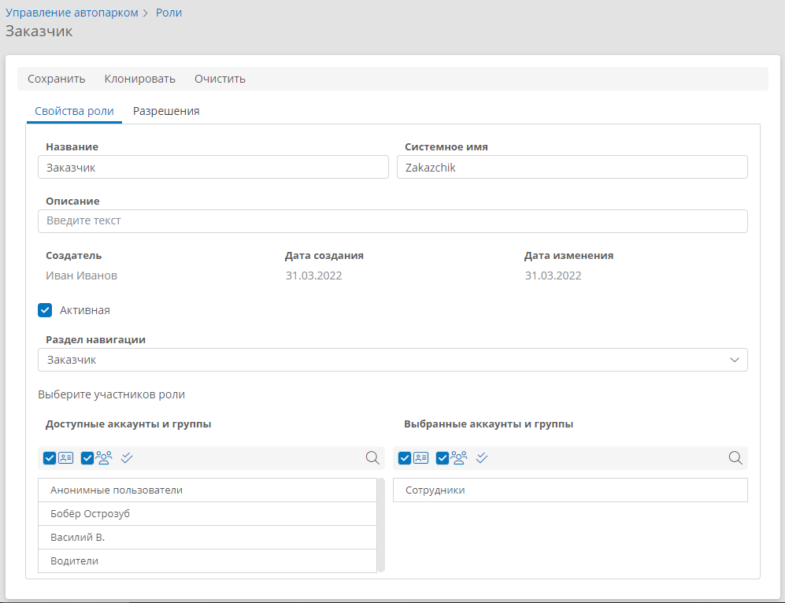
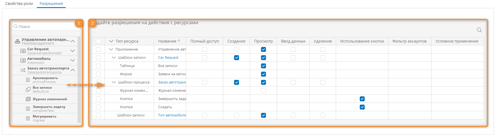

# Роли в приложении. Определения, настройка, объединение, удаление {: #roles}

## Определения {: .admonition-title #definitions}

В **{{ productName }}** предусмотрена возможность контроля доступа к различным ресурсам посредством ролей, разрешений и прав доступа.

Для контроля доступа к системным ресурсам используются **[системные роли][system_roles]**. **Системные роли** определяют политику безопасности для пользователей, настраивающих систему и приложения, а также для интеграции с внешними службами.

Для контроля доступа конечных пользователей к ресурсам приложения используются **роли в приложении**. **Роли в приложении** не дают доступа к настройке приложений или системы и использованию API.
<!--role-definition-start-->
- **Роль** — это совокупность разрешений, назначенная аккаунту или группе аккаунтов.
- **Разрешение** — это полномочие на совершение определенного действия с объектом: полный доступ, создание, просмотр, изменение, удаление и т. п.
- **Права доступа** — это совокупность всех разрешений, предоставленных аккаунту или группе аккаунтов. Права доступа формируются посредством: ролей, правил для форм, выражений, языка запросов и скриптов.
- **Ресурс** — любая сущность в системе, к которой осуществляет доступ пользователь или внешний сервис.
<!---role-definition-end-->

## Просмотр списка ролей в приложении и настройка роли {: .pageBreakBefore }

1. На странице [«**Администрирование**» приложения][apps] выберите пункт «**Роли**» <i class="fa-light fa-user-shield ">‌</i>.
2. Отобразится список ролей в данном приложении.
3. Нажмите кнопку «**Создать**» или дважды нажмите строку роли в списке.
4. Отобразится страница «**Роль**» с вкладками «**Свойства роли**» и «**Разрешения**».
5. Настройте [свойства роли](#настройка-свойств-роли).
6. Настройте [разрешения](#настройка-разрешений-для-ресурсов) на доступ к ресурсам.
7. Сохраните роль.

__

### Настройка свойств роли

<!--role-properties1-start-->
Заполните перечисленные ниже поля на вкладке «**Свойства роли**» и перейдите к вкладке «[**Разрешения**](#настройка-разрешений-для-ресурсов)» для настройки доступа к ресурсам.

- **Название** — наименование роли. **Обязательное поле**.
- **Системное имя** — уникальное имя роли.
--8<-- "system_name_requirements.md"
- **Описание** — дополнительный комментарий относительно назначения роли.
- **Создатель** — аккаунт, создавший роль.
- **Дата создания** — дата и время создания роли.
- **Изменил(а)** — аккаунт, последним изменивший роль.
- **Дата изменения** — дата и время последнего изменения роли.<!--role-properties1-end-->
- **Активная** — установите или снимите этот флажок, чтобы использовать или отключить данную роль.
- **Раздел навигации** — выберите [раздел навигации][navigation_sections_setup], который будет отображаться для аккаунтов с данной ролью.<!--role-properties2-start-->
- **Выберите участников роли**
{: #role_members}
    - **Доступные аккаунты и группы** — в этом списке отображаются аккаунты и группы, которым можно назначить данную роль.
        - Чтобы назначить роль аккаунту или группе, дважды нажмите соответствующую строку.
        - Чтобы назначить роль всем аккаунтам и группам, отображающимся в списке, нажмите кнопку «**Выбрать все**» <i class="fa-light fa-check-double"></i>.
    - **Выбранные аккаунты и группы** — в этом списке отображаются аккаунты и группы, которым назначена данная роль. Чтобы снять назначение роли аккаунту или группе, дважды нажмите соответствующую строку.
    - Содержимое обоих списков можно отфильтровать:
        - начните вводить текст в поле «**Поиск**» <i class="fa-light fa-search"></i>, в списке отобразятся подходящие аккаунты и группы;
        - установите или снимите флажок «**Аккаунты**» <i class="fa-light fa-address-card"></i> , чтобы показать или скрыть отдельные аккаунты;
        - установите или снимите флажок «**Группы**» <i class="fa-light fa-users"></i>, чтобы показать или скрыть группы аккаунтов.
<!--role-properties2-end-->

__

### Настройка разрешений для ресурсов {: .pageBreakBefore }

!!! note "Примечание"

    В списке разрешений каждая строка задаёт набор разрешений для одного ресурса.

    Набор разрешений, заданный для ресурса, применяется при соблюдении следующих условий:

    - роль назначена текущему аккаунту или группе, в которую он входит;
    - [фильтр-аккаунтов](#account-filter) не задан или возвращает текущий аккаунт;
    - [условие применения](#conditional-application) не задано или возвращает `true`.

1. Откройте вкладку «**Разрешения**», на которой предусмотрены следующие области:

    **(1)** **Список системных ресурсов** — содержит ресурсы, к которым можно предоставить доступ участникам данной роли.

    **(2)** **Список разрешений** — показывает ресурсы и назначенные для них разрешения для данной роли. Каждая строка задаёт набор разрешений для одного ресурса.

    __

2. Перетаскивайте ресурсы из **списка ресурсов** в **список разрешений**, чтобы настроить полномочия на действия с ресурсами в рамках роли.
3. Разворачивайте и сворачивайте пункты в списке ресурсов, чтобы просмотреть дочерние и родительские ресурсы.
4. Чтобы отфильтровать список ресурсов, начните вводить название ресурса в поле «**Поиск**» <i class="fa-light  fa-search"></i>. В списке ресурсов отобразятся искомые ресурсы.
5. Установите флажки и введите выражения в следующих столбцах, чтобы настроить разрешения для данного ресурса:

      - **Полный доступ** — предоставление доступа ко всем функциям администрирования ресурса, указанного в строке. При установке этого флажка остальные флажки в строке будут установлены автоматически и будут предоставлены все соответствующие разрешения на доступ к ресурсу.
      - **Создание** — разрешение на создание экземпляров (записей) ресурса.
      - **Просмотр** — разрешение на просмотр данных ресурса.
      - **Ввод данных** — разрешение на ввод данных ресурса.
      - **Удаление** — разрешение на удаление экземпляров (записей) ресурса.
      - **Использование кнопок** — отображение кнопки, указанной в строке. Если флажок снят, соответствующая кнопка для участников данной роли отображаться не будет.
      - **Фильтр аккаунтов** — предоставление заданных в строке разрешений на доступ к данным шаблона записи или процесса только определенным аккаунтам. Введите **формулу** или выражение на языке **N3**, возвращающие список аккаунтов, либо укажите **атрибут** типа «**[Аккаунт][attribute_account]**». Эти аккаунты должны входить в состав участников роли, указанных на вкладке «**Свойства роли**». Разрешения на доступ к данным, заданные в этой строке, не будут действовать для других участников роли. Фильтр аккаунтов не применяется к дочерним ресурсам шаблона, указанного в строке, таким как таблицы, формы, кнопки и журнал изменений. Разрешения для дочерних ресурсов шаблона применяются для всех участников роли, указанных на вкладке «**Свойства роли**».
      {: #account-filter }
      - **Условное применение** — предоставление разрешений, указанных в строке, только при выполнении определенного условия. В этом столбце для ресурса можно указать **формулу**, выражение на языке **N3** или **атрибут**, возвращающие значение `true` или `false`. Таким образом можно предоставить условный доступ к соответствующему ресурсу для участников данной роли.
      {: #conditional-application}

### Удаление разрешений для ресурсов

<!--role-permissions-delete-start-->

1. На вкладке «**Разрешения**» в списке разрешений выберите один или несколько ресурсов, разрешения для которых требуется удалить.
2. Нажмите кнопку «**Удалить**».
3. Подтвердите удаление разрешений.
4. Будут удалены выбранные строки разрешений.
<!--role-permissions-delete-end-->

## Восстановление исходных разрешений роли {: .pageBreakBefore }

<!--role-permissions-restore-start-->
1. Откройте роль.
2. Нажмите кнопку «**Очистить**».
3. Будут восстановлены исходные разрешения роли на момент её последнего сохранения.
<!--role-permissions-restore-end-->

## Объединение ролей

<!--role-merge-start-->
Можно создать новую роль, объединив в ней свойства нескольких других ролей. Для этого выполните указанные ниже действия.

1. Выберите несколько ролей в списке ролей.
2. Нажмите кнопку «**Объединить в новую роль**».
3. В отобразившемся окне «**Клонирование**» введите **название** и **системное имя** новой роли.
4. Нажмите кнопку «**Сохранить**».
5. Объединённая роль отобразится в списке ролей.
<!--role-merge-end-->

## Клонирование роли

<!--role-clone-start-->
Можно создать новую роль, скопировав текущую. Для этого выполните указанные ниже действия.

1. Откройте роль в приложении.
2. Нажмите кнопку «**Клонировать**».
3. В отобразившемся окне «**Клонирование**» введите **название** и **системное имя** новой роли.
4. Нажмите кнопку «**Сохранить**».
<!--role-clone-end-->

## Удаление роли

<!--role-delete-start-->
1. Выберите подлежащие удалению роли в списке ролей.
2. Нажмите кнопку «**Удалить**».
3. Подтвердите удаление роли.
<!--role-delete-end-->

--8<-- "related_topics_heading.md"

- _[Системные роли. Определения, настройка, объединение, удаление][system_roles]_
- _[Шаблон роли][role_templates]_
- _[Панель и разделы навигации. Определения, настройка, удаление][navigation_sections_setup]_


