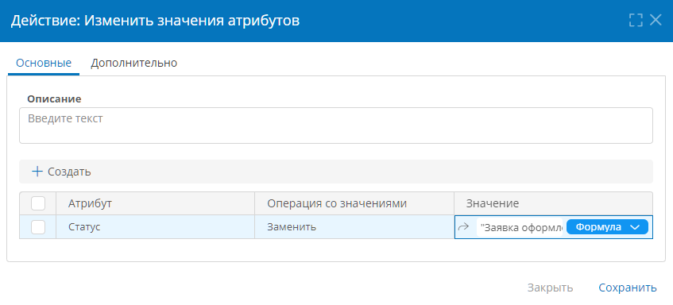

# Событие и действия сценария. Определения, типы, свойства, настройка {: #scenario_elements}

## Введение

Сценарий состоит из события, которое запускает его, и последовательности действий, которые выполняются согласно настроенной логике.

Здесь представлены сведения о настройке **[событий](#scenario_event)** и **[действий](#scenario_actions)** сценариев.

## Событие сценария {: #scenario_event}

!!! question "Определения"

    **Событие** — это элемент, наступление которого запускает сценарий.

    Все остальные элементы сценария следуют за его событием.

    Предусмотрены следующие события сценария:

    - **[Нажатие кнопки](#нажатие-кнопки)**
    - **[Создание записи](#создание-записи)**
    - **[Изменение записи](#изменение-записи)**
    - **[Запуск процесса](#запуск-процесса)**
    - **[Получение сообщения](#получение-сообщения)**
    - **[Вход токена](#вход-токена)**
    - **[Выход токена](#выход-токена)**

    У события можно настроить [общие](#scenario_event_common_properties) и [специфические для каждого типа](#свойства-событий-по-типам) свойства.

### Общие свойства событий {: #scenario_event_common_properties}

!!! note "Примечание"

    При создании нового сценария в приложении автоматически формируется ненастроенное событие «**Нажата кнопка**», после чего следует выбрать требуемый тип события и настроить его.

    При создании сценариев на входе и выходе из элементов диаграммы процесса автоматически настраиваются событие «**Вход токена**» или «**Выход токена**» соответственно и необходимое действие «**Сменить контекст**».

Для события любого типа можно настроить следующие свойства:

- **Описание** — наглядный комментарий о назначении события.
- **Тип** — тип события, запускающего сценарий.
- **Контекстный шаблон** — шаблон записи или процесса, в контексте которого будет выполняться сценарий.

!!! question "Контекст выполнения действий"

    **Контекстный шаблон** определяет контекст выполнения действий сценария, то есть набор атрибутов, которые будут доступны для манипуляций с помощью действий.

    По умолчанию действия выполняются в контексте шаблона, заданного в событии сценария.

    Контекстный шаблон может меняться внутри действий «[**Создать запись**](#создать-запись)», «[**Дублировать запись**](#создать-запись)» и «[**Сменить контекст**](#сменить-контекст)». При выходе из этих действий восстанавливается исходный контекст, заданный в событии сценария.

__

### Свойства событий по типам

#### Нажатие кнопки

Сценарий будет запускаться при нажатии указанной **кнопки** в **[контекстном шаблоне](#scenario_event_common_properties)**.

!!! note "Примечание"

    Сценарий по событию «**Нажатие кнопки**» может быть запущен при нажатии любой кнопки, кроме кнопки с операцией «**Создать**», так как для «[**создания записи**](#создание-записи)» предусмотрено специальное событие.

#### Создание записи

Сценарий будет запускаться при создании записи в **[контекстном шаблоне](#scenario_event_common_properties)**.

#### Изменение записи

Сценарий будет запускаться при изменении значений указанных **атрибутов** любой записи в **[контекстном шаблоне](#scenario_event_common_properties)**.

Если **атрибуты** не указаны, то сценарий будет запускаться при изменении значения любого атрибута любой записи в **контекстном шаблоне**.

#### Запуск процесса

Сценарий будет запускаться при создании экземпляра **[контекстного шаблона процесса](#scenario_event_common_properties)**.

#### Получение сообщения

Сценарий будет запускаться при получении сообщения через указанные подключение и путь передачи данных.

- **Подключение** — подключение для получения сообщений, инициирующих запуск сценария.
- **Путь передачи данных** — путь передачи данных для обработки сообщений.
- **Имя переменной** — переменная, в которую будет помещено содержимое сообщения, обработанное посредством пути передачи данных.

#### Вход токена

Сценарий будет запускаться перед выполнением элемента диаграммы **[контекстного шаблона процесса](#scenario_event_common_properties)**.

Это событие и необходимое после него действие «[**Сменить контекст**](#сменить-контекст)» настраиваются автоматически при создании сценария на входе в [**элемент диаграммы** процесса][process_diagram_elements].

**Тип**, **контекстный шаблон** и **элемент диаграммы** этого события не следует менять во избежание ошибок при выполнении сценария.

Чтобы настроить сценарий на входе в другой элемент диаграммы, воспользуйтесь [меню элемента][process_diagram_call_element_menu] в конструкторе диаграммы процесса.

#### Выход токена

Сценарий будет запускаться после выполнения выбранного элемента диаграммы **[контекстного шаблона процесса](#scenario_event_common_properties)**.

Это событие и необходимое после него действие «[**Сменить контекст**](#сменить-контекст)» настраиваются автоматически при создании сценария на выходе из [**элемента диаграммы** процесса][process_diagram_elements].

**Тип**, **контекстный шаблон** и **элемент диаграммы** этого события не следует менять во избежание ошибок при выполнении сценария.

Чтобы настроить сценарий на выходе из другого элемента диаграммы, воспользуйтесь [меню элемента][process_diagram_call_element_menu] в конструкторе диаграммы процесса.

## Действия сценария {: #scenario_actions}

!!! question "Определения"

    **Действие сценария** — это элемент, который выполняется после наступления **события сценария**.

    Действия сценария служат для обработки и передачи данных, организации циклов и условного выполнения других действий.

    Сценарий может содержать произвольное количество действий, выполняющихся согласно настроенной бизнес-логике.

    Некоторые действия могут содержать вложенные действия, задавать их логику выполнения и менять [контекстный шаблон](#scenario_event_common_properties).

    Предусмотрены следующие действия сценария:

    - **[Создать запись](#создать-запись)**
    - **[Дублировать запись](#дублировать-запись)**
    - **[Сменить контекст](#сменить-контекст)**
    - **[Изменить значения атрибутов](#изменить-значения-атрибутов)**
    - **[Изменить значения переменных](#изменить-значения-переменных)**
    - **[Изменить значения скриптом](#изменить-значения-скриптом)**
    - **[Создать документ по шаблону](#создать-документ-по-шаблону)**
    - **[Прикрепить документ к атрибуту](#прикрепить-документ-к-атрибуту)**
    - **[Запустить процесс](#запустить-процесс)**
    - **[Отправить сообщение](#scenario_actions_send_message)**
    - **[Проверить результат выражения](#scenario_actions_validate_expression)**
    - **[Проверить результат скрипта](#scenario_actions_validate_csharp)**
    - **[Выполнить по условиям](#выполнить-по-условиям)**;
    - **[Повторять по числовому счётчику](#повторять-по-числовому-счётчику)**
    - **[Повторять по количеству объектов](#повторять-по-количеству-объектов)**

    У действий можно настроить [общие](#scenario_actions_common_properties) и [специфические для каждого типа](#свойства-действий-по-типам) свойства.

### Общие свойства действий {: #scenario_actions_common_properties .pageBreakBefore }

Для действия любого можно настроить следующие свойства:

- Вкладка «**Основные**»
    - **Описание** — наглядный комментарий о назначении действия.
- Вкладка «**Дополнительно**»
    - **Тип** — тип действия. Его можно сменить, но рекомендуется создавать новое действие требуемого типа во избежание ошибок при выполнении сценария.
    - **Контекстный шаблон** — шаблон, в контексте которого будет выполняться действие. [Контекст](#scenario_event_common_properties) для действий сценария задаётся в **событии сценария**, а также в действиях «**Создать запись**», «**Дублировать запись**» и «**Сменить контекст**».
    - **Игнорировать все ошибки** — если установлен этот флажок, данное действие сценария будет выполняться несмотря на любые ошибки: исключения, недопустимые данные и т. п.
    - **Выполнять отдельно от сценария** — если установлен этот флажок, данное действие и все вложенные в него действия будут выполняться асинхронно с последующими действиями в сценарии.
    - **Сбрасывать кэш значений** — если установлен этот флажок, выражения, используемые в данном действии, будут вычисляться при каждом его выполнении. Если флажок снят, результаты выражений будут вычисляться единожды при первом выполнении данного действия и сохраняться в кэш, а при последующем выполнении действия будут использоваться значения из кэша.

    !!! question "Логика сброса кэша значений"

        Кэш значений создаётся при запуске сценария и очищается при его завершении.

        Сняв флажок «**Сбрасывать кэш значений**», можно повысить скорость выполнения сценария, но при этом некоторые динамические данные могут перестать обновляться. То есть, этот флажок не требуется устанавливать для действий, которые выполняются линейно и один раз или используют статические результаты выражений.
        
        Флажок следует устанавливать в случаях, когда при каждом выполнении действия выражения в нём могут возвращать разные значения, и поэтому должны вычисляться заново.

        Обычно **не** требуется устанавливать данный флажок для следующих действий:

        - Сменить контекст;
        - Повторять по числовому счётчику;
        - Повторять по количеству объектов.

__

### Свойства действий по типам {: .pageBreakBefore }

#### Создать запись

Это действие создаёт запись в указанном шаблоне. Контекст вложенных действий меняется на целевой шаблон.

Настройте действие:

- **Целевой шаблон записи** — шаблон, в котором будет создана запись.
- **Ссылка на новую запись** — атрибут типа «**Запись**» [контекстного шаблона](#scenario_event_common_properties) (указан на вкладке «**Дополнительно**»), в который будет помещена ссылка на созданную запись. Это поле можно задать, если контекстный шаблон связан с целевым шаблоном.
- **Операция со значениями** — доступно, если выбрана ссылка на новую запись:
    - **Добавить** — добавление ссылки на созданную запись в указанный атрибут (если для него установлен флажок «**Хранить несколько записей**»).
    - **Заменить** — замена имеющихся ссылок в указанном атрибуте ссылкой на созданную запись.

__

#### Дублировать запись {: .pageBreakBefore }

Это действие дублирует указанные записи. Контекст вложенных действий меняется на дублированные записи в целевом шаблоне, и вложенные действия выполняются для каждой дублированной записи.

Настройте действие:

- **Целевой шаблон записи** — шаблон, в котором будут созданы дубликаты записей. Должен совпадать с шаблоном, записи из которого возвращает **атрибут или выражение для поиска объектов**.
- **Ссылка на новую запись** — атрибут типа «**Запись**» [контекстного шаблона](#scenario_event_common_properties) (указан на вкладке «**Дополнительно**»), в который будет помещена ссылка на дублированную запись. Это поле можно задать, если контекстный шаблон связан с целевым шаблоном записи.
- **Атрибут или выражение для поиска объектов** — атрибут типа «**Запись**», ссылающийся на дублируемые записи, или выражение (**формулу**, **N3** или **DMN**), возвращающее идентификаторы дублируемых записей.
- **Операция со значениями** — доступно, если выбрана ссылка на новую запись:
    - **Добавить** — добавление ссылки на созданную запись в указанный атрибут (если у него установлен флажок «**Хранить несколько значений**»).
    - **Заменить** — замена имеющихся ссылок в указанном атрибуте ссылкой на созданную запись.
- **Дублировать дочерние записи** — установите этот флажок, чтобы дублировать запись вместе с записями, на которые она ссылается. При этом дублироваться будут только те дочерние записи, на которые ссылаются атрибуты с установленным флажком «**Удалять связанные записи**».
    - **Глубина дублирования** — количество уровней дочерних записей, подлежащих дублированию.

__

#### Сменить контекст {: .pageBreakBefore }

Это действие меняет контекст выполнения вложенных действий на указанные записи в целевом шаблоне. То есть вложенные действия выполняются для каждой записи, которую возвращает **атрибут или выражение для поиска объектов**.

Настройте действие:

- **Целевой шаблон записи** — шаблон записи, на который следует сменить контекст выполнения сценария. Должен совпадать с шаблоном, записи из которого возвращает **атрибут или выражение для поиска объектов**.
- **Атрибут или выражение для поиска объектов** — выберите атрибут типа «**Запись**» или введите выражение (**формулу**, **N3** или **DMN**), возвращающее идентификатор одной или нескольких записей, по которым требуется выполнить вложенные действия.

__

#### Изменить значения атрибутов {: .pageBreakBefore }

Это действие изменяет значения указанных атрибутов в записи [контекстного шаблона](#scenario_event_common_properties) (указан на вкладке «**Дополнительно**»).

Настройте действие:

- **Создать** — нажмите, чтобы добавить атрибут и настроить изменение его значения.
- **Удалить** — нажмите, чтобы убрать выбранный атрибут.
- **Атрибут** — подлежащий изменению атрибут [контекстного шаблона](#scenario_event_common_properties) (указан на вкладке «**Дополнительно**»).
- **Операция со значениями**
    - **Заменить** — установка в атрибуте значения, указанного в столбце «**Значение**».
    - **Удалить** — удаление всех значений из атрибута.
    - **Добавить** — добавление в атрибут значения, указанного в столбце «**Значение**» (этот пункт отображается для атрибутов типа «**Запись**», «**Аккаунт**», «**Роль**», «**Организационная единица**», «**Документ**», «**Изображение**» с установленным флажком «**Хранить несколько значений**»).
    - **Исключить** — удаление из атрибута ссылок на объекты, указанные в столбце «**Значение**» (этот пункт отображается для атрибутов типа «**Запись**», «**Аккаунт**», «**Роль**», «**Организационная единица**»,  «**Документ**», «**Изображение**» с установленным флажком «**Хранить несколько значений**»). Сами связанные объекты при этом удалены не будут.
- **Значение** — задайте одно или несколько значений атрибута посредством другого **атрибута**, **формулы**, **N3** или **DMN**.

__

#### Создать документ по шаблону {: .pageBreakBefore }

Это действие формирует файл посредством [шаблона экспорта][export_templates] и помещает ссылку на него в переменную. Затем созданный файл следует поместить в атрибут типа «**Документ**» с помощью действия «[**Прикрепить документ к атрибуту**](#прикрепить-документ-к-атрибуту)».

Настройте действие:

- **Поместить документ в переменную**
    - **Операция со значением переменной**
        - **Добавить** — добавление ссылки на сформированный файл в переменную.
        - **Заменить** — замена значения в переменной ссылкой на сформированный файл.
        - **Удалить** — обнуление значения переменной.
    - **Переменная** — укажите имя переменной, в которую будет помещена ссылка на сформированный файл.

    __

- **Шаблон экспорта** — настройте шаблон экспорта для формирования и заполнения файла значениями атрибута из [контекстного шаблона](#scenario_event_common_properties) (указан на вкладке «**Дополнительно**»).

    - **Создать** — настройте новый шаблон экспорта:
        - **Название** — наглядное название шаблона экспорта.
        - **Системное имя** — уникальное имя шаблона экспорта, формируется автоматически из названия шаблона.
        - **Файл шаблона** — загрузите файл шаблона экспорта (выбрав пункт «**Значение**»), выберите **атрибут** с типом данных «**Документ**», содержащий файл шаблона экспорта, либо задайте такой атрибут с помощью **формулы**, **N3** или **DMN**.
        - **Имя выходного файла** — задайте имя сформированного файла (без расширения; расширение будет совпадать с расширением файла шаблона экспорта) с помощью **атрибута**, **формулы**, **N3** или **DMN**.
        - **Экспортировать как PDF** — установите этот флажок, чтобы сформировать файл в формате PDF.

    __

    - **Выбрать существующий**
        - **Выберите шаблон экспорта** — укажите шаблон экспорта из [контекстного шаблона](#scenario_event_common_properties) (указан на вкладке «**Дополнительно**»), по которому будет создан и заполнен файл.

    __

#### Прикрепить документ к атрибуту {: .pageBreakBefore }

Это действие помещает в атрибуты типа «**Документ**» ссылки на файлы, сформированные с помощью действий «[**Создать документ по шаблону**](#создать-документ-по-шаблону)».

Настройте действие:

- **Создать** — нажмите, чтобы добавить атрибут и настроить прикрепление к нему файла.
- **Удалить** — нажмите, чтобы убрать выбранные атрибуты.
- **Атрибут** — атрибут типа «**Документ**», в который будут помещена ссылка на файл, указанная в столбце «**Значение**».
- **Операция со значениями**
    - **Добавить** — добавление ссылки на файл в атрибут, у которого установлен флажок «**Хранить несколько значений**».
    - **Заменить** — замена всех ссылок на файлы в атрибуте ссылкой, указанной в столбце «**Значение**» (при этом сами файлы заменены не будут).
    - **Создать** — создание в атрибуте новой ссылки на файл.
- **Значение** — укажите переменную из действия «[**Создать документ по шаблону**](#создать-документ-по-шаблону)», в которой хранится прикрепляемый файл.

__

#### Проверить результат выражения {: #scenario_actions_validate_expression .pageBreakBefore }

Это действие проверяет выполнение заданного условия.

Выражение должно возвращать логическое значение `true` или `false`. Любое значение кроме логического `true` будет считаться значением `false`.

Если выражение вернёт `false`, сценарий будет остановлен и все его действия будут отменены, как если бы он не запускался. При этом будет выведено сообщение об ошибке с заданным текстом:

--8<-- "verify_expression_result_message_view.md"

С помощью этого действия можно осуществлять отладку сценариев и, например, устанавливать запрет на сохранение записей. См. _[«Отладка формул, выражений N3, сценариев и C#-скриптов»][expression_debug]_ и [_«Сценарий. Проверка данных записи перед сохранением»_][scenario_verify_data].

Настройте действие:

- **Сообщение об ошибке** — текст, который отобразится во всплывающем сообщении, в журнале действий и ошибок и в цепочке событий, если выражение вернёт значение `false`.
- **Выражение** — условие проверки (**атрибут**, **формула**, **N3** или **DMN**). Действие сработает, если выражение вернёт значение `false`.

__

__

#### Проверить результат скрипта {: #scenario_actions_validate_csharp .pageBreakBefore }

Это действие проверяет выполнение заданного C#-скрипта.

Скрипт должен возвращать логическое значение значение `true` или `false`. Любое значение кроме логического `true` будет считаться значением `false`.

Если скрипт вернёт `false`, сценарий будет остановлен и все его действия будут отменены, как если бы он не запускался. При этом будет выведено сообщение об ошибке с заданным текстом:

--8<-- "verify_expression_result_message_view.md"

С помощью этого действия можно осуществлять отладку сценариев и, например, устанавливать запрет на сохранение записей. См. _[«Отладка формул, выражений N3, сценариев и C#-скриптов»][expression_debug]_ и [_«Сценарий. Проверка данных записи перед сохранением_][scenario_verify_data].

Настройте действие:

- **Сообщение об ошибке** —  текст, который отобразится во всплывающем сообщении, в журнале действий и ошибок и в цепочке событий, если скрипт вернёт значение `false`.
- **Выражение** — C#-скрипт, выполняющий проверку. Действие сработает, если скрипт вернёт значение `false`. Любое значение кроме `true` типа `bool` будет считаться значением `false`.

Составьте скрипт по следующему образцу:
{: .pageBreakBefore }

``` cs
class Script
{
    public static bool Main()
    {
    // Чтобы просмотреть доступные методы
    // в пространстве имён Comindware,
    // введите Comindware и точку
        var result = true; // или false
        // Добавьте код, который будет
        // менять возвращаемое значение.
        return result;
    }
}
```

__

__

#### Выполнить по условиям {: .pageBreakBefore }

Это действие выполняет вложенные в него блоки действий по заданным условиям.

- Возможно применение нескольких условий. Для каждого условия внутри действия «**Выполнить по условиям**» создаётся блок для вложенных действий, которые выполняются, если выражение возвращает `true`.
- Блок вложенных действий выполняется, если выражение для условия возвращает значение `true`.
- Блоки вложенных действий выполняются последовательно по порядку условий в списке.
- Если ни одно из условий не вернёт `true`, действие «**Выполнить по условиям**» и вложенные в него блоки действий будут пропущены.

Настройте условия:

- **Создать** — нажмите, чтобы добавить условие.
- **Удалить** — нажмите, чтобы удалить выбранные условия.
- **Название условия** — краткое описание условия.
- **Выражение** — задайте условие выполнения вложенных действий с помощью **атрибута**, **формулы**, **N3** или **DMN**.

__

#### Повторять по числовому счётчику {: .pageBreakBefore }

Это действие выполняет вложенные в него действия заданное количество раз.

Настройте действие:

- **Переменная** — переменная-счётчик, по которой будет выполняться цикл, аналогичная счётчику цикла `for`. Значение этой переменной будет увеличиваться **от 0** до значения, заданного в поле «**Количество итераций**», **минус 1**.
- **Количество итераций** — задайте количество повторений цикла посредством числового **значения**, **атрибута**, **формулы**, **N3** или **DMN**.

__

#### Повторять по количеству объектов {: .pageBreakBefore }

Это действие выполняет вложенные в него действия над объектами, заданными с помощью **атрибута**, **формулы**, **N3** или **DMN**.

Настройте действие:

- **Переменная** — переменная-итератор, по которой будет выполняться цикл, аналогичная итератору цикла `for each`. Этой переменной будет присваиваться значение заданного атрибута или выражения.
- **Атрибут или выражение для поиска объектов** — задайте объекты, по которым требуется выполнить цикл, с помощью **атрибута**, **формулы**, **N3** или **DMN**.

__

#### Запустить процесс {: .pageBreakBefore }

Это действие создаёт экземпляр выбранного шаблона процесса.

Настройте действие:

- **Шаблон процесса** — шаблон процесса, в котором будет создан новый экземпляр по текущей записи [**контекстного шаблона**](#scenario_event_common_properties) (указан на вкладке «**Дополнительно**»).

Чтобы запустить процесс по новой записи, перед этим действием необходимо выполнить действие «**Создать запись**».

__

#### Отправить сообщение {: #scenario_actions_send_message .pageBreakBefore }

Это действие отправляет сообщение посредством указанных подключения и пути передачи данных.

Настройте действие:

- **Подключение** — подключение, которое будет использоваться для отправки сообщения.
- **Путь передачи данных** — путь передачи данных, который будет использоваться для формирования сообщения.
- **Переменная с сообщением** — имя переменой, в которой хранится содержимое сообщения. До вызова действия «**Отправить сообщение**» эта переменная должна быть инициализирована с помощью действия [«**Изменить значения переменных**»](#изменить-значения-переменных). Это словарь типа ключ-значение, который указанный путь передачи данных преобразует в сообщение. Результирующее сообщение будет отправлено посредством указанного подключения.
- **Переменная для успешного ответа** — имя переменной, в которую будет помещён ответ сервера в случае успешной отправки сообщения.
- **Переменная для ответа с ошибкой** — имя переменной, в которую будет помещён ответ сервера в случае сбоя отправки сообщения.

__

#### Изменить значения переменных {: .pageBreakBefore }

Это действие изменяет значение структурированного набора переменных указанным способом.

Настройте действие:

- **Операция со значениями переменных**
    - **Добавить** — добавление в набор переменных и значений, указанных в таблице переменных.
    - **Заменить** — установка в наборе переменных и значений, указанных в таблице переменных.
    - **Исключить** — удаление из набора  всех переменных и значений.
- **Набор переменных** — имя набора переменных, подлежащего изменению. Набор переменных представляет собой словарь типа ключ-значение.
- Таблица переменных
    - **Создать** — нажмите, чтобы добавить переменную и настроить изменение её значения.
    - **Удалить** — нажмите, чтобы убрать выбранные переменные.
    - **Имя переменной** — переменная, подлежащая изменению.
    - **Значение** — задайте значение или список значений переменной с помощью **атрибута**, **формулы**, **N3** или **DMN**.

--8<-- "variable_object.md"

__

#### Изменить значения скриптом {: .pageBreakBefore }

Это действие изменяет значение указанных атрибутов определённым способом в записи [контекстного шаблона](#scenario_event_common_properties) (указан на вкладке «**Дополнительно**»).

Настройте действие:

- **Создать** — нажмите, чтобы добавить атрибут и настроить изменение его значения.
- **Удалить** — нажмите, чтобы убрать выбранный атрибут.
- **Атрибут** — подлежащий изменению атрибут контекстного шаблона записи (указан на вкладке «**Дополнительно**»).
- **Операция со значениями**
    - **Заменить** — установка в атрибуте значения, указанного в столбце «**Значение**».
    - **Удалить** — удаление всех значений из атрибута.
    - **Добавить** — добавление в атрибут значения, указанного в столбце «**Значение**» (этот пункт отображается для атрибутов типа «**Запись**», «**Аккаунт**», «**Роль**», «**Организационная единица**», «**Документ**», «**Изображение**» с установленным флажком «**Хранить несколько значений**»).
    - **Исключить** — удаление из атрибута ссылок на объекты, указанные в столбце «**Значение**»  (этот пункт отображается для атрибутов типа «**Запись**», «**Аккаунт**», «**Роль**», «**Организационная единица**»,  «**Документ**», «**Изображение**» с установленным флажком «**Хранить несколько значений**»). Сами связанные объекты при этом удалены не будут.
- **Значение** — задайте значение или список значений атрибута посредством C#-скрипта.

Составьте скрипт по следующему образцу:
{: .pageBreakBefore }

``` cs
public class Script {
    // Выберите тип метода Main() в зависимости от типа атрибута:
    // string — Текст, int, decimal — Число, dateTime — Дата и время,
    // bool — Логический, TimeSpan — Длительность,
    // IEnumerable<string> — Список значений.
    // ObjectID — переменная, в которой хранится ID экземпляра шаблона записи,
    // в контексте которого выполняется скрипт.
    // Чтобы просмотреть доступные методы
    // в пространстве имён Comindware,
    // введите Comindware и точку

    public static string Main(string ObjectID) {
        var result = "Текстовый результат действия «Изменить значения скриптом»";
        return result;
    }
}
```

__

<div class="relatedTopics" markdown="block">

--8<-- "related_topics_heading.md"

- _[Сценарии. Определение, создание, настройка, использование][scenarios]_
- _[Использование переменных в сценарии][scenario_variables]_
- _[Сценарий. Проверка данных записи перед сохранением][scenario_verify_data]_
- _[Отладка формул, выражений N3, сценариев и C#-скриптов][expression_debug]_

</div>


