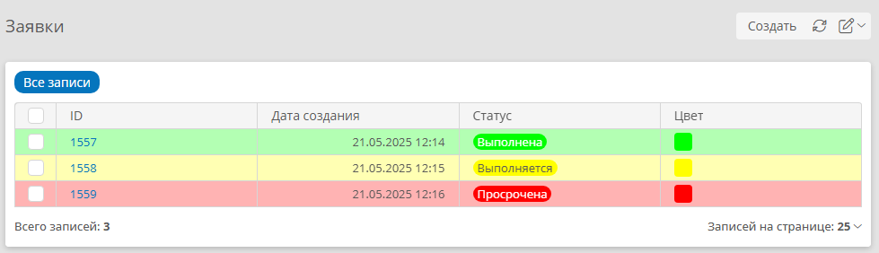

# Атрибут «Цвет» {: #attribute_color}

## Введение

Атрибут «**Цвет**» является системным, он задаёт цвет отображения записи в таблицах, шевронах и диаграммах.

- Если для записи задано значение атрибута «**Цвет**», строки этой записи в таблицах, шевроны и сектора диаграмм для неё будут отображаться с заливкой заданным цветом.
- Чтобы строки в _таблице шаблона_ окрашивались в соответствии со значением атрибута «**Цвет**», его необходимо поместить в качестве столбца в таблицу. При этом столбец можно скрыть.

Значение атрибута «**Цвет**» можно изменять следующими способами:

- вручную на форме **в шестнадцатеричном формате**;
- с помощью правил для формы, сценариев и C#-скриптов **в десятичном формате**.

Для поиска кодов цветов и их преобразования из шестнадцатеричной в десятичную форму можно воспользоваться, например, сайтом [convertingcolors.com](https://convertingcolors.com/)

Свойства системного атрибута типа «**Цвет**» не подлежат изменению.

## Примеры использования {: #attribute_color_examples }

- Ниже представлены примеры окрашивания строк таблиц шаблонов:
    - [по условию](#table_conditional_color_example)
    - [по справочнику](#table_reference_color_example)
    - [по списку значений](#table_enum_color_example)
- См. также:
    - [Пример окрашивания секторов диаграммы][form_dynamic_elements_color]
    - [Правила окрашивания шевронов][form_dynamic_elements_chevron]
    - [Пример настройки окрашивания шевронов][chevron_color_rules]
    - [Пример окрашивания секторов диаграммы][form_dynamic_elements_color_diagram_example]

<div class="admonition example" markdown="block">

### Условное окрашивание строк таблицы {: .admonition-title #table_conditional_color_example}

**Конфигурация приложения**

- Шаблон записи _«Этапы заявки»_
    - Атрибут _«Процент выполнения»_
        - **Тип данных: число**
        - **Количество знаков после запятой**: **не преобразовывать**
    - Поля на форме:
        - _Процент выполнения_
            - **Доступ: разрешить ввод**
        - _Цвет_
            - **Доступ: только чтение**
    - Столбцы в таблице _«Все записи»_:
        - _ID_
        - _Дата создания_
        - _Процент выполнения_
        - _Цвет_
- Сценарий
    - **Событие**
        - **Тип: создание записи**
        - **Целевой шаблон:** _Этапы заявки_
    - **Действие: изменить значения атрибутов**
        - **Атрибут:** _Цвет_
        - **Операция со значениями: заменить**
        - **Значение: формула**
        ``` sql
        # "16711680" — десятичный код красного цвета,
        # "16776960" — жёлтого, "65280" — зелёного.
        IF($Protsentvypolneniya < 30, "16711680",
            IF($Protsentvypolneniya < 50, "16776960",
                "65280"))
        ```


</div>
<div class="admonition example" markdown="block">

Условное окрашивание строк таблицы — продолжение
{: .admonition-title }


**Тестирование**

1. Создайте запись в шаблоне _«Этапы заявки»_.
2. Введите _процент выполнения: 15_.
3. Сохраните запись.
4. Поле _«Цвет»_ должно отобразиться красным цветом.
5. Создайте ещё несколько записей с разными значениями _процента выполнения_.
6. Откройте таблицу _«Все записи»_ шаблона _«Этапы заявки»_.
7. Строки таблицы должны отображаться цветами, соответствующими _проценту выполнения_.

__

</div>

<div class="admonition example" markdown="block">

### Окрашивание строк таблицы по справочнику статусов {: .admonition-title #table_reference_color_example}

**Конфигурация приложения**

- Шаблон записи _«Статусы заявок»_
    - Атрибут _«Статус»_
        - **Тип данных: текст**
        - **Формат отображения: обычный текст**
        - **Использовать как заголовок записей:** флажок установлен
    - Поля на форме:
        - _Цвет_
        - _Статус_
- Шаблон записи _«Этапы заявки»_
    - Атрибут _«Статус заявки»_
        - **Тип данных: запись**
        - **Связанный шаблон:** _Статусы заявок_
        - **Хранить несколько значений:** флажок снят
    - Поля на форме:
        - _Статус заявки_
            - **Представление: раскрывающийся список**
        - _Цвет_
            - **Доступ: только чтение**
    - Столбцы в таблице _«Все записи»_:
        - _ID_
        - _Дата создания_
        - _Статус заявки_
        - _Цвет_


</div>
<div class="admonition example" markdown="block">

Окрашивание строк таблицы по справочнику статусов — продолжение
{: .admonition-title }



- Сценарий
    - **Событие**
        - **Тип: изменение записи**
        - **Целевой шаблон:** _Этапы заявки_
    - **Действие: изменить значения атрибутов**
        - **Атрибут:** _Цвет_
        - **Операция со значениями: заменить**
        - **Значение: атрибут** _Статус заявки → Цвет_

**Тестирование**

1. Создайте записи в шаблоне «Статусы заявок»:

    **Статус**    | **Цвет**
    ----------    |---------
    _Выполнена_   | `#00ff00` (зелёный) {: style="background-color: green; color: white;"}
    _Выполняется_ | `#ffff00` (жёлтый) {: style="background-color: yellow; color: black;"}
    _Просрочена_  | `#ff0000` (красный) {: style="background-color: red; color: white;"}

2. Создайте запись в шаблоне _«Этапы заявки»_.
3. Выберите _статус заявки_ _«Просрочена»_.
4. Сохраните запись.
5. Поле _«Цвет»_ должно отобразиться красным цветом.
6. Создайте ещё несколько записей с разными _статусами заявок_.
7. Откройте таблицу _«Все записи»_ шаблона _«Этапы заявки»_.
8. Строки таблицы должны отображаться цветами, соответствующими _статусам заявок_.

__

</div>

<div class="admonition example" markdown="block">

### Окрашивание строк таблицы по списку значений {: .admonition-title #table_enum_color_example}

**Конфигурация приложения**

- Шаблон записи _«Заявки»_
    - Атрибут _«Статус»_
        - **Тип данных: список значений**
        - **Формат отображения: бейдж**
        - **Список значений:**

        | **Системное имя | RU**          | **Цвет**                                                               |
        | --------------- | ------------- | ---------------------------------------------------------------------- |
        | `Выполнена`     | _Выполнена_   | `#00ff00` (зелёный) {: style="background-color: green; color: white;"} |
        | `Выполняется`   | _Выполняется_ | `#ffff00` (жёлтый) {: style="background-color: yellow; color: black;"} |
        | `Просрочена`    | _Просрочена_  | `#ff0000` (красный) {: style="background-color: red; color: white;"}   |

    - Поля на форме:
        - _Статус_
        - _Цвет_
            - **Доступ: только чтение**
    - Правило для формы с действием:
        - **Элемент формы:** _Цвет_
        - **Действие: установить значение**
        - **Новое значение: формула**

        ``` sql
        FORMAT("{0}", LIST($Статус->cmw.color))
        ```

    - Столбцы в таблице _«Все записи»_:
        - _ID_
        - _Дата создания_
        - _Статус_
        - _Цвет_

**Тестирование**

1. Создайте заявку.
2. Выберите _статус_ _«Просрочена»_.
3. Сохраните заявку.
4. Поле _«Цвет»_ должно отобразиться красным цветом.
5. Создайте ещё несколько заявок с разными _статусами_.
6. Откройте таблицу _«Все записи»_ шаблона _«Заявки»_.
7. Строки таблицы должны отображаться цветами, соответствующими _статусам заявок_.

__

</div>

<div class="relatedTopics" markdown="block">

--8<-- "related_topics_heading.md"

- [Пример окрашивания секторов диаграммы][form_dynamic_elements_color]
- [Правила окрашивания шевронов][form_dynamic_elements_chevron]
- [Пример настройки окрашивания шевронов][chevron_color_rules]
- [Пример окрашивания секторов диаграммы][form_dynamic_elements_color_diagram_example]
- [Таблица. Настройка в шаблоне][table_configure_template]
- [Таблица. Настройка на форме][form_dynamic_elements_table]
- [Системные атрибуты][attributes_system]
- [Атрибуты. Определения, типы, настройка, архивирование, удаление][attributes]

</div>


