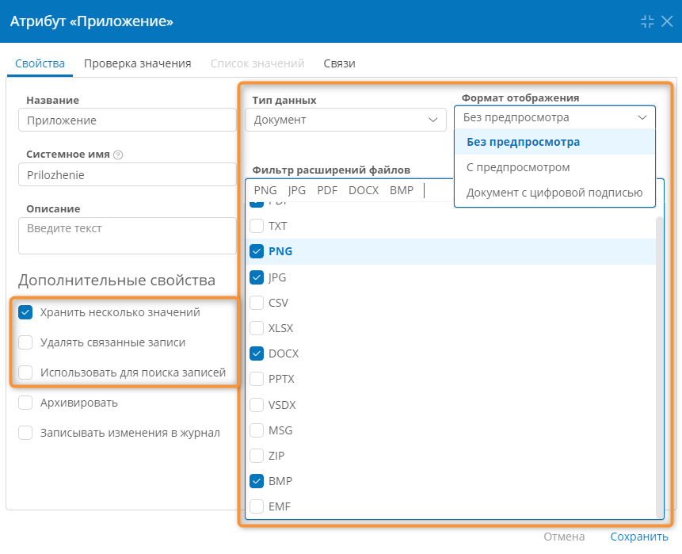
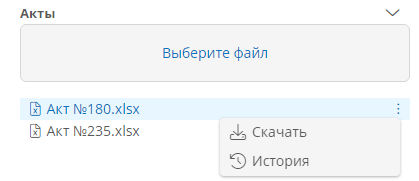

# Атрибут типа «Документ» {: #attribute_document}

## Свойства атрибута

Атрибут типа «**Документ**» содержит один или несколько загруженных конечным пользователем файлов.

!!! question "Структура атрибута типа «Документ»"

    --8<-- "attribute_document_logic.md"

!!! tip "Извлечение файлов из атрибута типа «Документ» с помощью C#"

    --8<-- "attribute_document_get_file_csharp.md"

!!! tip "Добавление файлов в атрибут типа «Документ» с помощью C#"

    --8<-- "attribute_document_add_file_csharp.md"

!!! tip "Извлечение файлов из атрибута типа «Документ» с помощью N3"

    --8<-- "attribute_document_get_file_n3.md"

!!! tip "Добавление файлов в атрибут типа «Документ» с помощью N2"

    --8<-- "attribute_document_add_file_n3.md"
    

См. примеры работы с атрибутом типа «**Документ**»:

- _[Клонирование записи вместе с прикреплёнными файлами][example_document_clone_scenario_n3]_
- _[Скачивание архива с файлами из всех строк таблицы с прикреплением архива к атрибуту][example_document_download_archive_related_records_csharp]_;
- _[Скачивание архива с файлами из выбранных строк таблицы и записи][example_document_download_archive_csharp]_
- _[Скачивание файлов в папку на сервере][example_document_download_to_server_csharp]_

Помимо **[общих свойств][attribute_common_properties]** для атрибута типа «**Документ**» предусмотрены перечисленные ниже свойства.

- «**Формат отображения**» — выберите способ представления загруженных файлов в полях атрибута на формах:

    - «**Без предпросмотра**» — отображение только имен загруженных файлов;
    - «**С предпросмотром**» — отображение миниатюр с содержимым загруженных файлов (поддерживаются только файлы PDF);
    - «**Документ с цифровой подписью**» — отображение кнопок «**Подписать**» и «**Перейти к форме**» для работы с цифровыми подписями.
- «**Фильтр расширений файлов**» — выберите типы файлов, которые можно будет загрузить в атрибут: **PDF**, **TXT**, **PNG**, **JPG**, **CSV**, **XLSX**, **DOCX**, **PPTX**, **VSDX**, **MSG**, **ZIP**, **BMP**, **EMF**. Если не выбрано ни одно расширение, то можно будет загрузить файлы любых типов. Этот раскрывающийся список не отображается, если выбран формат отображения «**С предпросмотром**»
- «**Хранить несколько значений**» — установите этот флажок, чтобы в атрибут можно было загрузить несколько файлов (по умолчанию флажок установлен).
- «**Удалять связанные записи**» — установите этот флажок, чтобы можно было удалять загруженные в атрибут файлы.
- «**Использовать для поиска записей**» — установите этот флажок, чтобы записи шаблона можно было искать по именам и содержимому загруженных в атрибут файлов. См. раздел «**[Атрибуты для поиска записей шаблона][attribute_searchable]**».

__

## Пример использования

!!! Tip "Прикрепление к записи актов, приложений и документов на подпись"

    **Конфигурация атрибутов**

    Атрибут                 | Формат отображения            | Хранить несколько значений
    ---------             |----------                   |---------
    Акты                    | Без предпросмотра             | Флажок установлен
    Приложение              | С предпросмотром              | Флажок снят
    Документы на подпись    | Документ с цифровой подписью  | Флажок установлен

    **Результирующее поведение**

    **

    **

    **

--8<-- "related_topics_heading.md"

- _[Копирование записи вместе с прикреплённым документом. Настройка сценария][example_document_clone_scenario_n3]_
- _[Общие свойства атрибутов][attribute_common_properties]_
- _[Атрибуты. Определения, типы, настройка, архивирование, удаление][attributes]_
- _[Атрибут типа «Документ». Скачивание архива с файлами из всех строк таблицы с прикреплением архива к атрибуту][example_document_download_archive_related_records_csharp]_
- _[Атрибут типа «Документ». Скачивание архива с файлами из выбранных строк таблицы и записи][example_document_download_archive_csharp]_
- _[Атрибут типа «Документ». Клонирование записи вместе с прикреплёнными файлами][example_document_clone_scenario_n3]_
- _[Атрибут типа «Документ». Скачивание файлов в папку на сервере][example_document_download_to_server_csharp]_


