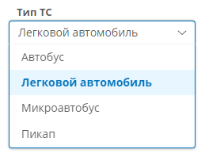

# Атрибут типа «Список значений» {: #attribute_enum }

## Описание атрибута {: #attribute_enum_description }

!!! question "Структура атрибута типа «Список значений»"

    --8<-- "attribute_enum_logic.md"

!!! tip "Получение данных из атрибута с помощью формулы"

    --8<-- "attribute_enum_get_data_formula.md"

!!! tip "Установка значения атрибута с помощью формулы"

    --8<-- "attribute_enum_set_value_formula.md"

!!! tip "Сравнение значения атрибута с помощью формулы"

    --8<-- "attribute_enum_compare_value_formula.md"

!!! tip "Префиксы N3 для работы с атрибутом"

    Для работы с атрибутом типа «**Список значений**» в выражениях на N3 (например, в сценариях) могут потребоваться следующие префиксы:

    ``` turtle
    @prefix object: <http://comindware.com/ontology/object#>.
    @prefix variable: <http://comindware.com/ontology/session/variable#>.
    @prefix session: <http://comindware.com/ontology/session#>.
    ```

!!! tip "Получение данных из атрибута с помощью N3"

    --8<-- "attribute_enum_get_data_n3.md"

!!! tip "Установка значения атрибута с помощью N3"

    --8<-- "attribute_enum_set_value_n3.md"

!!! tip "Сравнение и фильтрация значения атрибута с помощью с помощью N3"

    --8<-- "attribute_enum_compare_value_n3.md"

## Настройка свойств атрибута {: #attribute_enum_settings }

Помимо **[общих свойств][attribute_common_properties]** для атрибута типа «**Список значений**» предусмотрены перечисленные ниже свойства.

- Вкладка «**Свойства**»
    --8<-- "attribute_property_calculated.md"
    - **Формат отображения:**
        - **Текст** — значения атрибута будут отображаться в виде простого текста;
        - **Индикатор** — перед значением атрибута будет отображаться кружок (если не задан значок) или значок заданного цвета;
        - **Бейдж** — значение и значок атрибута будут отображаться на подложке заданного цвета. См. [пример](#attribute_enum_examples).

    __

    

- Вкладка «**Список значений**»
    - **Системное имя** **(обязательное поле)** — системное имя элемента списка.
    - **EN** — английское название пункта в списке.
    - **DE** — немецкое название пункта в списке.
    - **RU** — русское название пункта в списке.
    - **Цвет** — цвет, которым будет отображаться значение атрибута.
    - **Значок** — значок, который будет отображаться рядом со значением атрибута.

    __

### Создание элементов списка значений {: .pageBreakBefore #attribute_enum_create_value }

1. На вкладке «**Список значений**» нажмите кнопку «**Создать**».
2. Нажмите поле «**Системное имя**» и введите системное имя элемента списка.
3. Нажмите поле «**EN**» и введите английское отображаемое название пункта в списке.
4. Нажмите поле «**RU**» и введите русское отображаемое название пункта в списке.
5. Нажмите поле «**Цвет**» и выберите цвет пункта в списке.
6. Нажмите поле «**Значок**» и выберите значок пункта в списке.
7. Повторите шаги 1–5, чтобы создать остальные элементы списка.
8. Нажмите кнопку «**Сохранить**», чтобы сохранить атрибут.

__

### Удаление элементов из списка значений {: #attribute_enum_delete_value }

1. На вкладке «**Список значений**» установите флажки выбора для элементов, подлежащих удалению.
2. Нажмите кнопку «**Удалить**».
3. В отобразившемся окне подтверждения нажмите кнопку «**Удалить**».
4. Нажмите кнопку «**Сохранить**», чтобы сохранить атрибут.

__

## Примеры использования {: #attribute_enum_examples }

Ознакомьтесь с перечисленными ниже подробными статьями, а также простейшим примером настройки атрибута типа «**Список значений**».

- _[Вычисление текущего значения][attribute_enum_calculate_current_value]_
- _[Вычисление значения по справочнику][attribute_enum_calculate_registry]_
- _[Фильтрация связанных записей по значению атрибута с помощью N3][attribute_enum_value_filter]_
- _[Вычисление значения с помощью N3 и формул][attribute_enum_value_calculation]_

!!! example "Выбор типа ТС из списка значений на форме"

    **Исходные данные**

    В приложении настроен и помещён на форму следующий атрибут:

    - _Тип транспортного средства_

        - **Тип данных: список значений**
        - **Формат отображения: бейдж**
        - **Список значений:**

        | Системное имя  | EN        | RU                    | Цвет                                                             | Значок                                              |
        | -------------- | --------- | --------------------- | ---------------------------------------------------------------- | --------------------------------------------------- |
        | `bus`          | _Bus_     | _Автобус_             | `#ff0000`{: style="background-color: #ff0000; color: #ffffff;" } | <i class="fa-light fa-bus">‌</i> bus                 |
        | `passengerCar` | _Car_     | _Легковой автомобиль_ | `#0000ff`{: style="background-color: #0000ff; color: #ffffff;" } | <i class="fa-light fa-car">‌</i> car                 |
        | `truck`        | _Truck_   | _Грузовик_            | `#00ff00`{: style="background-color: #00ff00;" }                 | <i class="fa-light fa-truck">‌</i> truck             |
        | `van`          | _Minivan_ | _Микроавтобус_        | `#ffff00`{: style="background-color: #ffff00;" }                 | <i class="fa-light fa-van-shuttle">‌</i> van-shuttle |


    **Результирующее поведение**

    - Поле _«Тип транспортного средства»_ будет отображаться как раскрывающийся список с названиями и значками автомобилей, пункты списка будут окрашены указанными цветами:

    __

<div class="relatedTopics" markdown="block">

--8<-- "related_topics_heading.md"

- _[Атрибут типа «Список значений». Вычисление текущего значения][attribute_enum_calculate_current_value]_
- _[Атрибут типа «Список значений». Вычисление значения по справочнику][attribute_enum_calculate_registry]_
- _[Атрибут типа «Список значений». Фильтрация связанных записей по значению атрибута с помощью N3][attribute_enum_value_filter]_
- _[Атрибут типа «Список значений». Вычисление значения с помощью N3 и формул][attribute_enum_value_calculation]_
- _[Общие свойства атрибутов][attribute_common_properties]_
- _[Атрибуты. Определения, типы, настройка, архивирование, удаление][attributes]_

</div>


