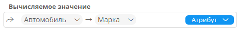
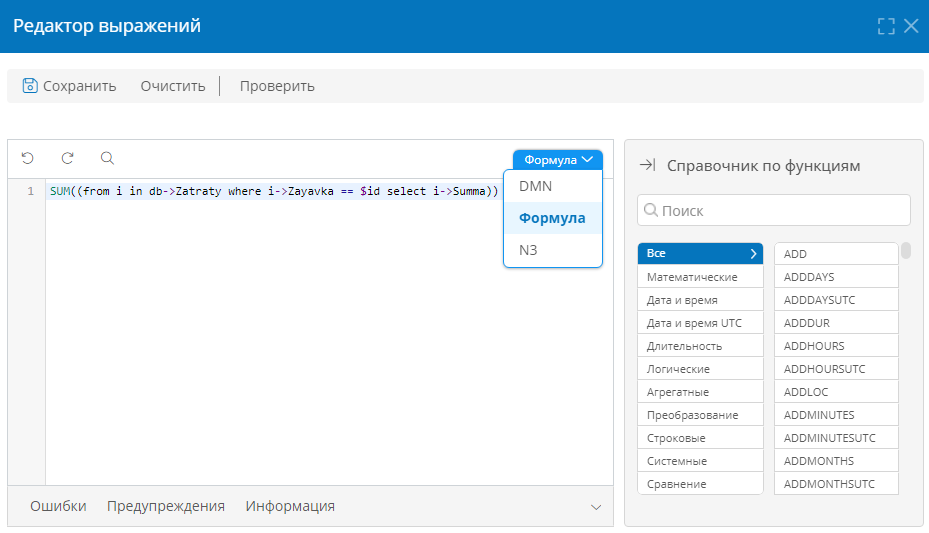

# Вычисляемые атрибуты {: #attribute_calculated}

## Определения {: .admonition-title #definitions}

- Значение атрибута может вычисляться по формуле, выражению на языке N3, таблице DMN или атрибуту.
- Вычисляемыми могут быть атрибуты следующих типов:
    - [Аккаунт][attribute_account]
    - [Гиперссылка][attribute_hyperlink]
    - [Дата и время][attribute_date_time]
    - [Длительность][attribute_duration]
    - [Запись][attribute_record]
    - [Логический][attribute_boolean]
    - [Организационная единица][attribute_organizational_unit]
    - [Роль][attribute_role]
    - [Атрибут типа «Список значений»][attribute_enum]
    - [Текст][attribute_text]
    - [Часовой пояс][attribute_timezone]
    - [Число][attribute_number]
- Значение вычисляемого атрибута не хранится в базе данных и недоступно для изменения конечным пользователем приложения.
- Значение вычисляется в момент отображения в интерфейсе пользователя и при обращении к нему.
- Изменения значения вычисляемого атрибута не записываются в журнал.
- Вычисляемый атрибут нельзя использовать для поиска записей.

## Настройка выражения для вычисления значения атрибута

!!! warning "Внимание!"

    После преобразования атрибута в вычисляемый его имеющиеся значения во всех записях будут безвозвратно удалены.

!!! note "Примечание"

    - Вычисляемое выражение должно возвращать результат, соответствующий [типу атрибута][attributes].
    - Если снять флажок «**Вычислять автоматически**» и сохранить атрибут, то атрибут перестанет быть вычисляемым и выражение для вычисления значения будет утрачено.

1. Установите флажок «**Вычислять автоматически**» в [свойствах атрибута][attributes_configure].
2. В отобразившемся поле «**Вычисляемое значение**» выберите способ вычисления значения: «**Формула**», «**DMN**», «**N3**» или «**Атрибут**».

    __

3. Нажмите поле «**Вычисляемое значение**».
4. Введите выражение в компактном редакторе выражений или выберите атрибут с помощью селектора.

    __

    __

5. Чтобы сохранить выражение в компактном редакторе, нажмите кнопку с зеленым флажком.
6. Чтобы изменить выражение в полном редакторе, нажмите кнопку «**Открыть в редакторе**».

__

## Примеры вычислений

См. подробные описание формул и языка N3 с примерами:

- [Руководстве по языку формул][formula_guide]
- [Руководстве по языку N3][n3_guide]
- [Примеры использования формул][formula_use_examples]
- [Примеры использования языка N3][n3_use_examples]

--8<-- "related_topics_heading.md"

- _[Атрибуты. Определения, типы, настройка, архивирование, удаление][attributes]_
- _[Руководстве по языку формул][formula_guide]_
- _[Руководстве по языку N3][n3_guide]_
- _[Примеры использования формул][formula_use_examples]_
- _[Примеры использования языка N3][n3_use_examples]_


