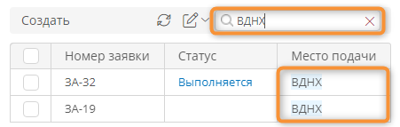

# Атрибуты для поиска записей шаблона

## Определения {: .admonition-title #definitions}

В шаблоне можно выбрать атрибуты, значения которых будут использоваться для поиска записей шаблона:

- в поле «**Поиск в системе**» в информационной панели.
- в поле «**Поиск**» в таблицах.

Поиск записей выполняется по значениям атрибутов следующих типов:

- [Текст][attribute_text]
- [Документ][attribute_document]
- [Изображение][attribute_image]

__

__

## Включение атрибута в поиск

Установите флажок «**Использовать для поиска записей**» в [свойствах атрибута][attributes_configure].

__

--8<-- "related_topics_heading.md"

**[Атрибуты. Определения, типы, настройка, архивирование, удаление][attributes]**


