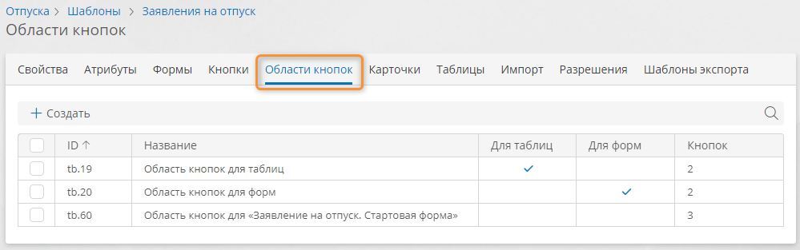

# Области кнопок. Определение, настройка, клонирование, удаление {: #button_area}

## Определения {: .admonition-title #definitions}

- **Область кнопок** содержит [кнопки][buttons] для [таблицы][table_configure] (и связанных с ней карточек), [формы][forms] или области формы.
- Все области кнопок, используемые в шаблоне, перечислены на вкладке «**Области кнопок**».
- В каждом шаблоне (кроме шаблона процесса) имеется две области кнопок по умолчанию: для таблиц и для форм.
- В шаблоне процесса имеется четыре области кнопок по умолчанию: для таблиц, для форм, для экземпляров и для диаграммы.
- При настройке формы или таблицы, область кнопок можно изменить. При этом будет создана новая область кнопок для данной таблицы или формы, а для остальных таблиц и форм будут отображаться области кнопок по умолчанию.
- Для настройки области кнопок предусмотрен [визуальный конструктор](#button_area_configure).
- Кнопка отображается для конечного пользователя, если в его [роли][roles] разрешено использование этой кнопки и если выполняется [условие отображения кнопки][buttons].

## Просмотр списка областей кнопок в шаблоне {: .pageBreakBefore }

1. Откройте шаблон и перейдите на вкладку «**Области кнопок**».
2. Отобразится список всех областей кнопок, используемых в таблицах и формах шаблона со следующими сведениями:

    - **ID** — уникальный идентификатор области кнопок.
    - **Название** — наглядное наименование области кнопок.
    - **Для таблиц** — флажок установлен для области кнопок, которая используется по умолчанию для таблиц.
    - **Для форм** — флажок установлен для области кнопок, которая используется по умолчанию для форм.
    - **Для списков задач** (у шаблона процесса) — флажок установлен для области кнопок, которая используется по умолчанию в списках задач по процессу на странице «[**Мои задачи**][my_tasks_page_configure]».
    - **Для экземпляров** (у шаблона процесса) — флажок установлен для области кнопок, которая используется по умолчанию на [диаграмме экземпляра процесса][process_diagram_view_instance].
    - **Для диаграммы** (у шаблона процесса) — флажок установлен для области кнопок, которая используется по умолчанию в режиме [просмотра диаграммы процесса][process_templates].
    - **Кнопок** — количество кнопок в области.

__

## Способы настройки областей кнопок {: #button_area_configure .pageBreakBefore}

Настроить область кнопок можно двумя способами:

- [для шаблона](#настройка-области-кнопок-для-шаблона) — настроенную область можно будет использовать по умолчанию для форм и таблиц в данном шаблоне.
- [для формы или таблицы](#настройка-области-кнопок-для-формы-или-таблицы) — при этом будет создана новая область кнопок, которая будет использоваться только для конкретной формы или таблицы.

## Настройка области кнопок для шаблона

1. Откройте или создайте область кнопок в [списке областей кнопок шаблона](#просмотр-списка-областей-кнопок-в-шаблоне).
2. Отобразится конструктор области кнопок со следующими областями:

    **(1) [Панель элементов](#настройка-элементов-области-кнопок)** — список доступных элементов для области кнопок. В панели элементов предусмотрен **поиск** кнопок.

    **(2) Макет области кнопок** — перетаскивайте элементы на макет, чтобы добавить их в область кнопок.

    **(3) Панель свойств** — настройте свойства элемента, выбранного на макете.

    **(4) Кнопки**

    - **Сохранить** — сохранение изменений области кнопок.
    - **Клонировать** — [создание дубликата области кнопок](#клонирование-области-кнопок-шаблона).
    - **Очистить** — удаление всех элементов из области кнопок.
    - **Настроить шаблон** <i class="fa-light fa-cog">‌</i> — переход к свойствам текущего шаблона.

3. Настройте свойства области кнопок:

    - **Название** — наглядное наименование, которое отображается в списке областей кнопок.
    - **Системное имя** — уникальное имя области в рамках шаблона.
    --8<-- "system_name_requirements.md"
    - **По умолчанию для таблиц** — установите этот флажок, чтобы область кнопок использовалась по умолчанию для таблиц.
    - **По умолчанию для форм** — установите этот флажок, чтобы область кнопок использовалась по умолчанию для форм.
    - **По умолчанию для списков задач** (в шаблоне процесса) — установите этот флажок, чтобы область кнопок использовалась по умолчанию для списков задач по процессу на странице «[**Мои задачи**][my_tasks_page_configure]».
    - **По умолчанию для экземпляров процесса** (в шаблоне процесса) — установите этот флажок, чтобы область кнопок использовалась по умолчанию для экземпляра процесса — на [диаграмме экземпляра процесса][process_diagram_view_instance].
    - **По умолчанию для конструктора диаграммы** (в шаблоне процесса) — установите этот флажок, чтобы область кнопок использовалась по умолчанию в режиме [просмотра диаграммы процесса][process_templates].

    !!! note "Примечание"

        В шаблоне можно назначить по одной области кнопок по умолчанию каждого типа. Например, при установке флажка «**По умолчанию для таблиц**» для новой области кнопок он будет снят у текущей области кнопок по умолчанию данного типа.

4. Настройте [элементы области кнопок](#настройка-элементов-области-кнопок).

__

## Настройка области кнопок для формы или таблицы {: .pageBreakBefore }

!!! note "Примечание"

    Для формы можно настроить несколько областей кнопок:

    - _Основная область_ _кнопок_ расположена над формой — это область кнопок для которой в шаблоне установлен флажок «**По умолчанию для форм**». При её настройке в шаблоне будет создана новая область, которая будет использоваться только для данной формы.
    - _В каждой [области][form_static_elements_area] формы и на каждой [вкладке][form_static_elements_tabs]_ предусмотрена пустая область кнопок, в которую можно поместить кнопки из текущего шаблона.
    - _В каждой таблице на форме (коллекции)_ предусмотрена пустая область кнопок, в которую можно поместить кнопки из шаблона, связанного с атрибутом типа «**Запись**».

    Для таблицы в шаблоне можно настроить одну область кнопок:

    - _Основная область_ _кнопок_ расположена над формой — это область кнопок для которой в шаблоне установлен флажок «**По умолчанию для таблиц**». При настройке её настройке в шаблоне будет создана новая область, которая будет использоваться только для данной таблицы.

1. Откройте конструктор формы или таблицы.
2. Выберите область кнопок.
3. Отобразится конструктор области кнопок со следующими областями:

    **(1) [Панель элементов](#настройка-элементов-области-кнопок)** — список доступных элементов для области кнопок. В панели элементов предусмотрен **поиск** кнопок.

    **(2) Макет области кнопок** — перетаскивайте элементы на макет, чтобы добавить их в область кнопок.

    **(3) Панель свойств** — настройте свойства элемента, выбранного на макете.

4. Настройте свойства области кнопок:

    - **Название** — наглядное наименование, которое отображается в списке областей кнопок.
    - **Системное имя** — уникальное имя области в рамках шаблона.
    --8<-- "system_name_requirements.md"

5. Настройте [элементы области кнопок](#настройка-элементов-области-кнопок).

__

## Настройка элементов области кнопок {: .pageBreakBefore }

В область кнопок можно поместить следующие элементы:

- **Группа кнопок** — отображается как раскрывающееся меню с вложенными кнопками.
- **Разделитель кнопок** — отображается как промежуток между кнопками и группами кнопок.
- **Кнопки**, настроенные в текущем шаблоне.

1. Чтобы настроить свойства области кнопок:

    - _в шаблоне,_ щелкните пустое место макета области;
    - _в таблице или на форме,_ выберите область (на форме может быть несколько областей кнопок);
    - настройте область с помощью панели свойств.

2. Чтобы добавить элемент в область кнопок, перетащите его из панели элементов на макет области.
3. Чтобы переместить элемент, например в группу кнопок, перетащите его в необходимую позицию. Целевая позиция подсвечивается при перетаскивании элемента.
4. Чтобы настроить кнопку или группу кнопок, выберите её на макете:

    - **Отображаемое название** — подпись кнопки или группы кнопок, которая отображается для конечного пользователя. Изменение названия кнопки в области кнопок не повлияет на название исходной кнопки в шаблоне.
    - **Описание** — подсказка, отображающаяся при наведении указателя мыши на кнопку или группу кнопок. Изменение описания кнопки в области кнопок не повлияет на описание исходной кнопки в шаблоне.
    - **Значок** — отображается рядом с подписью кнопки или группы кнопок.
    - **Цвет** — выберите один из цветов, заданных в текущей [теме на вкладке «**Цвета приоритетов**»][themes_graphic_diagram_color].

5. Чтобы найти необходимую кнопку, введите часть её названия в поле «**Поиск**» на панели элементов.
6. Чтобы создать новую кнопку, нажмите значок _‌_ рядом с пунктом «**Кнопки**» на панели элементов. Откроется [конструктор кнопки][buttons].
7. Чтобы отредактировать кнопку, нажмите значок _‌_ рядом с названием кнопки на панели элементов. Откроется [конструктор кнопки][buttons].
8. Чтобы удалить элемент, перетащите его за пределы макета.

    __
    

## Клонирование области кнопок шаблона {: .pageBreakBefore }

Область кнопок можно дублировать для последующей настройки. Это позволяет сохранить исходную область кнопок и использовать её отдельно.

1. Откройте [список областей кнопок](#просмотр-списка-областей-кнопок-в-шаблоне) шаблона.
2. Откройте область кнопок, дважды щёлкнув её в списке.
3. Отобразится конструктор области кнопок.
4. Нажмите кнопку «**Клонировать**».
5. В отобразившемся окне «**Клонирование**» введите **название** и _уникальное_ **системное имя** новой области кнопок.
6. Нажмите кнопку «**Сохранить**».
7. Новая область кнопок откроется в конструкторе и будет добавлена в [список областей кнопок](#просмотр-списка-областей-кнопок-в-шаблоне) шаблона.
8. [Настройте область кнопок][button_area_configure].

## Удаление области кнопок шаблона

Удалить можно области кнопок для шаблона.

Области кнопок на таблицах и формах можно только очистить.

1. В [списке областей кнопок](#просмотр-списка-областей-кнопок-в-шаблоне) установите флажки выбора для областей, подлежащих удалению.
2. Нажмите кнопку «**Удалить**».
3. Подтвердите удаление области.

--8<-- "related_topics_heading.md"

- _[Кнопки. Определение, настройка, удаление][buttons]_


