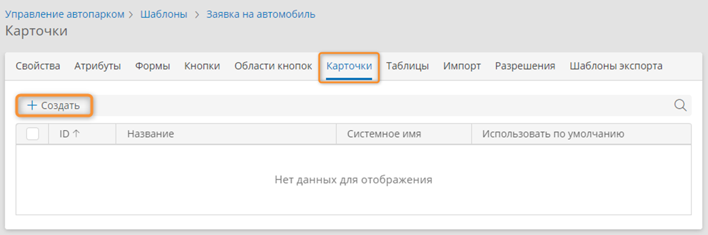

# Карточки. Определения, настройка, назначение таблице, удаление {: #cards_configure}

## Определения {: .admonition-title #definitions}

- **Карточки** — визуальное представление набора данных в виде плиток.
- Представление карточек привязано к таблице и наследует настроенные для таблицы параметры фильтрации и сортировки данных.
- Для каждой таблицы можно назначить одно представление карточек.
- В мобильном приложении вместо таблиц по умолчанию отображаются карточки.

## Просмотр списка и настройка карточек

1. Откройте вкладку «**Карточки**» любого шаблона.
2. Отобразится список карточек для шаблона.
3. Создайте или откройте представление карточек.

    __

4. Отобразится конструктор карточки со следующими элементами:

    **(1) Панель атрибутов** — содержит атрибуты, которые можно поместить на карточку.

    **(2) Макет карточки** — перетащите атрибуты с панели атрибутов на макет. Чтобы удалить поле с макета, перетащите его за пределы макета.

    **(3) Панель свойств** — настраивайте свойства карточки и полей на ней.

    **(4) Кнопки:**

    - **Сохранить** — сохранить представление карточек.
    - **Клонировать** — создать дубликат представления карточек.
    - **Очистить** — очистить макет карточки.
    - **Настроить шаблон** <i class="fa-light fa-gear"></i> — перейти к странице свойств шаблона.

    __

5. Настройте [свойства](#настройка-свойств-карточки) и [поля](#настройка-полей-карточки) представления карточек.
6. Назначьте представление карточек таблице [в шаблоне](#cards_configure_assign_to_table) или на [форме](#cards_configure_assign_to_form_table).

### Настройка свойств карточки

1. Нажмите пустое место на макете карточки.
2. Отобразится панель свойств карточки.
3. Настройте свойства представления карточек:

    - **Отображаемое название** — введите наглядное название представления карточек.
    - **Системное имя** — введите уникальное имя представления карточек.
    - **Использовать по умолчанию** — установите этот флажок, чтобы данное представление карточек отображалось для таблиц, у которых не выбрано представление карточек.
    - **Макет карточки** — выберите подходящий макет карточки.

### Настройка полей карточки

1. Перетащите необходимые атрибуты на макет карточки.
2. Выбирайте поля карточки и настройте их свойства с помощью панели свойств.

    - **Цвет фона** — выберите цвет фона поля карточки.
    - **Выравнивание** — выберите расположение данных на поле:
        - **Слева**
        - **По центру**
        - **Справа**
        - **Отображаемое название** — введите наглядное название поля для конечных пользователей.
    - **Представление** — выберите представление данных на поле карточки. В зависимости от типа атрибута доступны следующие представления:
        - **Текст**
        - **Ссылка**
        - **Количество**
        - **Изображение**
        - **Индикатор**
        - **Бейдж**
    - Выберите **значок** для поля карточки.
    - Настройте формат отображения подписи поля с помощью флажков:
        - **Полужирный**
        - **Курсив**
        - **Зачеркнутый**

3. Сохраните представление карточек.

__

## Назначение представления карточек таблице {: #cards_configure_assign_to_table}

1. Откройте вкладку «**Таблицы**» любого шаблона.
2. Откройте или создайте таблицу.
3. Отобразится конструктор таблицы.
4. На панели свойств таблицы выберите представление карточек в раскрывающемся списке «**Карточка**».
5. Сохраните таблицу, нажав кнопку «**Сохранить**».

__

## Назначение представления карточек таблице на форме {: #cards_configure_assign_to_form_table}

1. Откройте или создайте форму.
2. Выберите или создайте таблицу на форме.
3. На панели свойств таблицы выберите представление карточек в раскрывающемся списке «**Карточка**». В этом списке доступны представления карточек из шаблона, для которого формируется таблица.
4. Сохраните форму, нажав кнопку «**Сохранить**».

__

# Удаление представления карточек

1. Откройте вкладку «**Карточки**» шаблона.
2. Установите в списке флажок у представления карточек, которое требуется удалить.
3. Нажмите кнопку «**Удалить**».
4. Подтвердите удаление.

__

--8<-- "related_topics_heading.md"

**[Карточки. Использование в браузере и мобильном приложении][cards_view]**

**[Таблицы. Определения, настройка, удаление][tables]**


