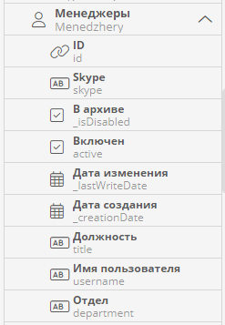
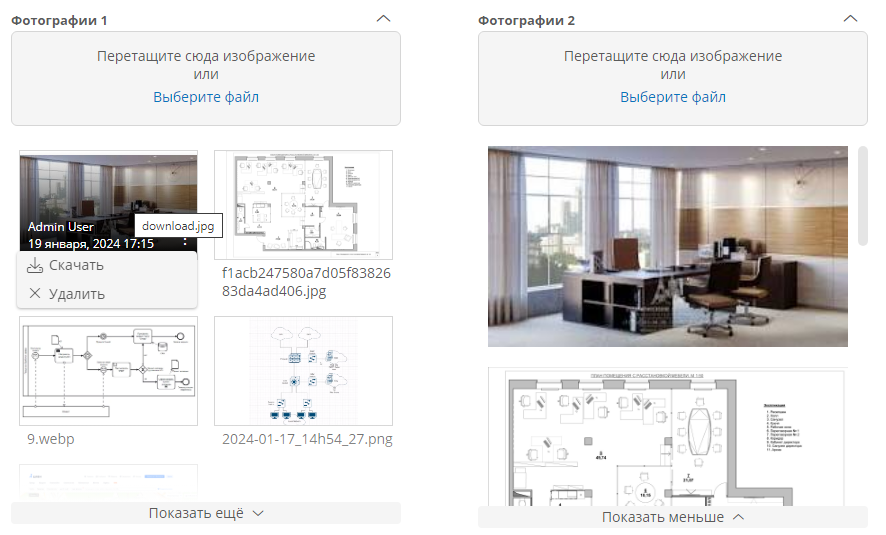
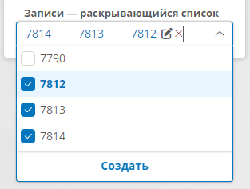
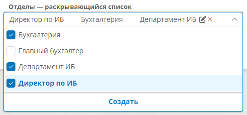
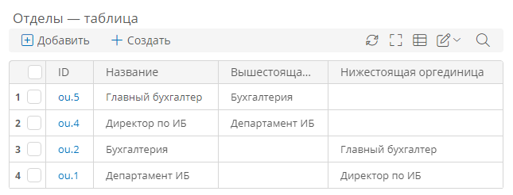
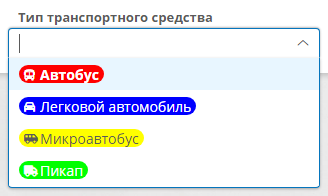
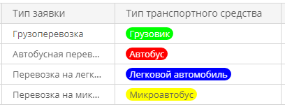
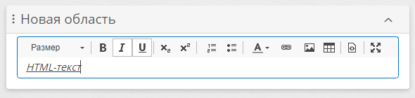
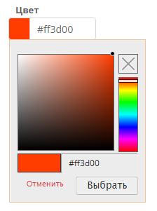

# Динамические элементы формы: поля атрибутов и вложенные формы. Настройка представления {: #form_dynamic_elements}

## Определения {: .admonition-title #definitions}

**Динамические элементы** формы — это поля атрибутов, кнопки и вложенные формы, вынесенные на форму. Их представление настраивается с помощью [конструктора формы][forms] и [правил для формы][form_rules] и формируется для пользователя на основе данных, отображающихся в форме.

- **[Поля атрибутов](#настройка-полей-атрибутов)** — при перетаскивании атрибута на форму создаётся поле, представление которого зависит от [типа атрибута][attributes].
- [**Вложенные формы**](#настройка-вложенной-формы) — вложенные формы можно поместить на форму и на **[вкладки][form_static_elements_tabs]**. Это позволяет повторно использовать формы в качестве стандартных блоков.  
- **Кнопки** — кнопки можно поместить в области кнопок, которые предусмотрены у формы, областей формы, таблиц и вкладок. См. _«[Настройка области кнопок][button_area_configure]»_ и _«[Настройка кнопки][buttons]»._

## Настройка полей атрибутов

1. Откройте [конструктор формы][forms].
2. Выберите атрибут на макете формы или перетащите атрибут из панели элементов внутрь [области][form_static_elements_area], [вкладки][form_static_elements_tabs] или [колонки][form_static_elements_columns].
3. Отобразится панель «**Свойства поля**».
4. Настройте [общие свойства](#общие-свойства-полей) и представление поля в соответствии с его типом:
    - [Аккаунт](#аккаунт)
    - [Гиперссылка](#form_dynamic_elements_hyperlink)
    - [Дата и время](#дата-и-время)
    - [Длительность](#длительность)
    - [Документ](#документ)
    - [Запись](#запись)
        - [Раскрывающийся список](#настройка-раскрывающегося-списка)
        - [Таблица](#form_dynamic_elements_table)
        - [Шевроны](#form_dynamic_elements_chevron)
        - [Диаграмма Ганта](#настройка-диаграммы-ганта)
        - [Карта](#form_dynamic_elements_map)
    - [Изображение](#изображение)
    - [Логический](#логический)
    - [Обсуждение](#обсуждение)
    - [Организационная единица](#организационная-единица)
    - [Роль](#роль)
    - [Связанные процессы](#связанные-процессы)
    - [Список значений](#список-значений)
    - [Текст](#текст)
    - [Цвет](#form_dynamic_elements_color)
    - [Чертёж](#form_dynamic_elements_drawing)
    - [Число](#число)
    - [Штрихкод](#штрихкод)

### Общие свойства полей

Для большинства полей на форме предусмотрены перечисленные ниже свойства.

- **Отображаемое название** / **Заголовок** — отображаемая для пользователя подпись поля. Названия полей также отображаются в правилах для формы.

    !!! note "Примечание"

        - Отображаемое название поля изначально совпадает с названием атрибута, связанного с полем.
        - Поле на форме можно переименовать, и это не повлияет на название связанного с ним атрибута.
        - Чтобы у поля не было подписи, введите в качестве отображаемого названия пробел.

- **Системное имя** — уникальное имя поля в рамках текущей формы, используемое для настройки [правил для формы]({{ kbArticleURLPrefix }}2537).  Может содержать только буквы латинского алфавита, цифры и знак «_». Заполняется автоматически.

    !!! note "Примечание"

        - Системное имя поля на форме изначально совпадает с системным именем атрибута, связанного с полем.
        - Если вынести на поле один и тот же атрибут несколько раз, системные имена его полей будут автоматически пронумерованы по порядку добавления на форму.
        - Системное имя поля может не совпадать с системным именем атрибута, связанного с полем.

- **Путь к атрибуту** — полный путь к атрибуту, с которым связано поле:

    - для атрибута текущего шаблона отображается системное имя атрибута;
    - для из связанной записи отображается полны путь к атрибуту в виде цепочки системных имён атрибутов.

- **Доступ** — режим доступа к данным атрибута и отображения поля:

    - **Требовать ввод** — пользователь обязательно должен ввести данные в поле.
    - **Разрешить ввод** — пользователь сможет вводить данные в поле, но может оставить его пустым.
    - **Только чтение** — данные в поле можно будет только просматривать.
    - **Скрыть** — поле не будет отображаться на форме. Показать скрытое поле можно с помощью [правил для формы][form_rules].

- **Подсказка** — текст, который отображается пользователю при нажатии знака вопроса, расположенного рядом с подписью поля.
- **Свойства атрибута** — сведения об атрибуте, с которым связано поле.

__

### Аккаунт

Для поля атрибута типа «**Аккаунт**» предусмотрены следующие варианты отображения (см. иллюстрации ниже):

- Если атрибут хранит одно значение:

    - название аккаунта (если поле доступно только для чтения);
    - раскрывающийся список (если в поле разрешён ввод, возможно выбирать аккаунты).

- Если атрибут хранит несколько значений:

    - список аккаунтов (если поле доступно только для чтения);
    - раскрывающийся список (если в поле разрешён ввод, возможно выбирать аккаунты);
    - таблица (если в поле разрешён ввод, возможно добавлять, исключать, удалять и редактировать аккаунты).

#### Примеры отображения

__

__

__

#### Настройка представления

Представление поля атрибута типа «**Аккаунт**» на форме определяется свойствами поля.

Помимо [общих свойств](#общие-свойства-полей) у этого поля предусмотрены следующие свойства:

- **Представление** — выберите представление поля на форме:
    - **Раскрывающийся список** — пользователь может выбрать один или несколько аккаунтов. В раскрывающийся список выводятся первые 50 аккаунтов, отсортированных по алфавиту. Если аккаунтов больше 50, то отобразится предупреждение — _«Отображены не все значения, уточните поиск»_.
        - **Максимум аккаунтов** — укажите максимальное количество аккаунтов, которые ID которых можно выбрать в раскрывающемся списке (то есть добавить в атрибут). Остальные аккаунты будут отображаться в списке, но выбрать их будет нельзя.
        - **Фильтр** — задайте список ID аккаунтов, которые должны отображаться в раскрывающемся списке. Для этого укажите **атрибут** типа «**Аккаунт**» либо введите **формулу** или выражение на языке **N3**.
    - **Таблица** — настройте таблицу аналогично [таблице для атрибута типа «Запись»](#form_dynamic_elements_table).

#### Добавление на форму атрибутов шаблона аккаунта

Так как атрибут типа «**Аккаунт**» связан с шаблоном аккаунта (системным или пользовательским), на формы и в таблицы можно добавить атрибуты шаблона аккаунта, а также связанных с ним шаблонов любого уровня вложенности.

1. В панели элементов конструктора формы разверните атрибут типа «**Аккаунт**», нажав стрелку вниз _‌_ справа от названия атрибута.
2. Отобразится список атрибутов шаблона аккаунта, связанного с атрибутом.
3. Перетащите на макет формы или в таблицу требуемый атрибут аккаунта.
4. Настройте поле или столбец атрибута с помощью панели «**Свойства поля**» или «**Свойства столбца таблицы**».

__

### Гиперссылка {: #form_dynamic_elements_hyperlink}

Представление этого поля на форме определяется свойствами поля и **допустимыми схемами URI**, заданными в [свойствах атрибута][attribute_hyperlink].

Помимо [общих свойств](#общие-свойства-полей) у этого поля предусмотрено одно свойство:

- **Замещающий текст** — введите наглядный образец гиперссылки, которую следует вводить пользователю. Этот текст будет отображаться в пустом поле

#### Пример использования

1. Создайте и поместите на форму атрибут _«Веб-сайт магазина»_:
    - **Тип данных: Гиперссылка**
    - **Допустимые схемы URI:** **HTTPS** и **HTTP**
2. Откройте форму.
3. Введите в поле _«Веб-сайт магазина»_ адрес  `https://company.ru`
4. Адрес должен отобразиться в виде гиперссылки.

    __

5. Введите в поле _«Веб-сайт магазина»_ адрес  `company.ru` без префикса `https://`
6. Над полем должно отобразиться сообщение об ошибке «**Не соответствует формату HTTPS-ссылки**». 

    __

### Дата и время

Представление поля атрибута типа «**Дата и время**» на форме определяется свойствами поля и **форматом отображения**, заданным в [свойствах атрибута][attribute_date_time].

У этого поля предусмотрены только [общие свойства](#общие-свойства-полей).

См. также статью [_«Работа с атрибутом типа «Дата и время»_][attribute_date_time_use].

### Длительность

Представление поля атрибута типа «**Длительность**» на форме определяется свойствами поля и **форматом отображения**, заданным в [свойствах атрибута][attribute_duration].

Помимо [общих свойств](#общие-свойства-полей) у этого поля предусмотрены следующие свойства:

- **Показать незаполненные части** — установите этот флажок, чтобы в поле отображались разряды значения длительности, даже если они равны нулю:

    - флажок установлен: значение `2 минуты` будет отображаться как  `0 д 0 ч 2 м 0 с`
    - флажок снят: значение `2 минуты` будет отображаться как  `2 м`

- **Минимальное значение** — укажите минимально допустимое значение, которое может вести в поле пользователь.
- **Максимальное значение** — укажите максимально допустимое значение, которое может вести в поле пользователь.

    !!! warning "Логика корректировки значения"

        При вводе значения за пределами указанных лимитов значение будет автоматически скорректировано.

        Например, если минимальное значение — `2 ч`, максимальное — `3 ч`, то при вводе значения `4 ч 5 м` оно будет преобразовано в `3 ч`.

### Документ

Представление поля атрибута типа «**Документ**» на форме определяется свойствами поля и **форматом отображения**, заданным в [свойствах атрибута][attribute_document], см. примеры на иллюстрациях ниже.

Помимо [общих свойств](#общие-свойства-полей) у этого поля предусмотрено следующие свойства:

- **Максимальное количество файлов** — укажите, сколько файлов пользователям разрешено прикреплять к атрибуту. Значение по умолчанию 0 означает неограниченное количество файлов.
- **Разрешить удаление** — установите этот флажок, чтобы пользователи могли удалять прикреплённые к атрибуту файлы.

#### Пример использования

1. Создайте и поместите на форму следующие атрибуты:

    |Атрибут|Формат отображения|Хранить несколько значений|
    |---|---|---|
    |Акты|Без предпросмотра|Флажок установлен|
    |Приложение|С предпросмотром|Флажок снят|
    |Документы на подпись|Документ с цифровой подписью|Флажок установлен|

2. В конструкторе формы установите для любого из созданных полей флажок «**Разрешить удаление**».
3. Откройте форму и прикрепите документы к созданным полям.
4. Попробуйте скачать и удалить документы, просмотреть их историю и предпросмотр.

__

__

__

### Изображение

Представление поля атрибута типа «**Изображение**» на форме определяется сочетанием свойств поля и [свойств атрибута][attribute_image].

Помимо [общих свойств](#общие-свойства-полей) у этого поля предусмотрены следующие свойства:

- **Формат отображения** — выберите внешний вид поля с изображениями, прикреплёнными к атрибуту, на форме:

    - **Карточки** — изображения будут отображаться друг под другом в один столбец с прокруткой;
    - **Картинка** — изображения будут отображаться друг под другом в два столбца с прокруткой.

- **Максимальное количество файлов** — укажите, сколько файлов пользователям разрешено прикреплять к атрибуту.
- **Разрешить удаление** — установите этот флажок, чтобы пользователи могли удалять прикреплённые к атрибуту файлы.

#### Пример использования

1. Создайте и поместите на форму атрибут «_Фотографии_» типа «**Изображение**»:

    - **Тип данных: Изображение**
    - **Хранить несколько значений:** флажок установлен

2. Ещё раз поместите атрибут «_Фотографии_» на форму.
3. В конструкторе формы настройте свойства полей «_Фотографии_»:

    - установите флажок «**Разрешить удаление**» для одного из полей;
    - выберите для одного поля **формат отображения** «**Карточки**», а для другого «**Картинки**».

4. Откройте форму и прикрепите несколько файлов к любому из полей «_Фотографии_».
5. При загрузке каждого изображения будет отображаться окно «**Кадрирование изображения**»:

    - если кадрировать изображение не требуется, нажмите кнопку «**Отменить обрезку**»;
    - чтобы кадрировать изображение, выберите его фрагмент и нажмите кнопку «**Обрезать**».

6. Попробуйте скачать, просмотреть и удалить изображения:

    - чтобы скачать или удалить изображение, наведите на него указатель мыши и в меню с троеточием выберите команду;
    - чтобы просмотреть изображение на весь экран, нажмите на него — отобразится галерея прикреплённых к атрибуту изображений;
    - чтобы просмотреть все изображения в списке, нажмите кнопку «**Показать ещё**».

__

### Логический

Представление поля атрибута типа «**Логический**» на форме определяется свойствами поля.

Помимо [общих свойств](#общие-свойства-полей) у этого поля предусмотрены следующие свойства:

- **Представление** — выберите внешний вид поля на форме:

    - **Флажок** — поле будет отображаться в виде флажка, который может быть в снят или установлен;
    - **Переключатель** — поле будет отображаться как в виде двух пунктов, по умолчанию — «**Да**» и «**Нет**».

        - **Изменить названия вариантов** — установите этот флажок, чтобы изменить подписи пунктов переключателя.

            - **Истина** — введите подпись для значения `true`;
            - **Ложь** —  введите подпись для значения `false`;

#### Пример использования

1. Создайте и поместите на форму атрибут _«Решение по заявлению на отпуск»_ типа «**Логический**».
2. Ещё раз поместите атрибут _«Решение по заявлению на отпуск»_ на форму.
3. Для первого поля оставьте **представление** по умолчанию «**Флажок**».
4. Для второго поля выберите представление «**Переключатель**», установите флажок «**Изменить названия вариантов**» и переименуйте пункты переключателя:

    - **Истина** — _Согласовать отпуск_;
    - **Ложь** — _Отказать в отпуске_.

5. Откройте форму и выбирайте пункты переключателя, а также снимите и установите флажок.
6. Значения полей должны меняться, как показано на иллюстрации.

__

### Запись

Атрибут типа «**Запись**» содержит одну или несколько ссылок на связанный шаблон записи, что позволяет выносить на форму данные из связанных шаблонов.

Для поля атрибута типа «**Запись**» предусмотрены перечисленные ниже варианты отображения (см. иллюстрации).

- Если атрибут хранит одно значение:

    - заголовок записи — гиперссылка на запись или простой текст в зависимости от формата отображения атрибута (если поле доступно только для чтения);
    - раскрывающийся список (если в поле разрешён ввод, возможно выбирать, создавать и редактировать записи).

- Если атрибут хранит несколько значений:

    - список записей — гиперссылки на записи или простой текст в зависимости от формата отображения атрибута (если поле доступно только для чтения);
    - раскрывающийся список (если в поле разрешён ввод, возможно выбирать, создавать и редактировать записи);
    - таблица (если в поле разрешён ввод, возможно создавать, редактировать, добавлять, дублировать, исключать, архивировать и удалять записи);
    - шевроны;
    - диаграмма Ганта;
    - карта (возможно создавать, удалять и редактировать записи).

#### Настройка представления

Представление поля атрибута типа «**Запись**» на форме определяется сочетанием свойств поля и [свойств атрибута][attribute_record].

Помимо [общих свойств](#общие-свойства-полей) у этого поля предусмотрены следующие свойства:

- **Представление** — выберите представление поля на форме:

    - **Раскрывающийся список** — [настройте раскрывающийся список](#настройка-раскрывающегося-списка);
    - **Таблица** — [настройте таблицу](#form_dynamic_elements_table);
    - **Шевроны** — [настройте шевроны](#form_dynamic_elements_chevron);
    - **Диаграмма Ганта** — [настройте диаграмму Ганта][creating_gantt_chart];
    - **Карта** — настройте представление карты.

#### Добавление на форму атрибутов связанного шаблона записи

Так как атрибут типа «**Запись**» связан с шаблоном записи, на формы и в таблицы можно добавить атрибуты связанного шаблона, а также связанных с ним шаблонов любого уровня вложенности.

1. В панели элементов конструктора формы разверните атрибут типа «**Запись**», нажав стрелку вниз <i class="js-default-anchor  fal  fa-angle-down  anchor" style="box-sizing: border-box; -webkit-font-smoothing: antialiased; display: var(--fa-display,inline-block); font-style: normal; font-variant: normal; line-height: 1; text-rendering: auto; font-family: ’Font Awesome 6 Pro’; font-weight: 300; color: #545764; font-size: 15px; letter-spacing: 0.2px; orphans: 2; text-align: left; text-indent: 0px; text-transform: none; widows: 2; word-spacing: 0px; -webkit-text-stroke-width: 0px; white-space: normal; background-color: #ffffff; text-decoration-thickness: initial; text-decoration-style: initial; text-decoration-color: initial;">‌</i> справа от названия атрибута.
2. Отобразится список атрибутов шаблона аккаунта, связанного с атрибутом.
3. Перетащите на макет формы или в таблицу требуемый атрибут аккаунта.
4. Настройте поле или столбец атрибута с помощью панели «**Свойства поля**» или «**Свойства столбца таблицы**».

__

#### Настройка раскрывающегося списка

Если для поля атрибута типа «**Запись**» выбрано **представление** «**Раскрывающийся список**», в нём будут отображаться заголовки записей связанного шаблона. При нажатии поля пользователь сможет выбрать одну или несколько записей.

В раскрывающийся список выводятся первые 50 записей, отсортированных по алфавиту. Если записей больше 50, то отобразится предупреждение — _«Отображены не все значения, уточните поиск»_.

__

__

Помимо [общих свойств](#общие-свойства-полей) поля для раскрывающегося списка можно настроить следующие свойства:

- **Создание записей** — установите этот флажок, чтобы пользователь мог создавать записи в связанном шаблоне, нажав кнопку в раскрывающемся списке. Для этого отобразится всплывающее окно с формой связанного шаблона.
- **Редактирование записей** — установите этот флажок, чтобы пользователь мог редактировать записи в связанном шаблоне, нажав кнопку в раскрывающемся списке. Для этого отобразится всплывающее окно с формой связанного шаблона.
- **Форма** — выберите форму, которая будет использоваться для создания и редактирования записей. Если форма не указана, используется основная форма связанного шаблона.
- **Фильтр** — задайте список ID записей из связанного шаблона, которые должны отображаться в раскрывающемся списке. Для этого укажите **атрибут** типа «**Запись**» либо введите **формулу** или выражение на языке **N3**.

#### Настройка таблицы {: #form_dynamic_elements_table}

Если для поля атрибута типа «**Запись**» выбрано **представление** «**Таблица**», то в поле будет отображаться список записей связанного шаблона. В зависимости от настроек таблицы на форме пользователь сможет создавать, добавлять, исключать, редактировать и удалять записи. Кроме того, таблица может отображаться в виде иерархического дерева записей с возможностью изменения их порядка и вложенности.

__

Помимо [общих свойств](#общие-свойства-полей) поля для таблиц можно настроить следующие свойства:

- **Дочерние записи** — используется для построения иерархического дерева записей в таблице. Укажите атрибут типа «**Запись**», связанный с шаблоном, по которому формируется таблица. Этот атрибут должен хранить несколько значений, а также иметь взаимную связь с атрибутом в том же шаблоне (ссылка на родительские записи).
- **Упорядочивание** — чтобы сохранять и изменять порядок следования строк в таблице, укажите атрибут типа «**Число**». Порядковый номер строки будет автоматически меняться при её перемещении в таблице.
- **Иерархическая нумерация** — укажите атрибут типа «**Текст**», который будет хранить иерархические номера строк древовидной таблицы (1, 1.1, 1.2, 1.2.1 и т. д.). Номера строк будут автоматически меняться при перемещении строк в таблице..
- **Сортировка** — укажите столбец для первоначальной сортировки строк таблицы.
- **Направление сортировки** — укажите направление сортировки строк таблицы по выбранному столбцу.

    !!! note "Примечание"

        Для древовидной таблицы сортировка будет работать только в ручном режиме

- **Закрепить столбцы** — укажите количество столбцов, которые следует закрепить в левой части таблицы. Эти столбцы не будут прокручиваться по горизонтали.
- **Карточки** — выберите [представление карточек][cards], которое требуется использовать для таблицы.
- **Фильтр**

    - **Отображаемые записи** — задайте список ID записей из связанного шаблона, которые должны отображаться в виде шевронов. Для этого укажите **атрибут** либо введите **формулу** или выражение на языке **N3**.
    - **Добавляемые записи** — задайте список ID записей из связанного шаблона, которые должны отображаться в списке при нажатии кнопки «**Добавить**» в таблице. Для этого укажите **атрибут** типа «**Запись**» либо введите **формулу** или выражение на языке **N3**.

- **Отключить выбор записей** — установите этот флажок, чтобы отключить возможность выбора записей в таблице. При этом в таблице не будет отображаться столбец с флажками выбора строк.
- **Показывать архивные записи** — установите этот флажок, чтобы в таблице отображались архивные записи из связанного шаблона.

##### Пример настройки древовидной таблицы с иерархической нумерацией

Обычно в таблице на форме шаблона отображаются записи из другого шаблона записи посредством связи «один ко многим». Например, на форме _«Заявка»_ отображается таблица _«Позиции заявки»_.

Но можно построить древовидную таблицу из взаимосвязанных записей одного и того же шаблона. Например, в таблице могут отображаться задачи и подзадачи, проекты и подпроекты, подразделения и дочерние подразделения.

Рассмотрим пример настройки шаблона и таблицы для отображения дочерних работ на форме текущей работы:

- каждая работа может быть связана с несколькими дочерними работами, у каждой работы может быть только одна родительская работа.

1. Создайте шаблон записи «Работы».
2. В шаблоне «Работы» создайте следующие атрибуты:

    |Название атрибута|Тип данных|Свойства|
    |---|---|---|
    |_Дочерние работы_|**Запись**|
**Связанный шаблон:** _Работы_

**Формат отображения:** **гиперссылка**

**Хранить несколько значений:** флажок установлен

**Взаимная связь с атрибутом:** **с новым**

- **Свойства нового атрибута**

  - **Название:** _Родительская работа_

    - **Хранить несколько значений:** флажок снят
|
    |_Порядковый номер_|**Число**|**Количество знаков после запятой: не преобразовывать**|
    |_Иерархический номер_|**Текст**|**Формат отображения: обычный текст**|

3. Вынесите на основную форму шаблона _«Работы»_ атрибут _«Дочерние работы»_.
4. В свойствах поля _«Дочерние работы»_ на форме выберите **представление** «**Таблица**».
5. Настройте **свойства таблицы** _«Дочерние работы»_:

    - **Дочерние записи:** _Дочерние работы_
    - **Упорядочивание:** _Порядковый номер_
    - **Иерархическая нумерация:** _Иерархический номер_
    - **Сортировка:** _Иерархический номер_
    - **Направление сортировки:** _По возрастанию_

6. В панели элементов конструктора формы раскройте атрибут _«Дочерние работы»._
7. Из раскрытого списка _«Дочерние работы»_ вынесите в таблицу атрибуты _«Иерархический номер»_, _«Порядковый номер»_ и _«Родительская работа»_.
8. Выберите область кнопок таблицы _«Дочерние работы»_ и добавьте на неё кнопки «<i class=" fal  fa-plus " aria-hidden="true">‌</i> **Создать**», «<i class=" fal  fa-plus-square " aria-hidden="true">‌</i> **Добавить**», «<i class=" fal  fa-times " aria-hidden="true">‌</i> **Исключить**».
9. Сохраните форму.
10. Перейдите к странице свойств шаблона _«Работы»_.
11. Создайте запись в шаблоне _«Работы»_.
12. Протестируйте работу древовидной таблицы:
    - На форме текущей работы создайте несколько записей в таблице _«Дочерние работы»_.
    - Сохраните запись текущей работы. 
    - Переместите одну работу внутрь другой, взявшись за вертикальное многоточие <i class="fa-light fa-ellipsis-vertical">‌</i> в первом столбце таблицы.
    - Переместите любую работу между уровнями иерархии:
        - выберите работу с помощью флажка в первом столбце таблицы;
        - нажмите кнопку <i class=" fal  fa-arrow-alt-from-left " aria-hidden="true">‌</i>, чтобы переместить работу на один уровень иерархии вниз;
        - нажмите кнопку <i class=" fal  fa-arrow-alt-from-right " aria-hidden="true">‌</i>, чтобы переместить работу на один уровень иерархии вверх.
    - Изменяйте порядковые номера работ, чтобы переместить их на новые позиции в таблице.

__

#### Настройка шевронов {: #form_dynamic_elements_chevron}

Если для поля атрибута типа «**Запись**» выбрано **представление** «**Шевроны**», то в поле будет отображаться последовательность цветных плашек с заголовками записей связанного шаблона.

- Каждый шеврон содержит заголовок связанной с ним записи в виде гиперссылки на запись.
- Пользователь может нажимать шевроны для просмотра связанных с ними записей во всплывающем окне.
- Цвет шеврона можно задать двумя способами:
    - с помощью системного атрибута «**Цвет**» связанной записи;
    - с помощью **правил окраски записей**.

См. также статьи _«[Шевроны. Правила окрашивания. Пример настройки][chevron_color_rules]»_ и _«[Шевроны. Визуализация этапов процесса. Пример настройки][chevron_stage_render]»_.

__

Помимо [общих свойств](#общие-свойства-полей) поля для шевронов можно настроить следующие свойства:

- **Упорядочивание** — укажите атрибут типа «**Число**», по значению которого будет выстраиваться последовательность записей в виде шевронов.
- **Фильтр** — задайте список ID записей из связанного шаблона, которые должны отображаться в виде шевронов. Для этого укажите **атрибут** либо введите **формулу** или выражение на языке **N3**.
- **Форма** — выберите форму связанного шаблона записи, которая должна открываться при нажатии по шеврону.
- **Правила окраски записей** — [настройте правила окрашивания шевронов](#настройка-правил-окрашивания-шевронов) на форме.

    !!! note "Примечание"

        - Если не настроены правила окраски шевронов или не сработает ни одно правило, они будут окрашиваться цветом, указанным в системном атрибуте «[**Цвет**](#form_dynamic_elements_color)» в соответствующих записях. Если при этом для записи атрибут «**Цвет**» не задан, то шеврон будет окрашен в зелёный цвет.
        - Правил окраски шевронов может быть неограниченное количество, но для оптимальной работы платформы рекомендуется задавать не более 8 условий.
        - Если для одной записи одновременно сработают несколько правил, возвращающих разные цвета, то шеврон будет окрашен в цвет, заданный последним сработавшим правилом.
        - Следует помнить, что условие окрашивания шеврона вычисляется в контексте шаблона, связанного с текущим шаблоном посредством с атрибута типа «**Запись**». Поэтому обратиться к атрибутам текущего шаблона, на форме которого размещены шевроны, можно только посредством обратной ссылки. Например, к атрибуту _«Название магазина»_ текущего шаблона можно обратиться посредством атрибута _«Магазин»_ из связанного шаблона, который ссылается на текущий шаблон: `$Magazin->Nazvaniemagazina`.

##### Настройка правил окрашивания шевронов

1. Нажмите кнопку «**Создать**» в области «**Правила окраски записей**» свойств элемента «**Шевроны**».
2. В таблице правил окраски появится новое правило.
3. Задайте **цвет**, указав его код или выбрав с помощью палитры.
4. Задайте **условие**, при котором шеврон должен окрашиваться в заданный цвет. Правило должно возвращать `true` для записей, которые должны быть окрашены в выбранный цвет. Для этого укажите атрибут типа «**Логический**» либо введите **формулу** или выражение на **N3**.

__

#### Настройка диаграммы Ганта

Если для поля атрибута типа «**Запись**» выбрано **представление** «**Диаграмма Ганта**», то поле будет представлять собой диаграмму, отображающую записи из связанного шаблона — _работы_. Пользователь сможет выбирать интервал отображения данных на диаграмме, просматривать сведения о работах, их связях и зависимостях во всплывающей форме, а также показывать и скрывать ожидаемый ход работ.

Подробные сведения см. в статьях _«[Диаграмма Ганта. Настройка][creating_gantt_chart]»_ и _«[Диаграмма Ганта. Использование][using_gantt_chart]»_.

__

#### Настройка карты {: #form_dynamic_elements_map}

Если для поля атрибута типа «**Запись**» выбрано **представление** «**Карта**», то в поле будет отображаться карта с географическими метками, сформированными по записям связанного шаблона. Пользователь сможет искать адреса, добавлять метки на карту, убирать их с карты и задавать им свои данные. Для отображения карт на форме требуется настроить **системное подключение** типа «**Карты**», шаблон записи, на форме которого будет отображаться карта и шаблон записи, в котором будут храниться данные меток на карте.

Подробные сведения см. в статьях _«[Карты. Настройка][map_configure]»_ и _«[Карты. Использование][map_use]»_.

Помимо [общих свойств](#общие-свойства-полей) поля для карты можно настроить следующие свойства:

- **Высота** — задайте высоту карты на форме от 200 до 480 пикселей.
- **Атрибуты адреса** — выберите атрибуты типа «**Текст**» (из связанного шаблона), в которых будут храниться данные адреса меток на карте:

    - **Страна**
    - **Регион**
    - **Населённый пункт**
    - **Улица**
    - **Дом, строение**
    - **Индекс**

- **Атрибуты координат** — выберите из связанного шаблона атрибуты типа «**Число**» (из связанного шаблона) для хранения географических координат меток на карте:

    - **Широта**
    - **Долгота**

__

### Обсуждение

Представление поля «**Обсуждения**» на формах определяется сочетанием свойств поля и [свойств шаблона][discussion_configure_template].  См. статью _«[Настройка обсуждений][discussion_configure]»_.

Помимо [общих свойств](#общие-свойства-полей) у этого поля предусмотрено одно свойство:

- **Высота** — введите высоту области чата на форме в пикселях.

#### Пример использования

Подробные сведения см. в статье _«[Использование обсуждения][discussion_use]»_.

1. Поместите на неё поле «**Обсуждение**».
2. Откройте форму, отправляйте и отвечайте на сообщения в чате, архивируйте их и прикрепляйте к ним файлы.

__

### Организационная единица

Для поля атрибута типа «**Организационная единица**» предусмотрены следующие варианты отображения (см. иллюстрации ниже):

- Если атрибут хранит одно значение:

    - название оргединицы (если поле доступно только для чтения);
    - раскрывающийся список (если в поле разрешён ввод, возможно выбирать оргединицы).

- Если атрибут хранит несколько значений:

    - список оргединиц (если поле доступно только для чтения);
    - раскрывающийся список (если в поле разрешён ввод, возможно выбирать оргединицы);
    - таблица (если в поле разрешён ввод, возможно добавлять, исключать, удалять и редактировать оргединицы).

#### Примеры отображения

__

__

__

#### Настройка представления

Представление поля атрибута типа «**Организационная единица**» на форме определяется свойствами поля.

Помимо [общих свойств](#общие-свойства-полей) у этого поля предусмотрены следующие свойства:

- **Представление** — выберите представление поля на форме:

    - **Раскрывающийся список** — пользователь может выбрать одну или несколько оргединиц. В раскрывающийся список выводятся первые 50 оргединиц, отсортированных по алфавиту. Если аккаунтов больше 50, то отобразится предупреждение — _«Отображены не все значения, уточните поиск»_.

        - **Создание записей** — установите этот флажок, чтобы пользователь мог создавать оргединицы, нажав кнопку в раскрывающемся списке. Для этого отобразится всплывающее окно с формой шаблона оргединицы.
        - **Редактирование записей** — установите этот флажок, чтобы пользователь мог редактировать оргединицы, нажав кнопку в раскрывающемся списке. Для этого отобразится всплывающее окно с формой шаблона оргединицы.
        - **Форма** — выберите форму, которая будет использоваться для создания и редактирования оргединиц. Если форма не указана, используется основная форма шаблона оргединиц.
        - **Фильтр** — задайте список ID оргединиц, которые должны отображаться в раскрывающемся списке. Для этого укажите **атрибут** типа «**Оргединица**» либо введите **формулу** или выражение на языке **N3**.

    - **Таблица** — настройте таблицу аналогично [таблице для атрибута типа «Запись»](#form_dynamic_elements_table).

#### Добавление на форму атрибутов шаблона оргединицы

Так как атрибут типа «**Организационная единица**» связан с шаблоном оргединицы, на формы и в таблицы можно добавить атрибуты этого шаблона, а также связанных с ним шаблонов любого уровня вложенности.

1. В панели элементов конструктора формы разверните атрибут типа «**Организационная единица**», нажав стрелку вниз <i class="js-default-anchor  fal  fa-angle-down  anchor" style="box-sizing: border-box; -webkit-font-smoothing: antialiased; display: var(--fa-display,inline-block); font-style: normal; font-variant: normal; line-height: 1; text-rendering: auto; font-family: ’Font Awesome 6 Pro’; font-weight: 300; color: #545764; font-size: 15px; letter-spacing: 0.2px; orphans: 2; text-align: left; text-indent: 0px; text-transform: none; widows: 2; word-spacing: 0px; -webkit-text-stroke-width: 0px; white-space: normal; background-color: #ffffff; text-decoration-thickness: initial; text-decoration-style: initial; text-decoration-color: initial;">‌</i> справа от названия атрибута.
2. Отобразится список атрибутов шаблона аккаунта, связанного с атрибутом.
3. Перетащите на макет формы или в таблицу требуемый атрибут аккаунта.
4. Настройте поле или столбец атрибута с помощью панели «**Свойства поля**» или «**Свойства столбца таблицы**».

__

### Связанные процессы

Представление связанных процессов на формах определяется свойствами поля.

Помимо [общих свойств](#общие-свойства-полей) у поля «**Связанные процессы**» на форме предусмотрены следующие свойства:

- **Представление** — выберите способ отображения поля на форме:

    - **Диаграмма** — поле будет отображаться в виде диаграммы экземпляра процесса, связанного с текущей записью (если не задан **фильтр**), или экземпляра процесса, ID которого вернул **фильтр**. См. статью _«[Просмотр диаграммы процесса][process_diagram]»_.
    - **Таблица** — поле будет отображаться в виде таблицы со списком экземпляров процесса, связанных с текущей записью (если не задан **фильтр**), или экземпляров процесса, ID которых вернул **фильтр**. В таблице связанных процессов предусмотрены следующие столбцы:  

        - **Название экземпляра процесса** — гиперссылка на экземпляр процесса, см. статью _«[Использование диаграммы экземпляра процесса][process_diagram_view_instance]»_;
        - **Версия** — номер версии диаграммы экземпляра процесса;
        - **Дата создания** — дата и время создания экземпляра процесса;
        - **Позиции токенов** — ID элементов диаграммы экземпляра процесса, на которых находятся токены.
        - **Ошибки** — при наличии ошибок при выполнении экземпляра процесса в этом столбце отображается флажок.
        - **Задачи** — гиперссылки на [пользовательские задачи][user_task] по процессу, назначенные исполнителям.

- **Фильтр** — введите **формулу** или выражение на языке **N3**, возвращающие один или несколько ID экземпляров процесса, которые должны отображаться на диаграмме или в таблице.

__

### Список значений

Представление поля атрибута типа «**Список значений**» на форме определяется свойствами поля и **форматом отображения**, заданным в [свойствах атрибута][attribute_enum].

У этого поля предусмотрены только [общие свойства](#общие-свойства-полей).

См. также статьи _«[Атрибут типа «Список значений». Вычисление значения по справочнику][attribute_enum_calculate_registry]» и «[Атрибут типа «Список значений». Вычисление текущего значения][attribute_enum_calculate_current_value]»_ .

#### Пример использования

1. Создайте и поместите на форму и в таблицу атрибут _«Тип транспортного средства»_:
    - **Тип данных:** **Список значений**
    - **Формат отображения:** **Бейдж**
    - **Список значений:**

        |Системное имя|EN|RU|Цвет|Значок|
        |---|---|---|---|---|
        |bus|Bus|Автобус|#ff0000|_‌_ bus|
        |passengerCar|Car|Легковой автомобиль|#0000ff|_‌_ car|
        |truck|Truck|Грузовик|#00ff00|_‌_ truck|
        |van|Minivan|Микроавтобус|#ffff00|_‌_ van-shuttle|

2. Откройте форму и нажмите поле _«Тип транспортного средства»_.
3. Отобразится раскрывающийся список с названиями и значками автомобилей, пункты списка будут окрашены указанными цветами.

    __

4. Откройте таблицу с записями шаблона.
5. Столбец _«Тип транспортного средства»_ должен выглядеть как показано на иллюстрации.

    __

### Роль

Для поля атрибута типа «**Роль**» предусмотрены следующие варианты отображения (см. иллюстрации ниже):

- Если атрибут хранит одно значение:

    - название роли (если поле доступно только для чтения);
    - раскрывающийся список (если в поле разрешён ввод, возможно выбирать, создавать и редактировать роли).

- Если атрибут хранит несколько значений:

    - список ролей (если поле доступно только для чтения);
    - раскрывающийся список (если в поле разрешён ввод, возможно выбирать, создавать и редактировать роли);
    - таблица (если в поле разрешён ввод, возможно создавать, редактировать, добавлять, исключать и удалять роли).

#### Примеры отображения

__

__

__

#### Настройка представления

Представление поля атрибута типа «**Роль**» на форме определяется сочетанием свойств поля и [свойств атрибута][attribute_role].

Помимо [общих свойств](#общие-свойства-полей) у этого поля предусмотрены следующие свойства:

- **Представление** — выберите представление поля на форме:

    - **Раскрывающийся список** — пользователь может выбрать одну или несколько ролей. В раскрывающийся список выводятся первые 50 ролей, отсортированных по алфавиту. Если ролей больше 50, то отобразится предупреждение — _«Отображены не все значения, уточните поиск»_.

        - **Создание записей** — установите этот флажок, чтобы пользователь мог создавать роли, нажав кнопку в раскрывающемся списке. Для этого отобразится всплывающее окно с формой шаблона роли.
        - **Редактирование записей** — установите этот флажок, чтобы пользователь мог редактировать роли, нажав кнопку в раскрывающемся списке. Для этого отобразится всплывающее окно с формой шаблона роли.
        - **Форма** — выберите форму, которая будет использоваться для создания и редактирования ролей. Если форма не указана, используется основная форма шаблона роли.
        - **Фильтр** — задайте список ID ролей, которые должны отображаться в раскрывающемся списке. Для этого укажите **атрибут** типа «**Роль**» либо введите **формулу** или выражение на языке **N3**.

    - **Таблица** — настройте таблицу аналогично [таблице для атрибута типа «Запись»](#form_dynamic_elements_table).

#### Добавление на форму атрибутов шаблона роли

Так как атрибут типа «**Роль**» связан с шаблоном роли, на формы и в таблицы можно добавить атрибуты этого шаблона, а также связанных с ним шаблонов любого уровня вложенности.

1. В панели элементов конструктора формы разверните атрибут типа «**Организационная единица**», нажав стрелку вниз <i class="js-default-anchor  fal  fa-angle-down  anchor" style="box-sizing: border-box; -webkit-font-smoothing: antialiased; display: var(--fa-display,inline-block); font-style: normal; font-variant: normal; line-height: 1; text-rendering: auto; font-family: ’Font Awesome 6 Pro’; font-weight: 300; color: #545764; font-size: 15px; letter-spacing: 0.2px; orphans: 2; text-align: left; text-indent: 0px; text-transform: none; widows: 2; word-spacing: 0px; -webkit-text-stroke-width: 0px; white-space: normal; background-color: #ffffff; text-decoration-thickness: initial; text-decoration-style: initial; text-decoration-color: initial;">‌</i> справа от названия атрибута.
2. Отобразится список атрибутов шаблона роли, связанного с атрибутом.
3. Перетащите на макет формы или в таблицу требуемый атрибут роли.
4. Настройте поле или столбец атрибута с помощью панели «**Свойства поля**» или «**Свойства столбца таблицы**».

__

### Текст

Представление поля атрибута типа «**Текст**» на форме определяется свойствами поля и **форматом отображения**, заданным в [свойствах атрибута][attribute_text].

Помимо [общих свойств](#общие-свойства-полей) у этого поля предусмотрены следующие свойства:

- **Замещающий текст** — введите наглядный образец текста, которые следует вводить пользователю. Этот текст будет отображаться в пустом поле.
- **Макс. длина** — укажите максимально допустимое количество символов, которое может вести в поле пользователь:

    - 0 — неограниченная длина текста;
    - если имеющееся значение атрибута длиннее макс. длины, значение не будет обрезано, и пользователь сможет изменять текст в поле, но не сможет добавить символы сверх макс. длины;
    - при попытке ввести больше символов, ввод прекратится.

- **Отображать** — укажите, как следует отображать поле (для атрибута с **форматом отображения** « **Обычный текст**», «**HTML-текст**» или «**Размеченный** **текст**»):

    - **В одну строку** — поле будет иметь высоту в одну строку текста:

        - для атрибута с **форматом отображения** «**Обычный текст**» в поле возможно будет ввести любое количество строк;
        - для атрибута с **форматом отображения** «**HTML-текст**», «**Размеченный** **текст**» или **маской ввода** в поле возможно будет ввести одну строку;

    - **В несколько строк** — поле будет иметь указанную **высоту текста в строках**.

- **Высота текста в строках** — укажите максимальную высоту поля в строках:

    - **Авто** — высота поля будет соответствовать количеству строк текста;
    - **5, 10, 20** — поле будет иметь указанную высоту, не поместившийся в поле текст будет отображаться с помощью прокрутки.

Сведения о настройке и пример использования **форматов отображения** с **масками ввода** см. в статье [_«Атрибут типа «Текст»_][attribute_text].

В поле атрибута с **форматом отображения** « **HTML текст**» или «**Размеченный текст**» предусмотрена панель инструментов для форматированием текста.

__

### Цвет {: #form_dynamic_elements_color}

Этот атрибут предусмотрен в версиях ПО начиная с 4.6.

Представление поля системного атрибута «**Цвет**» на форме определяется свойствами поля.

Для пользователя в этом поле будут отображаться образец и шестнадцатеричный код цвета (например, красный #ff0000). Если в поле разрешён ввод, при нажатии образца цвета отобразится с палитра для визуального выбора или ввода кода цвета.

Если для записи задано значение системного атрибута «**Цвет**», строки этой записи в [таблицах](#form_dynamic_elements_table), [шевроны](#form_dynamic_elements_chevron) и сектора диаграмм для неё будут отображаться с заливкой заданным цветом.

У этого поля предусмотрены только [общие свойства](#общие-свойства-полей).

__

__

#### Пример использования {: #form_dynamic_elements_color_diagram_example}

Атрибут «**Цвет**» можно использовать для окрашивания секторов диаграмм.

В этом примере представлены инструкции по окрашиванию секторов диаграммы цветами, заданными в шаблоне со справочными данными.

По умолчанию сектора диаграмм окрашиваются цветами, заданными в разделе «**[Цвета графиков и диаграмм][themes_graphic_diagram_color]**» в текущей **теме**.

Если в свойствах диаграммы в поле «**Категории**» выбран атрибут типа «**Запись**», то сектора диаграммы будут окрашиваться цветами из атрибута «**Цвет**» связанных записей.

Если в свойствах диаграммы в поле «**Категории**» выбран атрибут типа «**Список значений**», то сектора диаграммы будут окрашиваться цветами, заданными для значений списка.

1. Создайте шаблон записи «**Заявки на перевозку**».
2. Создайте шаблон записи «**Типы транспортных средств**».
3. В шаблоне _«Типы транспортных средств»_ создайте атрибут _«Название»_:

    - **Тип данных: текст**
    - **Использовать как заголовок записей:** флажок установлен

4. В шаблоне _«Заявки на перевозку»_ создайте и вынесите на форму атрибут _«Тип транспортного средства»_:

    - **Тип данных: запись**
    - **Связанный шаблон:** _Типы транспортных средств_

5. В шаблоне _«Типы транспортных средств»_ вынесите на форму атрибут _«Название»_ и системный атрибут «**Цвет**».
6. В шаблоне записи _«Типы транспортных средств»_  создайте записи со следующими данными:

    |_Название_|_Цвет_|
    |---|---|
    |_Автобус_|#ff0000|
    |_Легковой автомобиль_|#0000ff|
    |_Грузовик_|#00ff00|
    |_Микроавтобус_|#ffff00|

7. В шаблоне _«Заявки на перевозку»_ создайте несколько записей и выберите в них разные _типы транспортных средств_.
8. В разделе навигации приложения создайте страницу _«Статистика заявок»_.

9. На странице _«Статистика заявок»_ создайте диаграмму _«Заявки по типу»_ со следующими свойствами:

    - **Отображаемое название:** _Заявки по типу_
    - **Тип: круговая**
    - **Данные**

        - **Шаблон:** _Заявки на перевозку_
        - **Категории**: _Тип транспортного средства_

10. На диаграмме _«Заявки по типу»_ должны отобразиться четыре сектора: красный, синий, зелёный и жёлтый, показывающие количество заявок на перевозку соответствующими типами ТС. См. пример на следующей иллюстрации.

    __

### Чертёж {: #form_dynamic_elements_drawing}

Этот атрибут предусмотрен в версиях ПО начиная с 4.6.

Представление поля атрибута типа «**Чертёж**» на форме определяется свойствами поля, загруженным чертежом в формате DWG и привязанными к нему данными.

Для пользователя в этом поле будет отображаться мастер для загрузки файла чертежа и привязки слоёв и маркеров к шаблонам записей, после чего отобразятся элементы для работы загруженным планом, маркеры и помещения. Пользователь сможет выбирать помещения, этажи и маркеры, раскрашивать объекты на плане, добавлять заявки по объектам.

Полигоны и маркеры на чертеже привязываются к записям в шаблонах.

Подробные сведения см. в статьях _«[Чертёж. Подготовка и импорт файла DWG][drawing_attribute_file_import]»_ и _«[Чертёж. Настройка][attribute_drawing]»_.

Помимо [общих свойств](#общие-свойства-полей) у этого поля предусмотрены следующие свойства:

- **Разрешить удаление** — установите этот флажок, чтобы пользователь мог удалять связанные с чертежом записи.
- **Связи** — настройте связи между слоями чертежа и шаблонами записей:

    - **Шаблон записи** — выберите шаблон записи, с которым будет связан указанный слой чертежа. В этом шаблоне будут храниться записи, связанные с полигонами на чертеже.
    - **Атрибут** — выберите ключевой атрибут типа «**Текст**». Этот атрибут будет использоваться для привязки полигонов к записям в указанном шаблоне путём сопоставления по наименований полигонов на текстовом слое чертежа со значениями атрибута.
    - **Форма для перехода**  — выберите форму, которая будет отображаться в информационной панели для объекта, выбранного на чертеже.
    - **Форма на чертеже** — выберите форму, которая будет отображаться при нажатии кнопки «**Перейти к записи**» в информационной панели для объекта, выбранного на чертеже.
    - **Создать уровень связи** — нажмите эту кнопку, чтобы связать ещё один слой чертежа с шаблоном записи.

- **Маркеры**

    - **Шаблон записи** — выберите шаблон, записи которого будут отображаться как маркеры на плане.
    - **Форма для перехода** — выберите форму, которая будет отображаться в информационной панели для маркера, выбранного на чертеже.
    - **Форма на чертеже** — выберите форму, которая будет отображаться при нажатии кнопки «**Перейти к записи**» в информационной панели на чертеже.
    - **Таблица** — выберите таблицу, которая будет отображаться на вкладке «**Заявки**» слева от плана. Если для таблицы назначено [представление карточек][cards], то оно будет отображаться вместо таблицы.
    - **Привязка к слоям** — укажите для каждого уровня связи атрибут типа «**Запись**» из шаблона маркеров, ссылающийся на шаблон записи, заданный в **свойствах связей**. Маркеры будут привязаны к соответствующим слоям.

- **Метаданные**

    - **Цвет объектов** — выберите атрибуты типа «**Список значений**» из шаблонов, привязанных к слоям в **свойствах связей**. Цвет полигонов на плане будет соответствовать значениям выбранных атрибутов. Кроме того, с помощью вкладки «**Цвета**» слева от плана пользователь сможет отфильтровать полигоны по значениям выбранных атрибутов.

Для того чтобы настроить свойства поля атрибута типа «**Чертёж**», выберите поле и нажимайте блоки «**Связи**», «**Маркеры**» и «**Метаданные**», как показано на иллюстрации.

__

__

### Число  

Представление поля атрибута типа «**Число**» на форме определяется свойствами поля и **форматом отображения**, заданным в [свойствах атрибута][attribute_number].

Помимо [общих свойств](#общие-свойства-полей) у этого поля предусмотрены следующие свойства:

- **Минимум** — укажите минимально допустимое значение, которое может вести в поле пользователь.
- **Максимум** — укажите максимально допустимое значение, которое может вести в поле пользователь.

    Логика корректировки значения

    При вводе значения за пределами указанных лимитов значение будет автоматически скорректировано.

    Например, если минимальное значение — `50,0`, максимальное — `50,5`, то при вводе значения `50,9` оно будет преобразовано в 50,5 .

### Штрихкод

Представление поля атрибута типа «**Штрихкод**» на форме определяется свойствами поля и **форматом отображения**, заданным в [свойствах атрибута][attribute_barcode].

У этого поля предусмотрены только [общие свойства](#общие-свойства-полей).

#### Пример использования

1. Создайте и поместите на форму атрибут _«Веб-сайт магазина»_:

    - **Тип данных:** **Штрихкод** 
    - **Формат отображения:** **QR-код**

2. Откройте форму и нажмите кнопку «**Изменить**» под QR-кодом.
3. Отобразится окно ввода данных QR-кода.
4. Введите гиперссылку, например `https://mycompany.ru/store`
5. Нажмите кнопку «**Сохранить**».
6. Проверьте сформированный QR-код, отсканировав его с помощью смартфона.

__

## Настройка вложенной формы

На форму можно добавлять вложенные формы текущего шаблона записи и формы связанных с ним шаблонов.

Формы, которые можно добавить как вложенные, отображаются в панели элементов конструктора формы. Формы связанного шаблона отображаются в списке элементов соответствующего атрибута типа «**Запись**».

На форму можно добавить вложенные формы неограниченного уровня вложенности. Если вложенная форма уже содержит в себе другую вложенную форму, то на итоговой форме для пользователя будут отображены все вложенные формы.

!!! note "Примечание"

    Нельзя создавать бесконечные циклы из вложенных друг в друга форм. Например, если на форму №1 добавлена форма №2 в качестве вложенной, то в конструкторе формы №2 форма №1 будет недоступна в панели элементов. Это правило действует при любом уровне вложенности форм.

Операции для кнопок на вложенной форме выполняются в контексте записи, отображенной на вложенной форме.

Для вложенной формы предусмотрены следующие свойства:

- _**Отображаемое название**_ — наглядное название вложенной формы, не отображается для пользователя;
- _**Системное имя**_ — уникальное имя вложенной формы в рамках текущей формы, используемое для настройки [правил для формы][form_rules].  Может содержать только буквы латинского алфавита, цифры и знак «_». Заполняется автоматически на основе системного имени исходной формы.
- **Путь к атрибуту** — показывает полный путь к форме:

    - для формы текущего шаблона отображается системное имя исходной формы;
    - для формы из связанного шаблона отображается цепочка системных имён атрибутов и системное имя исходной формы.

- **Доступ** — режим доступа к данным на вложенной форме и её отображения:

    - **Разрешить ввод** — пользователь сможет вводить данные в поля вложенной формы.
    - **Только чтение** — данные на вложенной можно будет только просматривать.
    - **Скрыть** — вложенная форма не будет отображаться на текущей форме. Показать скрытую вложенную форму можно с помощью [правил для формы][form_rules].

- **Редактировать форму** — нажмите эту кнопку, чтобы перейти к конструктору исходной формы.

__

--8<-- "related_topics_heading.md"

**[Формы. Определения, редактирование, удаление, использование списка форм][forms]** 

**[Статические элементы формы: области, вкладки, колонки, статичный текст. Настройка представления][form_static_elements]** 

**[Атрибуты. Определения, типы, настройка, архивирование, удаление][attributes]**


