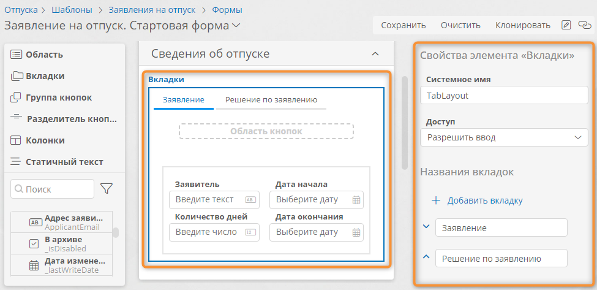

# Статические элементы формы. Настройка представления {: #form_static_elements}

## Определения {: .admonition-title #definitions}

**Статические элементы** формы — это визуальные элементы. Их представление для конечного пользователя формируется с помощью [конструктора формы][forms] и помощью [правил для формы][form_rules] и не зависит от данных, отображающихся в форме.

Статические элементы позволяют упорядочить и сгруппировать другие элементы на форме.

Предусмотрены следующие статические элементы:

- **[Область](#form_static_elements_area)** — содержит все остальные элементы формы.
- **[Вкладки](#form_static_elements_tabs)** — позволяют расположить элементы формы на нескольких вкладках.
- **[Колонки](#form_static_elements_columns)** — позволяют расположить элементы в несколько столбцов.
- **[Статичный текст](#form_static_elements_static_text)** — позволяет расположить на форме произвольный текст с HTML-форматированием.
- **Группа кнопок**, **Разделитель кнопок** — позволяют упорядочить кнопки в [области кнопок][button_area_configure] на форме.

## Область {: #form_static_elements_area}

**Область** представляет собой группу элементов формы с заголовком.

Все остальные элементы формы (кроме вложенных форм) могут располагаться только в областях. Поэтому на форме должна быть как минимум одна область, либо одна вложенная форма.

Области можно располагать на форме как друг под другом, так и рядом (при размещении рядом области будут помещены в отдельные [**колонки**](#form_static_elements_columns)).

В каждой области предусмотрена [область кнопок][button_area_configure], отдельная от основной области кнопок формы.

Пользователь может свёртывать и развёртывать области на форме, а также отобразить любую область на весь экран.

### Свойства области {: .pageBreakBefore }

- **Отображаемое название** — заголовок области, который будет отображаться в форме.
- **Системное имя** — уникальное имя элемента формы, используемое при настройке [правил для формы][form_rules].
    --8<-- "system_name_requirements.md"
- **Ширина** — размер области в процентах от ширины формы. По умолчанию ширина области рассчитывается автоматически в соответствии с количеством областей по горизонтали, расположенных на форме.
- **Расположение области кнопок** — положение области кнопок относительно области данных:
    - **Вверху**;
    - **Внизу**.
- **Доступ** — режим доступа к данным полей внутри области и отображения области:
    - **Разрешить ввод** — конечный пользователь сможет вводить данные в поля внутри области.
    - **Только чтение** — данные внутри области можно будет только просматривать.
    - **Скрыть** — область и элементы внутри неё не будут отображаться на форме. Показать скрытую область можно с помощью [правил для формы][form_rules].

__

## Вкладки {: #form_static_elements_tabs .pageBreakBefore }

Данный элемент позволяет расположить элементы формы на нескольких вкладках.

Внутрь каждой вкладки можно помещать вложенные вкладки и любые другие элементы формы (включая вложенные формы).

На каждой вкладке предусмотрена [область кнопок][button_area_configure], отдельная от основной области кнопок формы.

### Свойства вкладок

- **Системное имя** — уникальное имя элемента формы, используемое при настройке [правил для формы][form_rules].
    --8<-- "system_name_requirements.md"
- **Доступ** — режим доступа к данным полей внутри вкладок и отображения вкладок. Доступ можно настроить как для всех вкладок, так и для отдельных вкладок.
    - **Разрешить ввод** — конечный пользователь сможет вводить данные в поля внутри вкладок.
    - **Только чтение** — данные внутри вкладок можно будет только просматривать.
    - **Скрыть** — вкладки и элементы внутри них не будут отображаться на форме. Показать скрытый элемент можно с помощью [правил для формы][form_rules].
- **Названия вкладок** — в этом списке можно ввести названия всех вкладок.
- **Добавить вкладку** — эта кнопка позволяет добавить новую вкладку.
- **Вверх** <i class="fa-light fa-angle-up">‌</i> и **вниз** <i class="fa-light fa-angle-down">‌</i> — эти кнопки позволяют менять порядок вкладок.
- **Удалить** <i class="fa-light fa-trash-alt">‌</i> — эта кнопка позволяет удалить одну вкладку. Если вкладка содержит вложенные элементы, потребуется подтвердить удаление.

При добавлении вкладок на макет формы, вкладки создаются с вложенным элементом «**Колонки**», который при необходимости можно удалить.

Каждая вкладка имеет собственное системное имя и, следовательно, для каждой вкладки (как и для элемента в целом) имеется возможность настроить отдельное [правило][form_rules] его отображения.

С помощью панели «**Свойства элемента «Вкладки**» можно добавлять новые вкладки, менять их порядок и удалять.

__

## Колонки {: #form_static_elements_columns .pageBreakBefore }

Данный элемент предназначен для отображения других элементов формы в виде столбцов заданной ширины.

Элемент «**Колонки**» может содержать не более пяти колонок.

Внутрь каждой колонки можно помещать вложенные колонки и любые другие элементы формы (кроме вложенных форм).

Подпись элемента «**Колонки**» отображается только в конструкторе форм и не отображается на форме для конечного пользователя.

При просмотре формы конечным пользователем пустые колонки будут занимать пространство высотой в одну строку.

### Свойства колонок

- **Системное имя** — уникальное имя элемента формы, используемое при настройке [правил для формы][form_rules].
    --8<-- "system_name_requirements.md"
- **Доступ** — режим доступа к данным полей внутри колонок и отображения колонок (настраивается как для всех колонок, так и для отдельных колонок).
    - **Разрешить ввод** — конечный пользователь сможет вводить данные в поля внутри колонок.
    - **Только чтение** — данные внутри колонок можно будет только просматривать.
    - **Скрыть** — колонки и элементы внутри них не будут отображаться на форме. Показать скрытый элемент можно с помощью [правил для формы][form_rules].
- **Добавить колонку** — эта кнопка позволяет добавлять колонку (максимум 5 в каждом элементе «**Колонки**»).
- **Ширина** — размер колонки в процентах от общей ширины элемента «**Колонки**». По умолчанию ширина каждой колонки рассчитывается автоматически в соответствии с их количеством.
- **Удалить** <i class="fa-light fa-trash-alt">‌</i> — эта кнопка позволяет удалить одну колонку. Если колонка содержит вложенные элементы, потребуется подтвердить удаление.

__

## Статичный текст {: #form_static_elements_static_text .pageBreakBefore }

Данный элемент предназначен для отображения на форме произвольного текста с HTML-форматированием.

### Свойства статичного текста

- **Системное имя** — уникальное имя элемента формы, используемое при настройке [правил для формы][form_rules].
    --8<-- "system_name_requirements.md"
- **Текст** — HTML-текст, который будет отображаться на форме. См. *«[Перечень поддерживаемых тегов и элементов HTML][html_supported_tags]»*.

__

## Удаление статических элементов с формы {: .pageBreakBefore }

1. Перетащите подлежащий удалению элемент за пределы макета формы.
2. При удалении областей, вкладок или колонок, содержащих вложенные элементы, отобразится предупреждение с возможностью подтверждения действия или отмены.

--8<-- "related_topics_heading.md"

- _[Динамические элементы формы: поля атрибутов и вложенные формы. Настройка представления][form_dynamic_elements]_
- _[Формы. Определения, редактирование, удаление, использование списка форм][forms]_
- _[Правила для формы. Определения, логика работы и настройка][form_rules]_
- _[Перечень поддерживаемых тегов и элементов HTML][html_supported_tags]_
- _[Формы. Использование][form_personal_use]_


