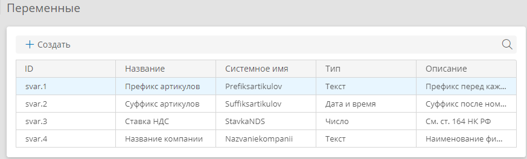
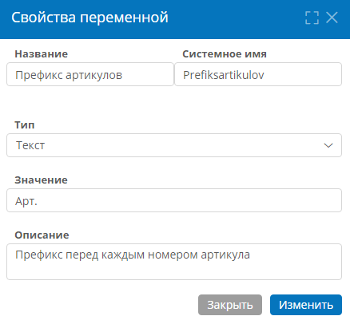

# Переменные приложения. Просмотр списка, настройка и использование {: #variables}

<div class="admonition question" markdown="block">

## Определения {: .admonition-title #definitions}

**Переменные приложения** — это атрибуты с заданным значением, которые не привязаны к какому-либо шаблону. Их можно использовать в C#-скриптах и выражениях на языке N3 в любом шаблоне или сценарии.

Переменные одного приложения доступны во всех остальных приложениях.

Переменные приложения подходят для хранения данных, которые требуется использовать в нескольких шаблонах записи или приложениях.

Например, с их помощью можно настроить автонумерацию записей, см. _[«Автонумерация записей с помощью формулы, C#-скрипта или выражения N3»][auto_numerating_records]_.

Помимо переменных приложения в **{{ productName }}** имеются системные и локальные переменные, которые применяются в сценариях, см. подробнее _[«Использование переменных в сценарии»][scenario_variables]_.

</div>

## Использование переменных приложения в выражениях N3 и C#-скриптах {: .pageBreakBefore }

!!! warning "Внимание!"

    Для корректного присвоения атрибуту значения переменной приложения их типы должны совпадать.

- Чтобы получить значение переменной приложения с помощью N3, используйте следующее выражение:

    **По системному имени переменной**

    ``` turtle
    # Импортируем функции для работы с переменными
    @prefix globalvariable: <http://comindware.com/ontology/variable#>.

    {
        # Находим переменную VariableSystemName в приложении SolutionSystemName
        # по их системным именам
        # и возвращаем значение переменной.
        ("SolutionSystemName" "VariableSystemName") globalvariable:getValueByAlias ?value.
    }
    ```

    **По ID переменной**

    ``` turtle
    # Импортируем функции для работы с переменными
    @prefix globalvariable: <http://comindware.com/ontology/variable#>.

    {
        # Получаем значение переменной приложения
        # по её ID (svar.1) и возвращаем её значение.
        "svar.1" globalvariable:getValueById ?value.
    }
    ```

- Чтобы присвоить атрибуту значение переменной приложения с помощью C#-скрипта в сценарии, используйте действие «**Изменить значения скриптом**» со следующими свойствами:

    - **Атрибут:** укажите атрибут, которому требуется присвоить значение переменной приложения.
    - **Операция со значениями: заменить**
    - **Значение:**

        ``` cs
        public class Script {
            // Задайте тип метода Main(),
            // соответствующий типу атрибута и переменной приложения:
            // string — Текст, int, decimal — Число, dateTime — Дата и время,
            // bool — Логический, TimeSpan — Длительность,
            // IEnumerable<string> — Список значений.
            // ObjectID — переменная, в которой хранится
            // ID экземпляра шаблона записи,
            // в контексте которого выполняется скрипт.
            // Чтобы просмотреть доступные методы
            // в пространстве имён Comindware,
            // введите Comindware и точку

            public static decimal Main(string ObjectID) {
                var result = (decimal)Api.Solution.SolutionVariableService.GetValue("svar.1");
                return result;
            }
        }
        ```

- Чтобы использовать значение переменной приложения в **Задаче-вызове сценария** используйте образец C#-скрипта из статьи [_«Автонумерация записей с помощью формулы, C#-скрипта или выражения N3»_][auto_numerating_records].

## Просмотр списка и настройка переменных приложения {: .pageBreakBefore }

1. На странице «**[Администрирование][apps]**» приложения выберите пункт «**Переменные**» <i class="fa-light fa-dice-five"></i>.
2. Отобразится список переменных приложения со свойствами переменных:

    - **ID** — уникальный идентификатор переменной, который используется для обращения к ней.
    - **Название** — наименование переменной.
    - **Системное имя** — уникальное имя переменной.
    - **Тип** — тип значения переменной:
            **Текст** — текстовая строка;
          - **Число** — числовое значение;
          - **Длительность** — длительность в днях, часах, минутах, секундах;
          - **Дата и время** — дата по календарю и время в днях, часах, минутах, секундах;
          - **Логический** — `true` или `false`.
    - **Описание** — комментарий относительно назначения переменной.

__

3. Нажмите кнопку «**Создать**» или дважды нажмите строку переменной в списке.
4. Настройте свойства переменной приложения.
5. Сохраните переменную.

__

<div class="relatedTopics" markdown="block">

--8<-- "related_topics_heading.md"

- _[Использование переменных в сценарии][scenario_variables]_
- _[Автонумерация записей с помощью формулы, C#-скрипта или выражения N3][auto_numerating_records]_

</div>


