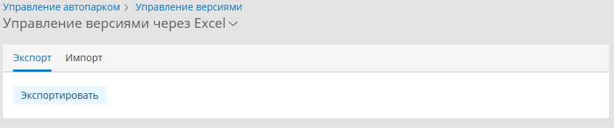
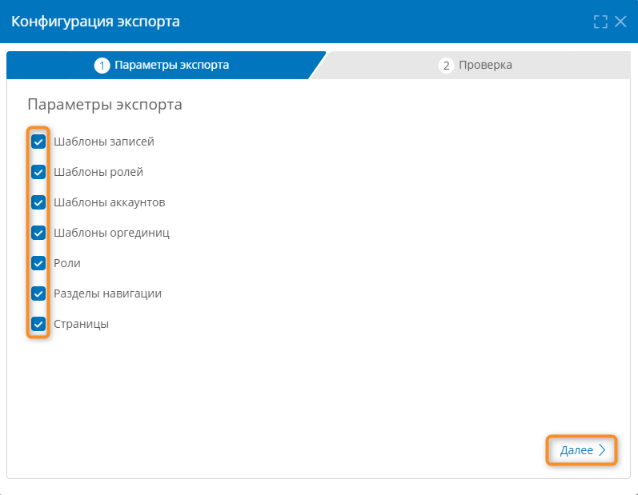
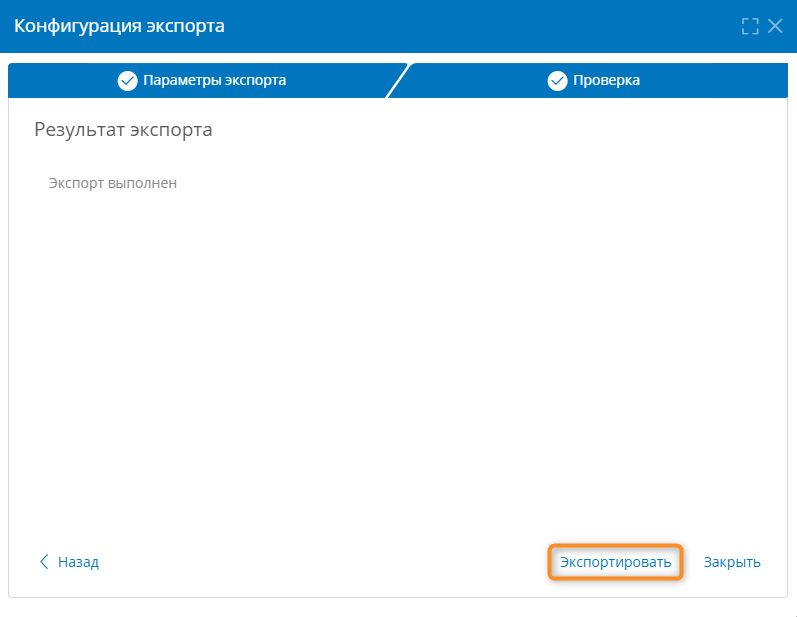
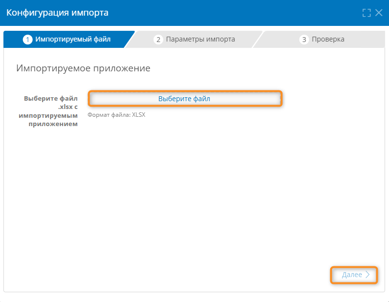
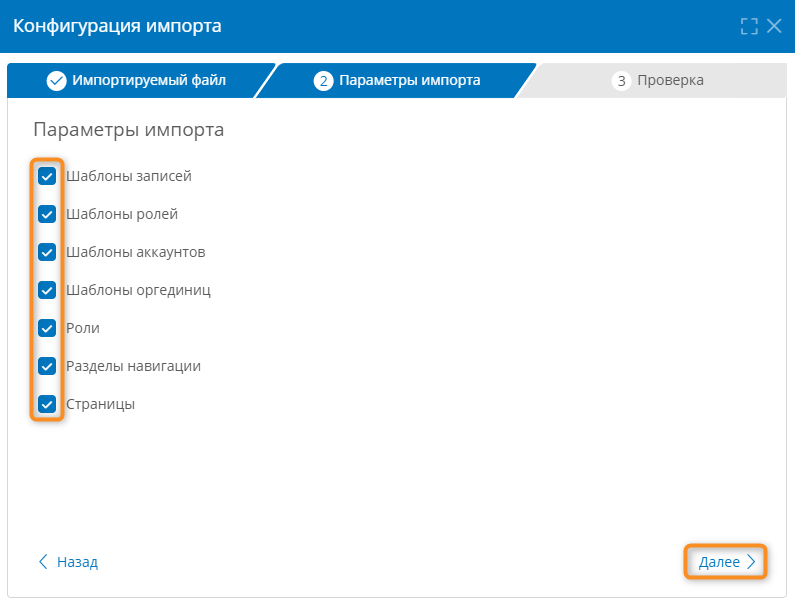
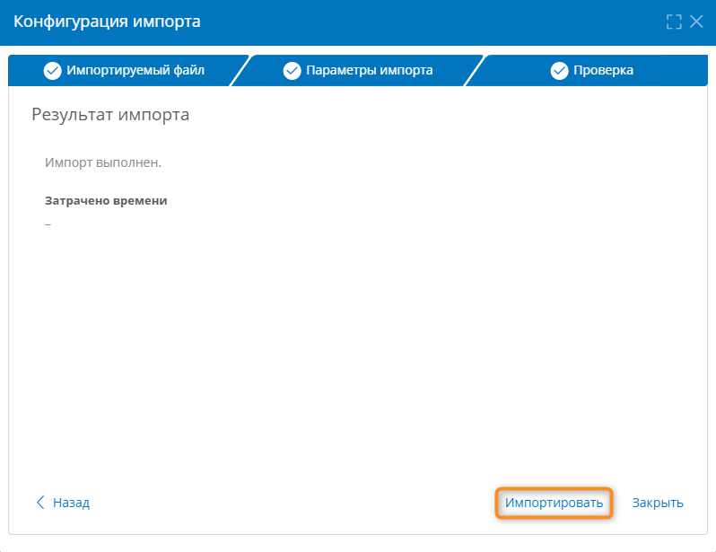

---
title:
kbId:
---

# Экспорт и импорт версий приложения с помощью Excel {: #excel_version_control}

## Введение

В **{{ productName }}** предусмотрены импорт и экспорт версий приложения с помощью документа в формате Excel.

## Переход к управлению версиями с помощью Excel

1. В разделе **«[Администрирование][apps]»** приложения выберите пункт «**Управление версиями**».
2. Нажмите заголовок страницы «**Управление версиями через Git**» и в раскрывающемся меню выберите пункт «**Управление версиями через Excel**».

    __

3. Отобразится раздел «**Управление версиями**» с двумя вкладками:

    - **Экспорт** — настройка параметров экспорта приложения в формате Excel.
    - **Импорт** — импорт версии приложения из документа в формате Excel.

    __

## Экспорт версии приложения

!!! warning "Внимание!"

    Перед экспортом приложения подготовьте его, как указано в параграфе _«[Подготовка приложения к экспорту][version_control_app_prepare]»_.

1. На вкладке «**Экспорт**» нажмите кнопку «**Экспортировать**».
2. Отобразится окно «**Конфигурация экспорта**».
3. На вкладке «**Параметры экспорта**» установите флажки около элементов приложения, которые хотите экспортировать:

    - шаблоны записей;
    - шаблоны ролей;
    - шаблоны аккаунтов;
    - шаблоны оргединиц;
    - роли;
    - разделы навигации;
    - страницы.

4. Нажмите кнопку «**Далее**».

    __

5. Отобразится вкладка «**Проверка**».
6. Нажмите кнопку «**Экспортировать**».

    __

7. При успешном экспорте отобразится надпись «**Экспорт выполнен**».
8. Закройте окно «**Конфигурация экспорта**».

## Конфигурация приложения в формате Excel

1. Откройте файл конфигурации приложения с расширением `.xclx`.
2. На вкладке «**Templates**» отобразится таблица со следующими колонками:

    - Solution — ID приложений, к которым относятся экспортированные шаблоны.
    - GlobalAlias — системное имя экспортированных шаблонов.
    - Name — название экспортированных шаблонов.
    - Type — тип экспортированных шаблонов.
    - Description — описание экспортированных шаблонов.

3. На вкладке «Attributes» отобразится таблица со следующими колонками:

    - TemplateGlobalAlias — системное имя шаблонов, к которым относятся экспортированные атрибуты.
    - GlobalAlias — системное имя экспортированных атрибутов.
    - InstanceGlobalAlias —
    - Name — название экспортированных атрибутов.
    - Type — тип экспортированных атрибутов.
    - Format — формат экспортированных атрибутов.
    - Expression — вычисляемое выражение.
    - LinkedRecordTemplate
    - DecimalPlaces
    - ImageColorType
    - ImageHeight
    - ImagePreserveAspectRatio
    - ImageWidth
    - ImageXResolution
    - ImageYResolution
    - IsCalculated
    - IsDigitGrouping
    - IsDisabled
    - IsIndexed
    - IsMandatory
    - IsMultiValue
    - IsOwnership
    - IsReadonly
    - IsSystem
    - IsTitle
    - IsTracked
    - IsUnique
    - ValidationMaskRegex
    - FileFormat
    - UriSchemeFormats
    - Description

4. На вкладке «AttributesVariants» отобразится таблица со следующими колонками:

    - AttributeGlobalAlias
    - Alias
    - NameEn
    - NameRu
    - NameDe
    - Color

5. На вкладке «UserCommands» отобразится таблица со следующими колонками:

    - TemplateGlobalAlias
    - GlobalAlias
    - Container
    - Name
    - Kind
    - ResultType
    - Context
    - ConditionRule
    - RelatedEntityGlobalAlias
    - IsConfirmationActive
    - IsDisabled
    - IsPrepare
    - IsSystem
    - LockStateChangeType
    - LockStateVisibilityType
    - Multiplicity
    - NavigationTarget
    - SkipValidation
    - Description

6. На вкладке «UserCommandsRelatedActions» отобразится таблица со следующими колонками:

    - UserCommandGlobalAlias
    - ContainerGlobalAlias
    - TemplateGlobalAlias
    - FormGlobalAlias
    - PropertyPath

7. На вкладке «ConfirmationModelConfigurations» отобразится таблица со следующими колонками:

    - UserCommandGlobalAlias
    - Form
    - Template

8. На вкладке «UserCommandsScriptRules» отобразится таблица со следующими колонками:

    - UserCommandGlobalAlias
    - ParentScriptRuleNumber
    - ScriptRuleNumber
    - Name
    - ContextObject
    - Type
    - MessageType
    - RecordTempate
    - FailMessage
    - Description

9. На вкладке «UserCommandsScriptRuleActions» отобразится таблица со следующими колонками:

    - ScriptRuleNumber
    - PropertyPath
    - PropertyAction

10. На вкладке «ScriptRuleDefinitions» отобразится таблица со следующими колонками:

    - ScriptRuleNumber
    - Type
    - ContextObject
    - Values
    - Expression
    - EntryPoint
    - References
    - Code
    - PropertyPath
    - XPath
    - JsonPath
    - FieldKey
    - Regex
    - Template
    - AssemblyId
    - ExportObjectTemplateid

11. На вкладке «ScriptRulePropertyMaps» отобразится таблица со следующими колонками:

    - ScriptRuleNumber
    - Value

12. На вкладке «ScriptRulePropertyMapKeys» отобразится таблица со следующими колонками:

    - ScriptRuleNumber
    - PropertyPath
    - PropertyAction

13. На вкладке «Forms» отобразится таблица со следующими колонками:

    - TemplateGlobalAlias
    - GlobalAlias
    - Container
    - Name
    - IsDefault
    - Type
    - FormSize
    - Origination
    - Toolbar
    - WithSimpleToolbar
    - SearchFormSourceType

14. На вкладке «FormComponents» отобразится таблица со следующими колонками:

    - FormGlobalAlias
    - ParentGlobalAlias
    - GlobalAlias
    - Type
    - AccessType
    - Width
    - Toolbar
    - Name
    - DataAlias
    - PropertyPath
    - DataSourcePropertyPath
    - FieldType
    - PlaceholderEn
    - PlaceholderRu
    - PlaceholderDe
    - HelpTextEn
    - HelpTextRu
    - HelpTextDe
    - TextHeight
    - ConversationHeight
    - DisableSidePanelConversations
    - DisableWidgetConversations
    - HideArchivedMessages
    - TextHeightAuto
    - MaxLength
    - TrueTextEn
    - TrueTextRu
    - TrueTextDe
    - FalseTextEn
    - FalseTextRu
    - FalseTextDe
    - UseTrueFalseText
    - EditorType
    - CreationType
    - RemovalType
    - EditType
    - ValueFilterExpression
    - InstanceFilterExpression
    - Min
    - Max
    - HideSearchBar
    - AllowDecimal
    - DisplayTime
    - ShowAsLink
    - ChildPropertyAlias
    - OrderPropertyAlias
    - NumberPropertyAlias
    - PrecedentPropertyAlias
    - SortingIndex
    - SortingDirection
    - AllowAddExisting
    - ShowArchiveRecords
    - AllowNavigation
    - MaxCount
    - PopupFormAlias
    - AllowEdit
    - ShowEmptyParts
    - MinDuration
    - MaxDuration
    - DisplayName
    - AbsoluteUri
    - DisplayFormat
    - TaskName
    - Assignee
    - PlanStartDate
    - PlanEndDate
    - ExpectedStartDate
    - ExpectedEndDate
    - Progress
    - Dependencies
    - DependencyReference
    - DependencyType
    - Slippage
    - ChildProperty
    - OrderProperty
    - PopupForm
    - ProhibitedReferenceTypes
    - TextEn
    - TextRu
    - TextDe
    - OriginalType
    - ContentEn
    - ContentRu
    - ContentDe
    - ShowLine
    - Height
    - LabelEn
    - LabelRu
    - LabelDe
    - Text

15. На вкладке «FormCompsLabels» отобразится таблица со следующими колонками:

## Импорт версии приложения

!!! warning "Внимание!"

    - После импорта версии приложения свойства имеющегося приложения, его шаблоны, атрибуты и другие сущности будут заменены импортированными. При этом имеющиеся записи и экземпляры процессов, а также значения атрибутов изменены не будут.

1. На вкладке «**Импорт**» нажмите кнопку «**Импортировать**».
2. Отобразится окно «**Конфигурация импорта**».
3. На вкладке «**Импортируемый файл**» выберите файл конфигурации приложения с расширением `.xclx` и нажмите кнопку «**Далее**».

    __

4. На вкладке «**Параметры импорта**» установите флажки около элементов приложения, которые хотите импортировать:

   - шаблоны записей;
    - шаблоны ролей;
    - шаблоны аккаунтов;
    - шаблоны оргединиц;
    - роли;
    - разделы навигации;
    - страницы.

5. Нажмите кнопку «**Далее**».

    __

6. На вкладке «**Проверка**» нажмите кнопку «**Импортировать**».

    __

7. При успешном импорте отобразится надпись «**Импорт выполнен**».
8. Закройте окно «**Конфигурация импорта**».

--8<-- "related_topics_heading.md"

- _[Управление версиями приложения][version_control]_
- _[Ручное управление версиями][version_control_manual]_
- _[Управление версиями через Git][version_control_git]_

