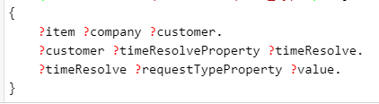
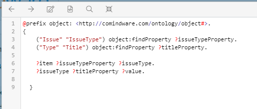
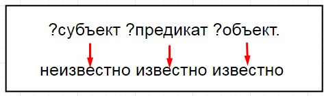
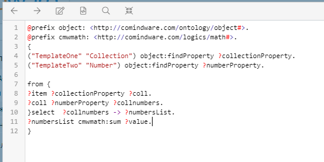
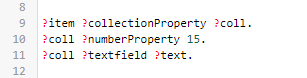
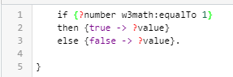
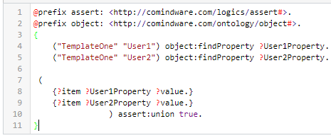

# Введение
Основная цель курса - научить пользователя  ориентироваться в написанных выражениях и самостоятельно писать запросы средней сложности на языке N3. В уроках будут освещены базовые принципы работы триплетов, интерпретатора, приведены реальные примеры использования. В конце каждого урока будут представлены задания, рассчитанные на самостоятельную работу.

Так как это вводный курс, то некоторые понятия в нем намеренно упрощены, но это не будет влиять на общее представление RDF N3.

Данный гайд рассчитан на людей с хорошим пониманием Comindware Business Application Platform и ее настройки.

Два типа синтаксиса запросов

В Comidware Business Application Platform мы имеем два вида или два разных типа синтаксиса запросов.

Первый из них — это Expression Language, полностью разработанный нашими специалистами. Выглядит он как язык выражений Excel и является более простым к восприятию. Это своего рода, надстройка для еще большего упрощения RDF N3. Для базовой настройки системы его вполне достаточно. 

Типовые примеры использования Expression language - это хождение по связанным шаблонам записи, счет списка объектов, простые математические операции типа умножить, разделить, конкатенация строк т.д. Полный перечень его функций указан в полном руководстве по использованию Comindware Business Application platform — ссылка <https://kb.comindware.com/article/%d0%a4%d1%83%d0%bd%d0%ba%d1%86%d0%b8%d0%b8-1193.html> 

Второй – это язык выражений RDF N3 (мы их называем просто «Тройки»). Он сложнее в прочтении и написании, но является более функциональным и основополагающим. Стандарт этого языка определен международным консорциумом W3.
## Хранение данных
Comindware Business Application Platform использует графовую базу данных, основанную на модели RDF. 

Общая идея графовой модели заключается в том, что любой объект материального и нематериального мира имеет свойства, а эти свойства содержат определенные значения. Следовательно, любую сущность можно описать с помощью простых выражений, которые называют свойства и их значения. 

Описание сущности с помощью графовой модели имеет правила. Происходит  это в виде так называемого триплета. **Триплет** состоит из трех связанных сущностей «**Субъект – предикат - объект**». Данные термины необходимо запомнить. В нашем курсе, мы будем часто употреблять эти понятия.

Триплет можно соотнести с простым предложением вида: Подлежащее – Сказуемое – Дополнение. Например, утверждение «Книга написана Пушкиным» в RDF терминологии можно представить следующим образом: субъект – Книга, предикат – написана, объект – Пушкин. 

Теперь изобразим сам граф (Рис. 1). Субъект и объект представлены как узлы. По нашему примеру это книга и Пушкин. Свойство, кем написана книга, является соединительной линией со стрелкой от субъекта к объекту.  

__

По такому же принципу мы можем описать структуру данных в платформе. У нас есть запись в ШЗ (субъект), есть его атрибут (он же предикат) и есть данные (объект – значение, лежащее внутри атрибута).  

Приведем пример: мы имеем шаблон записи “Книги”. В ШЗ созданы атрибуты “Наименование” и “Автор”. В нем имеются две записи. 

__

Данные этих записей лежат в триплетах и в упрощенном варианте выглядят примерно так:

|
id 8037 - Название - “Война и мир”.

id 8037 - Автор - “Толстой”.

id 8036 - Название - “Медный всадник”.

id 8036 - Автор - “Пушкин”.
|
| - |

В таком же виде выглядит вся метаинформация (Описание шаблонов записи, описание форм, объектов, типов и т.д.)  и атрибуты окружения (текущий пользователь, текущее время, текущий контекст и т.д.). Такая структура создает единообразие и простоту доступа к данным через запросы к БД. 

Явные преимущества такого хранения заключаются в нескольких вещах.

1. Простота понимания модели данных. Создание шаблонов записи и связей между ними достаточно быстро усваивается для неподготовленного пользователя.
1. Добавление новых шаблонов записи и атрибутов происходят мгновенно и сразу доступны к работе.
1. Неограниченная широта и глубина связей между сущностями. В нашей базе нет ограничений по количеству атрибутов, и количеству связей между ними. 
1. Простота и неограниченность хождения по связям. Переход из одного справочника в другой через ссылочное поле делается в одну строку.

Для лучшего понимания принципа описания и хранения данных без использования жесткой структуры (такой, как таблицы в SQL), ознакомьтесь со следующей статьей:<https://kb.comindware.com/article/%d0%9e%d0%bd%d1%82%d0%be%d0%bb%d0%be%d0%b3%d0%b8%d1%8f-1475.html>

|
На заметку:

Немного о внутренней работе платформы. К примеру, делаем вычисляемый атрибут и пишем формулу Expression. Что происходит под «капотом» после написания формулы? Компилятор переводит написанную формулу в тот самый запрос на «тройках», который уже однозначно понятен системе. Тут же сразу можно сделать небольшой вывод – хотим облегчить работу компилятору- пишем формулу сразу на «тройках».
|
| - |

## Цели использования языка N3:
·        Продвинутое пользование платформой

·        Доступ ко всем созданным и системным атрибутам платформы (те атрибуты, которые мы видим в интерфейсе платформы далеко не полный список)

·        Большое количество функций по работе с данными (расширенные математи ческие функции, работа со списками, приведение к одному типу данных, расчеты времени и т.д.) (Ссылка на документ)	

# 
# 1 урок
## Чему научимся:
Триплет, параметры Item и Value, синтаксис, переменные.

##  Триплеты
Само тело запроса состоит из триплетов. Это те самые понятия (субъект, предикат, объект), о которых говорилось во введении.

Пример запроса:

__

С помощью такого запроса, мы говорим какая строчка из базы нужна. мы получаем требуемые данные из графа.

Мы находимся в записи заявки. Первым триплетом находим ссылку на клиента. Второй строкой находим ссылку на время ответа на заявку. И третьей строкой находим у времени ответа его тип. 

В ситаксисе языка RDF N3 есть некоторые правила написания без которых, правило не сохраниться на форме или не отработает корректно.

|
Список основных правил:

1. Каждый триплет начинается с новой строчки.

2. Объявление переменных пишется через вопросительный знак ( ? )

3. Все тело запроса помещается в фигурные кавычки ( {} )

4. В конце каждого триплета ставится точка (.)

5. Интерпретатор регистрозависимый. Это следует учитывать. 

|
| :- |

## Переменные

Формируя запрос мы прибегаем к помощи переменных. 

[Переменная](https://ru.wikipedia.org/wiki/%D0%9F%D0%B5%D1%80%D0%B5%D0%BC%D0%B5%D0%BD%D0%BD%D0%B0%D1%8F_\(%D0%BF%D1%80%D0%BE%D0%B3%D1%80%D0%B0%D0%BC%D0%BC%D0%B8%D1%80%D0%BE%D0%B2%D0%B0%D0%BD%D0%B8%D0%B5\)) – это «именованное хранилище» для данных. 

В примере выше переменными являются ?customer и ?timeResolve,Бб и они jybхранят в себе ссылки на другие шаблоны записи. 

Имена переменных мы задаем сами и они должны отражать суть хранимых данных.

|На заметку: в данном примере переменными являются каждый объект из триплета после символа “?”. Намеренно упростим понятие. В следующих уроках научимся определять предикат через переменную.|
| :- |

## Входные и выходные параметры Item и Value.
Наш пример начался и закончился двумя переменными Item и Value. Это переменные особого типа. Они являются зарезервированными переменными для входных и выходных параметров запроса.

Item - входной параметр запроса. Какие конкретно придут данные на вход зависит от контекста в котором мы выполняем выражение. Так, например, при записи выражения в атрибуте в item будет лежать ID текущей записи. Полный перечень по [ссылке](https://kb.comindware.com/secure/%d0%a0%d1%83%d0%ba%d0%be%d0%b2%d0%be%d0%b4%d1%81%d1%82%d0%b2%d0%be-%d0%bf%d0%be-%d0%bd%d0%b0%d0%bf%d0%b8%d1%81%d0%b0%d0%bd%d0%b8%d1%8e-%d0%b2%d1%8b%d1%80%d0%b0%d0%b6%d0%b5%d0%bd%d0%b8%d0%b9-%d0%b2-%d0%bd%d0%be%d1%82%d0%b0%d1%86%d0%b8%d0%b8-n3-1485.html):

Value - выходной параметр. В нее мы помещаем те данные, которые хотим отобразить на выходе. 

|
Типизация переменных

Следует отметить, что
|
| - |

Итого: мы разобрались с телом запроса, основными правилами синтаксиса,  
## Задачи:

Модель данных: у нас имеется шаблоны записи “Договоры”, “Контрагенты” и “Статусы контрагента”. У договора есть ссылка на контрагента, а у контрагента есть ссылочное поле на статус. 

Мы находимся в контексте договоров. Нам нужно вывести статус контрагента. 

Предикаты:

?agentProperty - предикат контрагента

?statusProperty - предикат ссылки на статус у контрагента

Требуется написать запрос и получить значение статуса контрагента.

Разберем общую модель написания запроса на N3.

В общем виде запрос состоит из:

1. Подключаемые библиотеки пространств имен
1. Использование переменных.
1. Триплеты
## 	

##
## Итого:
В итоге, мы научились использовать библиотеку object и ее функцию по записи URI предикатов в переменную. 

Познакомились со структурой триплетов.

Разобрали входные и выходные параметры запроса (Item и value) 

Познакомились с основными правилами синтаксиса запроса.

##
## Задачи

Создаем модель данных: 

Три шаблона записи. Первый шаблон имеет числовой атрибут “Calculation” и атрибут ссылку на второй шаблон. Второй ШЗ имеет ссылку на третий. В третьем ШЗ создаем атрибут “Number”. У шаблонов создаем по одной записи и устанавливаем ссылочные поля. В атрибут “Number” пишем число. 

Задача: вычислить в атрибут Calculation значение атрибута Number.

# 2 урок

## Чему научимся: 
Библиотеки пространств имен, присвоение переменных, применение системных атрибутов, built-in предикаты, конструкция from.

Итак, начнем разбор первого полноценного запроса.  Для  ее анализа нужно знать модель данных, в которой мы его пишем.

Пример:

Напишем запрос, который пройдет по ссылке в IssueType, возьмет значение текстового атрибута Title и выведет его.

-----
**Модель данных:**

Два шаблона записи – Issue и Type.

В ШЗ Issue имеется ссылка на ШЗ Type. Имя: “IssueType”.

В ШЗ Issue есть текстовый атрибут TitleCalc. В нем пишем текущий запрос. 

В ШЗ Type создан текстовой атрибут Title.

__

-----

|
В обычном Expression Language выглядел бы так:

$IssueTypeRef->Title

Пример в Expression language приведен лишь для введения в понимание. В дальнейшем, не следует пытаться представлять выражение N3 в Expression Language, так как это может сбить с верного понимания. 
|
| - |

Начнем разбор построчно:

Первую строку, которую мы видим - это библиотека «пространства имен».  @prefix object — <[http://comindware.com/ontology/object#](http://comindware.com/ontology/object)>.

|
<h2>Библиотеки пространств имен </h2>

**Библиотеки** - это подключаемые модули (области), где лежат знания об объектах, функциях и разных правилах. С их помощью мы можем обращаться с системным и прикладным атрибутам и брать их значения. Также, при объявлении библиотек может появляться доступ к различным функциям по работе с датами, списками, числами и т.д. ([ссылка на документ](https://kb.comindware.com/article/%d0%a0%d0%b0%d1%81%d1%88%d0%b8%d1%80%d0%b5%d0%bd%d0%b8%d1%8f-comindware-%d0%a1%d0%bf%d0%b8%d1%81%d0%be%d0%ba-%d0%b2%d1%81%d1%82%d1%80%d0%be%d0%b5%d0%bd%d0%bd%d1%8b%d1%85-%d1%84%d1%83%d0%bd%d0%ba%d1%86%d0%b8%d0%b9-1482.html)).
|
| :-: |

С помощью этой библиотеки у нас появляется доступ к функции object:findProperty из строки 3 и 4 нашего примера. Данная функция позволяет брать URI атрибутов, записывать в переменные и использовать их внутри запроса.

|
Так как модель описания данных – RDF, для нее определены некоторые стандарты. Так, один из стандартов - это хранение в виде URI. 

URI — последовательность символов, идентифицирующая абстрактный или физический ресурс и выглядит он примерным образом:

https://www.w3.org/1999/02/22-rdf-syntax-ns#type.

По сути каждая сущность из триплета является либо URI, либо литералом. При использовании полной нотации RDF выражений, происходит появление в записи длинных строк вида:

|
| :- |

Эта библиотека и функция является одной из базовых и в дальнейшем будет часто использоваться в написании запросов. Она содержит в себе функцию поиска id атрибута по его системному имени.

Перейдем к строке 3 и 4.

В предыдущем уроке мы не касались темы предикатов в триплете. Они были даны изначально. Но по сути каждая часть из триплета лежит в переменных, в том числе и искомые атрибуты. Чтобы их определить и записать в переменную пишем выражение вида:

|
("Сист.ИмяШЗ" "Сист.ИмяАтрибута") object:findProperty ?переменная.

Эта функция подходит только для определения прикладных атрибутов (созданных вручную). Системные атрибуты лежат в других библиотеках.

|
| - |

Теперь, вместо длинных URI предикатов, мы можем использовать переменные.

Берем атрибуты нужных предикатов для запроса и присваиваем их в переменные IssueTypeProperty и titleProperty.

Где, имя переменной определяем сами.
## Триплет
С первыми тремя строчками разобрались. Начинаем писать сам триплет.

__

1\. 	Каждый запрос имеет входной параметр item. Он вычисляется по умолчанию и служит для определения текущей записи, в которой находится атрибут. 

2\. 	Указываем предикат. Мы его уже определили выше.

3\. 	Создаем переменную, в которую поместится значение. Имя этой переменной придумываем сами. Интерпретатор видит, какой части не хватает для триплета и автоматически присваивает в него некое значение.

Данной строкой мы добились того, что смогли определить ссылку, чье значение требуется для дальнейшего нахождения поля title.

Важное правило работы интерпретатора:

Если результат триплета будет false - а именно он не найдет такого предиката, либо вместо объекта мы впишем уже определенное значение и интерпретатор не найдет такую строчку в базе, тогда он останавливается и вниз дальше не идет.

Разбираем 7 строку.

`        	`? IssueType ?TitleProperty ?value.

Берем переменную, которую определили выше. Так как, мы переместились по ссылке и находимся в контексте ШЗ «IssueType», у него имеется предикат TitleProperty. Указываем его. 

И третьим аргументом идет обязательная переменная value. value - является выходным параметром запроса. То что мы поместим в нее, то и будет отображаться в вычисляемом атрибуте. Тип данных, помещенный в value должно быть согласован с типом атрибута. Например: если вычисления в атрибуте логического типа, в value нужно получить логическое значение. И такое же правило существует для остальных типов данных. 

## Присвоение переменных
В предыдущем примере мы использовали ситуацию, где в триплетах субъект и предикат были определены. Неизвестным являлся объект. 

` 	`Интерпретатор понимает какая сущность из триплета неизвестна и тут же присваивает в нее недостающее значение.

Но это не единственный возможный случай присваивания. Всего существует три основных варианта присвоения значений в переменные с помощью работы триплета.

1. Первый способ, используемый в примере 1 урока.  Субъект и предикат определен, значит искомое значение - это объект.

__

1. Триплет позволяет идти и от обратного, если известен объект и предикат, то мы находим субъект

   __

1. Это так называемый ExactMatch. В случае, где известны все три части, происходит проверка на полное совпадение. Здесь получаем уточненное значение субъекта.
   __

Рассмотрим еще один пример с новым типом присвоения значения переменным:

Задача: в некоторых случаях администратор приложения хочет быстро и наглядно увидеть есть ли среди заявок те, у которых в запущенном процессе имеется ошибка.

Суть вычисления - если у текущей записи имеется процесс с ошибкой, вывести true в логический атрибут.

Модель данных: 

У нас имеется процесс и связанный шаблон записи. В связанном шаблоне записи создаем логический вычисляемый атрибут. В вычислениях пишем:

__

Начнем разбор построчно:

1 строка - подключаем библиотеку пространств имен процесса. После данного подключения становятся доступны системные предикаты процесса.
## Системные атрибуты
`	 `В платформе предусмотрено два вида атрибутов: системные и прикладные. К прикладным мы относим, те сущности, которые были вручную созданы для нашей онтологии. 

Но также, у каждого объекта в платформе (Процессы, шаблоны записи, группы, глобальные настройки и т.д.) есть ряд системных атрибутов, которые не всегда видны в интерфейсе программы, но они существуют и как правило логика наполнения данными таких атрибутов уже предопределена и автоматически заполняется системой. 

3 строка - тут мы имеем ситуацию с переменными, когда неизвестен один субъект (2 случай).  Мы знаем что у процесса есть предикат businessObject, который связывает запись с процессом. +Этот атрибут является системным.  Поэтому, первым пишем переменную, затем ее предикат и объект. По итогу в переменной “proc” у нас появился текущий, связанный с записью, процесс.

4 строка - здесь имеем уже первый вид присваивания. Предикат в этой строке тоже системный. Он является логическим типом и его значение становиться true, если запущенный процесс имеет ошибку. Соответственно его значение мы и передаем в выходной параметр value.

Так мы выведем в атрибут екгу, если есть ошибка в процессе.
## Built-In предикаты
Помимо, обычных предикатов, которые описывают свойства сущностей в платформе мы имеем также Built-In предикаты. Это сложные предикаты, которые носят в себе какие-либо функции по работе со строками, датами и т.д. Список таких предикатов описан в документе основы N3.

Рассмотрим пример:

Задача: У нас есть ШЗ TemplateOne. У ШЗ есть коллекция.  У коллекции имеется числовой атрибут. Требуется вывести сумму записей коллекции этого числового поля в вычисляемый числовой атрибут ШЗ.

Пример:

__

2 строка - добавляем библиотеку, содержащую в себе ряд математических функций.
## Конструкция from {}
7 строка - добавляем конструкцию from {}. Так как мы используем математическую функцию суммирования, ей требуется получить на вход такой тип данных, как “list”. Если бы мы просто нашли переменную collnumbers и попытались бы ее применить к функции без преобразования в list, тогда бы ничего не вышло. В collnumbers хранятся uri к значениям записей, а данная функция не работает с uri. Ей нужен понятный для нее тип данных. Какой тип данных требуется на вход разным функциям описано в документе N3.

Структура конструкции: from {триплеты} select ?переменная -> ?лист.

11 строка - пишем наш built-in предикат “cmwmath:sum”. В переменную value запишется получившаяся сумма из списка чисел numbersList.

## Итого:

Теперь мы умеем применять разные типы присвоения значений в переменные, используем системные атрибуты в наших запросах, производим вычисления с помощью bult-in предикатов.

Задачи:
# 3 урок
## 	Чему научимся:

Итератор,  Assert, if, or, контейнеры.

В данном уроке мы будем знакомиться с работой итератора, от которого зависит быстродействие выполнения запроса. Также, познакомимся с отдельными частоиспользуемыми функциями.
## Итератор

Еще одна важная особенность при работе с с запросами —  это итератор. 

Итератор — это перечислитель, который поддерживает простой перебор по группе ссылок. К группе ссылок относятся коллекции и ссылки со множественными значениями в них.

Под перебором мы имеем в виду,  что итератор в порядке случайной очереди берет первый объект из коллекции и проверяет его на верность выполнения условий по всем нижестоящим триплетам.  Пример: 

__

В переменную coll мы получили коллекцию.  Енумератор взял первую запись из коллекции и пошел на 10 строчку. В этой строке мы делаем ExactMatch (3 тип присваивания). Мы проверяем что у этой записи в атрибуте Number значение 15. 

Если у этой записи значение не 15, тогда результат триплета равен false, и эта запись выбрасывается из результата и мы возвращаемся обратно на 9 строку и берем следующую запись коллекции. 

Если результат следующей записи true, тогда запись двинулась дальше на 11 строку и так до конца тела запроса. Таким образом, он повторяет свои действия пока не закончатся уникальные записи. 

Важное примечание: итератор работает всегда. Он пытается вернуться и к верхней строчке и проверить есть ли значения, который он не проверял. Возвращается наверх, сверяет значение с записанным хэшем. Если это значение уже было, он останавливается.

Из этого следует правило, что вверху запроса следует указывать 
` 	`В случае, если мы точно знаем, что итератор должен пройти один раз по телу запроса (нету ссылок со множественным значением или коллекций), тогда внутри тела, триплеты можно обернуть в конструкцию once {}. Она сделает запрос быстрее.

## Логическое И
` 	`Распространены ситуации, где нужно объединить два условия выборки “логическим и”. В N3 нам не нужны специальные функции, так как между строками триплетов по умолчанию используется конъюнкция.  

Предположим, что мы пишем какое то условие применения в правила на форме. Мы должны получить значение truе, если атрибуты PlannedStartDate и PlannedEndDate пустые. 

__

6 строка — проверяем чтобы атрибут PlannedStartDate был пуст. 

Проверка на пустоту происходит подобным синтаксисом:

not {?субъект ?предикат ?.}

Знак-точка вместо объекта означает, что в нем есть данные. Соответственно, мы добавляем not и у нас получается проверка на пустоту.

Предположим, что 6 строка выдала true(атрибут пустой) , тогда интерпретатор перешел 7 строке.

Если в 7 строке интерпертатор выдаст false, то он заканчивает работу и не запишет в value значение true. 

Таким образом, ему требуется, чтобы в 6 и 7 выполнились условия.
## Логическое ИЛИ
Если же мы хотим изменить наше условие, и хотим выводить true, если хоть один атрибутов пуст, тогда условие будет следующее:

__

Такое правило уже является “логическим или”. Синтаксис условия or:

or {триплеты}

or{триплеты}.

Прим — в конце перечислений or обязательно должна стоять точка.

or-ов может быть несколько.

## Условный оператор IF
If -- условный оператор позволяет проверить некоторое условие и в зависимости от результатов проверки выполнить то или иное действие.

Пример: 

__

Синтаксис: if {условие}

then {выполняется, если условие - true}

else {выполняется, если условие - false}

## Assert:union
Еще одна часто используемая функция для работы с запросами — это вызов assert: union true. 

Данная функция требуется, когда в запросе нужно объединить несколько результатов выполнения в одну переменную. 

Пример:

Предположим, в заявке имеется поле с выбором Руководителя (User1) и заместителя руководителя (User2). Нам требуется объединить эти два значения в вычисляемом атрибуте:

__

В строке 8 и 9 мы использовали одноименную переменную для того, чтобы и в нее записалось объединенное значение. 

Синтаксис функции: 

(

{триплет}

{триплет}

) assert:union true.
## 	Итого: 
Мы разобрались в работе Итератора. Умеем применять логические условия для фильтров и так же объединять результаты запросов в одну переменную.

Данные функции являются самыми частоиспользуемыми в запросах.

