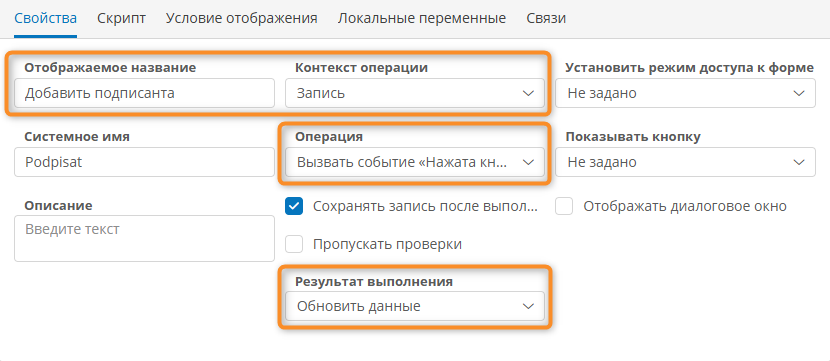

# Документы с электронной подписью. Настройка сертификатов, приложения и использование {: #document_digital_signature }

## Введение {: #document_digital_signature_intro }

В этой статье представлены инструкции по настройке браузера конечного пользователя и приложения для подписания документов электронной подписью (ЭП) и по подписанию документов.

Для работы с ЭП необходимо:

- [настроить ПК конечного пользователя](#document_digital_signature_nastroyka_pk_konechnogo_polzovatelya) — установить ПО КриптоПро CSP, расширение КриптоПро для браузера и сертификаты для цифровых подписей;
- [настроить приложение](#document_digital_signature_nastroyka_prilozheniya) в **{{ productName }}** для использования ЭП.

В статье представлен пример настройки приложения таким образом, чтобы текущий пользователь мог подписывать документы с помощью ЭП.

## Настройка ПК конечного пользователя {: #document_digital_signature_nastroyka_pk_konechnogo_polzovatelya }

1. Установите расширение для браузера [CryptoPro Extension for CAdES][cryptopro_cades] (КриптоПро ЭЦП Browser plug-in).
2. Установите ПО КриптоПро CSP: [cryptopro_csp].
3. Получите и установите сертификат с расширением `.cer`, используя параметры по умолчанию:

    __

4. Получите и установите закрытый сертификат с расширением `.pfx`, используя параметры по умолчанию:

    __

## Настройка приложения {: #document_digital_signature_nastroyka_prilozheniya }

1. В шаблоне записи для хранения подписанных документов (например, _«Документы»_) создайте атрибут _«Подписанные договоры»_ типа «**Документ**» с форматом отображения «**Документ с цифровой подписью**».

    __

2. Поместите атрибут _«Подписанные договоры»_ на форму, которая будет служить для загрузки и подписания документов ЭП.
3. В разделе «**Роли**» приложения откройте свойства роли, которая будет давать доступ на подписание документа.
4. На вкладке «**Разрешения**» перетащите атрибут _«Подписанные договоры»_ в список ресурсов и установите для него флажок «**Использование кнопок**».

    __

5. В шаблоне _«Договоры»_ создайте кнопку _«Добавить подписанта»_:

    - в поле «**Контекст кнопки**» выберите пункт «**Запись**»;
    - в поле «**Операция**» выберите пункт «**Вызвать событие „Нажата кнопка“**»;
    - в поле «**Результат выполнения**» выберите пункт «**Обновить данные**».

    __

6. Поместите кнопку _«Добавить подписанта»_ на ту же форму, на которую поместили атрибут _«Подписанные договоры»_.

    __

7. В разделе приложения «**Сценарии**» создайте сценарий _«Добавить подписанта»_.

    !!! note "Логика работы сценария"

        Сценарий для кнопки подписания документа требуется для того, чтобы назначить подписантом документа текущего пользователя.

        Список разрешённых подписантов хранится в атрибуте _«Подписанты»_ системного шаблона документа.

        Файл, прикреплённый к атрибуту типа «**Документ**», представляет собой запись в шаблоне документа.

        Соответственно, для подписания документа в данном примере сценарий записывает в атрибут _«Подписанты»_ текущего документа идентификатор аккаунта текущего пользователя (вычисляемый с помощью функции `USER()`).

8. Настройте свойства начального события сценария «**Нажать кнопку**»:

    - в поле «**Контекстный шаблон**» выберите шаблон _«Документы»_;
    - в поле «**Кнопка**» выберите кнопку _«Добавить подписанта»_, созданную на шаге 5.

    __

9. Добавьте в сценарий действие «**Сменить контекст**».
10. В свойствах блока «**Сменить контекст**» в поле «**Целевой шаблон**» выберите пункт «**Шаблон документа**» и атрибут _«Подписанные договоры»_.

    __

11. Добавьте внутрь действия «**Сменить контекст**» действие «**Изменить значения атрибутов**».
12. Настройте свойства блока «**Изменить значения атрибутов**»:

    - нажмите кнопку «**Создать**»;
    - в столбце «**Атрибут**» выберите атрибут «**Подписанты**»;
    - в столбце «**Операция со значениями**» выберите пункт «**Заменить**»;
    - в столбце «**Значение**» выберите пункт «**Формула**» и введите формулу: `USER()`

    __

13. Должен получиться показанный ниже сценарий:

    __

14. На этом настройка приложения для использования документов с ЭП завершена.

## Подписание документа {: #document_digital_signature_podpisanie_dokumenta }

1. Создайте новую запись в шаблоне _«Документы»_.
2. Добавьте документ для подписания, нажав кнопку «**Добавить документ**».

    __

3. Нажмите кнопку _«Добавить подписанта»_.
4. Сохраните запись, нажав кнопку «**Сохранить**».
5. Обновите страницу в браузере.
6. Рядом с названием документа появится кнопка «**Подписать**».

    __

7. Нажмите кнопку «**Подписать**».
8. Отобразится окно «**Подписание**».
9. Выберите сертификат.
10. Нажмите кнопку «**Подписать**».

    __

11. Подтвердите операцию с ЭП для веб-сайта и при необходимости введите пароль.

    __

12. Документ будет подписан ЭП, и рядом с его названием отобразятся статус «**Документ подписан**» и дата подписания.

    __

13. Чтобы подписать документ с помощью другого сертификата, нажмите кнопку «**Отозвать подпись**» и подпишите документ заново.
14. При необходимости загрузите подпись в виде файла формата SIGN, нажав кнопку «**Скачать подпись**».
15. Чтобы просмотреть подробную информацию о документе и подписи, нажмите кнопку «**Перейти к форме**».
16. Отобразится форма с информацией о документе и подписях для него, а также содержащая сам подписанный документ.

    __

--8<-- "related_topics_heading.md"

- [Атрибут типа «Документ»][attribute_document]
- [Сценарии. Определения, создание, настройка, использование][scenarios]
- [Кнопки. Определения, настройка, удаление][buttons]


