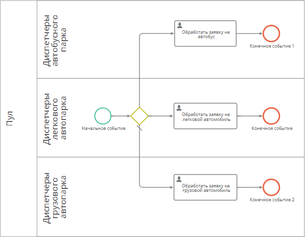

# Атрибут типа «Список значений». Вычисление значения с помощью N3 и формул {: #attribute_enum_value_calculation }

## Введение

Атрибут типа «**Список значений**» содержит значения на русском, английском и немецком языках.

Получить значение атрибута на определённом языке можно с помощью выражения на **N3**.

Здесь представлен пример настройки передачи текстового значения атрибута типа «**Список значений**» на требуемом языке и обращения к этому атрибуту с помощью формул в процессе.

См. также _[подробное описание и другие примеры использования атрибута типа «Список значений»][attribute_enum]_.

!!! tip "Получение данных из атрибута типа «Список значений» с помощью N3"

    --8<-- "attribute_enum_get_data_n3.md"

!!! tip "Сравнение значения атрибута типа «Список значений» с помощью формулы"

    --8<-- "attribute_enum_compare_value_formula.md"    

## Прикладная задача

Имеется процесс оформления заявок на перевозку. Тип транспортного средства задаётся атрибутом типа «**Список значений**».

Требуется распределять заявки в процессе обработки в зависимости от выбранного _типа ТС_.

Требуется формировать таблицу со списком заявок на легковые автомобили.

## Исходные данные

- Имеются шаблон записи _«Заявки на перевозку»_ (с системным именем `Заявкинаперевозку`) и связанный с ним шаблон процесса _«Обработка заявок»_.
- В шаблоне _«Заявки на перевозку»_ есть атрибут _«Тип ТС»_ типа «**Список значений**» с системным именем `ТипТС` и следующими значениями:

| Системное имя |  RU                    |
| ------------- |  --------------------- |
| _Bus_         |  _автобус_             |
| _Car_         |  _легковой автомобиль_ |
| _Truck_       |  _грузовой автомобиль_ |

## Настройка распределения заявок по значению атрибута типа «Список значений»

1. В шаблоне _«Заявки на перевозку»_ создайте атрибут со следующими свойствами:

    - **Название:** _Наименование типа ТС_
    - **Тип данных:** **Текст**
    - **Вычислять автоматически:** флажок установлен
    - **Вычисляемое выражение: N3**

    ``` turtle
    # Импортируем функции для работы
    # с записями, строками и базой данных.
    @prefix object: <http://comindware.com/ontology/object#>.
    @prefix cmw: <http://comindware.com/logics#>.
    @prefix l10n: <http://comindware.com/ontology/l10n#>.
    @prefix string: <http://www.w3.org/2000/10/swap/string#>.
    @prefix cmwentity: <http://comindware.com/ontology/entity#>.
    {
        # Находим атрибут «Тип ТС» в шаблоне «Заявки на перевозку».
        ("Заявкинаперевозку" "ТипТС") object:findProperty ?TipTSAttribute.
        # Присваиваем переменной ?TipTSAttributeValues
        # объект со списком значений атрибута «Тип ТС».
        ?item ?TipTSAttribute ?TipTSAttributeValues.
        # Присваиваем переменной ?SelectedValue 
        # объект с выбранным значением атрибута.
        ?TipTSAttributeValues cmw:variantName ?SelectedValue.
        # Присваиваем переменной ?names массив объектов
        # с заполненными названиями значения атрибута на всех языках.
        ?SelectedValue l10n:text ?names.
        # Начинаем цикл по ?names
            # Присваиваем переменной ?langCodeStr код языка
            # названия значения атрибута на текущей итерации цикла.
            ?names l10n:lang ?langCode.
            ("{0}" ?langCode) string:format ?langCodeStr.
            # Сравниваем код языка для значения атрибута с желаемым.
            # "ru" — код русского языка, "en" — английского, "de" — немецкого.
            ?langCodeStr cmwentity:contains "ru".
                # Если предыдущее предложение возвращает true,
                # записываем значение на русском языке в вычисляемый атрибут.     
                ?names l10n:data ?value.
        # переходим к следующей итерации по ?names.
    }
    ```

2. Поместите атрибуты _«Тип ТС»_ и _«Наименование типа ТС»_ на форму начального события диаграммы процесса _«Обработка заявок»_.
3. После начального события добавьте **развилку «или/или»**.
4. Добавьте три потока управления и присоедините к ним **пользовательские задачи** _«Обработать заявку на автобус»_, _«Обработать заявку на легковой автомобиль»_, _«Обработать заявку на грузовой автомобиль»_.
5. В дополнительных свойствах всех задач задайте **формулу** для заголовка задачи:

    ``` cs
    FORMAT("Обработайте заявку на перевозку: {0}", LIST($НаименованиетипаТС))
    ```

6. После каждой пользовательской задачи добавьте **конечное событие**.
7. Настройте **исходящие потоки** в **дополнительных** свойствах **развилки «или/или»** следующим образом:

    | Поток «Иначе»     | Конечная точка                             | Условие                        |
    | ----------------- | ------------------------------------------ | ------------------------------ |
    |                   | _Обработать заявку на автобус_             | **Формула:** `$ТипТС == "Bus"` |
    |                   | _Обработать заявку на легковой автомобиль_ | **Формула:** `$ТипТС == "Car"` |
    | Флажок установлен | _Обработать заявку на грузовой автомобиль_ |                                |

8. Опубликуйте процесс.

__

## Фильтрация записей по значению атрибута «Список значений»

1. В шаблоне _«Заявки на перевозку»_ создайте таблицу _«Заявки на легковые автомобили»_.
2. Добавьте в таблицу атрибут _«Тип ТС»_.
3. Сохраните таблицу.
4. Откройте панель **основных** свойств таблицы.
5. В поле «**Системный фильтр**» введите следующее выражение **N3**:

    ``` turtle
    # Импортируем функции для работы
    # с записями, строками и базой данных.
    @prefix convert: <http://comindware.com/logics/convertions#>.
    @prefix object: <http://comindware.com/ontology/object#>.
    {
        # Находим атрибут «Тип ТС»
        # в шаблоне «Заявки на перевозку».
        ("Заявкинаперевозку" "ТипТС") object:findProperty ?TipTSAttribute.
        # Находим ID значения Car (легковой автомобиль)
        # атрибута «Тип ТС».
        ("ТипТС" "Car") convert:enumValue ?enumIdCar.
        # Возвращаем записи, у которых 
        # значение атрибута «Тип ТС»
        # равно Car (легковой автомобиль).
        ?item ?TipTSAttribute ?enumIdCar.
    }
    ```

6. Сохраните таблицу.

## Тестирование

1. Создайте заявку и выберите _тип ТС_ _«автобус»_.
2. На странице «**Мои задачи**» должна появиться задача с заголовком _«Обработайте заявку на перевозку: автобус»_.
3. Создайте вторую заявку и выберите _тип ТС_ _«легковой автомобиль»_.
4. На странице «**Мои задачи**» должна появиться с заголовком _«Обработайте заявку на перевозку: легковой автомобиль»_.
5. Создайте третью заявку и выберите _тип ТС_ _«грузовой автомобиль»_.
6. На странице «**Мои задачи**» должна появиться задача с заголовком _«Обработайте заявку на перевозку: грузовой автомобиль»_.
7. Перейдите к экземплярам записи шаблона _«Заявки на обработку»_.
8. Откройте таблицу _«Заявки на легковой автомобиль»_.
9. Отобразится список заявок на легковой автомобиль.

<div class="relatedTopics" markdown="block">

--8<-- "related_topics_heading.md"

- _[Атрибут типа «Список значений»][attribute_enum]_
- _[Атрибут типа «Список значений». Фильтрация связанных записей по значению атрибута с помощью N3][attribute_enum_value_filter]_
- _[Атрибут типа «Список значений». Вычисление текущего значения][attribute_enum_calculate_current_value]_
- _[Атрибут типа «Список значений». Вычисление значения по справочнику][attribute_enum_calculate_registry]_
- _[Атрибут типа «Список значений». Вычисление значения с помощью N3 и формул][attribute_enum_value_calculation]_
- _[Написание выражений на языке N3][manual_n3]_
- _[Список функций языка формул Comindware][formula_function_list]_
- _[Таблицы. Определения, настройка, клонирование, удаление][table_configure]_

</div>


