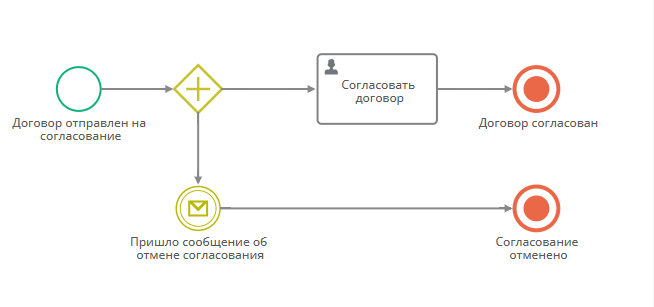
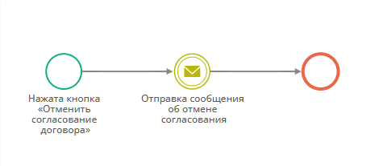

# Отмена процесса по кнопке. Настройка шаблонов записи, шаблонов процесса и кнопки {: #process_end_button_example}

## Введение

**{{ productName}}** позволяет гибко управлять процессами, в том числе завершать их.

В некоторых бизнес-сценариях пользователь должен иметь возможность отменять процесс. Например, в процессе согласования договора инициатор может отозвать его и остановить процесс.

Для этого можно создать кнопку отмены процесса на любом этапе.

Здесь представлен пример настройки приложения с кнопкой быстрой остановки процесса.

## Исходные данные

Имеется шаблон записи _«Договоры»_ с текстовым атрибутом _«ID процесса»_ (системное имя — `processID`).

Имеется шаблон процесса _«Согласование договора»_, который связан с шаблоном _«Договоры»_.

## Прикладная задача

Требуется настроить кнопку на форме согласования договора, которая будет останавливать процесс согласования.

## Настройка завершения процесса по нажатию кнопки

### Настройка процесса «Согласование договора»

1. Откройте для редактированию диаграмму процесса _«Согласование договора»_.
2. Откройте **сценарий на выходе** из **стартового события**.
3. Внутрь действия «**Сменить контекст**» добавьте действие «**Изменить значения атрибутов**» со следующими свойствами:

    - **Атрибут:** _ID процесса_
    - **Операция со значениями: заменить**
    - **Значение: формула**

        ``` cs
        FORMAT("{0}", LIST($$ProcessObject))
        ```

4. После стартового события добавьте **развилку «и»**.
5. После **развилки «и»** добавьте пользовательскую задачу _«Согласовать договор»_, исполнителем назначьте себя.
6. Добавьте **промежуточное событие–получение сообщения**.
7. В свойствах события-получения сообщения на вкладке «**Дополнительные**» установите **имя сообщения** _«ProcessCancelMessage»_.
8. Соедините событие-получение сообщения с **развилкой «и»**.
9. Добавьте **конечное событие-остановку процесса** _«Согласование отменено»_ и соедините его с событием-получением сообщения.
10. Добавьте **конечное событие-остановку процесса** _«Договор согласован»_ и соедините его с задачей _«Согласовать договор»_.

    !!! warning "Логика процесса"

        Все конечные события процесса обязательно должны быть типа **конечное событие-остановка процесса**. Это требуется, чтобы останавливался весь процесс, а не только одна его ветвь.
        
        Таким образом, при запуске процесса будут активны обе его ветви и процесс завершится либо по завершении основной ветви, либо при получении сообщения об отмене согласования договора.

__

### Настройка процесса «Отмена согласования договора»

1. Создайте шаблон записи _«Отменённые договоры»_ со следующим атрибутом:

    - **Название:** _Договор_
    - **Системное имя:** _Contract_
    - **Тип: запись**
    - **Связанный шаблон:** _Договоры_

2. Создайте шаблон процесса _«Отмена согласования договора»_, связанный с шаблоном _«Отменённые договоры»_.
3. Добавьте **промежуточное событие-отправку сообщения** со следующими **дополнительными** свойствами:

    - **Место назначения: промежуточное событие**
    - **Имя сообщения:** _ProcessCancelMessage_
    - **Экземпляр процесса: формула**

        ``` cs
        $Contract->processID
        ```

    !!! warning "Логика работы имён сообщений"

        Передача данных между событиями отправки и получения сообщений происходит посредством имён сообщений. Имена сообщений служат идентификаторами событий.

        Поэтому имя сообщения в **промежуточном событии-отправке сообщения** должно совпадать с именем сообщения в **промежуточном событии–получении сообщения** другого процесса.

__

### Настройка кнопки отмены процесса

1. В шаблоне _«Договоры»_ создайте кнопку _«Отменить согласование»_ со следующими свойствами:

    - **Контекст операции: запись**
    - **Операция: запустить процесс по связанному шаблону**
    - **Сохранять запись после выполнения:** флажок установлен
    - **Результат выполнения: обновить данные**
    - **Шаблон:** _Отмена согласования договора (атрибут: Contract)_

2. Поместить кнопку _«Отменить согласование»_ на форму шаблона _«Договоры»_.

## Тестирование

1. Запустите процесс _«Согласование договора»_.
2. Откройте договор, проходящий согласование.
3. Нажмите кнопку _«Отменить согласование»_.
4. Перейдите к списку экземпляров процесса _«Согласование договора»_.
5. Экземпляр отменённого должен иметь статус «**Завершён**».

<div class="relatedTopics" markdown="block">

--8<-- "related_topics_heading.md"

- [Диаграмма процесса. Определения, просмотр, редактирование, публикация][process_diagram]
- [Шаблон процесса][process_templates]
- [Промежуточное событие-получение сообщения][process_diagram_elements_receive_message_intermediate_event]
- [Промежуточное событие-отправка сообщения][process_diagram_elements_send_message_intermediate_event]
- [Конечное событие-остановка процесса][process_diagram_elements_stop_process_end_event]
- [Кнопки. Определение, настройка, удаление][buttons]

</div>


