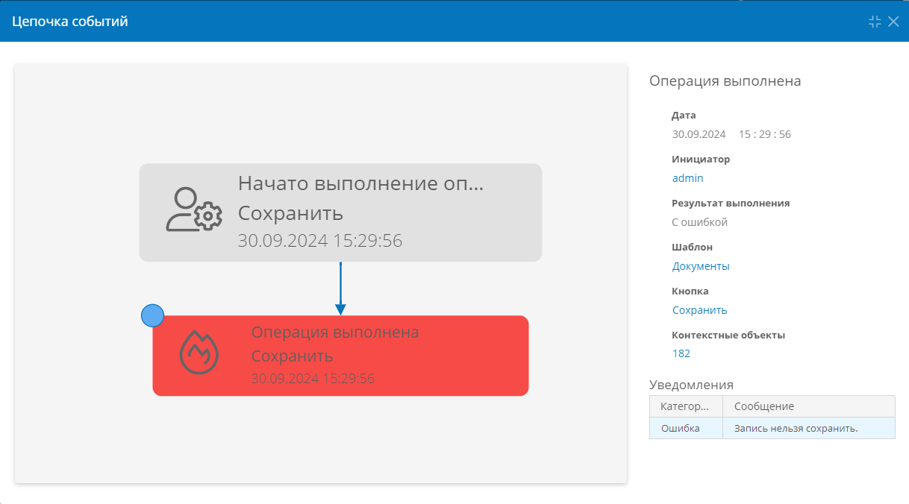

# Сценарий. Запрет сохранения записи с помощью действия «Проверить результат выражения» или «Проверить результат скрипта» {: #scenario_verify_expression_csharp}

Настроим сценарий, который будет запрещать сохранение заявки на поездку, если не указана её длительность в атрибуте `TripDuration`.

1. Создайте новый сценарий.
2. В начальном событии «**Нажата кнопка**» выберите контекстный шаблон записи и кнопку «**Сохранить**».
3. Добавьте действие:
   - **Проверить результат выражения**
      - **Сообщение об ошибке:** _Длительность поездки не может быть нулевой_
      - **Выражение: формула**

          ``` cs
          GREATER($TripDuration,0)
          // Введите выражение, которое будет возвращать
          // false, когда сохранение записи запрещено, и
          // true, когда сохранение записи разрешено.
          ```

    **ИЛИ**

   - **Проверить результат скрипта**:
        - **Сообщение об ошибке:** _Длительность поездки не может быть нулевой_
        - **Выражение: C#**

            ``` cs
            class Script
            {
                public static bool Main()
                {
                    var result = false;
                    // Добавьте код, который будет 
                    // менять result на true,
                    // когда запись разрешено сохранять.
                    return result;
                }
            }
            ```

4. Перейдите к любой записи в контекстном шаблоне, внесите в неё изменения и нажмите кнопку «**Сохранить**».
5. На экране отобразится уведомление об ошибке сохранения записи.

__

--8<-- "related_topics_heading.md"

<!--Добавить ссылку на статью по отладке сценариев-->

**[Событие и действия сценария. Определения, типы, свойства, настройка][scenario_elements]**


