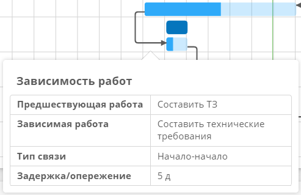

# Диаграмма Ганта. Использование {: #gantt_chart_use}

## Работа с диаграммой ганта

В данном примере предполагается, что диаграмма Ганта создана по инструкциям в разделе **«[Создание диаграммы Ганта][gantt_chart_create]»**.

1. Создайте и откройте запись в шаблоне _«План работ»_.
2. Создайте записи в шаблоне _«Работы»_ с помощью таблицы на форме _«План работ»_ например:

    * _Составить ТЗ_;
    * _Составить технические требования_.

3. Укажите исполнителей, даты начала и окончания работ.
4. Укажите прогресс работ в процентах (без символа %). Прогресс отображается на диаграмме как полоса более тёмного цвета на полосе планового хода работы.

    __

5. Нажмите поле _«Зависимости»_ в строке работы _«Составить технические требования»_.
6. В раскрывающемся списке зависимостей нажмите кнопку **«Создать»**.

    __

7. В форме зависимости работ укажите тип связи работ. От типа связи будет зависеть положение и направление стрелки, связывающей работы на диаграмме:

    * Начало-начало;
    * Начало-окончание;
    * Окончание-начало;
    * Окончание-окончание.

    __

8. Укажите задержку. Если указана задержка и у зависимой работы не указана дата начала или плановая дата начала, то отсутствующая дата будет равна сумме даты окончания предшествующей работы и задержки.
9. Выберите предшествующую и зависимую работы.
10. Нажмите кнопку **«OK»**, чтобы сохранить зависимость работ.

    __

11. Чтобы сделать работу _«Составить технические требования»_ дочерней для работы _«Составить ТЗ»_, установите для неё флажок выбора в первом столбце и нажмите кнопку **«На уровень ниже»**.

    __

12. Нажмите кнопку **«Сохранить»** в верхней части формы, чтобы сохранить запись плана работ.
13. Выберите интервал отображения диаграммы Ганта: **неделя**, **месяц**, **год** или **десятилетие**.
14. Установите или снимите флажок «**Ожидаемый ход работ**». Ожидаемый ход работ отображается в виде отдельной полосы над полосой планового хода работы.

    __

15. Чтобы просмотреть сведения о работе, нажмите соответствующую полосу на диаграмме.

    __

16. Чтобы просмотреть сведения о зависимости работ, нажмите связывающую их стрелку на диаграмме.

    __

--8<-- "related_topics_heading.md"

* _[Диаграмма Ганта. Настройка][gantt_chart_create]_


