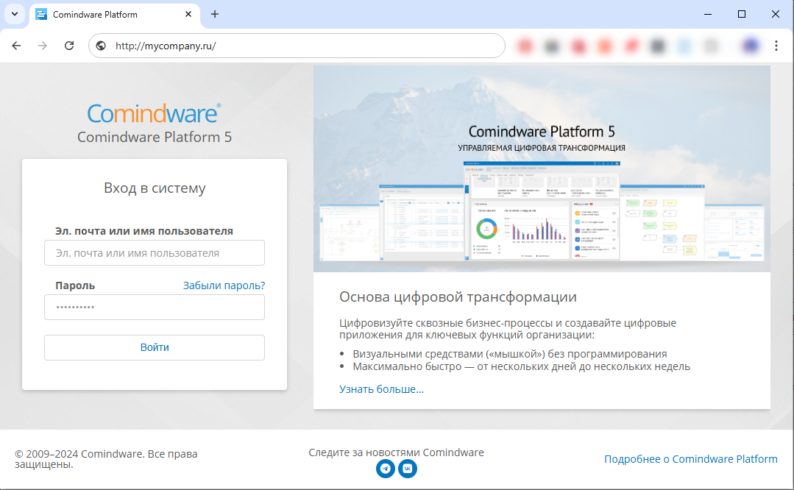

# Урок 1. Первое знакомство {: #lesson_1 }

## Введение

На этом уроке вы научитесь входить в **{{ productName }}**, познакомитесь с основными элементами системы и настроите свой аккаунт.

Чтобы начать работу, вам понадобится доступ к веб-сайту с **{{ productName }}**. Если ваша организация уже является клиентом **{{ companyName }}**, то его предоставит администратор. Если же вы пока хотите только познакомиться с **{{ productName }}**, обратитесь с запросом по любому из контактов на [нашем сайте](https://www.comindware.ru/company/contact-us/).

**{{ productName }}** — это low-code-система управления бизнес-процессами.

Для работы с **{{ productName }}** требуется только браузер, вам не понадобится устанавливать какое-либо программное обеспечение на свой компьютер. Поддерживаются современные версии браузеров Google Chrome, Firefox, Microsoft Edge и Safari.

**Расчётная продолжительность:** 10 мин.



## Вход в {{ productName }}

1. Запустите браузер и введите в адресную строку адрес веб-сайта с **{{ productName }}**, развёрнутого в вашей компании или в облаке **{{ companyName }}** (если используется демо-доступ).
2. Должна отобразиться страница входа.
3. Введите имя пользователя и пароль, полученные от администратора или от службы поддержки **{{ companyName }}**.
4. Нажмите кнопку «**Войти**».
5. Отобразится начальная страница **{{ productName }}**.

    __

## Настройка аккаунта

В разделе «**Мой аккаунт**» вы можете просмотреть персональную информацию и сменить пароль.

!!! note "Примечание"

    Некоторые или все действия в разделе «**Мой аккаунт**» для вас могут быть недоступны в зависимости от разрешений, выданных системным администратором.

1. Нажмите значок с вашими инициалами в правом верхнем углу страницы.
2. Выберите пункт «**Мой аккаунт**».
3. Должен отобразиться раздел «**Мой аккаунт**».

    __

4. Чтобы сменить пароль, нажмите кнопку «**Сменить пароль**».
5. Чтобы изменения вступили в силу, нажмите кнопку «**Сохранить**».

    __

## Результаты

Вы научились входить в систему и настраивать свой аккаунт.

В [следующем уроке][lesson_2] вы создадите своё первое бизнес-приложение и реестр данных.


